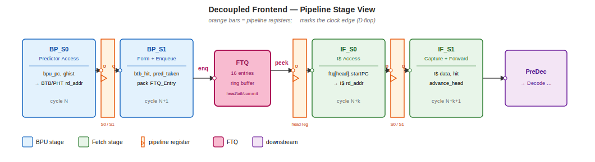
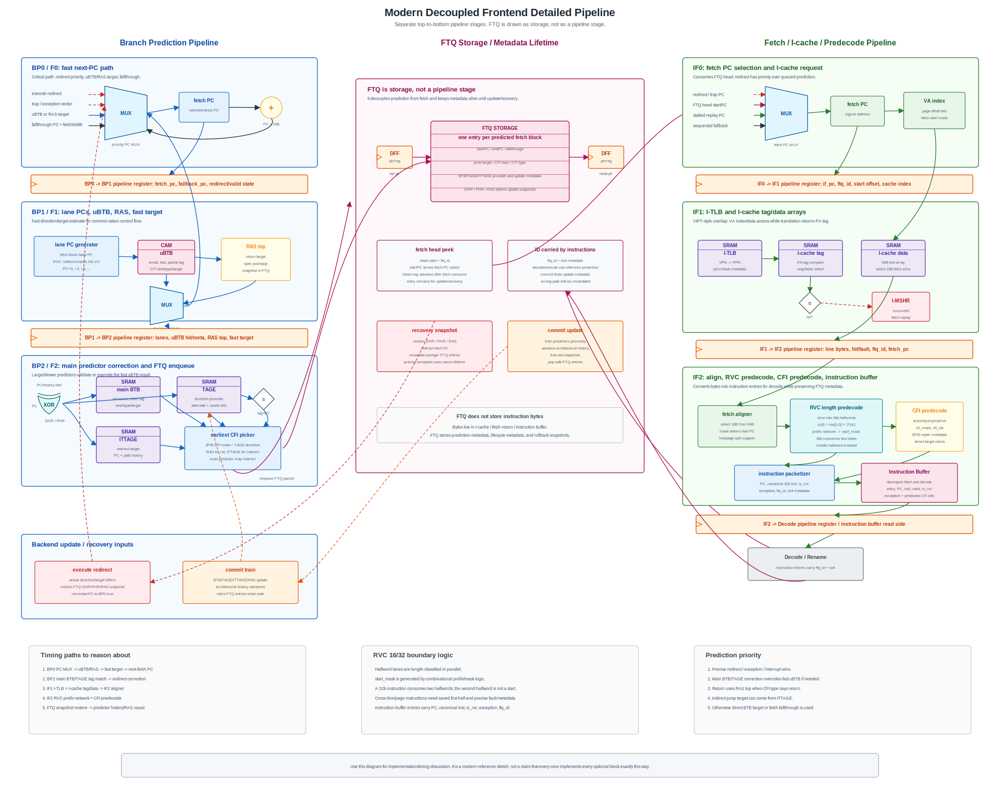
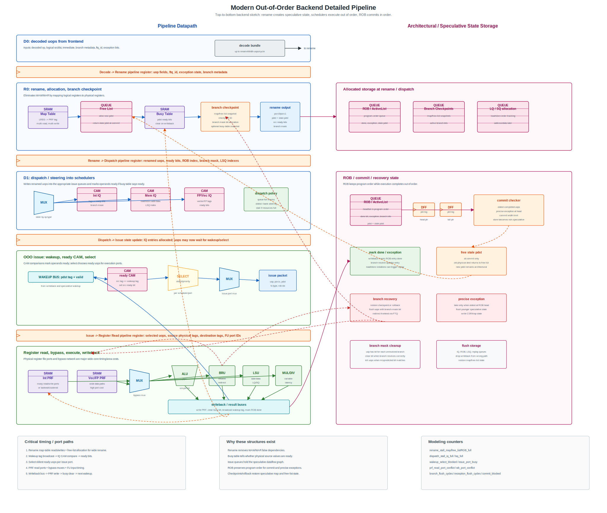
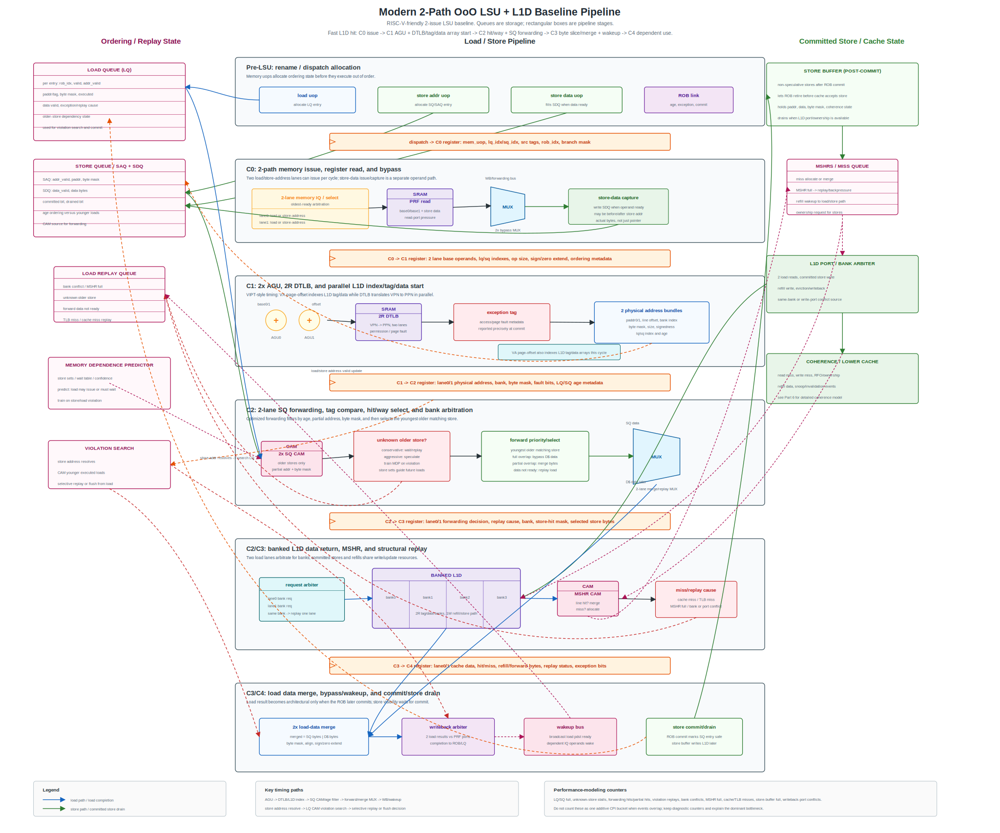
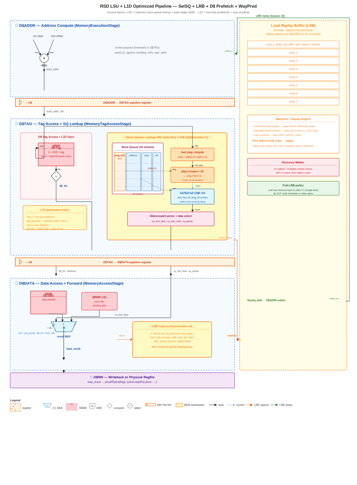
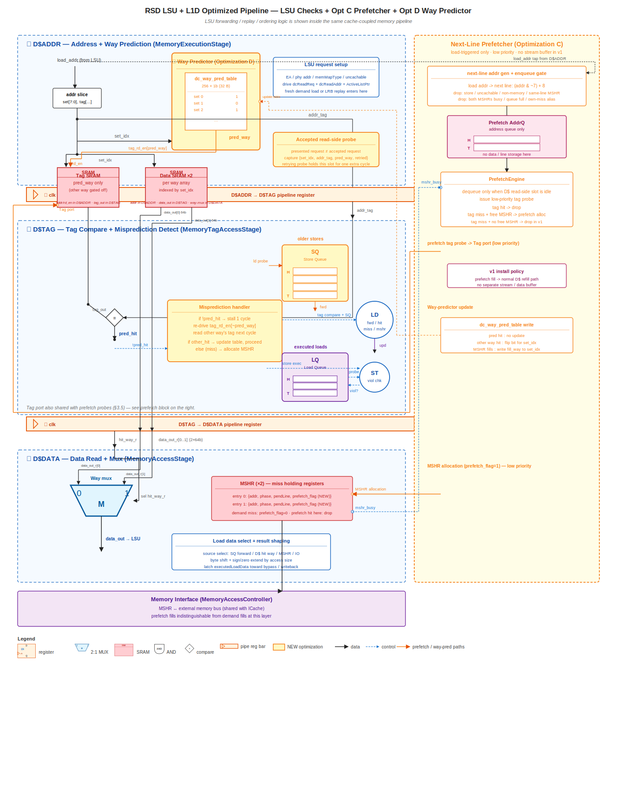

# Architecture Review

Unified microarchitecture review notes for the Qualcomm second-round preparation.

This file has these major review blocks:

1. Computer architecture fundamentals.
2. Decoupled frontend implementation specification.
3. Backend microarchitecture details.
4. LSU + L1D optimization specification.
5. TLB, MMU, and page-table-walker microarchitecture.
6. Cache, coherence, and memory-system review.
7. Vector / SIMD review.
8. Interrupt and exception implementation.
9. Serialization, fences, atomics, and privileged control.
10. Architect thinking, tradeoff analysis, timing, ports, and hardware cost modeling.
11. Prefetcher microarchitecture.

The interviewer focus map below is a preparation router: use it to prioritize likely topics for each second-round interviewer, then jump into the detailed sections linked from that map.

The original FE and LSU source markdown files and their diagram assets remain in place. Local markdown links in the merged sections are rewritten relative to this `interview/` directory so the SVG/PNG pipeline diagrams still resolve from here.

## Interviewer Focus Map

### Ajay Rathee — Likely Interview Focus

Public-signal basis:
- Public LinkedIn preview: focus listed as modeling and analysis of high-performance CPU cores; older projects include C++ cache/memory hierarchy simulation, trace processor with trace cache/trace predictor, checkpoint recovery, speculative load forwarding, and memory-dependence prediction.
- Public patent listings: instruction fetch / branch / fetch-bundle work and instruction-side TLB prefetching.
- Treat this as preparation speculation, not a claim about what he will definitely ask.

Highest-priority map:

| Likely topic | Why it may come up | Existing review section |
|---|---|---|
| Decoupled frontend, FTQ, fetch bubbles | Public work points toward instruction fetch and branch/fetch-bundle behavior | [Part 2 — Decoupled Frontend Specification](#part-2--decoupled-frontend-specification), [Frontend Extra Topics to Review](#frontend-extra-topics-to-review) |
| Branch prediction and predictor metadata | Fetch patents mention branch history and fetch groups; frontend work often tests direction/target/update/recovery reasoning | [Part 2 — Decoupled Frontend Specification](#part-2--decoupled-frontend-specification), [Branch Predictor Summary and Modeling Checklist](#8-branch-predictor-summary-and-modeling-checklist), [TAGE Predictor Review](#tage-predictor-review) |
| Fetch beyond predicted-taken branch | Direct public patent theme; likely discussion around using fetch-bundle slots after a predicted-taken branch | Ajay-only notes below, plus [Decode Bandwidth and Frontend Bubbles](#decode-bandwidth-and-frontend-bubbles) |
| Instruction TLB and ITLB prefetch | Public patent listing includes instruction TLB prefetching from retired-page history | [Part 5 — TLB, MMU, and Page Table Walker](#part-5--tlb-mmu-and-page-table-walker), [TLB and Virtual Memory Corner Cases](#8-tlb-and-virtual-memory-corner-cases) |
| Trace cache / trace processor | His older project explicitly mentions trace processor, trace cache, trace predictor, and checkpoint recovery | Ajay-only notes below, plus [Uop Cache / Decoded Instruction Cache](#uop-cache--decoded-instruction-cache) |
| Memory dependence prediction and speculative load forwarding | His older project mentions Alpha 21264-inspired MDP and speculative load forwarding | [Memory Dependence Prediction](#141-memory-dependence-prediction), [OoO Load/Store Consistency](#142-ooo-loadstore-consistency), [Store Queue / Store Buffer Discussion](#121-store-queue--store-buffer-discussion) |
| Cache and memory hierarchy modeling | His older project includes C++ cache hierarchy simulation and validation | [Part 6 — Cache, Coherence, and Memory System](#part-6--cache-coherence-and-memory-system), [Replacement Policy and MSHRs](#9-replacement-policy-and-mshrs) |
| Performance model debug and validation | Role is CPU performance modeling; likely asks how to prove model results and debug regressions | [Architecture Performance Evaluation Hooks](#21-architecture-performance-evaluation-hooks), [Validation and Calibration](#22-validation-and-calibration) |

Lower-priority possible angles:

| Possible topic | Why it may come up | Existing review section |
|---|---|---|
| Memory fabric, address decoding, CXL/HDM-style address translation | Public patent listings include CXL host-managed device memory decoding and reduced-area/power sequencing | [Interconnect Types](#5-interconnect-types), [ACE / CHI Coherent Interconnect Basics](#6-ace--chi-coherent-interconnect-basics), [Mobile Power / Performance Constraints](#11-mobile-power--performance-constraints) |
| Compiler/codegen and intrinsic-aware performance | Public coursework includes code generation/optimization; your BKFIR/intrinsics work is a good bridge if he asks software-to-microarchitecture questions | [Compiler, Intrinsics, and Scheduling Notes](#5-compiler-intrinsics-and-scheduling-notes), [Vector and SIMD](#part-7--vector-and-simd) |

Expected question style:
- Mechanism-first: explain the microarchitecture structure, not only the high-level definition.
- Model-first: identify what state/counters/latencies the performance model needs.
- Validation-first: explain how to prove the result with counters, directed tests, RTL evidence, or workload deltas.
- Tradeoff-first: mention performance benefit, power/timing/area cost, and failure cases.

Preparation priority for Ajay:
1. Be able to draw and explain `BP_S0 -> BP_S1 -> FTQ -> IF_S0 -> IF_S1 -> Decode`.
2. Be able to explain why taken branches inside a fetch block waste bandwidth, and how fetching beyond a predicted-taken branch could help loops.
3. Be able to explain gshare vs TAGE, BTB target misses, GHR checkpoint/restore, and predictor update timing.
4. Be able to explain ITLB miss handling and how instruction-side TLB prefetch could help instruction-stream page crossings.
5. Be able to explain memory-dependence prediction, store-load forwarding, violation detection, and replay.
6. Be able to debug an IPC regression with CPI stack, MPKI, branch MPKI, ITLB MPKI, MSHR occupancy, replay count, and frontend-bubble counters.

Likely mock questions:
- How would you model lost fetch bandwidth from a taken branch in the middle of a fetch bundle?
- What is the difference between BTB miss, direction misprediction, and target misprediction?
- How does TAGE reduce destructive aliasing compared with gshare?
- What state must be checkpointed for branch recovery in a decoupled frontend?
- What is a trace cache, and how is it different from a uop cache?
- How would an ITLB prefetcher work, and what are its risks?
- Why can a memory-dependence predictor improve IPC, and how do you recover from a wrong prediction?
- If your model predicts a frontend speedup, what counters would you inspect to validate it?

Ajay-only topic: fetching beyond a predicted-taken branch:
- Baseline fetch usually stops useful extraction at the first predicted-taken branch in a fetch bundle, because the next PC is predicted to be the branch target.
- If the branch is a loop branch and the next loop iteration also fits in the same fetch bundle or can be reconstructed predictively, the frontend may extract useful instructions beyond the predicted-taken branch rather than wasting later fetch lanes.
- Potential benefit: higher effective fetch bandwidth for tight loops and fewer frontend bubbles.
- Risks: wrong-path fetch/extract work, more complex branch metadata, duplicated loop-iteration bookkeeping, predictor-history update complexity, and recovery corner cases.
- Model counters: useful fetched lanes, wasted fetched lanes after taken branch, loop-iteration extraction hit rate, branch recovery count, and frontend power/activity.

Ajay-only topic: trace cache / trace processor:
- A trace cache stores dynamic instruction traces, often spanning multiple basic blocks and taken branches, instead of only static cache-line-aligned instruction bytes.
- A trace predictor predicts which trace to fetch next, so frontend bandwidth can follow hot dynamic paths.
- Benefit: bypasses repeated decode/fetch steering for hot control-flow paths and can deliver high effective fetch bandwidth across taken branches.
- Costs and risks: trace construction complexity, trace-cache capacity/aliasing, partial trace exits, self-modifying code invalidation, exception/debug mapping, and recovery metadata.
- Modeling hooks: trace-cache hit rate, average trace length, trace exit reason, mispredicted trace count, useful uops per trace, and trace-cache replacement effects.

Ajay-only topic: instruction TLB prefetch from retired-page history:
- Idea: when retirement observes instruction-stream progress into a new page, record retired instruction pages and prefetch likely next instruction translations before the frontend demands them.
- Benefit: hides ITLB miss/page-walk latency for instruction streams that move predictably across pages.
- Risks: ASID/context correctness, page-boundary prediction accuracy, TLB pollution, page-walk bandwidth, wrong-path instruction streams, and interaction with `SFENCE.VMA`.
- Model counters: ITLB MPKI, ITLB prefetch accuracy, ITLB prefetch coverage, late prefetches, page-walk traffic, L2 TLB pollution, and frontend cycles blocked on translation.

Ajay lower-priority topic: CXL/HDM-style address decoding:
- CXL host-managed device memory uses decoder logic to map host physical address ranges to device memory regions.
- The performance-modeling angle is not CXL protocol detail; it is address decode latency, area/power of decoder structures, memory-region selection, and traffic routing.
- Possible questions could resemble cache/TLB address decode: what bits select region, how many parallel compares are needed, how to reduce decoder power, and what happens on remap/reconfiguration.
- Model counters: decoder lookup count, decoder miss/error count, fabric request latency, memory-region bandwidth, queue occupancy, and power proxy from active decoder comparisons.

Ajay lower-priority topic: compiler/codegen bridge:
- If he asks about compiler-aware performance, connect your BKFIR/intrinsics work to microarchitecture: register reuse reduces reloads, fused intrinsics reduce uop count/latency, and branch-to-predicate conversion can improve scheduling when branches are unpredictable.
- Mention that compiler scheduling is usually easiest within basic blocks; branches, aliasing, calls, and exception-visible memory operations constrain motion.
- Model counters: instruction count, uop count if available, load/store count, vector utilization, branch count/mispredicts, register spills/reloads, and memory bandwidth.

### David Palframan — Likely Interview Focus

Public-signal basis:
- Public LinkedIn preview: computer architect with experience in performance modeling; publications include `COP: To Compress and Protect Main Memory` and `Precision-Aware Soft Error Protection for GPUs`.
- UW-Madison architecture group lists him as PhD, May 2015, current employment Qualcomm Research.
- Public Qualcomm patent listing includes `Intelligent data prefetching using address delta prediction`.
- Earlier research includes redundant intermediate bitslices for process variation, critical paths, reliability, and performance.
- Treat this as preparation speculation, not a claim about what he will definitely ask.

Highest-priority map:

| Likely topic | Why it may come up | Existing review section |
|---|---|---|
| Data prefetching beyond next-line | Public patent signal is address-delta data prefetching; likely asks accuracy/coverage/timeliness/pollution tradeoffs | [L1D Next-Line Prefetcher](#5-optimization-c--l1d-next-line-prefetcher), [Part 11 — Prefetcher Microarchitecture](#part-11--prefetcher-microarchitecture), David-only notes below |
| MSHRs, bandwidth, and demand interference | Prefetch benefit depends on miss concurrency and whether prefetches steal demand resources | [Replacement Policy and MSHRs](#9-replacement-policy-and-mshrs), [Port Conflicts and Banking](#8-port-conflicts-and-banking), [Cache and Memory-System Corner Cases](#12-cache-and-memory-system-corner-cases) |
| Cache/memory hierarchy modeling | Publications and patent point toward memory hierarchy, cache behavior, and performance-model evidence | [Part 6 — Cache, Coherence, and Memory System](#part-6--cache-coherence-and-memory-system), [Architecture Performance Evaluation Hooks](#21-architecture-performance-evaluation-hooks) |
| Main-memory compression and ECC | `COP` publication combines compression, main-memory capacity, and error protection | David-only notes below, plus [Cache and Memory-System Corner Cases](#12-cache-and-memory-system-corner-cases) |
| Reliability and soft errors | HPCA publication and Spare RIBs work point toward selective protection, register-file/execution logic vulnerability, and reliability/cost tradeoffs | David-only notes below, plus [Power, Timing, and Area Tradeoffs](#10-power-timing-and-area-tradeoffs) |
| Power/performance/critical path tradeoffs | Spare RIBs work is about critical paths, variation, redundancy, area, and performance | [Power, Timing, and Area Tradeoffs](#10-power-timing-and-area-tradeoffs), [Mobile Power / Performance Constraints](#11-mobile-power--performance-constraints) |
| Model validation and counter interpretation | Performance modeling role plus research background likely means he will care about proof, not just claims | [Architecture Performance Evaluation Hooks](#21-architecture-performance-evaluation-hooks), [Validation and Calibration](#22-validation-and-calibration) |

Lower-priority possible angles:

| Possible topic | Why it may come up | Existing review section |
|---|---|---|
| Register file ports and backend scaling | `CRAM: Coded Registers for Amplified Multiporting` points to multi-ported RF cost, wide OoO scaling, and area/power/timing tradeoffs | [Backend Microarchitecture Details](#part-3--backend-microarchitecture-details), [Wakeup / Select](#5-wakeup--select), [Power, Timing, and Area Tradeoffs](#10-power-timing-and-area-tradeoffs) |
| Low-cost error detection and memory fault patching | Public work includes time-redundant parity and patching memory faults using existing memory hierarchy structures | David-only notes below, plus [Cache and Memory-System Corner Cases](#12-cache-and-memory-system-corner-cases), [Validation and Calibration](#22-validation-and-calibration) |

Expected question style:
- Tradeoff-heavy: performance gain versus bandwidth, power, area, latency, and reliability cost.
- Evidence-heavy: what counters prove the mechanism helped, and what counters prove it did not cause damage.
- Modeling-heavy: what state must be represented in the simulator, and what simplifying assumption is acceptable.
- Corner-case-heavy: pollution, MSHR pressure, replacement effects, ECC metadata overhead, and critical-path impact.

Preparation priority for David:
1. Be able to explain prefetch metrics: accuracy, coverage, timeliness, pollution, bandwidth, MSHR pressure, and demand interference.
2. Be able to describe a beyond-next-line prefetcher, especially PC-correlated address-delta prediction.
3. Be able to explain why lower MPKI may not improve IPC: MLP, ROB head blocking, bandwidth, hit latency, and unrelated bottlenecks.
4. Be able to explain MSHR merge/full behavior and how prefetches interact with demand misses.
5. Be able to discuss ECC, soft errors, selective protection, and memory compression at a high level.
6. Be able to validate a memory-system change with counters and directed tests.

Likely mock questions:
- Design a prefetcher for pointer-chasing or irregular memory patterns. What state do you store?
- A prefetcher improves MPKI but hurts IPC. What happened?
- What counters show whether a prefetcher is accurate, timely, and non-interfering?
- How do MSHRs affect memory-level parallelism and prefetch usefulness?
- Why are multi-ported register files expensive, and how can a core reduce RF port pressure?
- Why can main-memory compression improve capacity but hurt latency or bandwidth?
- What is the tradeoff between ECC protection, memory capacity, power, and performance?
- What is the difference between parity detection, ECC correction, and full duplication?
- How would you model soft-error protection or selective hardening in a performance/power study?
- A design improves frequency by changing a critical path but adds area or redundancy. How do you evaluate it?

David-only topic: address-delta data prefetching:
- Idea: identify correlated load instructions whose virtual addresses have a repeating delta, then use the first load's PC/address to prefetch the second load's future address.
- Difference from stride prefetching: stride prefetching tracks one load stream; address-delta/correlation prefetching can learn relationships between different load PCs or dependent misses.
- Useful for irregular but repeatable allocation/layout patterns where normal sequential or stride prefetchers fail.
- Core state to model: miss-tracking table, address-delta prediction table, PC tags, delta value, confidence, replacement policy, and prefetch request queue.
- Training signal: prior D$ misses, resolved miss order, dependence/time correlation, or ROB-walk-based older-miss correlation.
- Risks: virtual-address alias/context issues, page crossing, DTLB pressure, low confidence, MSHR pollution, wrong prefetch target, and demand bandwidth interference.
- Model counters: ADP table hit rate, trained pairs, confidence distribution, prefetch accuracy, coverage, timeliness, MSHR merge/drop rate, demand miss latency, and pollution-induced demand MPKI.

David-only topic: main-memory compression with ECC protection:
- Compression can create space for ECC metadata or increase effective memory capacity, but it adds metadata, layout, and access complexity.
- Key performance issue: can the memory controller locate compressed blocks without expensive variable-size address calculation?
- A linearly compressed page style idea keeps blocks within a page at a uniform compressed size so address calculation remains simple.
- ECC angle: storing check bits protects against soft errors; stronger protection costs capacity, bandwidth, latency, or extra chips unless compression creates room.
- Model questions: compression ratio distribution, compress/decompress latency, memory bandwidth change, metadata access overhead, row-buffer locality, and error coverage.
- Interview framing: compression is useful only if the capacity/reliability benefit is not erased by address-lookup latency, decompression latency, or extra memory traffic.

David-only topic: reliability, soft errors, and variation:
- Soft errors can corrupt architectural state, register files, queues, or execution logic; not every bit has equal impact on final program output.
- Selective protection hardens the most valuable or vulnerable structures rather than paying full protection cost everywhere.
- Precision-aware protection idea: for numeric/GPU-style workloads, the magnitude of the error can matter, not only whether any bit flipped.
- Process variation can slow critical paths; redundancy or bitslice-level techniques can avoid the slowest slice, but at area/power/design-complexity cost.
- Model questions: which structure is protected, what is the performance overhead, what is the area/power cost, and what reliability metric improves.
- Interview framing: reliability mechanisms should be evaluated like performance features: define the fault model, cost, coverage, workload impact, and validation method.

David lower-priority topic: register file multiporting and backend scaling:
- Wide OoO cores need many RF read/write ports because multiple issued instructions may each read two or more operands and write back results in the same cycle.
- True multi-port RFs are expensive: more ports increase cell size, bitline/wordline loading, sense amps, muxing, area, leakage, dynamic energy, and often critical-path delay.
- Common alternatives: banked RF, clustered execution, operand caching, bypass-heavy designs, read-port scheduling, limiting issue width per cluster, multi-cycle RF read, or encoded/coded storage ideas.
- Performance tradeoff: reducing RF ports saves power/timing/area but can create operand-read conflicts, issue restrictions, or extra bypass complexity.
- Model counters: RF read/write port utilization, RF port conflict stalls, bypass hit rate, issue slots lost to operand-read conflicts, cluster imbalance, and writeback conflicts.

David lower-priority topic: low-cost error detection and memory fault patching:
- Parity detects many errors cheaply but usually cannot correct them without replay, redundant state, or recovery support.
- ECC can detect and correct within its code strength but costs storage, encode/decode latency, power, and sometimes extra memory chips or metadata storage.
- Full duplication gives stronger checking but is usually high area/power overhead.
- Time-redundant parity style ideas trade time/checking latency for lower area/power than full duplication.
- Memory fault patching idea: if one memory location is faulty, use redundant copies already present in the hierarchy, such as cache lines or other storage, and increase their persistence so the faulty location is effectively patched.
- Performance/modeling questions: how often faults occur, what recovery latency is, whether protected entries reduce usable cache capacity, whether persistence blocks normal replacement, and whether checking is on the critical path.
- Model counters: detected parity events, ECC corrected/uncorrected events, replay/recovery cycles, protected-entry occupancy, blocked evictions due to persistence, and protection energy/access overhead.

### Sabine Francis — Likely Interview Focus

Public-signal basis:
- Public LinkedIn preview: Qualcomm, Austin; education at UT Austin.
- Public Qualcomm patent listings include pointer prefetching, non-stalling cacheline-triggered prefetch pipeline optimization for indirect memory accesses, and differential training for indirect memory prefetching.
- UT Austin poster work includes SystemC/TLM, OMNeT++, host-compiled simulation, design-space exploration, latency/throughput/QoS modeling.
- Treat this as preparation speculation, not a claim about what she will definitely ask.

Highest-priority map:

| Likely topic | Why it may come up | Existing review section |
|---|---|---|
| Pointer / indirect prefetching | Public patent signal is strongest around pointer and indirect-memory prefetchers | [Part 11 — Prefetcher Microarchitecture](#part-11--prefetcher-microarchitecture), Sabine-only notes below |
| Prefetch accuracy, coverage, timeliness, pollution | Pointer prefetchers can easily become late, wrong, or bandwidth-destructive | [Part 11 — Prefetcher Microarchitecture](#part-11--prefetcher-microarchitecture), [Architecture Performance Evaluation Hooks](#21-architecture-performance-evaluation-hooks) |
| MSHR pressure and non-stalling prefetch pipeline | Public patent signal includes non-stalling prefetch pipeline optimization | [Replacement Policy and MSHRs](#9-replacement-policy-and-mshrs), [Port Conflicts and Banking](#8-port-conflicts-and-banking), Sabine-only notes below |
| TLB/page-crossing correctness for prefetch | Pointer/indirect prefetch often uses virtual addresses and can cross pages or contexts | [Part 5 — TLB, MMU, and Page Table Walker](#part-5--tlb-mmu-and-page-table-walker), [TLB and Virtual Memory Corner Cases](#8-tlb-and-virtual-memory-corner-cases) |
| Cache pollution and replacement side effects | Indirect prefetch can bring low-usefulness lines and evict useful demand lines | [Cache and Memory-System Corner Cases](#12-cache-and-memory-system-corner-cases), [Replacement Policy and MSHRs](#9-replacement-policy-and-mshrs) |
| Performance model validation | She may ask how to prove a prefetcher helps and does not damage demand traffic | [Validation and Calibration](#22-validation-and-calibration), [Architecture Performance Evaluation Hooks](#21-architecture-performance-evaluation-hooks) |

Lower-priority possible angles:

| Possible topic | Why it may come up | Existing review section |
|---|---|---|
| SystemC/TLM and fast design-space exploration | UT Austin poster signal includes SystemC/TLM and simulation methodology | [Architecture Performance Evaluation Hooks](#21-architecture-performance-evaluation-hooks), [Validation and Calibration](#22-validation-and-calibration) |
| QoS / latency / throughput modeling | NoS work mentions latency, throughput, and QoS; lower priority for CPU-core interview but relevant to performance modeling style | [Architecture Performance Evaluation Hooks](#21-architecture-performance-evaluation-hooks), [ACE / CHI Coherent Interconnect Basics](#6-ace--chi-coherent-interconnect-basics) |

Expected question style:
- Practical prefetch-design questions: what state is stored, what triggers training, and when to issue/drop a prefetch.
- Damage-control questions: how to detect pollution, late prefetches, MSHR pressure, and demand interference.
- Implementation-aware questions: how to avoid prefetch pipeline stalls, critical-path growth, and expensive arithmetic.
- Validation questions: what counters and directed tests prove correctness and usefulness.

Preparation priority for Sabine:
1. Be able to explain why pointer chasing is hard for stride/next-line prefetchers.
2. Be able to design a pointer/indirect prefetcher with trigger PC, pointer load, target address, confidence, and throttling.
3. Be able to explain prefetch metrics: accuracy, coverage, timeliness, pollution, and demand interference.
4. Be able to explain MSHR merge/full behavior and how prefetches should be lower priority than demand misses.
5. Be able to discuss VA/PA, page crossing, DTLB pressure, ASID/context correctness, and MMIO/non-cacheable filtering for prefetch.
6. Be able to validate a prefetcher with directed pointer-chase, linked-list, sparse-array, and graph-like tests.

Likely mock questions:
- Why is pointer chasing hard to prefetch?
- How would you design a hardware pointer prefetcher?
- What is a trigger access, and how do you train the prefetcher?
- How can a prefetcher improve MPKI but reduce IPC?
- What counters tell you a prefetcher is late versus inaccurate?
- How do you avoid MSHR pollution and demand interference?
- How do page crossings and DTLB misses affect a pointer prefetcher?
- What does a non-stalling prefetch pipeline need to avoid blocking demand access?

Sabine-only topic: pointer / indirect prefetching:
- Pointer-chasing load pattern: load address A to get pointer P, then later load from address P. The second address is not known until the first load returns.
- Normal next-line/stride prefetchers fail because the target stream may not have a constant address delta.
- A pointer prefetcher tries to identify a producer load whose data value is a future memory address, then prefetches the cache line pointed to by that value.
- Core state to model: trigger PC, pointer-load PC, last pointer value, confidence counter, prefetch distance, prefetch queue, and filter bits for cacheable/valid address ranges.
- Useful workloads: linked lists, trees, graph traversal, sparse data structures, object graphs, hash chains, and some ML/recommender access patterns.
- Risks: wrong pointer interpretation, stale pointer value, low reuse, page faults, DTLB pressure, MMIO/non-cacheable addresses, security/speculation policy, and cache pollution.
- Model counters: trigger count, generated pointer prefetches, useful pointer prefetches, late pointer prefetches, dropped unsafe prefetches, DTLB misses caused by prefetch, MSHR occupancy, and pollution-induced demand misses.

Sabine-only topic: trigger/training for indirect prefetchers:
- A trigger access is an earlier demand access that indicates a later indirect access is likely.
- Training can observe repeated relationships between a producer load and a consumer load, such as `consumer_addr = load_value_from_producer` or `consumer_addr = producer_value + offset`.
- Differential training idea: learn a compact delta/offset relationship rather than storing full target addresses when possible.
- Confidence is essential; low-confidence relationships should not issue prefetches.
- Replacement policy matters because training tables can be polluted by one-time pointer relationships.
- Model counters: trained entries, confidence promotions/demotions, table hit rate, table eviction rate, false trigger rate, and relationship age.

Sabine-only topic: non-stalling prefetch pipeline:
- Demand load/store traffic should not wait behind prefetch address generation, prefetch tag probes, or prefetch MSHR allocation.
- Prefetch generation should be decoupled through a queue so the load pipeline can enqueue hints and continue.
- Prefetch probes should use idle cache ports or low-priority arbitration.
- Expensive address-generation math should be kept off the demand critical path; use simple shifts/masks/adders when possible, or pipeline the computation.
- If resources are full, the prefetcher should drop or defer the request rather than stalling demand.
- Model counters: prefetch queue full drops, prefetch-generation stalls avoided, demand-port wins over prefetch, prefetch port conflicts, MSHR allocation failures, and prefetch issue latency.

Sabine-only topic: directed tests for pointer prefetchers:
- Linked list traversal: one pointer per node; tests pure pointer-chase latency hiding.
- Tree traversal: branch-dependent pointer path; tests confidence and wrong-path prefetch filtering.
- Graph BFS/DFS: irregular adjacency traversal; tests coverage, MSHR pressure, and cache pollution.
- Sparse matrix / CSR: indirect index array followed by value array; tests producer/consumer relationship detection.
- Hash table chains: pointer chains with low spatial locality; tests trigger quality and pollution.
- Object-pointer chains: pointer-to-struct layouts; tests sub-cacheline usefulness and field-offset relationships.
- Array of pointers versus pointer-to-struct layout: tests whether prefetcher learns pointer array loads and target object loads separately.
- Measurements: pointer-prefetch coverage, useful/late/useless prefetches, MSHR occupancy, DTLB pressure, demand MPKI, pollution-induced evictions, and speedup by access pattern.

Sabine lower-priority topic: SystemC/TLM and design-space exploration:
- TLM abstracts transactions rather than every cycle, so it is useful for fast design-space exploration and system-level latency/throughput studies.
- CPU-core performance modeling usually needs more microarchitectural detail than TLM, but the same discipline applies: define abstraction level, timing contracts, validation targets, and error tolerance.
- If asked, connect this to Sparta/Olympia-style modeling: use modular components, clear ports/events, parameterized latency/capacity, and counters for throughput/QoS.

### Pratishtha Dehadray — Likely Interview Focus

Public-signal basis:
- Public LinkedIn preview: Qualcomm, Santa Clara; CMU education.
- Public project history includes C++ models of global/local/tournament/perceptron/YAGS branch predictors.
- Public project history includes SystemVerilog ROB and issue queue with custom arbitration, VCS simulation, Genus synthesis, max-frequency analysis, and energy optimization.
- Public project history includes dynamic cache partitioning, BLISS/ATLAS DRAM scheduling, Snapdragon 855 profiling, cache coherence stress tests, Linux frequency governors, cache simulator with MESI, and latency modeling for DL workloads.
- Treat this as preparation speculation, not a claim about what she will definitely ask.

Highest-priority map:

| Likely topic | Why it may come up | Existing review section |
|---|---|---|
| Branch predictor modeling | Public project directly lists global/local/tournament/perceptron/YAGS predictors and BTB hit rate | [Branch Predictor Summary and Modeling Checklist](#8-branch-predictor-summary-and-modeling-checklist), [TAGE Predictor Review](#tage-predictor-review), Pratishtha-only notes below |
| ROB and issue queue arbitration | Public project lists SystemVerilog ROB/IQ with custom arbitration and synthesis | [Why ROB / ActiveList Exists](#7-why-rob--activelist-exists), [Issue Queue](#14-issue-queue), [Wakeup and Select](#15-wakeup-and-select) |
| Backend power/timing/energy tradeoffs | Public project includes Genus synthesis, max frequency, and energy optimization | [Power, Timing, and Area Tradeoffs](#10-power-timing-and-area-tradeoffs), [Mobile Power / Performance Constraints](#11-mobile-power--performance-constraints) |
| Cache partitioning and DRAM scheduling | Public project lists dynamic cache partitioning, BLISS, and ATLAS | [Part 6 — Cache, Coherence, and Memory System](#part-6--cache-coherence-and-memory-system), Pratishtha-only notes below |
| Cache coherence and MESI | Public project lists C cache simulator and MESI protocol | [MESI and MOESI](#3-mesi-and-moesi), [Snooping vs Directory Coherence](#4-snooping-vs-directory-coherence) |
| Snapdragon profiling and governors | Public project lists Snapdragon 855 stress tests and schedutil/ondemand/performance/powersave governor analysis | [Architecture Performance Evaluation Hooks](#21-architecture-performance-evaluation-hooks), [Mobile Power / Performance Constraints](#11-mobile-power--performance-constraints), Pratishtha-only notes below |
| C++/RTL model validation | Public project mix includes C++ models, SystemVerilog, VCS, synthesis, and profiling | [Validation and Calibration](#22-validation-and-calibration), [Architecture Performance Evaluation Hooks](#21-architecture-performance-evaluation-hooks) |

Expected question style:
- Broad microarchitecture coverage: branch predictor, backend, cache, DRAM, and power/perf.
- Implementation-aware: not only what a structure does, but how arbitration, timing, and energy affect the design.
- Model-building: define state, update rules, counters, and validation for a predictor, ROB, IQ, cache, or DRAM scheduler.
- Profiling-aware: real SoC behavior, PMU counters, frequency governors, and workload sensitivity.

Preparation priority for Pratishtha:
1. Be able to implement/explain a branch predictor model: index, tag/history, prediction, update, aliasing, and accuracy metric.
2. Be able to explain ROB/IQ behavior, custom arbitration policies, and oldest-ready versus fairness/energy tradeoffs.
3. Be able to explain why wakeup/select and multi-ported structures are timing/power sensitive.
4. Be able to discuss shared-cache partitioning and DRAM scheduling fairness/throughput tradeoffs.
5. Be able to explain MESI and cache coherence stress-test patterns.
6. Be able to profile mobile SoC performance under different governors and explain DVFS effects.

Likely mock questions:
- Implement or describe a branch predictor model. What state does it keep and how is it updated?
- Compare global, local, tournament, perceptron, YAGS, and TAGE predictors.
- How does issue-queue arbitration affect IPC, fairness, and energy?
- What happens when the ROB is full, IQ is full, or commit is blocked?
- How would you partition a shared LLC among threads?
- What is the difference between optimizing system throughput and fairness?
- How do BLISS and ATLAS-style DRAM schedulers think about fairness?
- How would you profile branch predictor behavior on Snapdragon hardware?
- How do Linux governors such as `schedutil`, `ondemand`, `performance`, and `powersave` affect benchmark measurements?

Pratishtha-only topic: YAGS and perceptron predictors:
- YAGS: "Yet Another Global Scheme"; uses a choice predictor plus exception caches for taken/not-taken exceptions to reduce aliasing versus a simple global predictor.
- YAGS intuition: most branches have a bias; store the common bias cheaply and use tagged exception tables for cases that disagree with the bias.
- Perceptron predictor: treats branch prediction as a weighted sum of global history bits. Positive sum predicts taken; negative sum predicts not taken.
- Perceptron benefit: can learn linearly separable long-history correlations with less table explosion than some counter-based predictors.
- Perceptron cost: dot-product latency, weight storage, update complexity, and frontend timing risk.
- Interview contrast: gshare is simple and fast; tournament chooses among predictors; YAGS reduces destructive aliasing with exception caches; perceptron learns long correlations; TAGE is often stronger practical high-end baseline.
- Model counters: prediction accuracy by branch class, table hit rate, aliasing/conflict rate, update count, wrong-path update pollution, and predictor latency.

Pratishtha-only topic: issue queue arbitration policy:
- Oldest-ready arbitration improves fairness and reduces starvation risk, but can cost timing/power because age comparisons across many ready entries are expensive.
- Round-robin or banked arbitration can be cheaper but may issue a younger op while an older ready op waits.
- Criticality-aware arbitration may prioritize branches, cache-miss-dependent ops, or long-latency ops to reduce overall stalls.
- Energy-aware arbitration may avoid waking/selecting too many entries or may partition the queue to reduce CAM activity.
- Model counters: ready-but-not-issued cycles, select conflicts, oldest-ready violations, starvation age, issue-port utilization, replay pressure, and IQ CAM access count.

Pratishtha-only topic: shared cache partitioning:
- Goal: prevent one thread from evicting another thread's useful shared-cache lines.
- Way partitioning: allocate ways per core/thread/class; simple but can reduce flexibility.
- Utility-based partitioning: give more cache to the thread that gains more misses saved per way.
- Dynamic partitioning: adjust based on miss rate, occupancy, reuse, or QoS target.
- Tradeoff: improves fairness/isolation but can lower total hit rate if partition boundaries are too rigid.
- Model counters: per-thread occupancy, per-thread MPKI, evictions caused by other threads, hit-rate change per allocated way, STP, ANTT, and QoS violations.

Pratishtha-only topic: BLISS and ATLAS DRAM scheduling:
- BLISS idea: blacklist applications that generate too many consecutive memory requests, reducing interference from memory-intensive threads.
- BLISS goal: simple fairness improvement by preventing one aggressive thread from dominating DRAM service.
- ATLAS idea: prioritize threads that have received the least attained memory service over a scheduling quantum.
- ATLAS goal: improve system throughput while limiting starvation by periodically ranking threads based on attained service.
- Model counters: per-thread memory requests served, row-buffer hit rate, average memory latency per thread, slowdown estimate, STP, ANTT, and starvation/outlier latency.

Pratishtha-only topic: Snapdragon governor profiling:
- `performance`: tends to hold high frequency; useful for reducing DVFS noise but higher power.
- `powersave`: biases low frequency; useful for energy studies but can hide microarchitecture improvements behind frequency limits.
- `ondemand`: reacts to utilization with threshold-based frequency changes.
- `schedutil`: integrates scheduler utilization signals with DVFS; can respond differently by workload phase and core class.
- Heterogeneous cores such as silver/gold/gold-prime complicate analysis because migration changes both microarchitecture and frequency.
- Profiling rule: record governor, frequency trace, core placement, thermal state, input size, warmup, PMU counters, and run-to-run variance.

Pratishtha-only topic: C++ model contracts to practice:
- Branch predictor model:
  - Input trace: `{pc, taken, target}` plus optional branch type.
  - State: predictor tables, local/global history, chooser table for tournament, BTB tags/targets, optional RAS.
  - API: `predict(pc)`, `update(pc, actual_taken, actual_target)`.
  - Metrics: predictions, mispredictions, direction accuracy, BTB hit rate, MPKI-style miss rate, aliasing/conflict count if modeled.
  - Key choice: update at execute/retire versus immediately after reading the trace; explain speculative-history limitations if simplified.
- ROB/IQ model:
  - State: circular ROB with head/tail/count, IQ entries with source-ready bits, physical tags, age, op type, and port requirements.
  - API: `allocate`, `wakeup(tag)`, `select(issue_width)`, `complete(rob_id)`, `commit(commit_width)`, `flush(recovery_id)`.
  - Invariants: no ROB overrun, in-order commit, no completed-but-unallocated instruction, no issue before operands ready, no starvation under arbitration policy.
  - Metrics: ROB-full cycles, IQ-full cycles, ready-not-issued cycles, port conflicts, commit bandwidth utilization, and average instruction age.
- Cache / DRAM scheduler model:
  - State: cache sets/ways/replacement, per-thread request queues, row-buffer state, bank/channel mapping, per-thread service counters.
  - API: `access(thread_id, addr, type)`, `enqueue_mem_request`, `schedule_next_request`, `complete_request`.
  - Metrics: per-thread MPKI, row-buffer hit rate, average memory latency, bandwidth, queue occupancy, STP, ANTT, and fairness/outlier slowdown.
  - Key choice: define whether timing is cycle-level, event-driven, or trace-level; explain what overlap/MLP assumptions are included.

## Part 1 — Computer Architecture Fundamentals

Source: original architecture fundamentals from this file before the merge.

Key concepts for firmware/embedded engineer interviews.

---

### 1. Memory Hierarchy

```
Fastest                                              Slowest
+----------+    +------+    +------+    +-----+    +------+
| Registers| -> |  L1  | -> |  L2  | -> | L3  | -> | DRAM |  -> Disk/SSD
|  <1 ns   |    | 1 ns |    | 4 ns |    |10 ns|    |100 ns|     ms
|  ~1 KB   |    | 32KB |    | 256KB|    | 8MB |    | GBs  |     TBs
+----------+    +------+    +------+    +-----+    +------+
```

**Key principle**: Smaller = faster = more expensive. Programs exploit **locality**:
- **Temporal locality**: Recently accessed data is likely accessed again soon
- **Spatial locality**: Nearby data is likely accessed soon (why cache lines are 64 bytes, not 1 byte)

**Interview question**: "Why do we need a memory hierarchy?"
- Because we can't build memory that is simultaneously fast, large, and cheap. The hierarchy gives the illusion of fast + large by caching frequently used data.

---

### 2. Cache

#### Cache Organization

```
Direct-Mapped (1-way):
Each memory address maps to exactly ONE cache line.
  Address: [Tag | Index | Offset]
  Fast lookup, but conflicts when two addresses map to same line.

Set-Associative (N-way):
Each address maps to a SET of N lines. Can be placed in any of N ways.
  Address: [Tag | Set Index | Offset]
  Reduces conflict misses. Most common: 4-way, 8-way.

Fully Associative:
Can be placed in ANY cache line. No conflict misses.
  Address: [Tag | Offset]
  Expensive — needs to compare all tags. Used for TLB, small caches.
```

#### Address Breakdown (example: 32-bit address, 256B cache, 4-way, 16B lines)

```
Total cache = 256 bytes
Line size   = 16 bytes  → Offset bits = log2(16) = 4
Num sets    = 256 / (4 ways * 16 bytes) = 4  → Index bits = log2(4) = 2
Tag bits    = 32 - 4 - 2 = 26

Address: [ 26-bit Tag | 2-bit Set Index | 4-bit Offset ]
```

#### Cache Miss Types (the 3 C's)

| Type | Cause | Fix |
|------|-------|-----|
| **Compulsory** (Cold) | First access to a block — never been in cache | Prefetching |
| **Conflict** | Two addresses map to same set, evicting each other | Increase associativity |
| **Capacity** | Cache too small to hold all active data | Bigger cache |

#### Write Policies

| Policy | Description | Pros | Cons |
|--------|-------------|------|------|
| **Write-through** | Write to cache AND memory simultaneously | Memory always up-to-date, simple | Slow writes, high bus traffic |
| **Write-back** | Write to cache only, write to memory on eviction | Fast writes | Complexity, dirty bit needed |
| **Write-allocate** | On write miss, load block into cache then write | Good for repeated writes | Wastes time if no reuse |
| **No-write-allocate** | On write miss, write directly to memory | Simpler | Misses future reads to same block |

Common combo: **write-back + write-allocate** (most modern processors)

#### Cache Coherence (Multi-core)

**Problem**: Core A writes to address X in its L1 cache. Core B still has the old value of X in its L1.

**Solution**: MESI protocol (4 states per cache line):
- **M**odified: Only this cache has it, it's dirty
- **E**xclusive: Only this cache has it, it's clean
- **S**hared: Multiple caches have it, clean
- **I**nvalid: Not valid

**Interview question**: "What happens when Core A writes to a Shared line?"
- Core A invalidates all other copies (Shared → Invalid in other caches), then transitions to Modified.

#### VIPT Caches

VIPT = **Virtually Indexed, Physically Tagged**.

Idea:
- Use virtual address index bits to start L1 tag/data SRAM access immediately.
- In parallel, the TLB translates virtual address to physical address.
- After translation, compare the physical tag against the cache tag.

Why VIPT:
- PIPT is clean but slower because translation must finish before cache indexing.
- VIVT is fast but has synonym/coherence problems.
- VIPT overlaps TLB lookup with cache access while still using physical tags.

Aliasing condition:
```text
num_sets * line_size <= page_size
cache_size / associativity <= page_size
```

Reason:
- Page offset bits are identical in VA and PA.
- VIPT is safe when all `index + offset` bits fit inside the page offset.
- If index bits extend into the virtual page number, two virtual aliases of the same physical page can index different L1 sets.

Examples:
```text
32KB L1, 64B line, 8-way, 4KB page:
32KB / 8 = 4KB <= 4KB -> no VIPT synonym aliasing

64KB L1, 64B line, 4-way, 4KB page:
64KB / 4 = 16KB > 4KB -> aliasing possible
```

Interview one-liner:
> VIPT indexes the L1 with virtual address bits while the TLB translates in parallel, then compares a physical tag. Aliasing depends on `num_sets * line_size`, equivalently `cache_size / associativity`, because index+offset must fit within the page offset.

#### Cache Banking

Cache banking splits the physical cache arrays into multiple independently accessible banks. Main purpose: increase access bandwidth without building expensive multiported SRAMs.

Ways vs banks:
- **Ways** = associativity; placement choices within a set.
- **Banks** = physical array partitioning for bandwidth, layout, or timing.
- A 4-way cache can be implemented as 4 way SRAM arrays, and each way SRAM can also be split into 2 or more banks.

For banking by set/line, the old index bits are split into bank-select bits and set-within-bank bits.

Example:
```text
32KB cache, 64B line, 4-way, 2 banks, 32-bit address

num_lines = 32KB / 64B = 512
num_sets  = 512 / 4 = 128 sets

Without banking:
offset = log2(64)  = 6 bits
index  = log2(128) = 7 bits
tag    = 32 - 6 - 7 = 19 bits

Address:
[ tag 31:13 | set index 12:6 | offset 5:0 ]
```

If the 128 sets are split across 2 banks:
```text
sets_per_bank = 128 / 2 = 64
bank bits = log2(2) = 1
set_in_bank bits = log2(64) = 6
```

One possible physical split:
```text
[ tag 31:13 | set_in_bank 12:7 | bank 6 | offset 5:0 ]

old set_index[6:0] = {set_in_bank[5:0], bank[0]}
```

Another design could choose a different index bit as the bank bit:
```text
[ tag 31:13 | bank 12 | set_in_bank 11:6 | offset 5:0 ]
```

Bank conflicts:
- Accesses to different banks can proceed in parallel.
- Accesses to the same bank need arbitration, stall, or replay.

Caveat:
- If banking is inside a cache line, bank bits may come from the offset instead:
```text
[ tag | index | bank | byte_offset ]
```

Interview one-liner:
> Cache banking is physical partitioning for bandwidth. For set/line banking, the original index field is split into bank bits and set-within-bank bits. Ways and banks are orthogonal: ways define associativity; banks define which physical SRAM partition is accessed.

#### Memory Consistency

Memory consistency defines the architecturally visible ordering and values of loads/stores across multiple cores or hardware threads.

Use the terminology from `PrimerOnConsistency&Coherence.pdf`:
- Program order `<p>`: the order of memory operations in one core/thread.
- Global memory order `<m>`: one logical order containing memory operations from all cores.
- A consistency model defines which program-order edges must be preserved in global memory order, and which store a load is allowed to read.

Sequential consistency (SC):
```text
1. There is one global memory order.
2. That order respects every core's program order.
3. Every load reads the latest store to the same address before it in global memory order.
```

Why ordering matters:
```c
// Core 0
data = 42;
ready = 1;

// Core 1
while (ready == 0) {}
print(data);
```

Programmer expects that seeing `ready == 1` means `data == 42` is visible. SC and TSO preserve enough ordering for this simple message-passing pattern. On a weak memory model such as RISC-V RVWMO, software should use fences or acquire/release synchronization.

Important distinction for interviews:
```text
memory consistency = architectural ordering/value rules
cache coherence    = mechanism/protocol for cached copies of a line
```

##### TSO vs RVWMO

TSO = **Total Store Order**. Used by x86-like memory models.

Key TSO relaxation:
```text
Store -> Load reordering is allowed for different addresses.
```

Meaning:
```text
store X
load Y
```

The younger load can execute before the older store becomes globally visible, because the store may sit in the local store buffer while the load reads from cache/memory.

Important TSO rules:
- A load after a store to the **same address** must see the older store through store forwarding.
- Stores become globally visible in program order.
- TSO mainly relaxes store-to-load ordering; it is stronger than weak models like RVWMO.

Classic store-buffering example:
```c
// Core 0
x = 1;
r1 = y;

// Core 1
y = 1;
r2 = x;
```

Under SC, these outcomes are possible:
```text
(r1,r2) = (0,1), (1,0), (1,1)
```

Under SC, this outcome is impossible:
```text
(r1,r2) = (0,0)
```

Reason:
```text
r1 = 0 means L1 <m S2
r2 = 0 means L2 <m S1

program order requires:
S1 <m L1
S2 <m L2

combine:
S1 <m L1 <m S2 <m L2 <m S1
```

That is a cycle, so no valid SC global order exists.

Under TSO, this result is allowed:
```text
r1 = 0
r2 = 0
```

Each core's load can bypass its own older store while that store is still buffered.

RVWMO = **RISC-V Weak Memory Ordering**.

RVWMO is weaker than TSO. It gives hardware more freedom to reorder independent memory operations unless ordering is created by:
- `fence`
- acquire/release operations
- atomics
- dependencies
- same-address ordering rules

Interview one-liner:
> TSO mostly preserves program order except that a younger load may bypass an older store to a different address through the store buffer. RVWMO is weaker and allows more reorderings unless constrained by fences, acquire/release, atomics, dependencies, I/O rules, or overlapping-address rules.

---

### 3. Pipeline

#### Classic 5-Stage Pipeline

```
Stage 1    Stage 2    Stage 3    Stage 4     Stage 5
+------+   +------+   +------+   +-------+   +------+
|  IF  | → |  ID  | → |  EX  | → |  MEM  | → |  WB  |
| Fetch|   |Decode|   |Execute|  |Memory |   |Write |
| Instr|   |& Reg |   | ALU  |  |Access |   | Back |
+------+   +------+   +------+   +-------+   +------+
```

**Ideal**: One instruction completes every cycle (throughput = 1 IPC).

#### Pipeline Hazards

##### Data Hazard
**Problem**: Instruction needs a result that isn't computed yet.
```
ADD R1, R2, R3    // writes R1 in WB stage (cycle 5)
SUB R4, R1, R5    // needs R1 in ID stage (cycle 3) — R1 not ready!
```

**Solutions**:
- **Forwarding/Bypassing**: Route result from EX output back to EX input — avoids stall
- **Stalling**: Insert bubble (NOP) and wait — simple but wastes cycles
- **Load-use hazard**: Load from memory (available after MEM stage) can't be fully forwarded — needs 1 stall cycle

##### Control Hazard
**Problem**: Branch instruction — don't know which instruction to fetch next.
```
BEQ R1, R2, LABEL    // branch decided in EX stage
???                    // what to fetch in the meantime?
```

**Solutions**:
- **Stall**: Wait until branch is resolved — wastes 2 cycles
- **Branch prediction**: Guess which way the branch goes, flush if wrong
  - Static: always predict not-taken, or backward-taken (loops)
  - Dynamic: Branch History Table (BHT), 2-bit saturating counter
- **Branch delay slot**: Execute the instruction after branch regardless (MIPS)

##### Structural Hazard
**Problem**: Two instructions need the same hardware resource simultaneously.
```
Example: Single memory port — IF and MEM both need memory in the same cycle.
```
**Solution**: Separate instruction and data memory/cache (Harvard architecture).

---

### 4. Virtual Memory

#### Address Translation

```
CPU generates:  Virtual Address (VA)
                     |
                     v
               +----------+
               |   TLB    |  ← fast lookup (fully associative cache of page table entries)
               +----------+
              /            \
         TLB Hit         TLB Miss
            |               |
            v               v
    Physical Addr     Page Table Walk
    (access cache)    (in memory, slow)
                           |
                       +---+---+
                       |       |
                   Page in   Page NOT
                   memory    in memory
                      |         |
                      v         v
                 Update TLB   PAGE FAULT
                              (OS loads from disk)
```

#### Virtual Address Breakdown (example: 32-bit VA, 4KB pages)

```
Page size = 4KB = 2^12 → Offset = 12 bits
VPN (Virtual Page Number) = 32 - 12 = 20 bits

VA: [ 20-bit VPN | 12-bit Page Offset ]
                       ↓ (translation)
PA: [ PPN (Physical Page Number) | 12-bit Page Offset ]
```

**Page offset stays the same** — only the page number gets translated.

#### Page Table

```
Page Table (one per process):

VPN  →  PPN  | Valid | Dirty | Permission
  0  →  5    |   1   |   0   | R/W
  1  →  --   |   0   |   --  | --    ← not in memory (page fault if accessed)
  2  →  12   |   1   |   1   | R/W   ← dirty = modified, must write back
  3  →  7    |   1   |   0   | R-only
```

**Interview question**: "What happens on a page fault?"
1. CPU raises exception → trap to OS
2. OS finds a free physical frame (or evicts one)
3. OS loads the page from disk into the frame
4. OS updates the page table entry (PPN, valid=1)
5. OS restarts the instruction that caused the fault

**TLB**: Small, fast cache of recent VA→PA translations. Typically 64-256 entries, fully associative.

---

### 5. Interrupts

#### Interrupt Handling Flow

```
1. Hardware asserts interrupt line
2. CPU finishes current instruction
3. CPU saves context:
   - Push PC (return address) to stack
   - Push status register (flags) to stack
   - Disable further interrupts (or mask lower priority)
4. CPU looks up ISR address from Interrupt Vector Table (IVT)
5. Jump to ISR (Interrupt Service Routine)
6. ISR executes — handles the event
7. ISR ends with return-from-interrupt instruction
8. CPU restores context (pop status, pop PC)
9. Resume normal execution
```

#### Key Concepts

| Concept | Description |
|---------|-------------|
| **ISR** | Interrupt Service Routine — the handler function. Keep it SHORT. |
| **IVT** | Interrupt Vector Table — array of ISR addresses, indexed by interrupt number |
| **Priority** | Higher priority interrupts can preempt lower ones (nested interrupts) |
| **Latency** | Time from interrupt assertion to first ISR instruction — critical for real-time |
| **Polling vs Interrupt** | Polling: CPU checks status in a loop (wastes cycles). Interrupt: hardware notifies CPU (efficient) |
| **Edge vs Level triggered** | Edge: fires on transition (0→1). Level: fires as long as signal is high |

**Interview question**: "Why should ISRs be short?"
- Long ISRs block other interrupts, increase latency, and can cause missed events. Do minimal work in ISR (set a flag, copy data), process in main loop.

**Interview question**: "Edge vs level triggered — when to use which?"
- Edge: good for events (button press). Can miss if signal pulses while masked.
- Level: good for status (FIFO not empty). Won't miss, but must clear the source before returning or it fires again.

---

### 6. Bus Protocols (ARM AMBA)

#### AXI / AHB / APB Comparison

```
                AXI                 AHB                 APB
              (Advanced)          (High-perf)         (Peripheral)
Speed:        Highest             Medium              Lowest
Complexity:   Most complex        Moderate            Simplest
Use for:      High-bandwidth      On-chip backbone    Low-speed peripherals
              (DDR, DMA)          (CPU, SRAM)         (UART, GPIO, Timer)
Channels:     5 separate          1 shared            1 shared
              (AR,R,AW,W,B)       bus                 bus
Burst:        Yes                 Yes                 No
Pipeline:     Yes (outstanding    No                  No
              transactions)
```

#### AXI Key Concepts
- **5 channels**: Read Address (AR), Read Data (R), Write Address (AW), Write Data (W), Write Response (B)
- **Handshake**: Every channel uses `VALID`/`READY` handshake — transfer happens when both are high
- **Outstanding transactions**: Can issue multiple requests before getting responses (pipelined)
- **Burst types**: FIXED (same address), INCR (incrementing), WRAP (wrapping)

#### AXI Handshake (most important concept)

```
         ____          ________
VALID: __|    |________|        |____
              ____          ____
READY: ______|    |________|    |____
              ^                 ^
          Transfer!         Transfer!
          (both high)       (both high)

Rule: VALID must not depend on READY (no deadlock)
      VALID asserts when data is available
      READY asserts when receiver can accept
```

**Interview question**: "Can VALID wait for READY before asserting?"
- No! VALID must not depend on READY. If both wait for each other, deadlock. VALID asserts when the sender has data, regardless of READY.

---

### 7. Endianness

```
Storing 0x12345678 at address 0x00:

Big-Endian (MSB first):          Little-Endian (LSB first):
Addr:  0x00  0x01  0x02  0x03   Addr:  0x00  0x01  0x02  0x03
Data:  0x12  0x34  0x56  0x78   Data:  0x78  0x56  0x34  0x12
       MSB →→→→→→→→→→→→ LSB           LSB →→→→→→→→→→→→ MSB
```

| | Big-Endian | Little-Endian |
|---|-----------|---------------|
| MSB stored at | Lowest address | Highest address |
| Used by | Network protocols (TCP/IP), Motorola | x86, ARM (default), RISC-V |
| Advantage | Human-readable in memory dump | Casting between types is free (char* to int*) |

**Interview question**: "How do you convert between endianness?"
- Byte-swap: `__builtin_bswap32()` in GCC, or manually:
```c
uint32_t swap(uint32_t x) {
    return ((x >> 24) & 0xFF)       |
           ((x >>  8) & 0xFF00)     |
           ((x <<  8) & 0xFF0000)   |
           ((x << 24) & 0xFF000000);
}
```

**ARM is bi-endian** — can be configured for either, but little-endian is default and most common.

---

### 8. DMA (Direct Memory Access)

#### What is DMA?

```
Without DMA (CPU copies data):          With DMA:
CPU reads byte from peripheral          CPU programs DMA: src, dst, length
CPU writes byte to memory               DMA transfers data independently
CPU reads next byte...                   CPU is free to do other work
(CPU is 100% busy copying!)             DMA interrupts CPU when done
```

**Purpose**: Transfer data between memory and peripherals (or memory-to-memory) without CPU involvement.

#### How DMA Works

```
1. CPU programs DMA controller:
   - Source address
   - Destination address
   - Transfer length
   - Direction (mem→peripheral, peripheral→mem, mem→mem)
   - Transfer mode
2. CPU starts DMA transfer
3. DMA controller takes over the bus and transfers data
4. DMA controller signals completion via interrupt
5. CPU handles the completion interrupt
```

#### DMA Transfer Modes

| Mode | Description | Use Case |
|------|-------------|----------|
| **Burst** | DMA takes bus, transfers entire block, releases bus | Large block transfers (disk read) |
| **Cycle-stealing** | DMA transfers one word, gives bus back to CPU, repeats | CPU needs bus access too |
| **Transparent** | DMA only uses bus when CPU isn't using it | No CPU impact, but slower |

**Interview question**: "When would you use DMA vs CPU copy?"
- DMA: large data transfers (audio buffers, display framebuffer, disk I/O). Frees CPU for computation.
- CPU: small transfers (a few bytes), or when data needs processing during transfer.

**Interview question**: "What is cache coherence problem with DMA?"
- DMA writes to memory, but CPU cache still has old data. Solutions:
  - Flush/invalidate cache before DMA read
  - Use non-cacheable memory regions for DMA buffers
  - Hardware cache coherence (snoop bus)

---

### Quick Reference Table

| Topic | Key Concept | Common Question |
|-------|-------------|-----------------|
| Memory hierarchy | Smaller=faster, locality principle | "Why do we need caches?" |
| Cache | 3 C's: compulsory, conflict, capacity | "Direct-mapped vs set-associative?" |
| Cache write | Write-back + write-allocate (common) | "Write-through vs write-back?" |
| Pipeline | 5 stages: IF/ID/EX/MEM/WB | "What are the 3 types of hazards?" |
| Forwarding | EX→EX or MEM→EX bypass | "How do you resolve data hazards?" |
| Virtual memory | VA → TLB → PA (or page fault) | "What happens on a page fault?" |
| TLB | Cache of page table entries | "What happens on a TLB miss?" |
| Interrupts | Save context → IVT → ISR → restore | "Why should ISRs be short?" |
| AXI handshake | VALID + READY both high = transfer | "Can VALID wait for READY?" (No!) |
| Endianness | Big=MSB first, Little=LSB first | "How do you byte-swap?" |
| DMA | Hardware data transfer, frees CPU | "DMA vs CPU copy — when to use?" |
| Cache coherence | MESI protocol (multi-core) | "What happens on a write to Shared?" |

---

### Embedded-Specific Concepts

#### Volatile Keyword
```c
volatile int* reg = (volatile int*)0x40021000;
```
- Tells compiler: don't optimize away reads/writes to this address
- Use for: memory-mapped registers, shared variables with ISR, hardware status registers
- Without `volatile`: compiler might cache the value in a register and never re-read

#### Memory-Mapped I/O vs Port-Mapped I/O
- **Memory-mapped**: Peripherals share address space with memory. Access with normal load/store. (ARM uses this)
- **Port-mapped**: Separate address space, special instructions (`IN`/`OUT`). (x86 uses this for legacy I/O)

#### Watchdog Timer
- Hardware timer that resets the system if not periodically "kicked" (written to)
- Purpose: recover from firmware crashes or infinite loops
- Firmware must periodically reset the watchdog — if it hangs, watchdog expires and resets the chip

## Part 2 — Decoupled Frontend Specification

Source: `rsd_fengze/Processor/Src/FetchUnit/deCoupled_FE.md`

Primary ARCH diagrams are collected under `diagrams/`. Source FE diagram assets also remain under `rsd_fengze/Processor/Src/FetchUnit/diagrams/`.

This document describes the frontend that is implemented in RTL behind
`RSD_MARCH_DECOUPLED_FRONTEND`.

It is not a future proposal. It intentionally removes the earlier raw-byte
fetch packet plan, FTQ-to-I$ bypass plan, I-cache MSHR assumptions, and the
claim that the BPU can run sixteen fetch blocks ahead of Fetch. The current RTL
keeps the existing RSD 32-bit instruction lane model and decouples prediction
from I-cache access through an FTQ.

### Implemented Files

| File | Role |
| --- | --- |
| `FetchUnit/FTQ_Types.sv` | FTQ entry, pointer, ID, and helper functions |
| `FetchUnit/FTQ_IF.sv` | FTQ interface shared by BPU, Fetch, Decode, Execute, Commit, and redirect logic |
| `FetchUnit/FTQ.sv` | FTQ ring buffer and lifecycle state |
| `FetchUnit/DecoupledBPU.sv` | BTB plus gshare predictor pipeline that enqueues FTQ entries |
| `Pipeline/FetchStage/NextPCStage.sv` | FTQ-head fetch request stage under the decoupled macro |
| `Pipeline/FetchStage/FetchStage.sv` | I-cache response stage plus four-entry fetch packet buffer |
| `Cache/ICache.sv` | Existing I-cache FSM plus a two-entry next-line prefetch queue |
| `Pipeline/PipelineTypes.sv` | `ftqID` and `ftqLast` fields in frontend and backend pipeline registers |
| `Pipeline/PreDecodeStage.sv` | Carries `ftqID` and `ftqLast` |
| `Pipeline/DecodeStage.sv` | Reads and updates FTQ lane prediction metadata |
| `Pipeline/RenameStage.sv` | Writes `ftqID` and `ftqLast` into ActiveList entries |
| `Pipeline/DispatchStage.sv` | Sends `ftqID` into issue queue entries |
| `Pipeline/IntegerBackEnd/*` | Reads FTQ prediction metadata and resolves branches into FTQ |
| `Pipeline/CommitStage.sv` | Sends predictor update and FTQ release information |
| `Recovery/RecoveryManager*.sv` | Carries recovery FTQ IDs for frontend squash |
| `Core.sv` | Instantiates `DecoupledBPU`, `FTQ`, and macro-specific stage wiring |

### High-Level Behavior

The original RSD frontend couples PC selection, branch prediction, and I-cache
request generation. Under `RSD_MARCH_DECOUPLED_FRONTEND`, this is split:

1. `DecoupledBPU` owns the prediction PC and predicts one fetch block.
2. The BPU writes the prediction result into the FTQ.
3. `NextPCStage` consumes the FTQ head and issues the demand I-cache request.
4. `FetchStage` receives I-cache data and pushes a lane packet into a small
   fetch buffer before PreDecode.
5. Backend stages carry `FTQ_ID` so branch resolution, recovery, predictor
   update, and FTQ release refer back to the original FTQ entry.

The predictor algorithm remains BTB plus gshare. The change is the pipeline
organization and metadata lifetime, not a replacement of the predictor.

### Interview Preparation Framing

Use this section as an interview framework, not as a claim that RSD is a
state-of-the-art frontend. For each frontend question, answer in this order:

1. Start with the standard modern out-of-order CPU design.
2. Explain the performance-modeling state, counters, and validation signals.
3. Use BOOM as a closer open-source reference when useful.
4. Use `rsd_fengze` as an implementation anchor or negative example when it is
   intentionally simplified.

RSD is valuable because it is concrete RTL you modified, so it proves you can
reason at implementation level. But several choices are simplified compared
with a commercial high-performance CPU frontend: BTB plus gshare instead of a
TAGE-family predictor, no RAS, no indirect target predictor, no uop cache, no
compressed-instruction frontend, no multi-level BTB, no I-cache MSHR, and only
one unconsumed FTQ entry of BPU runahead.

### Standard Modern Frontend Baseline

A strong modern OoO frontend usually looks more like:

```text
Next-PC select / redirect mux
  -> multi-stage branch prediction
       micro-BTB / fast BTB
       direction predictor such as TAGE-family predictor
       RAS for returns
       indirect target predictor for JALR-like branches
       loop predictor and/or statistical corrector in high-end designs
  -> FTQ / prediction metadata queue
  -> ITLB + I-cache access
  -> predecode / instruction boundary detection
  -> fetch buffer / instruction queue
  -> decode or uop-cache path
  -> rename
```

Key design goals:

- Keep the backend supplied with useful instructions, not just fetched bytes.
- Predict both branch direction and target early enough to avoid frontend
  bubbles.
- Preserve prediction metadata until branch resolution, recovery, predictor
  update, and commit.
- Recover quickly from mispredictions, exceptions, interrupts, and frontend
  translation/cache misses.
- Balance prediction accuracy against frontend latency, SRAM area, energy, and
  complexity.

Modern structures to mention when the discussion goes beyond RSD:

| Structure | Modern purpose | RSD comparison |
|---|---|---|
| Multi-level BTB | Fast small target cache plus larger/slower target cache to improve target coverage without lengthening the common path | RSD uses a simple direct-indexed BTB with partial tag/target |
| Direction predictor | TAGE/TAGE-SC-L-class predictors learn short and long correlations with tagged geometric histories | RSD uses gshare PHT |
| RAS | Predict return targets with call/return stack behavior and repair on squash | RSD frontend does not implement RAS |
| Indirect predictor | Predict JALR/virtual-call/switch targets using PC/history/path correlation | RSD frontend does not implement an indirect predictor |
| FTQ | Hold fetch-block PC, prediction metadata, history snapshots, branch masks, and predictor update metadata | RSD has a real 16-entry FTQ, but runahead is throttled to one unconsumed entry |
| Fetch buffer / instruction queue | Decouple I-cache/fetch timing from decode/rename backpressure | RSD has a small lane-packet buffer, not a raw-byte or compressed-instruction buffer |
| Uop cache / decoded cache | Bypass repeated decode for hot code and reduce frontend power | RSD does not implement one |
| I-cache miss machinery | Hit-under-miss, MSHRs, prefetch, and redirect handling reduce frontend starvation | RSD I-cache has no MSHR and only simple next-line prefetch |

Interview-safe contrast sentence:

> In a modern high-performance frontend I would expect a richer predictor stack,
> RAS, indirect prediction, more runahead, and often a uop-cache or more capable
> fetch buffering. My RSD implementation is intentionally simpler, but it is a
> useful concrete example because it shows the same core contracts: per-fetch
> prediction metadata, FTQ lifetime, fetch/decode backpressure, branch recovery,
> and commit-time predictor update.

### Modern Frontend Review Roadmap

Use this part as the frontend interview review path. The order is intentional:
start from the end-to-end modern frontend, then drill into each prediction and
metadata structure, and finally map those ideas back to the concrete RSD RTL.

Review order:

1. Fetch blocks, lanes, compressed-instruction boundaries, masks, and the
   instruction buffer.
2. BTB structure and target prediction, including uBTB plus main BTB.
3. Direction prediction and update timing: how BTB metadata, gshare/TAGE-style
   direction predictors, speculative history, and repair paths work together.
4. Return Address Stack: return prediction, speculative push/pop, FTQ snapshots,
   and repair.
5. Indirect target prediction: Seznec ITTAGE algorithm and XiangShan RTL mapping.
6. FTQ metadata and recovery lifetime.
7. I-cache, ITLB, fetch faults, predecode, uop cache, redirect priority, and
   large-cache/VIPT tradeoffs.

For each topic, answer in this order:

1. State the standard modern high-performance design.
2. Explain the performance-modeling state, counters, and validation signals.
3. Use BOOM/XiangShan as closer open-source references when useful.
4. Use `rsd_fengze` as a concrete implementation anchor or simplified negative
   example.

### 1. Fetch Blocks, Lanes, and Instruction Boundaries

- What exactly is a lane PC?
- Why does a wide frontend create per-lane PCs instead of only one fetch-block PC?
- How do compressed instructions change instruction-boundary detection and lane metadata?
- What does the fetch buffer / instruction buffer need to store?
- RSD anchor: `DecoupledBPU` creates `bpS1LanePC`; `NextPCStage` recreates fetch lane PCs from `ftq.headEntry.startPC`.

#### Working Answer
- A lane PC is the PC associated with one candidate instruction slot inside
  a wider fetch packet. If the frontend fetches four fixed 32-bit RISC-V
  instructions starting at `0x1000`, the simple lane PCs are `0x1000`,
  `0x1004`, `0x1008`, and `0x100c`.
- The lane idea is just the frontend version of a superscalar "slot" or
  "way": a wide fetch packet contains multiple candidate instructions, and
  each candidate instruction needs its own identity for prediction, decode,
  exception reporting, branch resolution, and commit.
- CFI means control-flow instruction: conditional branch, unconditional
  jump, indirect jump, call, or return. A frontend often carries `cfi_idx`
  to identify the first predicted-taken CFI inside the fetch packet.
- RSD's decoupled frontend is the simple fixed-width case. It can generate
  `lanePC[i] = startPC + i * 4`, use each lane PC for BTB/PHT lookup, select
  the earliest predicted-taken lane, and carry `ftqID`/`ftqLast` downstream.
- A modern frontend with RISC-V compressed instructions cannot assume
  `startPC + 4*i`. It must first identify instruction boundaries, then
  generate PCs only for real instruction starts.

#### RISC-V Compressed-Instruction Boundary Detection
- With the C extension, `IALIGN = 16`, so instructions may start at any
  2-byte-aligned address.
- For a candidate instruction-start halfword:
  - `halfword[1:0] != 2'b11` means a 16-bit compressed instruction.
  - `halfword[1:0] == 2'b11` means the start of a 32-bit instruction.
- Hardware can check all 16-bit halfwords in a returned fetch block in
  parallel, but not every halfword is a valid instruction start. If a
  candidate halfword starts a 32-bit instruction, the next halfword is the
  second half of that instruction and must be masked out as a possible
  start, even if its low two bits look like a compressed instruction.
- The common implementation idea is parallel length checks plus a small
  prefix/start-mask network. Logically the frontend walks instruction
  lengths, but physically it should not be a slow serial loop on the critical
  path.

#### Concrete Compressed-Boundary Example
- Assume the I-cache returns 16 bytes, represented as eight halfwords:

  ```text
  addr:      0x1000 0x1002 0x1004 0x1006 0x1008 0x100a 0x100c 0x100e
  halfword:    H0     H1     H2     H3     H4     H5     H6     H7
  ```

- Assume the low two bits imply:

  ```text
  H0[1:0] = 11  -> 32-bit if H0 is a start
  H1[1:0] = 01  -> 16-bit if H1 is a start
  H2[1:0] = 00  -> 16-bit if H2 is a start
  H3[1:0] = 11  -> 32-bit if H3 is a start
  H4[1:0] = 10  -> 16-bit if H4 is a start
  H5[1:0] = 00  -> 16-bit if H5 is a start
  H6[1:0] = 01  -> 16-bit if H6 is a start
  H7[1:0] = 11  -> 32-bit if H7 is a start
  ```

- First, the frontend can compute these in parallel:

  ```text
  is16 = 0 1 1 0 1 1 1 0
  is32 = 1 0 0 1 0 0 0 1
         H0 H1 H2 H3 H4 H5 H6 H7
  ```

- Then it computes which halfwords are actual instruction starts:

  ```text
  start[0] = 1
  start[1] = start[0] && is16[0]
  start[i] = (start[i-1] && is16[i-1]) ||
             (start[i-2] && is32[i-2])
  ```

- Step by step:

  ```text
  start[0] = 1
  start[1] = 1 && is16[0] = 1 && 0 = 0

  start[2] = (start[1] && is16[1]) || (start[0] && is32[0])
           = (0 && 1) || (1 && 1) = 1

  start[3] = (start[2] && is16[2]) || (start[1] && is32[1])
           = (1 && 1) || (0 && 0) = 1

  start[4] = (start[3] && is16[3]) || (start[2] && is32[2])
           = (1 && 0) || (1 && 0) = 0

  start[5] = (start[4] && is16[4]) || (start[3] && is32[3])
           = (0 && 1) || (1 && 1) = 1

  start[6] = (start[5] && is16[5]) || (start[4] && is32[4])
           = (1 && 1) || (0 && 0) = 1

  start[7] = (start[6] && is16[6]) || (start[5] && is32[5])
           = (1 && 1) || (1 && 0) = 1
  ```

- Final result:

  ```text
  halfword: H0 H1 H2 H3 H4 H5 H6 H7
  is16:     0  1  1  0  1  1  1  0
  is32:     1  0  0  1  0  0  0  1
  start:    1  0  1  1  0  1  1  1
  ```

- The decoded instruction starts are:

  ```text
  inst0: H0 + H1   // 32-bit at 0x1000
  inst1: H2        // 16-bit at 0x1004
  inst2: H3 + H4   // 32-bit at 0x1006
  inst3: H5        // 16-bit at 0x100a
  inst4: H6        // 16-bit at 0x100c
  inst5: H7 + next halfword from next fetch // split 32-bit at 0x100e
  ```

- This recurrence has a dependency chain, so it is logically sequential.
  But in hardware it is not a multi-cycle software loop. For a fixed small
  fetch block, the gates are built as one combinational start-mask network.
  Wider frontends may use more parallel-prefix/lookahead logic to reduce
  critical-path depth. The interview point is that compressed-instruction
  boundary detection has real timing cost even though it is "only"
  predecode.

#### Boundary-Crossing Behavior
- A 32-bit instruction can legally split across two cachelines when the C
  extension is enabled, for example first half at `0x103e` and second half
  at `0x1040`. This is not an instruction-address-misaligned exception as
  long as the instruction start is 2-byte aligned.
- If the split crosses a page, the second page can still fault during
  instruction fetch/translation, but the fault is a page/access fault, not
  a misalignment fault by itself.
- The frontend needs carry state such as `prev_half_valid`, `prev_half`, and
  `prev_half_pc` to combine a trailing first half with the next fetch
  response.
- If software branches to the second half of a 32-bit instruction, that
  target is 2-byte aligned under `IALIGN=16`, so it is not necessarily an
  address-misaligned trap. But it is not the original instruction stream.
  The bytes at the target will be interpreted as a new instruction stream.
  In normal compiler-generated code, branch targets point to real
  instruction boundaries. Jumping into the middle of an instruction is
  usually a compiler/program/control-flow-corruption bug unless deliberately
  used by hand-written code.

#### Where Masks Are Created
- Some masks are known before the I-cache data returns, such as the
  start-offset mask from the requested fetch PC and the cacheline/page
  boundary mask.
- Instruction-start masks, compressed/full-length masks, branch masks, and
  CFI metadata usually require returned instruction bits, so they are
  produced in predecode after the I-cache response, before or while enqueuing
  into the fetch/instruction buffer.
- Direction/target predictor metadata may arrive in parallel from the branch
  predictor and is combined with predecode metadata in the fetch packet/FTQ.

#### Mask Definitions
- `fetch_start_mask`: invalidates bytes/halfwords/lanes before the requested
  fetch PC when the I-cache returns an aligned cacheline but the branch
  target is in the middle of that line.
- `inst_start_mask`: marks which 16-bit positions are actual instruction
  starts after compressed-instruction boundary detection.
- `valid_inst_mask`: marks which instruction lanes are valid to enqueue,
  after applying the fetch start, cacheline/page boundary, and taken-branch
  limits.
- `branch_mask`: marks which valid instruction lanes are conditional
  branches. Direction predictors and predictor updates need to know all
  branch lanes before the first taken branch, because not-taken branches
  still update history and predictor state.
- `cfi_idx`: identifies the first control-flow instruction selected as the
  packet-ending CFI, often the first predicted-taken branch/jump/return.

#### Branch-Mask Concrete Example
- Suppose predecode finds four instruction lanes:

  ```text
  lane 0: 0x1000  add
  lane 1: 0x1004  beq x1, x2, L1     predicted not taken
  lane 2: 0x1008  add
  lane 3: 0x100c  bne x3, x4, L2     predicted taken
  ```

- Then useful metadata could be:

  ```text
  valid_mask  = 1 1 1 1
  branch_mask = 0 1 0 1
  cfi_idx     = 3
  cfi_type    = branch
  ```

- `cfi_idx = 3` says lane 3 is the selected control-flow instruction that
  redirects fetch. `branch_mask` still records lane 1 because it is a real
  conditional branch predicted not taken. Predictor update and global
  history may need both outcomes: lane 1 not taken, lane 3 taken.
- With an unconditional jump:

  ```text
  lane 0: add
  lane 1: beq predicted not taken
  lane 2: add
  lane 3: jal target

  branch_mask = 0 1 0 0   // conditional branches only
  cfi_idx     = 3         // selected CFI is JAL
  cfi_type    = JAL
  ```

#### Why Keep `is_rvc` After Expansion
- Many designs expand compressed instructions into a canonical 32-bit
  internal instruction before decode to simplify downstream decode.
- Even after expansion, the machine must remember whether the original
  instruction was 16-bit or 32-bit for next-PC calculation (`pc+2` vs
  `pc+4`), branch/JAL return-address calculation, exception/debug PC
  accounting, trace output, and commit/retire bookkeeping.
- PC differences can sometimes imply instruction length only after looking
  at neighboring instructions, but each instruction still needs its own
  length bit for local control, recovery, and precise metadata.

#### Instruction Buffer Entry Format
- "Fetch buffer", "instruction buffer", and "IBuffer" are often used for the
  queue between fetch/predecode and decode.
- Packet-based means one queue entry contains a group of lanes from one
  fetch packet: `start_pc`, per-lane PCs, instruction bits or expanded
  instructions, valid mask, `is_rvc`, branch/CFI metadata, prediction/FTQ
  index, and exception bits.
- Instruction-based means each queue slot contains one instruction:
  `valid`, `pc`, instruction bits or expanded instruction, original
  length/`is_rvc`, FTQ/prediction pointer, predicted-taken metadata, and
  exception/debug bits.
- The difference is not whether RTL uses `typedef struct packed`; both can
  be packed structs. The difference is semantic granularity: multiple
  instructions per entry versus one instruction per entry.
- RSD's current buffer is packet/lane based and simple: it stores
  `PreDecodeStageRegPath lane[FETCH_WIDTH]`, carrying fields such as
  `valid`, `pc`, `ftqID`, `ftqLast`, `brPred`, and `insn`. BOOM's
  `FetchBundle` is a richer packet-based example with compressed-instruction
  support, masks, per-lane PCs, expanded instructions, branch masks, CFI
  metadata, FTQ index, history, and exception bits.

#### Compressed Expansion and Instruction-Buffer Format
- There is no single mandatory point where compressed instructions must be
  expanded. The design can either expand RVC before the instruction buffer or
  store raw instruction bits and expand later in Decode.
- Common modern approach:

  ```text
  I-cache returns bytes
    -> predecode detects instruction boundaries
    -> optionally expand RVC to canonical 32-bit internal instruction
    -> instruction buffer stores expanded instruction plus original length
    -> decode sees mostly uniform 32-bit instruction format
  ```

- Example instruction-buffer slot if expansion happens before the buffer:

  ```text
  valid
  pc
  inst_32b_expanded
  raw_inst_bits          // optional, useful for debug/trace
  is_rvc or inst_len     // still needed after expansion
  ftq_idx
  predicted_taken / CFI metadata
  exception bits
  ```

- Why keep `is_rvc` or instruction length after expansion:

  ```text
  next PC calculation: pc + 2 or pc + 4
  JAL/JALR return address calculation
  exception/debug/trace original instruction accounting
  commit bookkeeping and precise metadata
  ```

- Alternative approach:

  ```text
  instruction buffer stores raw 16/32-bit instruction plus length
  Decode expands compressed instructions later
  ```

- Tradeoff:
  - Expanding before the buffer simplifies Decode and gives downstream a
    more uniform instruction format.
  - Storing raw format keeps the fetch buffer closer to I-cache bytes and
    may reduce some frontend work, but Decode must handle RVC expansion and
    length-sensitive control.
- Interview wording:

  > I would treat RVC expansion point as a design choice. The frontend must
  > at least predecode enough to find instruction boundaries and valid PCs.
  > After that, it can either expand compressed instructions before the
  > instruction buffer, like BOOM-style expanded instruction fields, or store
  > raw bits and let Decode expand. Even if expanded early, the entry still
  > needs `is_rvc` or length metadata because recovery, return-address
  > calculation, trace/debug, and precise exception bookkeeping depend on the
  > original instruction length.

#### Cacheline Size Versus Fetch Width
- Cacheline size is the storage/refill granularity. Fetch width is the
  frontend consumption bandwidth per cycle. They are often intentionally
  different.
- Example:

  ```text
  I-cache line size = 64 bytes
  fetch width       = 16 bytes per cycle
  ```

- A 64-byte cacheline is reasonable for miss refill and spatial locality.
  But processing 64 bytes every cycle as the fetch packet would mean:

  ```text
  64B = 512 bits
      = 32 halfwords
      = up to 32 compressed instructions
      = up to 16 normal 32-bit instructions
  ```

- Hardware cost of a 64-byte fetch width:
  - More I-cache SRAM bitlines/sense amps active each cycle.
  - Wider 512-bit data path, muxing, alignment, ECC/parity, and routing.
  - Larger compressed-instruction boundary detection over 32 halfwords.
  - Larger branch/CFI scan, first-taken priority encoder, and target mux.
  - More instruction-buffer write bandwidth and per-lane metadata.
  - More dynamic power and possibly longer frontend critical path.
- It is also often wasted work. If branch density is about one branch per
  four normal instructions, then a 64-byte fetch group contains about
  sixteen 32-bit instructions and potentially several branches. Bytes after
  the first taken branch are not useful for the current path.
- A 16-byte fetch width is a common practical compromise: four normal
  32-bit instructions or up to eight compressed instructions per fetch
  block, while the cache still refills larger 64-byte lines for locality.

#### Lane Meaning With Compressed Instructions
- With fixed 32-bit instructions, a 16-byte fetch block has four instruction
  lanes:

  ```text
  fetch packet: 0x1000 0x1004 0x1008 0x100c
                lane0  lane1  lane2  lane3
  ```

- The 64-byte cacheline contains several 16-byte fetch packets:

  ```text
  64B cacheline: 0x1000 ----------------------------- 0x103f

  packet 0: 0x1000 0x1004 0x1008 0x100c
            lane0  lane1  lane2  lane3

  packet 1: 0x1010 0x1014 0x1018 0x101c
            lane0  lane1  lane2  lane3

  packet 2: 0x1020 0x1024 0x1028 0x102c
            lane0  lane1  lane2  lane3

  packet 3: 0x1030 0x1034 0x1038 0x103c
            lane0  lane1  lane2  lane3
  ```

- With compressed instructions and a 16-byte fetch width:

  ```text
  16B = 8 halfword positions
  all 32-bit instructions -> 4 instructions
  all 16-bit instructions -> 8 instructions
  mixed instructions      -> dynamic count between 4 and 8
  ```

- Hardware normally keeps a fixed maximum interface plus valid bits rather
  than physically changing the number of wires every cycle. For example, it
  may predecode eight halfword positions, compact real instruction starts
  into up to eight instruction slots, and mark unused slots invalid.
- Be precise with language:
  - Halfword lane: a 16-bit position used for RVC boundary detection.
  - Instruction lane: a final instruction slot sent toward decode.
- RSD's fixed-32-bit frontend collapses these into the simple case:
  `lane i = startPC + 4*i`.

2. RAS, indirect jump predictor, and BTB structure:
- RSD does not currently implement RAS or an indirect target predictor in
  the inspected decoupled frontend, so treat these as advanced CPU review
  topics.
- Need a detailed review of return-address-stack push/pop/repair behavior.
- Need a detailed review of indirect jump target prediction, indexing,
  tags, target selection, and update timing.
- Need a detailed review of RSD BTB fields, indexing, partial tags, target
  encoding, valid bits, `isCondBr`, lane-based lookup, and replacement
  behavior.

#### Review Checkpoint: Fetch Packet / Instruction Buffer Format

- What exactly enters the fetch buffer?
- Is it raw cacheline bytes, decoded instructions, predecode metadata, or
  lane packets?
- What fields are carried per lane: valid bit, PC, instruction bits,
  `ftqID`, `ftqLast`, branch prediction metadata, and stage-control fields?
- RSD anchor: the implemented buffer stores `PreDecodeStageRegPath
  lane[FETCH_WIDTH]`, not a raw byte stream.

### 2. Branch Target Buffer and Target Prediction

- Does each lane access the BTB, or does the BTB store one fetch-block entry?
- What metadata is stored per fetch block and per possible CFI lane?
- How do partial tags, ASID, target compression, replacement bits, uBTB, and main BTB interact?
- RSD anchor: RSD has a simple BTB; modern designs often use uBTB plus a larger main BTB.

- Conceptually, every fetch lane needs branch-target information because any
  lane could contain a control-flow instruction. A four-lane fixed-width
  fetch packet might contain PCs `0x1000`, `0x1004`, `0x1008`, and `0x100c`,
  and any of those could be a branch, jump, call, or return.
- A high-performance frontend usually does not read one single-ported BTB
  sequentially once per lane. That would lose fetch bandwidth.
- Common implementation styles:

  | Style | Idea | Benefit | Cost |
  |---|---|---|---|
  | Multi-read / banked per-lane BTB | Each candidate lane PC can be checked in parallel | Flexible; direct per-PC lookup | More ports/banks/replication; high area, power, and timing cost |
  | Fetch-block indexed BTB row | One lookup by fetch-block PC returns per-lane CFI metadata | Good match for wide fetch; one row read can cover the packet | Row must store per-lane metadata; alignment/RVC handling is more complex |
  | uBTB + main BTB | Fast small uBTB predicts early; larger BTB confirms or corrects later | Fast common path plus better coverage | More structures and correction/recovery complexity |
  | Sequential single-port lane lookup | One lane checked per cycle | Simple and small | Not suitable for high-performance wide fetch |

#### Concrete Fixed-Width Example

```text
fetch block PC = 0x1000
fetch width    = 16B = four 32-bit instruction lanes

lane0: 0x1000  add
lane1: 0x1004  beq x1, x2, 0x2000     predicted not taken
lane2: 0x1008  add
lane3: 0x100c  jal 0x3000             always taken
```

#### Useful Metadata

```text
branch_mask = 0 1 0 0   // lane1 is a conditional branch
cfi_idx     = 3         // lane3 is selected redirecting CFI
cfi_type    = JAL
target      = 0x3000
```

A fetch-block BTB row could look like:

```text
BTB row for fetch block 0x1000:

valid
tag
lane_meta[4]
target
target_lane
replacement_bits

lane_meta[0] = {valid=0}
lane_meta[1] = {valid=1, is_branch=1, is_jal=0, is_ret=0, is_indirect=0}
lane_meta[2] = {valid=0}
lane_meta[3] = {valid=1, is_branch=0, is_jal=1, is_ret=0, is_indirect=0}

target_lane = 3
target      = 0x3000
```

#### How Fields Are Used
- `valid`: row contains useful prediction information.
- `tag`: confirms the fetch-block PC matches the row and reduces aliasing.
- `lane_meta`: identifies which lanes contain CFIs and what type they are.
- `is_branch`: lane needs direction prediction.
- `is_jal`: unconditional direct jump; taken is true.
- `is_ret`: use RAS target instead of ordinary direct BTB target.
- `is_indirect`: use indirect target predictor instead of ordinary direct
  BTB target.
- `target_lane`: lane whose target is stored or selected for redirect.
- `target`: predicted next PC if the selected CFI redirects.
- `replacement_bits`: choose a victim way when the set is full.

#### Multiple-Branch Example

```text
lane0: add
lane1: beq predicted not taken
lane2: bne predicted not taken
lane3: jal taken

branch_mask = 0 1 1 0
cfi_idx     = 3
target      = jal target
```

`branch_mask` preserves the earlier conditional branches for predictor and
global-history update even though the redirect target belongs to lane3.
Therefore the design does not lose earlier not-taken branch information.

#### BOOM-Like Reference
- BOOM's main BTB has per-bank/lane vectors in each set/way. Conceptually,
  `BTBMeta` stores `is_br` and `tag`, while `BTBEntry` stores a target
  offset plus an extended-target bit.
- BOOM-style update separates target data from metadata:

  ```text
  target write mask   = selected taken CFI lane
  metadata write mask = target write mask OR branch_mask
  ```

- This means the target can be written for the taken CFI, while branch
  metadata can also be written for earlier conditional branches that were
  predicted or resolved not taken.

#### Compressed-Instruction BTB Row Structure
- With compressed instructions, do not describe the BTB as storing metadata
  for every instruction in the cacheline. A better description is: the BTB
  stores metadata for possible CFI positions inside a fetch block.
- With RVC and a 16-byte fetch width, possible instruction starts are
  halfword-aligned:

  ```text
  fetch block PC = 0x1000
  fetch width    = 16B

  slot0 = 0x1000
  slot1 = 0x1002
  slot2 = 0x1004
  slot3 = 0x1006
  slot4 = 0x1008
  slot5 = 0x100a
  slot6 = 0x100c
  slot7 = 0x100e
  ```

- A fetch-block BTB row for an RVC-capable frontend could be:

  ```text
  BTBRow {
      valid
      tag

      slot_meta[8]       // one per 16-bit position

      target_slot        // which slot's target is stored/selected
      target             // direct target or target offset

      replacement_bits
  }
  ```

- Each `slot_meta[i]` could contain:

  ```text
  is_cfi       // this halfword slot starts a known control-flow instruction
  is_branch    // conditional branch
  is_jal       // direct jump/call
  is_jalr      // indirect jump/call/return
  is_call
  is_ret
  inst_len     // 16b or 32b, optional but useful
  ```

- Concrete mixed RVC example:

  ```text
  0x1000: c.addi          // 16-bit
  0x1002: c.beqz 0x1010   // 16-bit conditional branch, predicted not taken
  0x1004: add             // 32-bit, occupies 0x1004 and 0x1006
  0x1008: c.nop           // 16-bit
  0x100a: jal 0x3000      // 32-bit, occupies 0x100a and 0x100c
  0x100e: c.addi          // 16-bit
  ```

- Possible halfword slots:

  ```text
  slot0 0x1000: valid instruction start, non-CFI
  slot1 0x1002: valid instruction start, branch
  slot2 0x1004: valid instruction start, non-CFI, 32-bit
  slot3 0x1006: second half of 32-bit add, not instruction start
  slot4 0x1008: valid instruction start, non-CFI
  slot5 0x100a: valid instruction start, JAL, 32-bit
  slot6 0x100c: second half of JAL, not instruction start
  slot7 0x100e: valid instruction start, non-CFI
  ```

- BTB metadata could be:

  ```text
  slot_meta[0] = {is_cfi=0}
  slot_meta[1] = {is_cfi=1, is_branch=1, inst_len=16}
  slot_meta[2] = {is_cfi=0, inst_len=32}
  slot_meta[3] = {is_cfi=0, is_start=0}
  slot_meta[4] = {is_cfi=0, inst_len=16}
  slot_meta[5] = {is_cfi=1, is_jal=1, inst_len=32}
  slot_meta[6] = {is_cfi=0, is_start=0}
  slot_meta[7] = {is_cfi=0, inst_len=16}

  branch_mask = 0 1 0 0 0 0 0 0
  cfi_idx     = 5
  target      = 0x3000
  ```

- Here, slot1 is a conditional branch predicted not taken, while slot5 is a
  JAL that redirects fetch. `branch_mask` keeps slot1 visible for predictor
  and history update, while `cfi_idx`/`target` identify the selected
  redirecting CFI.
- Many BTBs do not store all non-CFI instruction-start metadata. A more
  storage-efficient CFI-only BTB row could be:

  ```text
  BTBRow {
      valid
      tag
      cfi_valid_mask[8]      // known CFI positions
      cfi_type[8]            // branch, JAL, JALR/indirect, return
      cfi_is_call[8]
      cfi_is_ret[8]
      cfi_is_indirect[8]
      branch_mask[8]         // conditional branch slots
      selected_cfi_idx
      target                 // direct target/offset for direct CFI slots
      replacement_bits
  }
  ```

  Target source is selected from the CFI type metadata:

  ```text
  direct branch/JAL:
    use BTB target/offset

  conditional branch:
    use direction predictor to choose BTB target or fallthrough

  return:
    BTB marks is_ret; RAS supplies the target

  indirect non-return JALR:
    BTB marks is_indirect; indirect target predictor supplies target
  ```

- Division of responsibility:
  - BTB remembers known CFI positions, target/type, and reusable prediction
    information for future encounters.
  - Predecode determines actual instruction starts and lengths from the
    current I-cache bytes.
  - FTQ records this dynamic prediction instance for later execute/commit
    validation and predictor update.

#### Working Example Assumptions

```text
virtual address width = 39 bits
fetch width           = 16B
I-cache line size     = 64B
BTB sets              = 1024
RVC enabled
```

#### BTB Granularity: Cacheline or Fetch Block?
- Both are possible, but a modern wide frontend commonly organizes BTB
  prediction around the fetch block/fetch packet, not the full I-cache line.
- With the example settings:

  ```text
  64B cacheline = four 16B fetch blocks

  0x1000-0x100f  fetch block 0
  0x1010-0x101f  fetch block 1
  0x1020-0x102f  fetch block 2
  0x1030-0x103f  fetch block 3
  ```

- A 64B-line BTB row with RVC would need metadata for up to 32 halfword
  positions. A 16B fetch-block BTB row needs metadata for up to eight
  halfword positions. The fetch-block row is smaller and more directly
  matches the frontend's per-cycle prediction bandwidth.
- Tradeoff:
  - 16B fetch-block BTB row: smaller/faster row, better timing, but more
    rows to cover the same code footprint.
  - 64B cacheline BTB row: fewer rows, but much larger row, more metadata
    read per prediction, and extra sub-block selection complexity.
- BOOM is closer to fetch-block indexed. Its frontend uses `fetchIdx(pc)`
  based on `fetchBytes`, so the BTB row corresponds to the frontend fetch
  packet rather than a full I-cache line.

#### Concrete Bit Split With the Working Assumptions
- With RVC, instructions are 2-byte aligned, so `PC[0]` is zero for valid
  instruction starts.
- A 16B fetch block has eight halfword positions:

  ```text
  PC[3:1] = halfword slot inside the 16B fetch block
  PC[3:0] = byte offset inside the 16B fetch block
  ```

- A 64B I-cache line has four 16B fetch blocks:

  ```text
  PC[5:4] = which 16B fetch block inside the 64B line
  PC[5:0] = byte offset inside the 64B line
  ```

- If the BTB is indexed by 16B fetch block and has 1024 sets:

  ```text
  fetch_block_pc = vpc[38:4]
  index          = vpc[13:4]    // 10 bits for 1024 sets
  tag            = vpc[38:14]
  slot           = vpc[3:1]     // halfword slot inside fetch block
  ```

- If a design instead indexes by 64B line:

  ```text
  line_pc  = vpc[38:6]
  index    = vpc[15:6]    // example 1024 sets
  subblock = vpc[5:4]     // which 16B fetch block inside line
  slot     = vpc[3:1]     // halfword slot inside 16B block
  ```

  The row must then store or select metadata by subblock.

#### Virtual Indexing and ASID
- Early frontend predictors usually use virtual PC bits because prediction
  happens before or in parallel with ITLB translation.
- Full virtual tags reduce partial-tag aliasing, but do not by themselves
  solve context aliasing. Two address spaces can use the same virtual PC for
  different code.
- RISC-V has ASID in `satp`; TLB entries architecturally use address-space
  context. BTB/RAS/predictor entries are microarchitectural, so including
  ASID/context bits in predictor tags, flushing on context switch, or
  partitioning predictor state are implementation choices.

#### Partial Target / Offset Target
- For direct branches and direct jumps, target is PC-relative, so a BTB can
  often store a signed target offset instead of a full target address:

  ```text
  predicted_target = branch_pc + stored_offset
  ```

- This saves BTB storage, SRAM area, and dynamic power, but it adds target
  reconstruction logic in the frontend.
- Timing tradeoff:
  - Full target: larger entry, more SRAM bits, target available directly
    after SRAM read.
  - Offset target: smaller entry, but needs an adder. High-performance
    designs may pipeline the predictor, use a small offset adder, use a fast
    uBTB, or keep an extended/full-target path for far targets.
- BOOM's main BTB uses this flavor: `BTBEntry` stores an `offset` and an
  `extended` bit. If the target is near enough, the target is reconstructed
  from PC plus offset; otherwise an extended target table supplies the full
  target.

#### RISC-V Direct-Target Ranges
- Conditional branch:

  ```text
  B-type immediate is 12-bit signed, scaled by 2 bytes
  effective range is about +/- 4 KiB
  ```

- `JAL`:

  ```text
  J-type immediate is 20-bit signed, scaled by 2 bytes
  effective range is about +/- 1 MiB
  ```

- `JALR`:

  ```text
  I-type immediate is 12-bit signed and added to rs1
  target is not limited by the immediate alone because rs1 can hold any address
  ```

- Therefore compact offsets work well for many direct branches/jumps, while
  far jumps and indirect jumps need extended/full-target handling.

#### Why uBTB Can Be Faster Than Main BTB
- A uBTB is often faster because it is smaller, has fewer entries, shorter
  wires, fewer bits per entry, simpler target/type logic, and may be
  implemented with flops or a small CAM-like structure instead of a larger
  SRAM.
- A main BTB can be slower because it is larger, more associative, has
  larger tags/targets, more ways to compare/select, and more timing pressure
  from target reconstruction, lane/CFI selection, and integration with other
  predictor sources.
- It is not always correct to say that the main BTB has more per-lane
  metadata. Some designs use the same logical metadata fields in uBTB and
  main BTB. The main BTB can still be slower because it has more total
  capacity, longer wires, larger muxes, and higher associativity.
- Other designs deliberately make the main BTB richer than the uBTB:

  ```text
  uBTB:
    partial tag, simple target/offset, simple type/counter

  main BTB:
    stronger tag, more ways, more CFI slots per fetch block,
    extended target handling, richer update/replacement metadata
  ```

- Therefore the safe wording is:

  > The main BTB may be slower either because it is physically larger and
  > more associative, or because it stores richer metadata. The key reasons
  > are capacity, associativity, wire delay, muxing, tag comparison, and
  > target-selection logic, not necessarily different metadata fields.

#### Main BTB Can Take More Than One Cycle
- A one-cycle SRAM macro does not imply the full BTB prediction is one
  cycle. The full path may include index generation, SRAM read, tag compare,
  way select, lane/CFI select, target offset add, RAS/indirect selection,
  and next-PC muxing.
- Example two/three-stage main BTB flow:

  ```text
  Cycle N:
    receive fetch PC
    compute index
    start SRAM read

  Cycle N+1:
    SRAM row available
    latch tags/data/metadata

  Cycle N+2:
    compare tags
    select way
    select CFI lane
    reconstruct target from offset or read extended target

  Cycle N+3:
    final next-PC mux / redirect visible to fetch
  ```

- Conditions that push the main BTB to two or three frontend stages include
  large capacity, high associativity, wide fetch, RVC with many possible CFI
  halfword positions, large tags, offset-target adders, extended target
  tables, high frequency targets, and physical-design wire delay.

uBTB timing and BOOM example:
- A one-cycle-latency uBTB does not necessarily add a frontend bubble. The
  key is that the result for fetch block `A` arrives in time to select the
  next F0 PC for fetch block `B`.
- Concrete timing:

  ```text
  Cycle N:
    F0 PC = A
    A is sent to I-cache
    A is sent to BPD/uBTB lookup

  Cycle N+1:
    A is in F1
    uBTB/BPD F1 response for A says taken target = B
    next-PC select mux chooses B as the new F0 PC
    B is sent to I-cache and BPD/uBTB in the same cycle

  Cycle N+2:
    B is in F1
    uBTB/BPD F1 response for B chooses the next fetch PC
  ```

- Therefore a correct F1/uBTB prediction gives one fetch-block request per
  cycle along the predicted path. The result is one cycle after lookup
  starts, but it arrives exactly in time to choose the next F0 request.
- This is not a combinational loop. In cycle `N+1`, the predictor result for
  `A` selects the F0 request for `B`; the predictor result for `B` is not
  available until cycle `N+2`.
- BOOM does this style:
  - F0 `s0_vpc` drives the I-cache request and `bpd.io.f0_req`.
  - F1 receives `bpd.io.resp.f1`, computes `f1_redirects`, and selects
    `f1_predicted_target`.
  - When `s1_valid` is true, BOOM assigns `s0_vpc := f1_predicted_target`,
    so the F1 prediction feeds the current cycle's F0 request.
  - The uBTB itself reads in F0 and produces `io.resp.f1` in F1.
- BOOM also has later correction levels. F2 and F3 predictor/decode results
  can clear younger fetch stages and set `s0_vpc` to a corrected target.
  Backend redirect/flush and `sfence` paths have even higher recovery
  priority. These correction paths create bubbles only when they override
  earlier F1 prediction, not on the correct common uBTB path.
- Interview wording:

  > In a BOOM-like frontend, the uBTB lookup starts in F0 and the result is
  > consumed in F1. If it predicts a taken target, that F1 result drives the
  > next-PC mux and becomes the same cycle's new F0 request. So a correct
  > uBTB hit does not create a bubble; later main-BTB/decode/backend
  > corrections create bubbles only when they disagree with the early
  > prediction.

#### Multi-Level BTB: uBTB + Main BTB
- The reason for a multi-level BTB is timing versus coverage.
  - uBTB: small, fast, low-latency target/type prediction for the common
    path.
  - Main BTB: larger, better coverage, stronger tags/targets/metadata, but
    usually later.
- A common pipeline is:

  ```text
  F0:
    send fetch PC to I-cache
    send fetch PC to uBTB
    also send fetch PC to main BTB / slower predictor bank

  F1:
    uBTB result selects next F0 PC
    correct uBTB hit keeps fetch running with no bubble

  F2/F3:
    main BTB / slower predictor / predecode result arrives
    if it disagrees, clear younger wrong-path fetch and redirect
    if it agrees, no visible recovery cost
  ```

- Many designs access uBTB and main BTB in parallel from the same fetch PC.
  The uBTB answer is consumed first; the main BTB answer is consumed later
  as a correction or confirmation. A power-optimized design could access
  the main BTB only after a uBTB miss, but then the miss correction is later.
- Main BTB entries often have stronger tags than uBTB entries. For example:

  ```text
  uBTB:
    few entries, partial tag, simple target/offset, simple type,
    maybe a small conditional-branch counter

  main BTB:
    more entries, set associative, stronger tag, per-slot CFI metadata,
    extended target handling, replacement metadata
  ```

  This is a common pattern, not a universal rule. The real design point is
  chosen from timing, area, power, and target accuracy.

#### Concrete Correction Cases

| Case | Example | Fetch behavior | Repair / update |
|---|---|---|---|
| uBTB hit, main BTB agrees | uBTB and main BTB both say lane3 `jal -> 0x3000` | F1 uBTB sends fetch to `0x3000`; main BTB later confirms | No redirect; optionally refresh confidence/replacement state |
| uBTB miss, main BTB hit | uBTB misses block `0x1000`; main BTB later finds lane2 `jal -> 0x4000` | Frontend initially follows fallthrough; F2/F3 redirects to `0x4000` | Fill uBTB from main BTB so next encounter is fast |
| uBTB hit, target wrong | uBTB says `0x3000`; main BTB says same CFI target should be `0x5000` | F1 fetches wrong target; F2/F3 redirects to `0x5000` | Overwrite/repair uBTB target; update main BTB if main was confirmed by decode/execute |
| uBTB hit, main BTB says different earlier CFI lane | uBTB predicts lane3 `jal`; main BTB says lane1 conditional branch is predicted taken | F1 starts lane3 target; later stage redirects to lane1 target because earliest taken CFI wins | Repair uBTB lane/type/target metadata to match the better prediction |
| uBTB hit, main BTB misses | uBTB has a hot recent entry that main BTB does not have | Frontend uses uBTB prediction; later decode/execute validates or rejects it | If valid, main BTB may allocate for coverage; if false, clear uBTB entry |
| uBTB false hit | uBTB predicts CFI, but predecode sees a normal `add` | Frontend may fetch wrong path for a few cycles | Clear the uBTB lane/entry; main BTB may also clear matching stale metadata |
| Both miss, decode finds direct `JAL` | Neither BTB knows the CFI | Frontend fetches fallthrough until predecode/decode redirects | Allocate main BTB and often uBTB; no direction counter needed for unconditional jump |
| Both miss, execute finds taken conditional branch | Conditional branch target only matters if branch resolves taken | Frontend predicts fallthrough; Execute redirects if taken | Train direction predictor; allocate/update BTB target/type if taken or policy chooses to record not-taken branches |

#### Different CFI Lane Example

```text
fetch block 0x1000:
  lane0: add
  lane1: beq x1, x2, 0x2000     // later predictor says taken
  lane2: add
  lane3: jal 0x3000

uBTB result in F1:
  selected_cfi = lane3
  target       = 0x3000

main BTB / stronger predictor result in F2:
  selected_cfi = lane1
  target       = 0x2000
```

The main BTB result must redirect to `0x2000`, because lane1 is earlier in
program order. The lane3 `jal` is not reached on that dynamic path if lane1
is predicted taken. The uBTB should be repaired so that next time it does
not skip the earlier taken CFI.

#### Direction Predictor Interaction
- BTB target/type prediction and branch direction prediction are related but
  not identical.
- For `JAL`, direction is always taken, so the BTB target/type is enough.
- For conditional branches, a BTB hit tells the frontend "there is a
  branch here and here is its target if taken." A direction predictor says
  whether to use that target or continue fallthrough.
- Some uBTBs include a tiny 2-bit counter for early conditional direction,
  while a slower TAGE/gshare-like predictor may override it later.
- Concrete example:

  ```text
  0x1004: beq x1, x2, 0x2000

  F1 uBTB:
    BTB hit, target = 0x2000
    small counter predicts taken
    next F0 PC = 0x2000

  F2/F3 stronger predictor:
    predicts not taken
    corrected next PC = 0x1008
  ```

  This is a direction correction, not a target correction. The BTB target
  can be correct while the direction prediction is wrong.

#### Inclusion Policy
- BTB hierarchies do not have to be strict cache hierarchies.
- Inclusive style: uBTB is treated like a small hot subset of the main BTB.
  Main BTB hits can refill uBTB, and main BTB is the more authoritative
  source. This is simple to reason about but duplicates storage.
- Non-inclusive style: uBTB and main BTB may be updated independently, and
  disagreement is repaired by later validation. This gives more policy
  freedom but needs consistency/repair logic.
- Strict exclusive style is less common for BTBs than for data caches,
  because the uBTB's purpose is latency, not capacity-only replacement.
- Safe interview answer:

  > I would not assume strict inclusion unless the design says so. I would
  > model uBTB as a fast hot target cache and main BTB as a larger,
  > later-arriving authority. On main-BTB hit and uBTB miss/stale hit, refill
  > or repair the uBTB. On false uBTB hit, clear or overwrite it after
  > predecode/execute/commit validation.

#### Bloom-Filter Connection
- A Bloom filter is a compact "may contain" structure built from a bit
  vector and multiple hash functions.
- Lookup:

  ```text
  h0 = hash0(fetch_pc)
  h1 = hash1(fetch_pc)
  h2 = hash2(fetch_pc)

  maybe_present = bloom[h0] & bloom[h1] & bloom[h2]
  ```

- If any bit is zero, the entry is definitely not present. If all bits are
  one, the entry may be present; false positives are possible.
- In a frontend, a Bloom-like filter can be used as a cheap branch/BTB
  presence filter:

  ```text
  if bloom says definitely no BTB entry:
      skip or gate expensive main-BTB access
  else:
      access main BTB
  ```

- Benefit: saves main-BTB power or avoids unnecessary slower lookup work.
- Risk: false positives waste work. False negatives are normally not allowed
  for a predictor filter unless the design can tolerate missing a useful
  prediction, so updates/deletions must be handled carefully.

#### Fully Associative uBTB / CAM-Style Lookup
- A small fully associative uBTB is commonly implemented like a small
  CAM-like structure:

  ```text
  request_tag = fetch_pc_tag

  hit[0]  = valid[0]  && entry[0].tag  == request_tag
  hit[1]  = valid[1]  && entry[1].tag  == request_tag
  ...
  hit[15] = valid[15] && entry[15].tag == request_tag

  hit_vec = {hit[15], ..., hit[0]}
  selected_entry = one_hot_mux(hit_vec, entry)
  ```

- This works well for small structures because all tags can be compared in
  parallel with short wires. It does not scale well to large BTBs because
  many parallel comparators and a large target mux cost too much area, power,
  and timing.
- Common high-performance pattern:

  ```text
  uBTB:     small, sometimes fully associative or lightly associative
  main BTB: larger, usually set-associative SRAM
  ```

#### Finding an Empty Entry / Allocation Hardware
- Small structures often find an empty entry by checking all valid bits in
  parallel and using a priority encoder, not by sequential software-style
  scanning.
- Example 8-entry MSHR or small uBTB:

  ```text
  valid = 1 1 0 1 0 1 1 0
  free  = 0 0 1 0 1 0 0 1

  alloc_idx = priority_encode(free) = 2
  ```

- Hardware blocks:

  ```text
  valid-bit vector
  invert to get free vector
  priority encoder / leading-zero detector
  one-hot decoder for write enable
  ```

- For lookup in associative structures, hardware also uses parallel
  comparators:

  ```text
  hit[i] = valid[i] && entry[i].tag == request_tag
  ```

- Example MSHR behavior:

  ```text
  hit[i] = valid[i] && mshr[i].block_addr == request.block_addr

  if any hit:
      merge with existing MSHR
  else if any free:
      allocate priority_encode(free)
  else:
      stall, retry, or drop depending on request type
  ```

- For larger structures, designers avoid full scans and use set-associative
  indexing, free lists, bitmaps, round-robin pointers, pseudo-LRU trees, or
  other replacement metadata.

#### Remaining BTB Review Questions

BTB update timing:
- Is the BTB updated when PreDecode discovers a branch?
- Is it updated at Execute when the real branch target is known?
- Is it updated only at Commit to avoid wrong-path pollution?
- What are the tradeoffs between early update and commit-only update?
- RSD anchor: current decoupled BPU updates BTB from committed, resolved,
  taken branch metadata.

BTB partial target and partial tag:
- RSD stores a partial BTB tag and partial target bits.
- This is not because all branches have small architectural offsets; it is a
  storage/latency/energy tradeoff.
- Need to understand what happens for long jumps, indirect jumps, calls,
  returns, and far targets when upper target bits differ from the current PC.
- Need to distinguish partial target aliasing from BTB tag aliasing.

### 3. Direction Prediction, Speculative History, and Update Lifecycle

- Direction predictors decide taken/not-taken; BTB/FTB/RAS/indirect predictors provide targets and CFI type.
- The important interview distinction is target/type metadata versus direction-counter training.
- This section is the bridge into the next topic: TAGE direction prediction.

Review questions:

- What happens if multiple branch instructions are in one fetch line?
- What happens on BTB miss: do we simply predict fall-through?
- How does earliest-taken-lane selection work?
- How would this change with TAGE instead of gshare?
- When should the frontend learn that a predicted non-branch was actually a
  branch: PreDecode, Execute, Commit, or some hybrid?
- RSD anchor: current predictor update is commit-driven; BTB updates only
  for resolved taken branches.

#### Speculative Versus Non-Speculative Updates
- High-performance cores usually speculate the state needed for the next
  prediction immediately, but are more selective about durable table
  training.
- Clean rule:

  ```text
  speculative update:
    update state needed by younger predictions now

  durable training:
    update learned predictor tables when outcome/target is known,
    either at execute/resolve for faster learning or at commit for cleaner
    non-speculative training
  ```

- Examples:

  | Structure | Speculative update? | Typical timing | Reason |
  |---|---:|---|---|
  | GHR / global history | Yes | prediction/fetch | Younger branches need predicted history immediately |
  | Path/folded history | Yes | prediction/fetch | TAGE/gshare-style indexes need recent speculative path |
  | Local branch history | Often | prediction/fetch or decode | Younger local-history predictions benefit from recent predicted outcomes |
  | RAS pointer/top | Yes | predicted call/return | Return targets need stack state before execute |
  | FTQ prediction record | Yes | fetch packet creation | Records what this prediction instance did |
  | uBTB refill/repair | Often | main-BTB/predecode correction | Improves next encounter quickly |
  | Direct `JAL` BTB repair | Often | predecode/decode | Target and taken behavior are known from instruction bits |
  | False BTB-hit clear | Often | predecode/decode | Instruction bits prove stale metadata |
  | Direction counters / TAGE tables | Sometimes | execute/resolve or commit | Actual outcome is needed |
  | Indirect target table | Sometimes | execute/resolve or commit | Actual register target is needed |

- GHR example:

  ```text
  GHR = 1010

  fetch branch B:
    predictor says taken
    speculative GHR = 10101

  younger branch C:
    indexes predictor using 10101

  if B later resolves not taken:
    restore checkpoint before B = 1010
    apply actual B outcome = 0
    corrected GHR = 10100
    redirect fetch
  ```

#### BTB Allocation/Update Timing Working Rule
- For a conservative performance model:

  ```text
  update/allocate most BTB and direction-predictor entries at commit
  ```

  This avoids wrong-path pollution and is easy to reason about.
- For a high-performance frontend:

  | Instruction/event | Earliest useful BTB action | Why |
  |---|---|---|
  | Direct `JAL` / direct call | predecode/decode allocate or repair | Target and taken behavior are known immediately |
  | Conditional branch | execute/resolve, or commit in conservative design | Direction is known only after condition resolves |
  | Indirect `JALR` | decode can learn type; execute/commit updates target predictor | Target depends on register value |
  | Return | decode can learn `is_ret`; RAS supplies target | BTB stores type/source, not the dynamic return target |
  | False BTB hit | predecode/decode clear or repair | Instruction bits prove it is not a CFI |

- Safe interview wording:

  > For a conservative model, I can train BTB entries at commit. Real
  > high-performance frontends often add fast repair paths: direct `JAL` and
  > false BTB-hit cleanup at predecode/decode, conditional taken-branch
  > repair after execute, and indirect target training after execute or
  > commit.

#### BTB Case and Update-Timing Table
- Separate three moments:
  - Detection: when the core discovers what happened.
  - Redirect/recovery: when fetch is corrected.
  - Predictor update/training: when predictor tables are actually changed.
- Conservative designs may redirect early but update predictor tables at
  commit. More aggressive designs may add fast repair paths before commit
  for obvious BTB mistakes, plus recovery machinery to avoid wrong-path
  pollution.

| Case | Example | Detected at | Redirect at | BTB update timing | Direction-counter update timing | Invalidate / clear BTB? |
|---|---|---|---|---|---|---|
| BTB miss on direct `JAL` | `jal 0x3000`, BTB missed | Predecode/decode sees `JAL` and immediate target | Predecode/decode can redirect immediately | Fast repair at predecode/decode, or safer update at commit | None; `JAL` is unconditional | No |
| BTB miss on conditional branch, actual not taken | `beq`, BTB missed, actual not taken | Decode sees branch/target; Execute resolves not taken | No redirect if fallthrough is already fetched | Usually commit updates branch metadata; target allocation may be skipped or lower priority if not taken | Outcome known at Execute; train at commit or speculative update with recovery | No |
| BTB miss on conditional branch, actual taken | `beq`, BTB missed, actual taken | Decode sees branch/target; Execute resolves taken | Execute redirects to target | Execute can send repair/allocation; conservative update at commit | Outcome known at Execute; train at commit or speculative update with recovery | No |
| BTB hit, target wrong for direct `JAL` | BTB says `0x2000`, actual JAL target is `0x3000` | Predecode/decode computes target mismatch | Predecode/decode can redirect | Fast BTB repair can happen from predecode/decode; otherwise commit update | None | Usually repair target, not invalidate whole entry |
| BTB hit, target wrong for conditional branch, actual taken | BTB target wrong, branch taken | Decode computes direct target; Execute confirms taken | Execute redirects to correct target | Execute can repair target after resolution; commit can do final training | Outcome known at Execute; train at commit or speculative update with recovery | Usually repair |
| BTB hit, target wrong for conditional branch, actual not taken | BTB target wrong, branch not taken | Decode computes direct target; Execute resolves not taken | Redirect only if frontend predicted taken | Target update optional; usually commit if updating at all | Outcome known at Execute; train not-taken at commit/speculative update | No |
| BTB hit, target correct, predicted taken but actual not taken | `beq` predicted taken to correct target, actual not taken | Execute resolves condition | Execute redirects to fallthrough | No target update needed | Outcome known at Execute; train at commit or speculative update with recovery | No |
| BTB hit, target correct, predicted not taken but actual taken | `beq` predicted not taken, actual taken | Execute resolves condition | Execute redirects to BTB target | No target update needed if target is correct | Outcome known at Execute; train at commit or speculative update with recovery | No |
| False BTB hit: predicted CFI but actual non-CFI | BTB says branch/JAL; instruction is `add` | Predecode/decode sees actual instruction is not CFI | Predecode/decode redirects to correct fallthrough if wrong path was fetched | Clear/invalidate BTB lane as fast repair, or delay cleanup until commit for safety | None | Yes, clear CFI metadata or invalidate matching lane/entry |
| Wrong CFI type | BTB says return, actual is branch/JAL/JALR | Predecode/decode sees type mismatch | Predecode/decode may redirect if predicted source was wrong; JALR target may still wait until Execute | Type metadata repair can happen early; final non-speculative update at commit | Only if actual instruction is conditional branch | Maybe clear old type or overwrite with correct type |
| Indirect/JALR target wrong | `jalr` predicted `0x8000`, actual register target `0x9000` | Execute computes actual target | Execute redirects | Update indirect predictor / BTB type after Execute; final training may be commit-based | Usually none | Usually repair target predictor, not invalidate BTB type |
| Return target wrong | RAS predicts `0x2000`, actual return target is `0x3000` | Execute computes actual JALR target | Execute redirects | BTB type may still be correct as return; repair RAS/checkpoint state, maybe update return metadata at commit | None | Usually no BTB invalidation unless type was wrong |

#### Clean Mental Model
- BTB target/type update answers: does this PC/fetch slot contain a CFI, what
  type is it, and what target should be used?
- Direction-counter update answers: for a conditional branch, should we
  predict taken or not taken?
- Examples:
  - `JAL`: update BTB target/type, no direction counter.
  - Conditional branch direction wrong but target correct: update direction
    counter, usually no BTB target update.
  - Conditional branch target wrong and branch taken: update both BTB target
    and direction counter.
  - False BTB hit on non-CFI: clear/invalidate BTB metadata, no direction
    counter update.

#### BOOM-Like Reference
- BOOM frontend F3 performs lightweight branch decode from returned
  instruction bits. It can identify CFI type, compute direct targets, build
  `br_mask`/`cfi_idx`, and detect some BTB target mismatches such as direct
  JAL target mismatch.
- BOOM's FTQ stores dynamic prediction metadata such as PC, branch mask,
  CFI index/type, history, and predictor metadata.
- BOOM's BTB update logic uses the useful separation:

  ```text
  target write mask   = selected taken CFI lane
  metadata write mask = target write mask OR branch_mask
  ```

  This lets the target be written for the redirecting CFI while branch
  metadata can also be written for earlier conditional branches that were
  resolved not taken.

#### Standard TAGE Direction Predictor
- TAGE predicts conditional branch direction:

  ```text
  input:
    branch PC
    history context

  output:
    taken / not taken
  ```

- It does not replace the BTB/FTB:

  ```text
  BTB / FTB:
    this lane has a branch, and if taken the target is X

  TAGE:
    for this conditional branch, predict taken or not taken
  ```

- Standard TAGE has one base predictor plus several tagged tables:

  ```text
  T0 = base bimodal predictor, PC-indexed, no tag
  T1 = tagged table using short history
  T2 = tagged table using medium history
  T3 = tagged table using long history
  T4 = tagged table using longer history
  ```

- Example history lengths:

  ```text
  T0: no history
  T1: 4-bit history
  T2: 8-bit history
  T3: 16-bit history
  T4: 32-bit history
  ```

- Tagged table entry:

  ```text
  valid
  partial_tag
  prediction_counter
  useful_bit
  ```

- The prediction counter encodes both direction and confidence:

  ```text
  strongly not taken
  weakly not taken
  weakly taken
  strongly taken
  ```

#### TAGE Versus ITTAGE
- TAGE and ITTAGE use the same broad framework:

  ```text
  geometric history lengths
  folded history
  partial tags
  provider / alternate
  useful bits
  allocation into longer-history tables
  speculative history snapshots
  ```

- The predicted value differs:

  ```text
  TAGE entry:
    partial tag
    direction saturating counter
    useful bit

  ITTAGE entry:
    partial tag
    target address
    confidence counter
    useful bit
  ```

- In TAGE, the counter is the prediction:

  ```text
  counter negative -> predict not taken
  counter positive -> predict taken
  counter magnitude -> confidence
  ```

- In ITTAGE, the target field is the prediction, and the counter only measures
  confidence in that target:

  ```text
  if actual target != stored target:
    decrement confidence

  if confidence is already weak:
    replace stored target with actual target
  ```

- Interview-safe wording:

  > ITTAGE reuses the TAGE table/allocation/provider framework, but replaces
  > the taken/not-taken prediction value with a target field. TAGE's counter
  > directly predicts direction; ITTAGE's counter is confidence in the stored
  > target.

#### Why Multiple History Lengths
- Longer history is not always better. It is more specific, but it trains more
  slowly and can waste entries.
- Example loop branch:

  ```text
  for (i = 0; i < 100; i++)

  branch pattern:
    T T T T ... T N
  ```

  A bimodal or short-history table often handles this well.
- Example path-dependent branch:

  ```text
  if previous path was A-B-C-D:
    branch is taken

  if previous path was X-Y-Z-W:
    branch is not taken
  ```

  This may need longer history.
- TAGE lets each branch use the shortest history that explains it:

  ```text
  easy biased branch      -> T0 / T1
  short correlation       -> T1 / T2
  long path correlation   -> T3 / T4
  ```

- "Longer table" means longer history length, not necessarily more entries.
  A longer-history table can have fewer physical entries:

  ```text
  T1: history length = 4 bits,    1024 entries
  T2: history length = 16 bits,   1024 entries
  T3: history length = 64 bits,    512 entries
  T4: history length = 128 bits,   512 entries
  ```

- Long history is folded into the available index width:

  ```text
  folded_history = fold_64_bits_to_9_bits(GHR[63:0])
  index = PC_bits XOR folded_history
  ```

#### Index, Tag, and Folded History
- For each tagged table:

  ```text
  index = hash(PC, folded history for this table)
  tag   = hash(PC, folded history for this table)
  ```

- Index chooses where to read:

  ```text
  entry = table[index]
  ```

- Tag checks whether the entry really belongs to this PC/history context:

  ```text
  hit = entry.valid && entry.tag == generated_tag
  ```

- Index lets the same PC under different histories use different entries:

  ```text
  PC 0x1008 + history A -> index 3
  PC 0x1008 + history B -> index 12
  ```

- Tag prevents different PC/history contexts that collide on the same index
  from being treated as the same entry:

  ```text
  PC 0x1008 + history A -> index 3, tag 10101
  PC 0x2040 + history B -> index 3, tag 00110
  ```

- Concrete tiny fold example:

  ```text
  T2:
    history length = 8 bits
    table entries  = 16
    index bits     = 4
    tag bits       = 5

  PC  = 0x1008
  GHR = 1101_0110

  folded_index_history = 1101 XOR 0110 = 1011

  PC >> 2 = 0x402
  PC low 4 bits = 0010

  index = 0010 XOR 1011 = 1001
  table read = T2[9]
  ```

#### Provider and Alternate
- Prediction searches all tagged tables and chooses:

  ```text
  provider  = longest-history table with a tag hit
  alternate = next shorter-history hit, or T0
  ```

- Example:

  ```text
  T3 hit, counter = weak not taken
  T2 miss
  T1 hit, counter = strong taken
  T0 predicts taken

  provider  = T3
  alternate = T1
  ```

- Longest matching history is the most specific context, but a newly allocated
  long-history entry may be weak. The alternate gives a stable fallback.
- If provider is strong:

  ```text
  use provider
  ```

- If provider is weak/new:

  ```text
  use provider or alternate depending on USE_ALT_ON_NA policy
  ```

#### USE_ALT_ON_NA
- `USE_ALT_ON_NA` is a global policy counter:

  ```text
  Should weak/new providers use the alternate prediction?
  ```

- It is updated when:

  ```text
  provider is weak/new
  provider prediction != alternate prediction
  ```

- If alternate is correct and provider is wrong:

  ```text
  USE_ALT_ON_NA++
  ```

  This means weak providers should be trusted less.
- If provider is correct and alternate is wrong:

  ```text
  USE_ALT_ON_NA--
  ```

  This means weak providers should be trusted more.

#### Useful Bit Update
- The useful bit is per entry. It measures whether this provider entry has
  recently outperformed its alternate.
- It is meaningful when provider and alternate disagree.
- Case A, provider better:

  ```text
  provider predicts T
  alternate predicts N
  actual T

  provider.u++ / set to 1
  USE_ALT_ON_NA--
  ```

- Case B, alternate better:

  ```text
  provider predicts N
  alternate predicts T
  actual T

  provider.u-- / clear to 0
  USE_ALT_ON_NA++
  ```

- If provider and alternate agree, provider may be correct, but it did not
  prove extra value over the alternate:

  ```text
  provider predicts T
  alternate predicts T
  actual T

  provider counter increments
  useful usually unchanged
  ```

- Relationship:

  ```text
  useful bit:
    per-entry replacement protection

  USE_ALT_ON_NA:
    global weak-provider selection policy
  ```

#### Allocation
- On a TAGE misprediction, usually two things happen:

  ```text
  1. Train the provider counter toward the actual outcome.
  2. Try to allocate a new entry in a longer-history table.
  ```

- Example:

  ```text
  T0: base
  T1: 4-bit history
  T2: 8-bit history
  T3: 16-bit history
  T4: 32-bit history

  provider = T1
  final prediction = not taken
  actual = taken
  ```

- Provider update:

  ```text
  T1 counter moves toward taken
  ```

- Allocation candidates:

  ```text
  T2, T3, T4
  ```

- Prefer entries with useful bit clear:

  ```text
  allocate only if u == 0
  ```

- New entry:

  ```text
  valid = 1
  tag = generated tag for the chosen longer-history table
  counter = weak actual outcome
  useful = 0
  ```

- New entries start with `useful = 0` because allocation only means "this
  context might matter." Useful means "this context has proven better than the
  alternate."
- One-entry allocation versus multi-entry allocation:

  | Policy | Benefit | Cost |
  |---|---|---|
  | Allocate one longer entry | Lower write bandwidth, less pollution, simpler timing | Slower learning |
  | Allocate multiple longer entries | Faster convergence for hard branches | More pollution, energy, write bandwidth, and replacement pressure |

- If all candidates have `u != 0`, TAGE may skip allocation, age useful bits,
  or periodically reset useful bits so old entries do not live forever.

#### Full Cold-Start Example
- One conditional branch:

  ```text
  PC = 0x1008
  actual pattern = T, N, T, N, T, N, ...
  ```

- Tiny TAGE:

  ```text
  T0 = base bimodal table
  T1 = tagged table using 1-bit history
  T2 = tagged table using 2-bit history

  counter:
    0 = strong N
    1 = weak N
    2 = weak T
    3 = strong T
  ```

- Initial state:

  ```text
  GHR = 0
  T0[PC] = 1
  T1/T2 empty
  ```

- Iteration 1:

  ```text
  GHR = 0
  actual = T

  T2 miss
  T1 miss
  T0 predicts N

  mispredict

  T0: 1 -> 2
  allocate T1 for history 0:
    counter = weak T
    useful = 0

  GHR = 1
  ```

- Iteration 2:

  ```text
  GHR = 1
  actual = N

  T2 miss
  T1 history 1 miss
  T0 predicts T

  mispredict

  T0: 2 -> 1
  allocate T1 for history 1:
    counter = weak N
    useful = 0

  GHR = 0
  ```

- Iteration 3:

  ```text
  GHR = 0
  actual = T

  T1 history 0 hit, predicts T
  T0 predicts N

  provider = T1
  alternate = T0
  final prediction = T
  correct

  T1 counter: 2 -> 3
  provider correct and alternate wrong -> T1.u = 1

  GHR = 1
  ```

- Iteration 4:

  ```text
  GHR = 1
  actual = N

  T1 history 1 hit, predicts N
  T0 predicts N

  provider = T1
  alternate = T0
  final prediction = N
  correct

  T1 counter: 1 -> 0
  provider and alternate agree -> useful unchanged

  GHR = 0
  ```

- What TAGE learned:

  ```text
  PC=0x1008 + history 0 -> taken
  PC=0x1008 + history 1 -> not taken
  ```

- Bimodal sees:

  ```text
  PC=0x1008 -> T,N,T,N,T,N
  ```

  which is unstable.
- TAGE sees:

  ```text
  PC=0x1008 + 0 -> T,T,T
  PC=0x1008 + 1 -> N,N,N
  ```

  which is stable.

#### Speculative History and Rollback
- High-performance TAGE speculatively updates history at prediction time so
  younger predictions can use recent predicted context.
- Example:

  ```text
  GHR = 1010

  predict branch A taken:
    speculative GHR = 10101

  predict branch B using 10101

  predict branch B not taken:
    speculative GHR = 101010
  ```

- If A later resolves not taken:

  ```text
  restore checkpoint before A = 1010
  append actual A outcome = 0
  corrected GHR = 10100
  flush younger predictions
  redirect fetch
  ```

- Predictor table training is separate from speculative history update:

  ```text
  speculative history update:
    prediction/fetch time

  predictor table training:
    execute/resolve or commit, when actual outcome is known
  ```

- Practical designs usually keep both:

  ```text
  committed / architectural history:
    known-correct state up to commit

  per-FTQ or per-branch snapshots:
    state before this prediction, used for precise recovery
  ```

- Why per-prediction snapshots are needed:

  ```text
  committed GHR = 1001

  frontend predicts:
    A -> speculative GHR 10011
    B -> speculative GHR 100110
    C -> speculative GHR 1001101

  if B mispredicts:
    restoring committed GHR would lose correct A
    correct action is restore snapshot before B and apply B actual outcome
  ```

#### TAGE Versus Gshare
- Gshare:

  ```text
  index = PC_bits XOR GHR
  prediction = PHT[index]

  one history length
  one untagged table
  simple counter update
  ```

- TAGE:

  ```text
  multiple geometric history lengths
  tagged tables
  provider / alternate
  useful bits
  allocation on mispredict
  ```

- Gshare must choose one fixed history length:

  ```text
  short history:
    trains quickly, misses long-distance correlations

  long history:
    can learn long-distance correlations, but increases aliasing and sparse training
  ```

- TAGE avoids that single-length tradeoff:

  ```text
  easy branch -> T0/T1
  medium branch -> T2
  hard branch -> T4
  ```

- Gshare entries are untagged, so different contexts that map to the same
  index share the same counter. TAGE uses partial tags to reject wrong-context
  entries.
- Interview summary:

  ```text
  Gshare:
    simple, cheap, fast
    one history length
    untagged table

  TAGE:
    higher accuracy
    many history lengths
    tagged tables
    more area, energy, update metadata, and recovery state
  ```

#### GHR, PHR, and Split PHR
- Standard textbook TAGE is often described as:

  ```text
  PC + folded global branch direction history -> taken / not taken
  ```

- Real high-performance TAGE-family predictors may use richer history:

  ```text
  global direction history
  path history
  branch PC history
  target history
  local-history components or correctors
  ```

- Definitions:

  ```text
  GHR:
    records taken/not-taken outcomes

  PHR:
    records a compressed footprint of the taken control-flow path
  ```

- In a GHR design:

  ```text
  taken     -> append 1
  not taken -> append 0
  ```

- In a taken-path PHR design:

  ```text
  taken control-flow event:
    inject branch/target footprint

  not-taken branch:
    usually does not inject a taken-path footprint
  ```

- A 2024 reverse-engineering paper reports that Apple Firestorm and Qualcomm
  Oryon use a split PHR structure:

  ```text
  PHRT = target-derived path history
  PHRB = branch-PC-derived path history

  Firestorm:
    PHRT = 100 bits
    PHRB = 28 bits

  Oryon:
    PHRT = 100 bits
    PHRB = 32 bits
  ```

- Reported update style:

  ```text
  PHRT_new = (PHRT_old << 1) XOR target_address_footprint
  PHRB_new = (PHRB_old << 1) XOR branch_pc_footprint
  ```

- This differs from Seznec ITTAGE's append-style history update:

  ```text
  PATH = target ^ (target >> 3) ^ pc
  insert low bits of PATH into history
  ```

- Interview-safe wording:

  > TAGE is the table/allocation/provider framework. The history source does
  > not have to be pure GHR. Industrial TAGE-family designs can use richer
  > path history, and published reverse engineering suggests Firestorm/Oryon
  > use split target-history and branch-history registers.

#### Split-PHR Concrete Update Example
- Use tiny 8-bit registers for visibility:

  ```text
  PHRT = 0000_0000
  PHRB = 0000_0000
  ```

- Taken branch:

  ```text
  branch PC = 0x1018
  target    = 0x2034

  target_bits = target[4:1] = 1010
  branch_bits = PC[4:1]     = 1100
  ```

- Update:

  ```text
  PHRT_new = (0000_0000 << 1) XOR 0000_1010
           = 0000_1010

  PHRB_new = (0000_0000 << 1) XOR 0000_1100
           = 0000_1100
  ```

- Next taken branch:

  ```text
  branch PC = 0x1044
  target    = 0x3012

  target_bits = 1001
  branch_bits = 0010

  PHRT_new = (0000_1010 << 1) XOR 0000_1001
           = 0001_0100 XOR 0000_1001
           = 0001_1101

  PHRB_new = (0000_1100 << 1) XOR 0000_0010
           = 0001_1000 XOR 0000_0010
           = 0001_1010
  ```

#### Split-PHR Index and Tag Use
- The exact hash formulas are implementation-specific. The design goal is:

  ```text
  index:
    choose SRAM set with acceptable aliasing and timing

  tag:
    verify context identity and reduce false hits
  ```

- Split PHR lets index and tag use different history mixtures:

  ```text
  index may emphasize stable low-latency placement
  tag may use longer/richer history for discrimination
  ```

- The reverse-engineered Firestorm 1st PHT example uses a 10-bit set index:

  ```text
  1024 sets = 2^10
  set_index = {index[9], ..., index[0]}
  ```

- Example recovered shape:

  ```text
  index[0] = PHRT[2]  XOR PHRT[43] XOR PHRT[93]
  index[1] = PHRT[7]  XOR PHRT[48] XOR PHRT[99]
  index[2] = PHRT[12] XOR PHRT[63] XOR PHRB[5]
  ...
  index[8] = PHRT[53] XOR PHRT[58] XOR PHRB[0]
  index[9] = PC[6]
  ```

- `PC[6]` directly becomes one index bit in this reported formula. It is not
  XORed with folded history.
- If:

  ```text
  PC[6] = 0
  ```

  then `index[9] = 0` and the entry is in one half of the sets.
- If:

  ```text
  PC[6] = 1
  ```

  then `index[9] = 1` and the entry is in the other half.

#### Multiple Branches Per Fetch Block Without Multiported PHT SRAM
- A high-performance frontend may need direction predictions for multiple
  conditional branch candidates in one fetch block:

  ```text
  lane1: beq, predicted not taken
  lane3: bne, predicted taken
  ```

- It must know both directions to choose the earliest taken CFI. Earlier
  not-taken branches also need history and predictor metadata for update.
- A naive design would read the PHT once per candidate branch:

  ```text
  branch A index -> SRAM read
  branch B index -> SRAM read
  ```

  which needs multiported SRAM, banking, or extra cycles.
- The reported partition/index trick lets multiple branch candidates from the
  same block share one set read:

  ```text
  logical prediction granularity:
    per branch

  physical SRAM read granularity:
    one set read can serve multiple branch candidates in a fetch block
  ```

- In the reported style, low lane-position bits such as `PC[5:2]` are not in
  the index; they are included in the tag. A higher PC bit such as `PC[6]`
  participates in the index.
- For a 16-byte block:

  ```text
  branch A PC = 0x1004
  branch B PC = 0x100c

  A PC[5:2] differs from B PC[5:2]
  A PC[6]    equals B PC[6]
  ```

- If both candidates use the same incoming taken-path PHR, their
  history-derived index bits are the same. Since `PC[5:2]` is not in the
  index, both candidates can read the same set:

  ```text
  set_index_A == set_index_B
  ```

- But their tags differ because the lane-position bits are in the tag:

  ```text
  tag_A != tag_B
  ```

- Hardware:

  ```text
  read one set once
  compare tag_A against all ways
  compare tag_B against all ways
  ```

- This is "same set, different ways," not "same entry." Within a set, any way
  can hold any branch context that maps to that set.
- Why same incoming PHR can be valid for multiple candidates in a taken-path
  PHR design:

  ```text
  if earlier branch is predicted taken:
    later branch in the block is not on the path, so its prediction is irrelevant

  if earlier branch is predicted not taken:
    no taken-path footprint is injected, so later branch uses the same PHR
  ```

- If the predictor used pure GHR with every taken/not-taken outcome appended,
  then later branches in the same block would ideally depend on earlier
  predicted outcomes. That needs either sequential intra-block prediction,
  multiple hypothetical histories, or an approximation.

#### Local History and Hybrid Predictors
- Standard TAGE is usually introduced as global-history based, but practical
  predictors may also include local-history components.
- Local history means:

  ```text
  for this branch PC, what were its recent outcomes?
  ```

- It is usually stored in a separate PC-indexed local-history table, not as a
  full history field inside every TAGE entry.
- A high-end predictor can combine:

  ```text
  global/path-history TAGE
  local-history predictor
  loop predictor
  statistical or perceptron-like corrector
  ```

- We are deferring TAGE-SC-L / statistical corrector details until after the
  remaining frontend modules.

### 4. Return Address Stack and Speculative Repair

- RAS predicts return targets by exploiting call/return stack behavior.
- The hard part is not the stack push/pop itself; it is speculative update and repair on squash.

- A return is an indirect jump, so waiting for register read and execute would
  be too late for a high-performance frontend.
- Concrete call/return sequence:

  ```text
  0x1000: jal  ra, foo       // call; return address is 0x1004
  ...
  0x3000: ret                // jalr x0, 0(ra)
  ```

  On the call, frontend pushes `0x1004`. On the return, frontend predicts
  the target from the top of the RAS.

#### RAS Pointer Convention
- A simple mental model is:

  ```text
  ras[N]     // array of predicted return addresses
  ras_idx    // index of current top valid return address

  current predicted return target = ras[ras_idx]
  ```

- Push on call:

  ```text
  write_idx = ras_idx + 1
  ras[write_idx] = call_pc + instruction_length
  ras_idx = write_idx
  ```

- Pop on return:

  ```text
  predicted_target = ras[ras_idx]
  ras_idx = ras_idx - 1
  ```

- Some designs keep a count, valid bits, or underflow/overflow state.
  Others use a circular pointer and tolerate overflow/underflow as
  prediction errors. RAS is predictor state, not architectural state.

#### Data/Control Flow for a Known Call

```text
fetch PC
  -> BTB/uBTB lookup says slot i is_call
  -> frontend computes return_pc = call_pc + 2 or +4
  -> frontend speculatively pushes return_pc into RAS
  -> frontend updates speculative ras_idx = ras_idx + 1
  -> FTQ records the packet and the RAS checkpoint
```

#### Data/Control Flow for a Known Return

```text
fetch PC
  -> BTB/uBTB lookup says slot i is_ret
  -> RAS supplies target = ras[ras_idx]
  -> frontend redirects next PC to that target
  -> frontend speculatively updates ras_idx = ras_idx - 1
  -> FTQ records the packet and the RAS checkpoint
```

#### How Call/Return Is Determined
- First encounter:

  ```text
  I-cache bytes return
  predecode / branch decode reads actual instruction bits
  identify call, return, direct jump, indirect jump, or normal branch
  repair or allocate BTB/uBTB metadata
  ```

- Future encounters:

  ```text
  BTB/uBTB metadata already says this slot is_ret or is_call
  frontend can use RAS early
  predecode/decode later confirms or repairs the metadata
  ```

- Therefore the earliest RAS usage normally depends on BTB/uBTB CFI
  metadata. Fresh decode is needed for validation and first-time learning,
  but it is too late to be the only source for every return prediction.

#### RISC-V Call/Return Hints
- `JAL` has `rd`, but no `rs1` or `rs2`.

  ```text
  jal x1, foo      // normal call; push PC+4
  jal x5, foo      // alternate-link call; push PC+4
  jal x0, target   // plain jump; no RAS push
  ```

- `JALR` has `rd` and `rs1`, but no `rs2`.

  ```text
  jalr x0, 0(x1)   // return; pop RAS
  jalr x0, 0(x5)   // alternate-link return; pop RAS
  ```

- Full RISC-V RAS hints use whether `rd` and/or `rs1` are link registers
  (`x1` or `x5`) to choose no action, push, pop, or pop-then-push.
- BOOM's branch-decode path is simpler than the full hint table: it marks
  calls mainly when `rd == x1`, and returns when `JALR`, `rd == x0`, and
  `rs1` is `x1` or `x5`. That covers common ABI call/return cases but not
  every alternate-link/coroutine hint case.

#### What FTQ Stores for RAS Repair
- One FTQ entry corresponds to a dynamic fetch packet/fetch target, not one
  branch instruction.
- The FTQ entry stores checkpoint-like predictor state for that packet:

  ```text
  fetch_pc
  mask
  br_mask
  cfi_idx
  cfi_type
  cfi_is_call
  cfi_is_ret
  cfi_taken
  predictor history/meta
  ras_idx
  ras_top
  ```

- `ras_idx` is the pointer snapshot.
- `ras_top` is the return address value at that pointer.
- The snapshot is not "the last committed RAS state." It is the speculative
  RAS state at this fetch-packet boundary, valid only if all older FTQ
  entries remain on the correct path.

Why save both `ras_idx` and `ras_top`?
- Restoring only the pointer can be wrong if wrong-path calls overwrite the
  old top entry.
- Concrete wraparound example with a four-entry RAS:

  ```text
  correct state before wrong path:
    ras_idx = 1
    ras[1]  = 0x9004

  FTQ checkpoint saves:
    ras_idx = 1
    ras_top = 0x9004

  wrong path:
    call A -> ras[2] = 0x1008, ras_idx = 2
    call B -> ras[3] = 0x2008, ras_idx = 3
    call C -> ras[0] = 0x3008, ras_idx = 0
    call D -> ras[1] = 0x4008, ras_idx = 1   // overwrote old top

  recovery:
    restore ras_idx = 1
    restore ras[1]  = 0x9004
  ```

- Without `ras_top`, restoring `ras_idx = 1` would still leave the wrong
  return target `0x4008` at the restored top.

#### Speculative Snapshot Chain
- FTQ/RAS snapshots are conditional checkpoints:

  ```text
  committed RAS
    -> FTQ E0 snapshot/effect
    -> FTQ E1 snapshot/effect
    -> FTQ E2 snapshot/effect
    -> current speculative RAS
  ```

- If an older redirect invalidates `E1`, then `E1`, `E2`, and younger
  snapshots are discarded. A snapshot on a flushed path is not used.
- If recovery redirects at `E1`, the frontend restores to the correct RAS
  state at `E1` and discards younger wrong-path entries.
- This is why the snapshot does not have to be committed. It only has to be
  valid relative to the still-valid older speculative path.

#### Partial FTQ-Entry Recovery
- FTQ entries are packet-level, but recovery can be lane-granular inside the
  packet. Instructions before the resolving CFI are still valid; younger
  lanes after a taken/mispredicted CFI are killed.
- Concrete 16B fetch packet:

  ```text
  FTQ entry E7, fetch PC = 0x1000

  lane0: 0x1000 add
  lane1: 0x1004 add
  lane2: 0x1008 beq x1, x2, 0x2000   // resolves taken
  lane3: 0x100c add                  // wrong path if branch taken
  ```

  If lane2 was predicted not taken but resolves taken:

  ```text
  keep:
    lane0
    lane1
    lane2 branch

  kill:
    lane3
    all younger FTQ entries
  ```

- Predictor/RAS recovery is:

  ```text
  restored state =
    checkpoint before this FTQ entry
    + effects of valid lanes up to the resolving CFI
  ```

BOOM reference:
- BOOM's `BoomRAS` is a register-vector target array with read/write index;
  the speculative pointer is carried in `GlobalHistory.ras_idx`, not as a
  standalone counter inside the RAS module.
- BOOM's FTQ stores `ras_idx` and `ras_top` with each fetch-target entry.
- On redirect, BOOM can restore the RAS top from FTQ metadata and redirect
  the frontend with a corrected `GlobalHistory` containing the repaired
  `ras_idx`.
- RSD anchor: the inspected RSD decoupled frontend does not implement RAS,
  so discuss RAS as a standard high-performance frontend feature rather
  than as current RSD RTL behavior.

### 5. Indirect Target Prediction: Seznec ITTAGE and XiangShan RTL

- Non-return indirect branches can map one PC to many targets, so a last-target BTB is not enough.
- ITTAGE uses `PC + path/history context -> target`, analogous to TAGE using `PC + history -> direction`.

- A non-return indirect branch, such as a virtual call, function-pointer
  jump, or switch dispatch, can have multiple targets from the same PC.
- A normal BTB often degenerates into:

  ```text
  PC -> last target
  ```

  That misses when the same indirect PC alternates among targets.
- An indirect target predictor uses:

  ```text
  PC + path/history context -> target
  ```

  so the same indirect PC can learn different targets under different
  calling/path contexts.

#### Seznec CBP3 ITTAGE Structure
- Seznec's original `A 64-Kbytes ITTAGE indirect branch predictor` is a C/C++
  competition simulator implementation, not RTL.
- It is TAGE-like in table organization, but the prediction is a target
  address rather than taken/not-taken direction.
- Each global table entry is:

  ```cpp
  class gentry {
    int8_t   ctr;     // 2-bit confidence counter for target
    uint16_t tag;     // partial tag
    uint32_t target;  // compressed target
    int8_t   u;       // 1-bit useful/replacement protection
  };
  ```

- Important fields:

  ```text
  ctr = confidence in this target, not direction
  tag = partial PC/history tag
  target = predicted indirect target, compressed
  u = useful bit; 0 means replaceable, 1 means protected
  ```

- Seznec uses logical tables `T0..T15`:

  ```text
  T0      tagless base target table
  T1-T15  tagged ITTAGE tables
  ```

- Table parameters:

  ```text
  m[i]     = history length used by table i
  logg[i]  = index bits for table i
  TB[i]    = partial tag bits for table i
  ```

- Example:

  ```text
  T3:
    m[3]    = 16   // use newest 16 encoded path-history bits
    logg[3] = 12   // 12-bit index = 4096 possible indexes
    TB[3]   = 13   // 13-bit partial tag
  ```

- `ghist[4096]` is one shared global circular history buffer. Each entry is
  one path-history bit. Tables do not own separate histories; they read or
  fold different-length windows from the same global history:

  ```text
  T1 uses newest 0 bits
  T2 uses newest 10 bits
  T3 uses newest 16 bits
  ...
  T15 uses newest 3881 bits
  ```

#### How Seznec Path-History Bits Are Formed
- For calls and indirect branches, Seznec injects bits derived from the PC
  and target:

  ```cpp
  PATH = target ^ (target >> 3) ^ pc;
  ```

- In the code:

  ```text
  indirect branch -> insert 10 low bits of PATH
  call            -> insert 5 low bits of PATH
  ```

- The bits are inserted LSB-first into the circular global history. The
  physical implementation moves a pointer, not a 4096-bit shift register:

  ```cpp
  P = PATH & 1;
  PATH >>= 1;
  Y--;
  ghist[Y & 4095] = P;
  ```

- Concrete indirect example:

  ```text
  PC     = 0x1008
  target = 0x4000

  target >> 3 = 0x0800
  PATH = 0x4000 ^ 0x0800 ^ 0x1008 = 0x5808

  low 10 bits of PATH, inserted LSB-first:
    [0, 0, 0, 1, 0, 0, 0, 0, 0, 0]
  ```

- Concrete call example:

  ```text
  PC     = 0x1000
  target = 0x401234

  target >> 3 = 0x080246
  PATH = 0x401234 ^ 0x080246 ^ 0x1000 = 0x480072

  low 5 bits inserted LSB-first:
    [0, 1, 0, 0, 1]
  ```

- A call can update both RAS and path history. RAS predicts future returns;
  path history records caller/path context for later indirect target
  prediction. These are different uses of the same call event.

#### Folded Histories
- For each table, Seznec maintains three folded versions of the newest
  `m[i]` bits:

  ```text
  Fetch_ch_i[i]       // folded history for index
  Fetch_ch_t[0][i]    // folded history for tag
  Fetch_ch_t[1][i]    // second folded history for tag
  ```

- The second tag folded history is not the alternate predictor. It is only a
  second differently-sized hash input to reduce tag aliasing.
- For `T3`, the same newest 16 path-history bits are folded three ways:

  ```text
  index folded history: 16 bits -> 12 bits
  tag folded history 0: 16 bits -> 13 bits
  tag folded history 1: 16 bits -> 12 bits
  ```

- Conceptually, folding XORs wrapped history chunks. Folding 16 bits into
  12 bits can be viewed as:

  ```text
  f0  = h0  XOR h12
  f1  = h1  XOR h13
  f2  = h2  XOR h14
  f3  = h3  XOR h15
  f4  = h4
  ...
  f11 = h11
  ```

#### Seznec Index and Tag Generation
- For every table, Seznec computes a table-specific index and tag:

  ```cpp
  GI[i] =
      pc
    ^ (pc >> (abs(logg[i] - i) + 1))
    ^ folded_index_history[i];

  GI[i] &= (1 << logg[i]) - 1;

  GTAG[i] =
      pc
    ^ folded_tag_history0[i]
    ^ (folded_tag_history1[i] << 1);

  GTAG[i] &= (1 << TB[i]) - 1;
  ```

- Dynamic inputs are essentially `PC` and path history. The table constants
  `m[i]`, `logg[i]`, `TB[i]`, and shift amounts choose how that information
  is hashed.
- Same PC plus same history regenerates the same `GI`/`GTAG` and hits the
  same entry. Same PC plus different history likely maps elsewhere, allowing
  multiple targets for one indirect PC.

#### Concrete Zero-History Example

```text
PC = 0x1008
folded histories are all zero

T1:
  logg[1] = 12
  TB[1]   = 9
  shift   = abs(12 - 1) + 1 = 12

  raw GI1 = (0x1008 ^ (0x1008 >> 12)) & 0xfff
          = (0x1008 ^ 0x1) & 0xfff
          = 0x009

  GTAG1  = 0x1008 & 0x1ff
         = 0x008

T3:
  logg[3] = 12
  TB[3]   = 13
  shift   = abs(12 - 3) + 1 = 10

  GI3    = (0x1008 ^ (0x1008 >> 10)) & 0xfff
         = 0x00c

  GTAG3  = 0x1008 & 0x1fff
         = 0x1008
```

#### Logical Versus Physical Tables
- `GI` is an array; table `Ti` uses `GI[i]` and `GTAG[i]`:

  ```cpp
  entry = gtable[i][GI[i]];
  hit   = entry.tag == GTAG[i];
  ```

- Seznec saves storage by sharing some physical arrays among multiple
  logical tables:

  ```text
  T1 and T2 share one physical 4096-entry table
  T3 through T10 share one physical 4096-entry table
  T11 through T15 share one physical 2048-entry table
  ```

- A logical table is a history length/view. A physical table is the actual
  allocated array. Sharing saves storage but increases aliasing.

#### Provider and Alternate Selection
- Prediction searches from longest to shortest:

  ```text
  HitBank = longest-history table whose tag matches
  AltBank = next shorter-history table whose tag matches
  ```

- `T0` is tagless, so it acts like a base PC-indexed target table. On cold
  start it may predict `0x0` in the simulator, but real hardware would
  normally gate target prediction with valid BTB/FTB metadata.
- Normally use the provider target. If the provider is newly allocated or
  weak (`ctr == 0`), Seznec may use the alternate target depending on a
  global signed counter:

  ```text
  USE_ALT_ON_NA >= 0:
    weak provider uses alternate

  USE_ALT_ON_NA < 0:
    weak provider is trusted
  ```

- `USE_ALT_ON_NA` is global, not per-entry. It is updated when a weak
  provider and alternate disagree and one is correct:

  ```text
  alternate correct, provider wrong -> USE_ALT_ON_NA++
  provider correct, alternate wrong -> USE_ALT_ON_NA--
  ```

#### Target Reconstruction in Seznec
- Seznec compresses the target as:

  ```text
  entry.target = {7-bit region pointer, 18-bit offset}
  rtable[region_pointer] = upper target bits
  ```

- Prediction reconstructs:

  ```text
  full_target =
    (rtable[pointer].region << 18) | offset
  ```

- Example:

  ```text
  full target = 0x812340
  offset      = 0x812340 & 0x3ffff = 0x12340
  region      = 0x812340 >> 18     = 0x20

  if rtable[5].region = 0x20:
    entry.target = (5 << 18) | 0x12340
    prediction   = (0x20 << 18) | 0x12340 = 0x812340
  ```

- On target storage, the region table is searched associatively for matching
  upper bits. If no entry is found, a free region entry is allocated. If the
  region table is full, Seznec uses a crude replacement policy; old predictor
  entries pointing to the replaced region pointer can reconstruct wrong
  targets and will be corrected by later training.

#### Seznec Update Behavior
- If provider target is correct:

  ```text
  provider.ctr++
  ```

- If provider target is wrong:

  ```text
  if provider.ctr > 0:
    provider.ctr--
    keep old target

  if provider.ctr == 0:
    replace provider target with actual target
  ```

- Useful bit:

  ```text
  if provider target == actual target
  and provider target != alternate target:
    provider.u = 1
  ```

  This means the provider added value over the shorter-history alternate.
- Allocation occurs when the provider target was wrong:

  ```text
  start at HitBank + 1
  scan longer-history tables
  allocate only entries with u == 0
  allocate up to three entries
  initialize ctr = 0, u = 0, target = actual target
  ```

- If candidate entries are protected with `u == 1`, allocation skips them.
  Repeated allocation failures increase `TICK`; when `TICK` saturates,
  Seznec clears all useful bits so entries become replaceable again.

#### Repeated-Pattern Seznec Example
- Same indirect PC:

  ```text
  PC = 0x1008
  ```

- Actual targets repeat:

  ```text
  A = 0x4010
  B = 0x5234
  C = 0x6abc
  D = 0x7def

  dynamic sequence:
    A, B, C, D, A, B, C, D, ...
  ```

- Cold state:

  ```text
  all table targets = 0
  all ctr = 0
  all u = 0
  USE_ALT_ON_NA = 0
  path history = 0
  ```

- Warmup behavior:

  ```text
  #1 actual A:
    T0 predicts 0 -> miss
    allocate T1/T3/T5 with target A
    T0 target becomes A

  #2 actual B:
    T1 hits because T1 uses little/no history
    T1 predicts A -> miss
    allocate T2/T4/T6 with target B
    T1 target becomes B

  #3 actual C:
    T1 predicts B or alternate predicts A -> miss
    allocate longer-history entries for C
    T1 target becomes C

  #4 actual D:
    miss again while useful context entries are being created
  ```

- Once the pattern repeats, same history contexts regenerate the same
  `GI`/`GTAG` values:

  ```text
  context before A -> ITTAGE entry predicts A
  context before B -> ITTAGE entry predicts B
  context before C -> ITTAGE entry predicts C
  context before D -> ITTAGE entry predicts D
  ```

- After repetition and confidence updates:

  ```text
  A context: provider predicts 0x4010, ctr reaches 3
  B context: provider predicts 0x5234, ctr reaches 3
  C context: provider predicts 0x6abc, ctr reaches 3
  D context: provider predicts 0x7def, ctr reaches 3
  ```

- This is the central value of ITTAGE:

  ```text
  BTB:
    PC 0x1008 -> last target

  ITTAGE:
    PC 0x1008 + path context A -> 0x4010
    PC 0x1008 + path context B -> 0x5234
    PC 0x1008 + path context C -> 0x6abc
    PC 0x1008 + path context D -> 0x7def
  ```

#### Inflight Update Mechanism (IUM)
- Seznec also includes an `IUM` path. It is a small forwarding/bypass
  mechanism for indirect target updates.
- Problem:

  ```text
  iteration 1 of indirect PC 0x1008 resolves target
  iteration 2 fetches PC 0x1008 before iteration 1 retires and updates tables
  ```

- IUM records the newer target for the provider entry, identified by:

  ```text
  IumTag = HitBank + (GI[HitBank] << 4)
  ```

- If a later prediction uses the same in-flight provider/index, IUM returns
  the newer target before the main table has been architecturally updated.

#### XiangShan ITTAGE RTL Structure
- XiangShan's ITTAGE is Chisel RTL and is more hardware-realistic than the
  Seznec simulator in a few ways.
- Key difference:

  ```text
  Seznec:
    ITTAGE has tagless T0 base target table

  XiangShan:
    ITTAGE has no internal tagless target table
    base target comes from BTB/FTB
    ITTAGE overrides only when it hits
  ```

- Final frontend target priority is:

  ```text
  return:
    use RAS target

  non-return indirect and ITTAGE hit:
    use ITTAGE target

  otherwise taken CFI:
    use BTB/FTB target

  otherwise:
    use fallthrough
  ```

- XiangShan default ITTAGE tables:

  ```text
  T0: 256 entries, history length 4
  T1: 256 entries, history length 8
  T2: 512 entries, history length 13
  T3: 512 entries, history length 16
  T4: 512 entries, history length 32
  ```

  This `T0` is a tagged ITTAGE table, not Seznec's tagless base table.

- Entry structure:

  ```scala
  class IttageEntry {
    valid
    tag
    confidenceCnt
    targetOffset
    usefulCnt
  }
  ```

#### XiangShan Path History
- XiangShan uses a PHR (predicted history register) and folded PHR values
  for ITTAGE.
- Path hash:

  ```scala
  pathHash(pc, target) =
    Cat(pc(9,1), 0.U(4.W)) ^ target(16,2)
  ```

- `0.U(4.W)` is a 4-bit zero constant in Chisel. So this is equivalent to:

  ```text
  ((pc bits [9:1]) << 4) XOR target bits [16:2]
  ```

#### XiangShan Index and Tag Generation
- With RVC enabled, `instOffsetBits = 1` globally because valid instruction
  starts are halfword-aligned. It is not dynamically `1` for compressed
  instructions and `2` for 32-bit instructions.
- Each table computes:

  ```scala
  unhashedIdx = startPc >> instOffsetBits

  bankIdx    = low bank bits of unhashedIdx
  setIdxBase = next set-index bits of unhashedIdx
  tagBase    = upper bits of unhashedIdx

  setIdx = setIdxBase ^ indexFoldedHistory
  tag    = tagBase ^ tagFoldedHistory ^ (altTagFoldedHistory << 1)
  ```

- For each table, all three folded values come from the same PHR source and
  same table history length:

  ```text
  index folded history:
    newest history bits -> set index width

  tag folded history:
    newest history bits -> tag width

  alt tag folded history:
    newest history bits -> tag width - 1
  ```

- Concrete cold example:

  ```text
  startPc = 0x1008
  RVC enabled -> instOffsetBits = 1
  NumBanks = 2
  unhashedIdx = 0x1008 >> 1 = 0x804
  folded histories = 0
  ```

  For XiangShan ITTAGE table `T0`:

  ```text
  Size = 256
  setsPerBank = 256 / 2 = 128
  setIdxWidth = 7

  bankIdx    = bit0 of 0x804 = 0
  setIdxBase = bits [7:1] of 0x804 = 0x02
  tagBase    = 0x804 >> 8 = 0x08

  setIdx = 0x02
  tag    = 0x08
  ```

  For XiangShan ITTAGE table `T2`:

  ```text
  Size = 512
  setsPerBank = 512 / 2 = 256
  setIdxWidth = 8

  bankIdx    = 0
  setIdxBase = bits [8:1] of 0x804 = 0x02
  tagBase    = 0x804 >> 9 = 0x04

  setIdx = 0x02
  tag    = 0x04
  ```

#### XiangShan Provider and Alternate
- All ITTAGE tables read in parallel.
- A table hit requires:

  ```text
  entry.valid && entry.tag == generated_tag
  ```

- XiangShan selects:

  ```text
  provider    = longest-history hit
  altProvider = next-longest-history hit
  ```

- If no ITTAGE table hits:

  ```text
  ITTAGE hit = false
  final target falls back to BTB/FTB target
  ```

- XiangShan does not use Seznec's global `USE_ALT_ON_NA` in the same way.
  If the provider counter is saturating negative/null and an alternate
  exists, it can use the alternate target. Otherwise it uses the provider.

#### XiangShan Target Reconstruction
- XiangShan stores:

  ```text
  targetOffset.offset       // low 20 target bits
  targetOffset.pointer      // 4-bit pointer into 16-entry region table
  targetOffset.usePcRegion  // use current PC upper region instead
  ```

- Example:

  ```text
  target = 0x812340
  offset = target[19:0] = 0x12340
  region = target >> 20 = 0x8

  if RegionWays[3] = 0x8:
    entry stores offset=0x12340, pointer=3, usePcRegion=false
    prediction = (0x8 << 20) | 0x12340 = 0x812340
  ```

- If `usePcRegion` is true, XiangShan reconstructs the upper bits from the
  current fetch PC region instead of consuming a region-table entry. This
  reduces region-table pressure for near targets.

#### XiangShan Update and Allocation
- Training uses the prediction-time metadata and folded PHR snapshot, not
  the current frontend history after many younger predictions.
- Metadata saved with the prediction includes:

  ```text
  provider id
  alternate provider id
  provider counter
  provider target
  alternate target
  selected allocation candidate
  folded PHR context
  ```

- Provider update:

  ```text
  provider correct:
    confidence counter increments

  provider wrong and counter > 0:
    confidence counter decrements
    old target stays

  provider wrong and counter == 0:
    target can be replaced with actual target
  ```

- Alternate update is narrower than provider update. If alternate was used
  because provider was null/weak and the final prediction mispredicted, the
  alternate can be penalized as wrong. In Seznec, by contrast, the alternate
  mainly affects the global `USE_ALT_ON_NA` policy rather than being directly
  updated as alternate.
- Allocation:

  ```text
  prediction time:
    choose one missed table entry with usefulCnt == 0 and longer history
    save selected allocation table in metadata

  update time:
    if mispredicted and allocation metadata is valid:
      allocate selected table with actual target
  ```

- Allocated XiangShan entry:

  ```text
  valid = 1
  tag = recomputed tag for that table
  target = actual target, compressed into offset/region form
  confidence = weak positive
  usefulCnt = 0
  ```

- XiangShan allocates at most one ITTAGE entry per update. Seznec may
  allocate up to three.
- With current parameters, `UsefulCntWidth = 1`, so `usefulCnt` behaves like
  a useful bit:

  ```text
  0 = replaceable
  1 = protected
  ```

#### Interview Summary
- Seznec explains the original algorithmic idea: multiple tagged target
  tables indexed by `PC + folded path history`, with provider/alternate,
  useful bits, and target-region compression.
- XiangShan shows a practical RTL organization: BTB/FTB identifies the
  indirect, ITTAGE is a target override, prediction metadata is saved for
  training, allocation is selected at prediction time, and update uses the
  same prediction-time folded PHR context.

### 6. FTQ Metadata and Recovery Lifetime

FTQ means Fetch Target Queue. It is a queue of dynamic frontend prediction
records.

A modern frontend does not only fetch instruction bytes. It must remember:

```text
what PC was predicted
what target/fallthrough was predicted
which branch slot was selected as the CFI
what history state was used
which predictor entries were read
what metadata is needed for update
what snapshot is needed for recovery
```

Branch prediction happens early, but branch resolution and commit happen much
later. FTQ is the bridge between:

```text
frontend prediction time
and
backend resolution / recovery / predictor update time
```

#### FTQ Is Dynamic, Not PC-Unique
- FTQ entries are dynamic prediction instances, not a cache indexed by PC.
- A new prediction event normally allocates a new FTQ entry:

  ```text
  predict next fetch PC -> create prediction record -> enqueue FTQ entry
  ```

- In a loop, the same start PC can appear multiple times in FTQ:

  ```text
  iteration 1 fetch PC 0x1000 -> FTQ entry 5
  iteration 2 fetch PC 0x1000 -> FTQ entry 7
  iteration 3 fetch PC 0x1000 -> FTQ entry 9
  ```

- These entries are distinct because each dynamic instance can have different:

  ```text
  GHR/PHR snapshot
  RAS state
  TAGE provider/alternate metadata
  BTB/FTB hit way
  position in program order
  backend resolution status
  commit timing
  ```

- Rule:

  ```text
  new prediction event -> allocate new FTQ entry
  ```

  unless the frontend is blocked by FTQ full, redirect, fetch stall, or other
  backpressure.

#### FTQ Versus BTB Target Prediction
- Direct branch and direct jump targets are fixed by instruction bits:

  ```text
  conditional branch target = PC + immediate offset
  JAL target                = PC + immediate offset
  ```

- A BTB/FTB stores these targets to make them available before decode.
- For indirect branches, the same PC can have many dynamic targets:

  ```text
  JALR target = register value + immediate
  return target = ra
  virtual call target = function pointer / vtable result
  ```

- A BTB may store the last indirect target, but ITTAGE or another indirect
  predictor is needed for:

  ```text
  PC + path context -> target
  ```

#### FTQ Entry Data Model
- A realistic FTQ entry is a dynamic fetch-block prediction record:

  ```text
  FTQEntry {
    valid
    ftq_id

    start_pc
    fetch_end_pc
    fallthrough_pc

    inst_start_mask
    valid_inst_mask
    branch_mask

    cfi_valid
    cfi_idx
    cfi_type
    pred_taken
    pred_target

    BTB / FTB metadata
    TAGE / direction-predictor metadata
    indirect-predictor metadata
    GHR / PHR snapshots
    RAS snapshot

    resolved metadata
    exception / fetch-fault metadata
  }
  ```

- The key is prediction-time identity. For TAGE, it is not enough to store
  "predicted taken"; the update needs:

  ```text
  provider table/index/way
  alternate table/index/way
  provider counter snapshot
  allocation candidate or history snapshot to recompute allocation
  folded-history or PHRT/PHRB snapshot
  ```

- For BTB/FTB repair, it is not enough to store the predicted target. The
  update needs:

  ```text
  BTB/FTB set
  way
  CFI slot
  predicted type
  predicted target
  ```

- For RAS recovery, the entry may store:

  ```text
  ras_idx before update
  ras_top / overwritten entry if needed
  call/return slots
  ```

#### Compressed-Instruction FTQ Lifecycle Example
- Assume:

  ```text
  fetch width = 16B
  RVC enabled
  ```

- Instruction stream:

  ```text
  0x1000: c.addi        // 16-bit, 2B
  0x1002: beq           // 32-bit, 4B, predicted not taken
  0x1006: c.mv          // 16-bit, 2B
  0x1008: add           // 32-bit, 4B
  0x100c: bne           // 32-bit, 4B, predicted taken to 0x3000
  ```

- Total size:

  ```text
  2 + 4 + 2 + 4 + 4 = 16B
  ```

- Halfword positions:

  ```text
  H0: 0x1000
  H1: 0x1002
  H2: 0x1004
  H3: 0x1006
  H4: 0x1008
  H5: 0x100a
  H6: 0x100c
  H7: 0x100e
  ```

- Instruction starts:

  ```text
  0x1000: c.addi    uses H0
  0x1002: beq       uses H1 + H2
  0x1006: c.mv      uses H3
  0x1008: add       uses H4 + H5
  0x100c: bne       uses H6 + H7

  inst_start_mask = 1 1 0 1 1 0 1 0
                    H0 H1 H2 H3 H4 H5 H6 H7
  ```

- Predecode creates real instruction slots:

  ```text
  slot0: PC 0x1000, len 2B, c.addi
  slot1: PC 0x1002, len 4B, beq, predicted N
  slot2: PC 0x1006, len 2B, c.mv
  slot3: PC 0x1008, len 4B, add
  slot4: PC 0x100c, len 4B, bne, predicted T to 0x3000
  ```

- Predictor allocates:

  ```text
  ftq_id = 17
  start_pc = 0x1000
  fetch_end_pc = 0x1010
  fallthrough_pc = 0x1010

  branch_mask = slot1 and slot4
  cfi_idx = slot4
  cfi_type = conditional branch
  pred_taken = true
  pred_target = 0x3000
  ```

- Fetch/instruction buffer entries carry `ftq_id = 17`:

  ```text
  slot0: pc=0x1000, len=2, is_rvc=1, ftq_id=17, ftq_last=0
  slot1: pc=0x1002, len=4, is_rvc=0, ftq_id=17, ftq_last=0
  slot2: pc=0x1006, len=2, is_rvc=1, ftq_id=17, ftq_last=0
  slot3: pc=0x1008, len=4, is_rvc=0, ftq_id=17, ftq_last=0
  slot4: pc=0x100c, len=4, is_rvc=0, ftq_id=17, ftq_last=1
  ```

- `ftq_last` marks the last instruction belonging to the surviving FTQ entry.
  Initially it is the selected predicted CFI slot or the end of the fetch
  group.

#### Commit-Based Deallocation
- FTQ entries are usually released at commit/retire, not at execute.
- Execute can resolve a branch:

  ```text
  compare predicted vs actual
  redirect if needed
  mark FTQ branch resolved
  maybe do early repair/training
  ```

- Commit makes the entry architecturally safe:

  ```text
  perform durable predictor update
  advance committed history
  release FTQ entry
  ```

- Why not release at execute:

  ```text
  older branch mispredict
  older exception
  older interrupt boundary
  older memory-order violation
  older fault
  ```

  can still flush this branch after it executes.
- Safe wording:

  > Execute is for resolution and fast recovery. Commit is for non-speculative
  > release and durable bookkeeping.

#### Partial Recovery Inside One FTQ Entry
- An FTQ entry can contain multiple branches. A misprediction inside the entry
  does not necessarily discard the entire entry.
- Example:

  ```text
  slot0: I
  slot1: b1 predicted not taken
  slot2: I
  slot3: b2 predicted taken to 0x3000
  slot4: I
  ```

- If `b2` resolves not taken:

  ```text
  slot0-slot3 survive
  younger FTQ entries fetched from 0x3000 are flushed
  corrected next PC = b2_pc + instruction_length
  ```

- The frontend starts fetching from the corrected next PC:

  ```text
  if actual taken:
    next_pc = actual branch target

  if actual not taken:
    next_pc = branch_pc + instruction_length
  ```

- If `b1` resolves taken after being predicted not taken:

  ```text
  slot2-slot4 are wrong-path
  effective FTQ last slot becomes slot1
  fetch redirects to b1 target
  ```

- The entry is not deallocated immediately. It is released when the new
  effective last surviving instruction commits.
- Predictor-state recovery may replay branch outcomes inside the entry, but
  instruction execution is not replayed for surviving older instructions.

#### History and RAS Snapshot Granularity
- Common approach:

  ```text
  one GHR/PHR/RAS snapshot before the FTQ block
  plus per-branch metadata inside the block
  ```

- Example:

  ```text
  snapshot before block = GHR 1010
  slot1 predicted N
  slot4 predicted T

  speculative history after block:
    apply slot1 N -> 10100
    apply slot4 T -> 101001
  ```

- If slot4 actually resolves not taken:

  ```text
  restore 1010
  apply slot1 actual N -> 10100
  apply slot4 actual N -> 101000
  ```

- If slot1 actually resolves taken:

  ```text
  restore 1010
  apply slot1 actual T -> 10101
  do not apply slot4, because it is wrong-path
  ```

- Alternatives:

  | Snapshot policy | Benefit | Cost |
  |---|---|---|
  | Per-FTQ snapshot | Compact | Recovery must replay surviving branch effects inside block |
  | Per-branch snapshot | Simpler precise restore | More storage and write bandwidth |
  | Hybrid snapshot + undo metadata | Balance | More control complexity |

#### Predictor Update Metadata and Allocation
- FTQ stores prediction-time metadata because current history is different by
  the time the branch resolves or commits.
- TAGE example:

  ```text
  prediction-time PC = 0x1008
  prediction-time GHR/PHR = H

  provider = T2
  provider_index = 0x87
  provider_tag = 0x19
  alternate = T0
  allocation_candidate = T3 index 0x44 tag 0x2a
  ```

- Later, update uses FTQ metadata:

  ```text
  T2[0x87].counter--
  maybe update useful
  maybe update USE_ALT_ON_NA
  maybe allocate T3[0x44]
  ```

  not indexes recomputed from current speculative history.
- If the design stores PHRT/PHRB or folded-history snapshots instead of every
  index/tag, update can recompute the correct prediction-time indexes/tags.
- Allocation candidate tradeoff:

  | Policy | Benefit | Cost |
  |---|---|---|
  | Choose candidate at prediction | Reuses table reads already done for prediction; less update-time SRAM pressure | Candidate may become stale |
  | Choose candidate at update | Uses current table state; avoids stale candidate | Needs extra SRAM read/replacement logic on update path |
  | Reserve candidate | Avoids staleness | Wastes capacity and complicates squash cleanup |

- A practical high-performance design may choose/store an allocation candidate
  during prediction, then recheck lightly or drop the allocation if the
  candidate is no longer acceptable.

#### Execute, Commit, and Early Repair
- Separate three events:

  ```text
  execute / resolve:
    actual direction and target become known
    redirect and flush if needed
    mark FTQ branch resolved

  predictor update / repair:
    can be execute-time, commit-time, or hybrid

  commit / release:
    update is non-speculative
    FTQ entry can be released
  ```

- Direct branch and `JAL` target repair can often happen at predecode/decode
  because the target is encoded in instruction bits:

  ```text
  direct target = PC + immediate
  ```

- Execute is needed for conditional direction, not for direct target
  calculation.
- But early repair can be wrong-path if an older branch or exception later
  squashes this instruction. Conservative models delay durable update to
  commit; aggressive frontends may repair early and tolerate or recover from
  predictor pollution.

#### FTQ Versus Fetch Buffer Versus ROB
- These structures track different lifetimes:

  ```text
  FTQ:
    in-flight fetch predictions and recovery/update metadata

  Fetch buffer / instruction buffer:
    fetched instructions waiting for decode

  ROB:
    renamed instructions waiting to commit in order
  ```

- Why not use the ROB instead of FTQ:

  ```text
  prediction happens before rename/ROB allocation
  frontend needs prediction metadata before instructions enter the ROB
  ```

- Why not use the fetch buffer instead of FTQ:

  ```text
  fetch buffer entries can be consumed by decode and freed
  long before branch execute/commit
  ```

- FTQ survives long enough for:

  ```text
  branch resolution
  recovery
  predictor update
  commit release
  ```

#### Redirect Interaction
- Multiple redirect sources can compete:

  ```text
  reset / trap / exception vector
  commit-stage interrupt or exception redirect
  backend branch mispredict
  decode/predecode correction
  main BTB late correction over uBTB
  normal BPU predicted next PC
  ```

- General priority:

  ```text
  older and architecturally mandatory redirects win
  younger speculative predictions lose
  ```

- If a branch in FTQ entry `E10` mispredicts:

  ```text
  keep E10 metadata until safe
  flush entries younger than E10
  restore snapshot from E10
  replay surviving branch effects inside E10
  redirect to actual target/fallthrough
  ```

#### FTQ Performance Modeling
- FTQ controls frontend runahead. If it is full, the BPU cannot allocate new
  prediction records and fetch can starve.
- Important counters:

  ```text
  ftq_occupancy
  ftq_full_cycles
  ftq_alloc_rate
  ftq_release_rate
  average_ftq_lifetime
  instructions_per_ftq_entry
  wrong_path_ftq_allocs
  wrong_path_fetch_bytes
  recovery_penalty_cycles
  predictor_update_latency
  ```

- Sizing rule of thumb:

  ```text
  required_depth ~= allocation_rate * average_lifetime + burst_margin
  ```

- Example:

  ```text
  allocation rate = 1 entry/cycle
  average prediction-to-commit lifetime = 18 cycles
  burst margin = 8 entries

  practical depth ~= 26 entries
  ```

- Deep FTQ:

  ```text
  more runahead
  better latency hiding
  more storage
  more wrong-path fetch after mispredict
  more recovery metadata
  ```

- Shallow FTQ:

  ```text
  smaller and lower power
  less wrong-path work
  more FTQ-full frontend stalls
  ```

#### FTQ Design Tradeoffs
- Entry granularity:

  | Granularity | Benefit | Cost |
  |---|---|---|
  | Fixed fetch block | Simple I-cache alignment | May carry invalid slots after taken CFI |
  | CFI-ended fetch group | Cleaner control-flow metadata | Variable instruction count per entry |

- Multi-branch metadata:

  ```text
  richer design:
    branch_mask
    per-branch TAGE metadata
    selected cfi_idx
    per-branch actual outcomes

  simpler design:
    only selected CFI metadata
  ```

- Richer metadata improves accuracy and update quality for earlier not-taken
  branches, but costs FTQ storage and recovery complexity.
- Interview summary:

  > FTQ is a dynamic prediction metadata queue. Main design choices are entry
  > granularity, snapshot granularity, depth, multi-branch metadata richness,
  > and update timing. A high-performance design wants enough FTQ depth and
  > metadata to support frontend runahead and precise recovery, but every extra
  > entry carries history snapshots, predictor metadata, and wrong-path state.

### 7. I-Cache, ITLB, Predecode, Uop Cache, and Redirect Priority

The frontend is not just a branch predictor plus an I-cache. A modern frontend
has to turn speculative virtual PCs into a precise architectural instruction
stream while hiding I-cache misses, ITLB misses, branch target latency, and
decode bandwidth limits.

This section closes the frontend review by connecting:

```text
next-PC prediction
  -> ITLB / I-cache / uop-cache source selection
  -> instruction boundary detection
  -> fetch buffer / instruction buffer
  -> precise fetch exceptions
  -> redirect and replay priority
```

#### Demand Fetch Path

Modern fetch is usually virtual-PC driven:

```text
fetch PC selected by redirect mux
  -> BPU / BTB / RAS / indirect predictor use virtual PC
  -> ITLB translates virtual PC to physical address
  -> I-cache reads instruction bytes
  -> predecode finds instruction starts and CFIs
  -> fetch buffer / instruction buffer sends slots to decode
```

Important split:

```text
frontend control flow:
  virtual PC

cache data access:
  physical address / physical tag after ITLB translation

architectural exception PC:
  virtual instruction PC
```

Why virtual PC still matters after translation:

```text
BTB targets are virtual PCs
FTQ stores fetch PCs for recovery/update
EPC/mepc/sepc report virtual instruction PCs
debug/trace use virtual instruction PCs
uop-cache lookup may want to start before translation finishes
```

Interview wording:

> The I-cache bytes are protected by physical translation, but frontend
> prediction and architectural bookkeeping remain virtual-PC based. Translation
> is a check and address-generation step, not a replacement for the virtual
> instruction stream.

#### ITLB Miss, I-Cache Miss, and Fetch Page Fault

These three events are easy to mix up:

| Event | Architectural exception? | Usual behavior |
|---|---:|---|
| ITLB miss | No | Start page walk or L2 TLB lookup, then replay fetch |
| I-cache miss | No | Refill line from lower cache, then replay fetch |
| Instruction page/access fault | Yes, if on real path | Create exception token/uop; take trap precisely later |

Concrete example:

```text
PC = 0x1040

ITLB miss:
  no translation in L1 ITLB
  page walker/L2 TLB finds valid executable PTE
  refill ITLB
  replay fetch 0x1040

I-cache miss:
  translation is valid
  L1I does not have cacheline
  request line from L2/L3/memory
  replay fetch 0x1040 when line returns

fetch page fault:
  translation says page is not present or not executable
  create fetch exception for instruction stream at 0x1040
  take exception only if it reaches precise commit
```

Rule:

```text
miss  = performance event
fault = architectural event, but only if not wrong-path
```

#### Precise Fetch Exceptions

A fetch exception is detected early, but architecturally taken late.

```text
Fetch / ITLB stage:
  detects instruction page fault or access fault

Fetch buffer / decode:
  creates an exception-carrying instruction slot/uop

ROB / commit:
  raises the trap only when it is oldest and valid
```

This is required because of wrong-path fetch:

```text
0x1000: branch predicted not taken
0x1004: normal instruction
0x1008: fetch page fault

if branch later resolves taken:
  0x1008 was wrong-path
  discard the fetch fault

if branch resolves not taken:
  0x1008 is the real next instruction
  take instruction page fault when precise
```

BOOM reference behavior:

```text
frontend detects pf.inst / ae.inst
fetch bundle carries xcpt_pf_if / xcpt_ae_if
fetch buffer copies exception bits into uops
decode maps them to fetch_page_fault / fetch_access
ROB records oldest exception
CSR trap is raised at precise commit
```

BOOM is conservative for frontend exceptions: it waits for older pipeline state
to clear before letting the frontend exception pass decode. This simplifies
precise exception handling because the exception token is not allowed to sit
behind arbitrary older unresolved work.

Interview wording:

> The frontend can know a fetch page fault before it knows the instruction
> bits. It marks the fetch slot at the faulting instruction stream position,
> but the architectural trap is delayed until precise commit. Wrong-path fetch
> faults are squashed.

#### Which PC Is Marked for a Fetch Fault?

The exception belongs to the instruction whose fetch cannot architecturally
complete, not necessarily to the branch that led there.

Example:

```text
0x1000: beq x1, x2, target
0x1004: add
0x1008: instruction fetch page fault
```

If branch predicted not taken and frontend fetches `0x1008`:

```text
faulting fetch slot = 0x1008
not the branch at 0x1000
```

If the branch later resolves taken:

```text
0x1008 was wrong-path
fault disappears
```

If the branch resolves not taken:

```text
0x1008 becomes oldest real next instruction
trap is taken
```

#### Split RVC Instruction Across Cacheline or Page

With RVC enabled, instruction starts are halfword-aligned:

```text
16-bit instruction:
  low bits != 2'b11

32-bit instruction:
  low bits == 2'b11
```

A 32-bit instruction can start at the last halfword of a cacheline or page:

```text
0xffe:  first 16b half of 32-bit instruction
0x1000: second 16b half of same instruction
```

If the second half faults:

```text
translation/fault address may be 0x1000
architectural EPC should be instruction start PC = 0xffe
```

The frontend must preserve:

```text
first_half_bits
instruction_start_pc = 0xffe
edge/split marker
FTQ/fetch metadata
fault metadata from second-half fetch
```

After the OS handles the page fault and returns:

```text
restart PC = 0xffe
fetch mask enables only the last halfword in that first page/cacheline
frontend carries it and fetches the second half from 0x1000
```

The old TLB entry for the first page does not need to remain live. The
frontend only needs to preserve the virtual instruction start PC and the
carried halfword metadata.

BOOM reference:

```text
prev_half / end_half:
  track trailing 16b half

edge_inst:
  marks instruction that started in previous packet

CSR EPC reconstruction:
  fetch_block_base + pc_lob - (edge_inst ? 2 : 0)
```

Interview wording:

> With RVC, fetch is a halfword stream problem. A fault may be detected while
> fetching the second half of an instruction, but precise EPC must point to the
> first halfword where the instruction started.

#### I-Cache Miss and Replay

An I-cache miss is not an exception:

```text
fetch PC = 0x1040
ITLB translation valid
I-cache misses line containing 0x1040
```

Frontend behavior:

```text
1. allocate miss request / line fill
2. remember fetch PC and metadata
3. feed decode from existing fetch buffer if possible
4. stall when buffer drains
5. refill I-cache
6. replay fetch PC 0x1040
```

From decode/rename's view, demand instruction fetch is usually blocking:

```text
decode cannot skip missing PC 0x1040 and decode younger PCs out of order
```

But the I-cache subsystem can still be non-blocking internally:

```text
hit-under-miss for other independent fetches
multiple line-fill buffers / MSHRs
instruction prefetch
redirect can abandon an outstanding wrong-path miss
critical-word or critical-block return
```

Performance-modeling distinction:

```text
demand miss visible to frontend:
  decode eventually starves

prefetch miss hidden by runahead:
  no frontend bubble if line arrives before demand
```

Useful counters:

```text
I-cache MPKI
ITLB MPKI
I-cache miss latency
frontend cycles stalled on I-cache miss
frontend cycles stalled on ITLB miss
fetch-buffer empty cycles
number of outstanding instruction misses
wrong-path instruction miss requests
prefetch coverage / accuracy / lateness
```

#### Blocking Versus Non-Blocking Apple Fetch

Public sources do not expose Apple Firestorm/Oryon-level I-cache MSHR details
with the precision needed to state the exact implementation.

Safe model:

```text
demand fetch stream:
  effectively blocking once the needed fetch block is missing and buffers drain

implementation underneath:
  likely has aggressive instruction prefetch, fill buffers, and large L1I
  to make demand misses rare or hidden
```

Apple Firestorm uses very large private L1 caches:

```text
L1I = 192 KB
L1D = 128 KB
page size = 16 KB
```

The large L1I reduces instruction miss frequency, and instruction prefetch
can hide many misses before they reach the demand fetch stream.

Interview wording:

> I would not claim Apple demand fetch can decode around a missing current
> instruction block. It cannot violate program-order frontend delivery. But I
> would model the implementation as aggressive underneath: large L1I,
> instruction prefetch, and likely multiple fills so many misses are hidden
> before becoming demand stalls.

#### I-Cache Predecode Metadata

After I-cache bytes return, the frontend must interpret a byte/halfword stream.
With RVC enabled:

```text
16B fetch block = 8 halfwords
instruction size = 16b or 32b
```

Example:

```text
0x1000: c.addi      16b
0x1002: c.li        16b
0x1004: add         32b
0x1008: beq         32b
0x100c: jal         32b
```

Halfword view:

```text
H0 0x1000: start of c.addi
H1 0x1002: start of c.li
H2 0x1004: start of add
H3 0x1006: second half of add
H4 0x1008: start of beq
H5 0x100a: second half of beq
H6 0x100c: start of jal
H7 0x100e: second half of jal
```

Frontend predecode produces:

```text
start_mask = 1 1 1 0 1 0 1 0
is_rvc     = 1 1 0 x 0 x 0 x
is_cfi     = 0 0 0 x 1 x 1 x
```

Two implementation choices:

| Design | Benefit | Cost |
|---|---|---|
| Predecode after every I-cache hit | Simpler I-cache storage | Repeated logic/power/timing cost |
| Store predecode bits with I-cache line | Faster repeated fetch and lower decode-front power | More I-cache bits and invalidation complexity |

For RISC-V, dynamic predecode is relatively cheap because length detection is
mostly low-two-bit checking. For x86, stored predecode metadata is more
valuable because instruction length decoding is expensive.

#### BTB, FTQ, and Instruction Boundaries

BTB and FTQ are not full instruction-boundary stores.

Clean ownership:

```text
BTB:
  reusable future CFI target/type metadata

FTQ:
  dynamic in-flight prediction and recovery metadata

fetch buffer / instruction buffer:
  real per-instruction slot metadata after bytes are known
```

Example instruction stream:

```text
0x1000: c.addi
0x1002: add
0x1006: beq
0x100a: c.li
0x100c: jal
```

Full instruction start map:

```text
start_mask = 1 1 0 1 0 1 1 0
```

BTB does not need to store that whole map. It may store only CFI starts:

```text
fetch block 0x1000:
  slot 3: conditional branch, target 0x2000
  slot 6: JAL, target 0x3000
```

FTQ may store:

```text
fetch_pc
predicted_next_pc
cfi_idx
cfi_type
branch_mask
history snapshots
predictor metadata
```

Fetch buffer/uops store:

```text
pc_lob / PC
inst bits or expanded inst
is_rvc
exception bits
ftq_idx
```

How BTB learns CFI boundaries:

```text
first encounter:
  BTB may miss
  I-cache bytes return
  predecode/decode sees branch/JAL
  execute resolves target/outcome
  update trains BTB with CFI slot/type/target

next encounter:
  BTB predicts before bytes return
```

#### BOOM BTB Direction Nuance

In many textbook explanations:

```text
BTB = target/type
TAGE/BIM = taken/not-taken direction
```

This is a useful clean model, but BOOM shows the practical nuance. BOOM has
multiple BTB-like structures:

| Structure | Timing role | Stored direction? |
|---|---|---|
| uBTB / FA uBTB | Early F1 redirect | Yes, small 2-bit counter for conditional branches |
| main BTB | Later target/type | Mostly target offset/full target plus branch/JAL type |
| BIM/TAGE | Direction refinement | Yes, direction counters |

BOOM `FA2MicroBTB` metadata includes:

```text
tag
ctr        // 2-bit direction counter
cfi_idx
br_mask
jal_mask
```

Its early taken decision is:

```text
taken = is_jal || ctr[1]
```

This makes sense because uBTB exists to provide a quick redirect before a
slower TAGE-class predictor is ready.

Interview wording:

> In a clean model, BTB stores target/type and TAGE stores direction. In a real
> fast path, a uBTB often also carries a small direction counter so it can make
> the initial redirect. Later BIM/TAGE/main-BTB stages can correct it.

#### Uop Cache / Decoded Instruction Cache

A uop cache is an alternate frontend source:

```text
normal path:
  PC -> ITLB/I-cache -> predecode -> instruction buffer -> decode -> rename

uop-cache hit path:
  PC -> uop cache -> uop queue / rename
```

First execution of hot loop:

```text
uop cache miss
I-cache fetches bytes
decode creates uops
uop cache fills decoded block
```

Later execution:

```text
BTB predicts loop target
uop cache hits on loop PC
frontend supplies decoded uops directly
decode can be bypassed
```

This is not only a decode-power optimization. It is also a frontend bandwidth
optimization:

```text
bypass I-cache data read for that block, depending design
bypass instruction alignment/splitting
bypass RVC expansion / length predecode
bypass full decode
deliver uops closer to rename
```

Still needed on a hit:

```text
next-PC prediction
uop-cache tag/context check
permission/context validity
uop ordering
redirect recovery
rename backpressure handling
```

Some implementations lookup uop cache and I-cache in parallel, then kill/ignore
the I-cache result on uop-cache hit. Others suppress I-cache access after a
fast uop-cache hit to save power.

#### Does BOOM Have a Uop Cache?

The inspected `riscv-boom-fengze` frontend does not have a real uop cache.

BOOM has a `FetchBuffer`, which:

```text
takes FetchBundle
creates MicroOp containers
buffers them before decode
```

But BOOM still instantiates `DecodeUnit`s and feeds fetch-buffer output into
decode. Therefore its path is:

```text
I-cache -> fetch/predecode -> FetchBuffer -> DecodeUnit -> rename
```

not:

```text
uop cache hit -> skip DecodeUnit -> rename
```

RSD anchor:

```text
RSD also does not implement a uop cache.
```

#### Why Uop Cache Correctness Is Hard

The basic idea is simple:

```text
reuse previous decode result
```

The hard part is proving the cached decode result still corresponds to the same
architectural instruction stream and context.

Context alias example:

```text
Process A:
  VA 0x4000 -> physical page P1 -> add

Process B:
  VA 0x4000 -> physical page P2 -> jal
```

If a uop cache is tagged only by virtual PC, process B could consume process
A's decoded uops. Solutions:

```text
include ASID/VMID in tag
use physical tagging
flush on context switch / satp change
```

Self-modifying code / JIT example:

```text
old bytes at 0x4000 = add
program writes new bytes = jal
FENCE.I / I-cache maintenance occurs
```

The uop cache must invalidate stale decoded uops, not only the I-cache bytes.

Privilege/CSR context example:

```text
same instruction bits
legal in machine mode
illegal in user mode

or:
FP/vector instruction legal only if status/ISA bits enable it
```

If decode result includes legality/control information, context changes must be
tracked or force re-decode.

Storage problem:

```text
4-byte RISC-V instruction -> large internal MicroOp
```

The cached decoded representation may contain:

```text
uop opcode
source/destination types
functional-unit selection
immediate
branch metadata
memory command/size
exception/control bits
fusion boundaries
commit accounting
```

For RISC-V/AArch64, decode is simpler than x86, so decode-power benefit is
smaller. For very wide cores, however, the bandwidth benefit can still be
large.

#### Uop Cache Indexing: Virtual or Physical PC?

Instruction bytes require physical translation, but the frontend prediction
stream is virtual-PC based.

A uop cache often wants to lookup early:

```text
cycle N:
  fetch virtual PC selected
  uop cache lookup starts
  ITLB/I-cache path also starts
```

If uop cache waited for physical PC:

```text
cycle N:   virtual PC
cycle N+1: ITLB produces physical address
cycle N+2: uop cache lookup
```

This loses some of the latency advantage. Therefore many designs use some
virtual component:

```text
virtually indexed/tagged with ASID/VMID
virtually indexed, physically tagged
physically tagged after parallel translation
flush-on-context-change simple policy
```

Interview wording:

> Uop-cache indexing is a speed/correctness tradeoff. Virtual lookup starts
> early but needs ASID/VMID or flush rules. Physical tagging is cleaner but can
> add translation latency unless overlapped.

#### Frontend Link to TLB/MMU and VIPT Details

The frontend chapter only needs the operational translation model:

```text
virtual fetch PC
  -> ITLB translation
  -> I-cache / uop-cache access
  -> predecode / fetch buffer
```

Frontend-specific points kept here:

- ITLB miss is a replay/stall event, not an architectural exception by itself.
- Instruction page/access fault is carried as metadata until the instruction
  becomes architecturally precise.
- Split RVC instructions across a page must remember the first half and use the
  instruction start PC as the architectural fault PC.
- Wrong-path fetch faults are discarded when an older redirect flushes them.

The deeper cache/TLB geometry questions belong in
[Part 5 — TLB, MMU, and Page Table Walker](#part-5--tlb-mmu-and-page-table-walker):

- VIPT formula and synonym risk.
- Page coloring.
- 4 KB / 16 KB / 64 KB page-size tradeoffs.
- Apple Firestorm and Oryon large L1 cache examples.
- Set/color prediction and way prediction.

#### Frontend Redirect and Replay Priority

Modern frontend has many possible next-PC sources:

```text
backend exception / interrupt / commit flush
execute branch mispredict
memory-order replay or pipeline replay
decode/predecode direct-target repair
RAS repair
main BTB / TAGE correction
uBTB early prediction
I-cache / ITLB replay PC
uop-cache hit PC
sequential fallthrough
```

The frontend needs a priority mux. Stronger and older events must override
younger speculative predictions.

Typical priority:

```text
1. architectural exception / interrupt / commit flush
2. execute-stage branch or JALR mispredict redirect
3. memory-order or pipeline replay redirect
4. decode/predecode repair
5. main BTB / TAGE / RAS correction
6. uBTB early prediction
7. I-cache/ITLB replay if no stronger redirect
8. sequential fallthrough
```

Concrete example:

```text
Cycle N:
  fetch PC = 0x1000
  uBTB predicts target 0x2000

Cycle N+1:
  frontend begins fetching 0x2000

Cycle N+2:
  main BTB/TAGE says branch was not taken
  correction target = 0x1010

Cycle N+3:
  older backend branch at 0x0f00 resolves mispredicted
  actual target = 0x3000
```

The backend redirect wins:

```text
next fetch PC = 0x3000
kill younger frontend work
restore FTQ/GHR/RAS snapshots
discard wrong-path fetch faults and I-cache misses if possible
```

Interview wording:

> Frontend prediction is layered. Fast predictors provide early PCs, slower
> predictors and predecode repair them, and execute/commit redirects override
> all younger frontend predictions. The PC-select mux is fundamentally an age
> and certainty priority problem.

#### Modeling Hooks for This Whole Block

Useful frontend performance counters:

```text
I-cache MPKI
ITLB MPKI
instruction page walk count
I-cache miss latency distribution
fetch-buffer empty cycles
fetch-buffer full cycles
decode input starvation cycles
uBTB hit rate
main BTB correction rate
TAGE correction rate
decode repair redirects
execute redirects
wrong-path fetch blocks
wrong-path I-cache misses
RVC split-instruction count
cacheline-crossing instruction count
page-crossing instruction count
uop-cache hit rate, if implemented
uop-cache invalidation count
```

For a performance model, distinguish:

```text
architectural events:
  precise exceptions, committed branches, committed faults

microarchitectural events:
  wrong-path fetch, squashed faults, replayed loads/fetches, predictor repair
```

#### Frontend Closing Summary

Modern frontend complexity comes from doing three things at once:

```text
1. predict far ahead to keep a wide backend fed
2. recover precisely when speculation was wrong
3. preserve architectural correctness across translation, exceptions,
   self-modifying code, and variable/compressed instruction boundaries
```

The high-level mental model:

```text
BTB/uBTB/RAS/ITTAGE/TAGE:
  predict where to fetch

ITLB/I-cache/uop-cache:
  supply the instruction stream or decoded uops

predecode/fetch buffer:
  convert bytes into instruction slots

FTQ:
  remember dynamic prediction metadata for update and recovery

ROB/commit:
  make exceptions and predictor updates precise
```

#### Deferred: TAGE-SC-L Direction Predictor

- TAGE basics are covered in the direction-prediction section above.
- Hold TAGE-SC-L until after backend, LSU, TLB/MMU, atomics/LR-SC, and fences.
- Later coverage should focus on what SC-L adds on top of standard TAGE:
  statistical corrector, loop predictor, extra confidence/chooser logic,
  update metadata, and frontend timing impact.

### Real Pipeline Stage Mapping

The original RSD frontend has two live frontend pipeline stages:

| Original stage | Role |
| --- | --- |
| `NextPCStage` | Select next PC and drive the next I-cache read address |
| `FetchStage` | Hold fetched lane PCs, receive I-cache hit/data, and forward to PreDecode |

The decoupled frontend keeps those two fetch stages and adds a two-stage BPU in
front of them. FTQ is a queue and lifecycle structure, not a pipeline stage.

| Implemented logical stage | RTL location | Register boundary |
| --- | --- | --- |
| `BP_S0` | `DecoupledBPU.sv` | Combinational PC/GHR selection, lane PC adders, gshare index XOR, and BTB/PHT read addresses |
| `BP_S0 -> BP_S1` | `DecoupledBPU.sv` | `bpS1PC`, `bpS1LanePC`, `bpS1Ghist`, `bpS1Valid` |
| `BP_S1` | `DecoupledBPU.sv` | BTB tag match, PHT direction, earliest-taken pick, FTQ entry pack/enqueue |
| `FTQ` | `FTQ.sv` | Decoupling queue plus metadata lifetime from prediction through commit/recovery |
| `IF_S0` / `NextPCStage` | `NextPCStage.sv` | Consume FTQ head, form fetch lane PCs/`ftqID`/`ftqLast`, drive `icNextReadAddrIn`, advance FTQ head |
| `IF_S0 -> IF_S1` | `FetchStage.sv` pipe register | `FetchStageRegPath`: `valid`, `pc`, `ftqID`, `ftqLast` |
| `IF_S1` / `FetchStage` | `FetchStage.sv` and `ICache.sv` | Receive I-cache hit/data for the registered fetch lanes, capture into the four-entry packet buffer or bypass to PreDecode |

So the correct implemented frontend view is:

```text
BP_S0 -> BP_S1 -> FTQ -> IF_S0/NextPCStage -> IF_S1/FetchStage -> PreDecode
```

### Frontend Diagrams

Only two diagrams are embedded here to keep review clean:
- A quick block-level sketch for first-pass explanation.
- A detailed modern frontend pipeline diagram for implementation, timing, and hardware-cost discussion.

The older proposal and RSD-specific RTL diagrams remain in
`rsd_fengze/Processor/Src/FetchUnit/diagrams/`, but the primary ARCH review
copies are kept under `diagrams/`.

#### Quick Block Diagram



Use this for a quick verbal walkthrough: PC prediction, FTQ decoupling,
I-cache fetch, predecode, instruction buffer, and decode handoff.

#### Detailed Modern Frontend Pipeline



Use this for deep-dive discussion. It preserves the useful schematic style of
the old `ex3_datapath_vertical` drawing, but the content is reorganized around a
modern decoupled frontend:
- PC select and fast uBTB/RAS path.
- Main BTB + TAGE direction predictor + ITTAGE indirect target predictor.
- FTQ allocation, prediction metadata lifetime, and history/RAS snapshots.
- VIPT I-TLB/I-cache access.
- RVC 16/32-bit boundary predecode, CFI mask generation, optional decompression,
  and instruction-buffer entry structure.
- Backend execute/commit update and recovery paths.

This diagram is intended as the main implementation/timing review reference.
It is a modern frontend reference diagram, not a claim that every specific core
implements every optional block in exactly this form.

### Macro and Core Wiring

The implemented macro is:

```systemverilog
RSD_MARCH_DECOUPLED_FRONTEND
```

`Core.sv` changes the frontend wiring under this macro:

- Instantiates `FTQ_IF ftqIF`.
- Instantiates `DecoupledBPU bpu(npStageIF, recoveryManagerIF, ftqIF)`.
- Instantiates `FTQ ftq(ftqIF)`.
- Instantiates `NextPCStage` with the `FTQ_IF.Fetch` modport.
- Instantiates `DecodeStage`, `IntegerExecutionStage`,
  `IntegerRegisterWriteStage`, and `CommitStage` with FTQ ports.
- Removes live use of the legacy `BTB` and `BranchPredictor` modules from the
  decoupled frontend path. They remain in the legacy `#else` path.

The redirect arbiter in `Core.sv` drives `ftqIF.redir*`:

- Redirect sources are interrupt, recovery, and Decode-stage early redirect.
- PC priority is interrupt, then recovery, then Decode-stage redirect.
- `redirFTQ_ID` is zero for interrupt, recovery FTQ ID for recovery, and Decode
  FTQ ID for Decode-stage redirect.
- `redirFlushAll` is asserted only for interrupt.
- `redirGhist` exists in the interface but is currently tied to zero and is not
  used by `DecoupledBPU`.

### FTQ Data Model

The FTQ has 16 entries:

```systemverilog
localparam int FTQ_ENTRY_NUM = 16;
localparam int FTQ_INDEX_WIDTH = $clog2(FTQ_ENTRY_NUM);
localparam int FTQ_PTR_WIDTH = FTQ_INDEX_WIDTH + 4;
typedef logic [FTQ_PTR_WIDTH-1:0] FTQ_Ptr;
typedef FTQ_Ptr FTQ_ID;
```

`FTQ_ID` is the full FTQ pointer value, not only the low index bits. The low
bits select the physical FTQ array entry through `ToFTQ_Index(id)`. The upper
bits let downstream stages distinguish wrapped generations.

`FTQ_Entry` contains:

- Fetch block identity:
  - `valid`
  - `startPC`
  - `fetchEndPC`
  - `predTarget`
- Scalar prediction summary:
  - `predTaken`
  - `brOffsetBytes`
  - `brInsnBytes`
  - `btbHit`
  - `isCondBr`
- Gshare update metadata:
  - `ghistSnapshot`
  - `phtIndex`
  - `phtPrevValue`
- Execute resolution metadata:
  - `resolved`
  - `execBrAddr`
  - `execIsCondBr`
  - `execTaken`
  - `execTarget`
  - `execPredTaken`
  - `mispred`
  - `execGlobalHistory`
  - `execPhtPrevValue`
- Per-lane compatibility metadata:
  - `lanePred[FETCH_WIDTH]`
  - `execLanePred[FETCH_WIDTH]`

`lanePred` is used by Decode for early branch handling. `execLanePred` is used
by Execute for the later branch comparison. Both are initialized by BPU and can
be updated by Decode for the matching PC.

### FTQ Pointers and Lifetime

`FTQ.sv` maintains three pointers:

- `tailPtr`: next BPU enqueue position.
- `headPtr`: next fetch block to consume.
- `commitPtr`: oldest FTQ entry still needed by backend/commit.

The queue is empty when `headPtr == tailPtr`.

The queue is considered full when either:

- The lifetime window from `commitPtr` to `tailPtr` reaches `FTQ_ENTRY_NUM`, or
- The BPU runahead throttle is reached.

The implemented runahead throttle is:

```systemverilog
localparam FTQ_BPU_MAX_AHEAD_ENTRY_NUM = 1;
```

So the BPU is currently allowed to produce only one unconsumed fetch block ahead
of Fetch. The FTQ still has 16 entries because entries remain live after Fetch
consumes them and until Commit releases them.

Fetch advances `headPtr` when `NextPCStage` accepts the FTQ head:

```systemverilog
headAccepted = ftq.headValid && !stall && !clear && !redirect && !port.rst;
ftq.fetchAdvanceHead = headAccepted;
```

Commit advances `commitPtr` through `commitReleaseValid` and
`commitReleaseID`. A normal release happens when a committed ActiveList entry
has `ftqLast`. Recovery also releases through the recovery FTQ ID.

On interrupt redirect, `redirFlushAll` resets `headPtr`, `tailPtr`, and
`commitPtr` and clears valid bits. On non-interrupt redirect, FTQ moves
`headPtr` and `tailPtr` to the entry after `redirFTQ_ID` within the current
`commitPtr..tailPtr` window. This drops younger speculative fetch entries while
preserving older entries that can still be needed for backend commit/recovery.

### DecoupledBPU

`DecoupledBPU.sv` implements the live predictor path. It still uses BTB plus
gshare PHT:

- BTB and PHT arrays are instantiated inside `DecoupledBPU`.
- PHT index is formed by XORing PC index bits with the speculative global
  history.
- Reset initializes BTB entries invalid and PHT counters to weak taken.

The BPU has a one-cycle SRAM-read style pipeline:

- The read address is `readPC`.
- SRAM outputs are interpreted in the next registered state:
  - `bpS1PC`
  - `bpS1LanePC[FETCH_WIDTH]`
  - `bpS1Ghist`
  - `bpS1Valid`

`readPC` selection:

1. Redirect PC when `ftq.redirValid` or recovery is active.
2. Hold `bpS1PC` when `ftq.ftqFull`.
3. Otherwise use the previous S1 entry's predicted target or sequential end PC.

The BPU enqueues when S1 is valid, there is no redirect, and FTQ is not full.

For each lane, the BPU checks:

- The lane is within the current I-cache line.
- BTB valid/tag hit.
- PHT MSB predicts taken.

If more than one lane predicts taken, the earliest taken lane wins. If no lane
predicts taken, the fetch block ends at the sequential end of the block, clipped
to the current I-cache line.

#### BTB SRAM Organization

The implemented BTB is a direct-indexed SRAM table, not a fully associative
CAM. The current configuration uses 1024 entries:

- `BTB index = PC[11:2]` because instructions are 4-byte aligned and
  `log2(1024) = 10`.
- `BTB tag = PC[15:12]`; this is only a partial tag, so aliasing is possible.
- Each fetch lane independently reads the BTB using that lane's instruction PC,
  not the cacheline address.

Each BTB entry stores `valid`, partial `tag`, partial target `data`, and
`isCondBr`. On a hit, the predicted target PC is reconstructed from the current
PC upper bits plus the stored target bits:

```systemverilog
predTarget = { currentPC[31:15], btbEntry.data[12:0], 2'b00 };
```

This saves BTB storage and works well for local control flow, but long-range
targets can be reconstructed incorrectly and are later recovered by branch
resolution.

The BPU writes both scalar FTQ metadata and per-lane `lanePred`/`execLanePred`
metadata. This preserves compatibility with the existing branch resolver and
execute branch comparison flow while allowing downstream stages to carry only an
`FTQ_ID`.

#### GHR Update and Restore

On a successful enqueue, the BPU speculatively updates its global history for
conditional BTB-hit lanes, stopping at the first predicted-taken lane.

On branch misprediction, the BPU restores from the branch result carried by the
existing backend branch result path:

- Conditional branch: `(oldGlobalHistory << 1) | execTaken`.
- Non-conditional branch: `oldGlobalHistory`.

The FTQ interface has a `redirGhist` field, but the current implementation does
not consume it.

#### Predictor Update

Predictor update is commit driven:

- `CommitStage` asserts `bpUpdateValid[i]` for committed branch entries.
- `DecoupledBPU` reads `ftq.bpUpdateEntry[i]`.
- PHT updates when the FTQ entry is resolved.
- BTB updates only for resolved taken branches.
- PHT update uses `execBrAddr`, `execGlobalHistory`, and `execPhtPrevValue`.

### NextPCStage Fetch Request Path

Under `RSD_MARCH_DECOUPLED_FRONTEND`, `NextPCStage` no longer owns branch
prediction. It selects the fetch request PC from:

1. FTQ redirect PC.
2. Interrupt PC.
3. Recovery PC.
4. `ftq.headEntry.startPC` when the FTQ has a head.
5. The existing PC register output as fallback.

When the FTQ head is accepted, `NextPCStage` creates a `FetchStageRegPath` lane
packet:

- `pc = ftq.headEntry.startPC + lane * INSN_BYTE_WIDTH`
- `ftqID = ftq.headID`
- `valid = lane PC is before fetchEndPC and does not cross the I-cache line`
- `ftqLast = last valid lane in this FTQ fetch block`

The I-cache request address is:

- Redirect PC during redirect.
- The stalled IF-stage PC when Fetch is stalled on an existing request.
- Otherwise the selected fetch PC.

There is no FTQ-to-I$ bypass in the current RTL. Fetch consumes the FTQ head
through `NextPCStage`.

### FetchStage Packet Buffer

`FetchStage.sv` keeps the existing RSD instruction-lane interface and adds a
conservative fetch packet buffer under the decoupled macro.

The buffer is:

```systemverilog
localparam int FETCH_BUFFER_ENTRY_NUM = 4;
```

Each entry stores `PreDecodeStageRegPath lane[FETCH_WIDTH]`. It is not a raw
byte stream, and it does not redesign PreDecode for compressed instructions.

A packet is ready when:

```systemverilog
pipeReg[0].valid && port.icReadHit[0] && !packetCapturedReg
```

The packet is either:

- Bypassed directly to PreDecode when the buffer is empty and PreDecode can
  accept it, or
- Pushed into the four-entry buffer.

Fetch applies backpressure when the current packet is ready but the buffer
cannot accept it. I-cache miss behavior is still the existing frontend stall:

```systemverilog
pipeReg[0].valid && !port.icReadHit[0]
```

`packetCapturedReg` prevents the same I-cache response from being pushed more
than once during a stall.

Branch prediction is no longer calculated in `FetchStage` under the decoupled
macro. `updateBrHistory` is driven false there, and Decode/Execute recover
prediction metadata through the FTQ.

### I-Cache Prefetch

The implemented prefetcher is a simple next-line request path:

- `NextPCStage` requests a prefetch for `NextICacheLineAddr(startPC)` when it
  accepts an FTQ head and the FTQ entry is not predicted taken.
- `ICache.sv` has a two-entry prefetch queue.
- Demand fetch has priority over queued prefetch work.
- Prefetch probing starts only when the I-cache is in `ICACHE_PHASE_READ_CACHE`,
  there is no demand read, the prefetch queue is non-empty, and there is no
  flush request.

The I-cache does not have an MSHR in this implementation. A prefetch miss uses
the existing I-cache miss FSM:

1. `ICACHE_PHASE_PREFETCH_PROBE`
2. `ICACHE_PHASE_MISS_READ_MEM_REQUEST`
3. `ICACHE_PHASE_MISS_READ_MEM_RECEIVE`
4. `ICACHE_PHASE_MISS_WRITE_CACHE`

If a prefetch probe hits, it updates NRU state and pops the queue entry. If a
demand fetch appears during a prefetch probe, demand fetch wins and the prefetch
entry is retried later.

### Frontend Extra Topics to Review

These are not implemented in the inspected RSD decoupled frontend, but they are useful interview topics if the discussion moves beyond BTB/gshare/FTQ basics.

#### Uop Cache / Decoded Instruction Cache

Purpose:
- Cache decoded uops or decoded instruction metadata so hot loops can bypass part of fetch/decode.
- Reduce frontend power by avoiding repeated decode work.
- Improve frontend bandwidth when decode is the bottleneck.

Design questions:
- Is it indexed by virtual PC or physical PC?
- Does it store fixed uops, macro-ops, or decoded instruction packets?
- How are branch boundaries and taken targets represented?
- How is it invalidated on self-modifying code, I-cache maintenance, context switch, or `FENCE.I`?
- What happens when the uop cache hits but branch prediction metadata misses?

Modeling hooks:
- Uop-cache hit rate.
- Decode-bypass cycles.
- Frontend power proxy from decode activity reduction.
- Mispredict recovery latency when refetching from uop cache versus I-cache.

#### Macro-Op / Uop Fusion

Fusion idea:
- Combine multiple architectural instructions or decoded uops into one internal uop when the pair is common and safe.
- Common examples in other ISAs include compare+branch, address-generation combinations, and load-op forms.

Performance benefit:
- Reduces rename/dispatch/issue/retire pressure.
- Can improve effective frontend bandwidth and ROB occupancy.
- May reduce register-file and bypass traffic.

Constraints:
- Fusion must preserve exceptions, flags/predicate semantics, debug behavior, and precise retirement.
- Fused instructions may need special handling in branch recovery and commit accounting.

#### Decode Bandwidth and Frontend Bubbles

Decode bandwidth:
- Fetch bandwidth, decode width, rename width, and dispatch width must be balanced.
- A 4-wide fetch feeding 2-wide decode can still bottleneck at decode.
- Variable-length instructions or compressed instructions can create alignment and packet-boundary issues.

Taken-branch bubbles:
- A taken branch inside a fetch block can waste later lanes in that same block.
- If the predictor/BTB target is late, the next useful fetch block may be delayed.
- Direction hit but target miss still creates redirect bubbles.

Fetch alignment:
- Fetch groups are usually aligned to I-cache lines or fetch blocks.
- A hot loop crossing a cache-line boundary can require two fetches per iteration.
- Branch targets landing near the end of a fetch block may reduce useful fetched instructions.

Modeling hooks:
- Fetched instructions versus useful decoded instructions.
- Decode queue empty/full cycles.
- Taken branch lane position.
- Fetch-block crossing count.
- I-cache line split count.
- Redirect latency by source: decode redirect, execute branch, exception, interrupt.

### FTQ Metadata Full Lifecycle

The implemented design keeps the FTQ entry live from prediction until the fetch
block commits or is recovered. Downstream stages carry `FTQ_ID` rather than a
full `BranchPred` struct.

Lifecycle:

1. BPU enqueues an `FTQ_Entry`.
2. `NextPCStage` assigns `ftqID` and `ftqLast` to fetch lanes.
3. `FetchStage`, `PreDecodeStage`, `DecodeStage`, and `RenameStage` carry
   `ftqID` and `ftqLast`.
4. `RenameStage` writes `ftqID` and `ftqLast` into ActiveList entries.
   `ftqLast` is kept only on the last micro-op of the final instruction in the
   FTQ fetch block.
5. `DispatchStage` writes `ftqID` into integer branch subinfo and into complex,
   memory, and FP issue queue entries.
6. `IntegerExecutionStage` reads `execLanePred` from FTQ using `ftqID` and PC,
   then compares the actual branch result against that prediction.
7. `IntegerRegisterWriteStage` writes resolved branch metadata back to the FTQ
   through `execResolve*`.
8. Complex, memory, and FP writeback stages propagate `ftqID` into
   `ActiveListWriteData` so recovery can identify the correct FTQ point even
   when the recovering op is not an integer branch.
9. `ActiveList` records the oldest recovery FTQ ID.
10. `RecoveryManager` forwards recovery FTQ IDs to the frontend redirect path.
11. `CommitStage` sends branch predictor updates and releases FTQ entries when
    committed ActiveList entries carry `ftqLast`.

This is the "full lifecycle" FTQ path in the current RTL: the entry is held
past Fetch and Decode, is visible to Execute and Commit, and is released only
after the corresponding fetch block has committed or recovery has selected the
entry.

### Decode-Stage FTQ Use

`DecodeStage` reads FTQ entries for each decode lane:

```systemverilog
ftq.decodeReadID[i] = pipeReg[i].ftqID;
brPredIn[i] = FTQBranchPredForPC(ftq.decodeReadEntry[i], pipeReg[i].pc);
```

The existing `DecodedBranchResolver` still performs early redirect detection.
When Decode completes, it writes corrected lane prediction metadata back into
the FTQ:

```systemverilog
ftq.decodeUpdateValid[i]
ftq.decodeUpdateID[i]
ftq.decodeUpdatePC[i]
ftq.decodeUpdatePred[i]
```

`FTQ.sv` updates `lanePred` for the matching PC. `execLanePred` remains the
original speculative prediction created by the BPU, so Execute can compare the
actual branch result against the original predicted path. This distinction is
important for interview discussion: Decode may refine metadata for early
frontend redirect handling, while Execute still needs the original speculation
for misprediction detection.

Decode-stage redirects also carry `nextFlushFTQ_ID` and `nextFlushPC`. For
cases where Decode's early redirect would require already-renamed backend work
to be flushed, `RenameStage` and `RecoveryManager` support a rename-stage
recovery path under the decoupled frontend macro.

### Recovery and Squash

Frontend redirect sources are:

- Interrupt redirect from `NextPCStageIF`.
- Recovery redirect from `RecoveryManager`.
- Decode-stage early redirect from `DecodeStage`.

The FTQ redirect ID is the instruction/fetch block that caused the redirect.
Normal redirect sets the FTQ fetch and enqueue pointers to the entry after that
ID, removing younger predictions. Interrupt redirect flushes the whole FTQ.

Backend selective flush still uses ActiveList ranges. The FTQ ID is additional
frontend metadata used to align the predictor/fetch queue with the backend
recovery point.

### What This Implementation Does Not Do

The following items were in earlier design notes but are not implemented:

- No `RSD_MARCH_DECOUPLED_FE` macro. The macro is
  `RSD_MARCH_DECOUPLED_FRONTEND`.
- No raw-byte instruction buffer.
- No compressed-instruction byte-stream PreDecode redesign.
- No FTQ-to-I$ bypass.
- No sixteen-block BPU runahead. Current runahead is one unconsumed FTQ entry.
- No I-cache MSHR.
- No independent architectural GHR register driven by `redirGhist`.
- No separate standalone prefetch arbiter. Prefetch is integrated into
  `ICache.sv`.

### Validation Status

The decoupled frontend checkpoint was validated with the existing RSD functional
test flow. Local benchmark staging for Dhrystone and CoreMark is wired and has
run successfully:

| Test | Result | Elapsed cycles |
| --- | --- | ---: |
| Dhrystone | PASS | 1,182,719 |
| CoreMark | PASS | 4,209,057 |

Embench is intentionally not part of the regular FE validation loop because the
full suite is too long for iteration.

### 8. Branch Predictor Summary and Modeling Checklist

This subsection replaces the old standalone branch predictor chapter. Branch
prediction is part of the frontend, so the summary belongs here with fetch
blocks, BTB, TAGE, RAS, indirect prediction, FTQ, and I-cache/ITLB behavior.

#### What A Branch Predictor Predicts

Direction:
- Conditional branch taken / not taken.
- Structures: bimodal counters, local history, global history, gshare,
  tournament, TAGE, perceptron-like predictors.

Target:
- BTB predicts the target PC for taken branches and jumps.
- Return address stack predicts function returns.
- Indirect predictor handles indirect jumps with many possible targets.

Fetch-block metadata:
- Which lane in the fetch packet is the first taken branch.
- Where the fetch block ends.
- What history snapshot must be restored on misprediction.

#### RSD Implementation Anchor

RSD decoupled frontend uses:
- `DecoupledBPU.sv` with BTB + PHT + global-history indexing.
- `CONF_BTB_ENTRY_NUM = 1024`.
- `CONF_PHT_ENTRY_NUM = 2048`.
- `CONF_BRANCH_GLOBAL_HISTORY_BIT_WIDTH = 10`.
- A gshare-style PHT index: PC index bits XORed with global history.
- FTQ entries that carry prediction metadata, GHR snapshots, PHT index/value,
  branch offset, predicted target, and lane predictions.
- Predictor update from resolved branch metadata through the FTQ update path.

What RSD does not currently model:
- RAS.
- TAGE / tournament predictor.
- Indirect branch target predictor.
- Multi-level BTB hierarchy.

Use this as an interview contrast:

```text
RSD is useful as a concrete implementation anchor.
For modern high-performance frontend discussion, compare against BOOM/XiangShan-style structures:
multi-level BTB, RAS, TAGE, ITTAGE, richer FTQ metadata, and deeper speculative history repair.
```

#### Prediction Flow

1. Use fetch PC to read BTB and PHT.
2. Match BTB tag for each fetch lane.
3. Use PHT counter MSB as taken/not-taken direction for BTB-hit lanes.
4. Pick the first predicted-taken lane in the fetch block.
5. Set predicted next PC to BTB target if taken, otherwise fall-through fetch end.
6. Enqueue prediction metadata into FTQ.
7. Speculatively update global history for predicted conditional branches.
8. On resolution, update BTB/PHT and restore/update global history if the
   speculation was wrong.

#### Performance-Modeling Knobs

- Direction accuracy by branch class.
- Target accuracy by branch class: direct branch, direct jump, return, indirect
  jump.
- BTB capacity, associativity, tag width, and aliasing.
- uBTB/main BTB latency and correction policy.
- PHT/TAGE size, history length, and destructive aliasing.
- RAS depth, speculative repair, overflow/underflow behavior.
- Indirect predictor table sizes, target compression, allocation policy, and
  update timing.
- Predictor latency and fetch redirection latency.
- Update timing: execute-time, commit-time, or hybrid.
- Misprediction penalty: frontend depth + backend recovery + lost issue/commit
  opportunity.
- Fetch bandwidth loss from taken branches inside a fetch packet.

#### TAGE Predictor Review

TAGE idea:
- TAGE means tagged geometric history length predictor.
- It keeps multiple predictor tables indexed with different global-history
  lengths.
- Short-history tables learn local/simple patterns; long-history tables learn
  long-range correlations.
- Each non-base table stores a partial tag to reduce destructive aliasing.

Core structures:
- Base predictor: simple bimodal predictor used when no tagged table matches.
- Tagged tables: each entry usually has prediction counter, tag, and usefulness
  bit.
- Geometric history lengths: table history lengths grow roughly geometrically,
  such as short, medium, long, and very long histories.
- Provider: the longest-history matching table that supplies the main
  prediction.
- Alternate provider: a shorter-history matching table or base predictor used
  when the provider is weak or newly allocated.
- Usefulness tracking: tells whether an entry has been helpful enough to keep
  during replacement.

Prediction flow:
1. Hash PC with different global-history slices for each table.
2. Read base predictor and tagged tables in parallel if timing allows.
3. Compare tags in tagged tables.
4. Choose the longest matching provider.
5. If provider confidence is weak, optionally use alternate prediction.
6. Carry provider/alternate metadata into the FTQ or branch metadata for update.

Update/allocation:
- Correct prediction: strengthen the provider counter and possibly usefulness.
- Misprediction: update provider, then allocate entries in longer-history tables
  that did not match.
- Replacement prefers entries with low usefulness.
- History update timing is critical because speculative GHR must be recoverable
  on misprediction.

Performance-modeling knobs:
- Number of tables.
- History lengths.
- Table entry count and associativity.
- Tag width.
- Counter width and allocation policy.
- Predictor latency: single-cycle vs pipelined prediction.
- Update timing and wrong-path history pollution.

Interview contrast:
- Gshare is compact and simple but aliases many unrelated branches into one
  counter.
- TAGE uses multiple tagged history lengths to reduce aliasing and learn both
  short and long branch correlations.
- TAGE improves accuracy but costs more SRAM, history bookkeeping, update
  complexity, and possibly frontend latency.

#### Review Questions

- What is the difference between a direction miss and a target miss?
- Why does a BTB miss on a taken branch look like a not-taken prediction?
- Why do global-history predictors alias?
- What metadata must be checkpointed to recover history after a misprediction?
- Why is RAS important for return-heavy workloads?
- How does TAGE choose between provider and alternate prediction?
- Why do TAGE tables use geometric history lengths?
- What is the usefulness bit protecting against?

## Part 3 — Backend Microarchitecture Details

This is the single backend chapter. The old retire/commit/recovery section has been merged here because rename, ROB/ActiveList, commit, rollback, issue, wakeup, writeback, and precise recovery are one connected mechanism.

Interview framing:

```text
Rename creates the speculative dataflow graph.
Issue/wakeup/select executes that graph out of order.
The ROB/ActiveList commits it back in program order.
Recovery restores the speculative structures when the prediction was wrong.
```

### Backend Diagram

Primary ARCH diagrams are collected under `diagrams/`.



Use this diagram for backend implementation and timing discussion:
- Decode/rename/dispatch are shown as top-to-bottom in-order pipeline stages.
- Issue queues, ROB/ActiveList, branch checkpoints, LSQ, map table, free list,
  busy table, and PRF are drawn as storage structures attached to the relevant
  stages.
- Wakeup/select, PRF ports, bypass muxes, execution pipes, writeback buses, and
  commit/recovery paths are explicit because these are the timing and port
  pressure points a performance modeling engineer should reason about.

### 1. Backend Pipeline Big Picture

Typical out-of-order backend flow:

```text
decode
  -> rename
  -> dispatch
  -> issue queue / scheduler
  -> select
  -> register read
  -> execute
  -> writeback / wakeup
  -> commit / retire
```

Important width terms:
- Decode width: how many instructions/uops the frontend can decode per cycle.
- Rename width: how many uops can receive physical-register mappings per cycle.
- Dispatch width: how many renamed uops can enter backend queues per cycle.
- Issue width: how many ready uops can be selected and launched to execution units per cycle.
- Commit width: how many oldest completed uops/instructions can retire per cycle.

When people say a core is "8-wide issue," they usually mean up to eight ready uops can be selected/launched into execution pipes per cycle. That is different from 8-wide decode or 8-wide commit, though high-performance cores often widen several of these stages together.

### 2. RSD and BOOM Anchors

RSD parameters to remember:
- Fetch / decode / rename / dispatch width: 2.
- Commit width: 2.
- Physical scalar integer registers: 64.
- Issue queue entries: 16.
- ActiveList entries: 64; this is RSD's ROB-equivalent structure.
- Load queue / store queue entries: 16 / 16.
- Integer issue width: 2; complex integer issue width: 1 unless unified with memory; memory issue width: 2 in the split load/store configuration.

RSD code anchors:
- `MicroArchConf.sv` — backend sizing knobs.
- `Pipeline/RenameStage.sv` — rename, allocation, serialization checks.
- `Pipeline/DispatchStage.sv` — dispatch into scheduler / issue structures.
- `Scheduler/` — source readiness, wakeup/select, issue queue, replay.
- `RenameLogic/ActiveList.sv` — ROB-like in-order allocation, completion state, recovery bookkeeping.
- `Pipeline/CommitStage.sv` — commit decision, store/load release, recovery trigger.
- `Recovery/RecoveryManager.sv` — frontend/backend flush and recovered PC selection.

BOOM comparison anchors:
- `common/micro-op.scala` has `br_mask`, the per-uop branch mask that marks which unresolved branches a uop is under.
- `exu/rename/rename-stage.scala`, `rename-freelist.scala`, and `rename-busytable.scala` show map/free-list/busy-table style rename plumbing.
- `lsu/lsu.scala` describes BOOM's LSU as LAQ, SAQ, and SDQ: load-address queue, store-address queue, and store-data queue.

Use BOOM when discussing a more standard open-source OoO design. Use RSD when discussing your own concrete implementation and when showing simpler or non-standard choices as useful comparison points.

#### Modern Backend Reference: Apple Firestorm and Qualcomm Oryon

Source-confidence rule:
- Apple backend details are mostly reverse-engineered. Do not present them as official Apple disclosure.
- Oryon Gen1 has stronger public signal from Qualcomm Hot Chips coverage and independent analysis, but exact physical implementation details can still differ from simplified diagrams.
- Use these examples to understand modern backend design philosophy, not to memorize every number as guaranteed.

Source anchors:
- Apple Firestorm reverse engineering: [Dougall Johnson, Apple M1/A14 P-core overview](https://dougallj.github.io/applecpu/firestorm.html)
- Oryon public/independent coverage: [Chips and Cheese Hot Chips 2024 Oryon](https://chipsandcheese.com/p/hot-chips-2024-qualcomms-oryon-core), [Chips and Cheese Oryon deep dive](https://old.chipsandcheese.com/2024/07/09/qualcomms-oryon-core-a-long-time-in-the-making/), [ServeTheHome Hot Chips 2024 Oryon coverage](https://www.servethehome.com/snapdragon-x-elite-qualcomm-oryon-cpu-design-and-architecture-hot-chips-2024-arm/)

High-level comparison:

| Topic | Apple Firestorm | Qualcomm Oryon Gen1 | Modeling lesson |
| --- | --- | --- | --- |
| Front/backend width | 8-wide style core | 8-wide decode/rename/retire style core | Wide cores need wide rename, issue, RF, bypass, commit, and recovery |
| In-flight window | Reverse-engineered as non-traditional grouped/coalesced retirement plus separate rename/reclaim tracking | Publicly described as 600+ ROB/window, conventional-looking large OoO window | "ROB size" is not always comparable across vendors |
| Integer execution | Reverse-engineering reports multiple distributed integer units | Public reporting shows 6 integer pipes | Model issue-port classes, not just total issue width |
| Vector/FP | 4 x 128-bit SIMD/FP style pipes | 4 x 128-bit vector/FP pipes | Vector pipe count and width are separate knobs |
| LSU | Reverse-engineering reports 4 LS units with mixed load/store capability | 4 flexible AGUs, large LQ/SQ | Model AGU flexibility and LQ/SQ pressure |
| Load/store queues | Large queues by mobile-core standards | Public reporting: very large load queue, 56-entry store queue | Modern cores expect many in-flight memory ops |
| Branch penalty | Low-teens-cycle style measurements | Public discussion around 13-cycle penalty | Mispredict penalty is a design balance, not always minimized |

Main takeaway:

```text
Modern high-performance mobile cores are wide, distributed, and port-limited.
The backend bottleneck is not just "ROB full."
It can be scheduler pressure, PRF pressure, wakeup/select timing, AGU conflicts,
load/store queue occupancy, bypass complexity, or recovery bandwidth.
```

##### Apple: Not A Simple One-Uop-Per-ROB Design

Traditional ROB mental model:

```text
ROB[0] = uop0
ROB[1] = uop1
ROB[2] = uop2
ROB[3] = uop3
```

One uop consumes one ROB entry. If the ROB has 300 entries, the simple model says it can track roughly 300 in-flight uops.

Apple Firestorm appears different from public reverse engineering. A better mental model is:

```text
RetireGroup[0] = {uop0, uop1, uop2, uop3}
RetireGroup[1] = {uop4, uop5}
RetireGroup[2] = {uop6, uop7, uop8}

separate rename/reclaim tracking remembers physical-register lifetime
```

This is not a set-associative ROB. A set-associative structure is cache-like:

```text
index -> set -> compare tags across ways -> choose hit/replacement way
```

A ROB/retire queue is still age ordered:

```text
allocate at tail
commit from head
preserve program order
```

The Apple idea is better described as:

```text
coalesced / grouped retirement structure
+
separate rename / physical-register reclaim tracking
```

Why do this?
- Larger effective in-flight window for less retire metadata.
- Fewer retire queue entries than a one-uop-per-entry ROB for the same useful window.
- Lower head/tail pointer and commit bookkeeping pressure.
- Better energy/area efficiency because retirement metadata is accessed frequently.
- Works well with aggressive rename/decode elimination of simple uops.

Tradeoffs:
- Precise exception is harder: if one uop inside a group faults, the core must still identify the exact architectural instruction.
- Branch recovery is harder: younger uops inside the same group may need to be killed while older uops survive.
- Register reclaim is harder: grouped retirement does not remove the need to free old physical registers per destination.
- The design needs extra structures for rename/reclaim metadata, so complexity moves rather than disappears.

Interview phrasing:

```text
I would not compare Apple's reported window directly against Oryon's ROB count.
Apple appears to use grouped/coalesced retirement, so its effective in-flight capacity
is not simply one ROB entry per uop. Oryon looks more like a large conventional OoO window.
For modeling, I would represent Apple as a large effective window with retirement/reclaim
constraints, not as a literal 330-entry traditional ROB.
```

##### Move, NOP, and Zero Elimination

These are rename/decode-stage optimizations that remove simple instructions before they consume execution resources.

NOP elimination:

```asm
nop
```

RISC-V encodes canonical NOP as:

```asm
addi x0, x0, 0
```

Because `x0` is hardwired zero and writes to `x0` are discarded, the instruction has no architectural effect.

A high-performance core can drop it:

```text
no scheduler entry
no execution pipe
no physical destination register
no writeback
```

Move elimination:

```asm
mv x5, x6
```

RISC-V pseudo-instruction:

```asm
addi x5, x6, 0
```

Instead of executing an ALU copy, rename can map the destination to the same physical register as the source:

```text
before:
  map[x6] = P20

after eliminated mv x5, x6:
  map[x5] = P20
```

This avoids scheduler, ALU, bypass, and writeback pressure.

Zero elimination / zero idiom recognition:

```asm
li   x5, 0          # often addi x5, x0, 0
xor  x5, x6, x6     # x5 = 0
sub  x5, x6, x6     # x5 = 0
```

RISC-V always has `x0`, so the most natural zero-producing form is:

```asm
addi x5, x0, 0
```

A core may implement:

```text
map x5 to a known-zero physical source
or allocate a destination and mark it ready with zero
or execute it normally
```

Important nuance:

```text
The ISA has these patterns.
Eliminating them in rename is a microarchitecture choice.
Simple cores may execute them normally.
High-performance OoO cores often eliminate at least some NOP/move/zero forms
to reduce scheduler, execution-port, PRF, bypass, and writeback pressure.
```

Performance-modeling implication:
- Decide whether the model counts eliminated uops as occupying ROB/retire entries, scheduler entries, PRF destinations, and execution ports.
- The answer can be different by instruction class and by core.
- For Apple-like modeling, elimination can materially reduce backend pressure.
- For a simpler RISC-V OoO model, it is acceptable to execute them normally unless the RTL implements elimination.

##### Oryon: Large Conventional-Looking Window and Flexible LSU

Oryon is a good Qualcomm-specific reference for a modern wide backend:
- 8-wide style frontend/backend.
- Large 600+ ROB/window.
- Large physical register files.
- 6 integer pipes.
- 4 x 128-bit vector/FP pipes.
- 4 AGU/LSU pipes with flexible load/store capability.
- Very large load queue by mobile-core standards.
- 56-entry store queue in public reporting.
- Low-teens branch mispredict penalty.

Important modeling lesson:

```text
Do not model Oryon as just "8-wide with a 600-entry ROB."
The important constraints are distributed scheduler capacity, physical-register pressure,
issue-port class restrictions, AGU flexibility, LQ/SQ fullness, memory replay,
and branch recovery latency.
```

Flexible AGU example:

```text
less flexible design:
  2 load-only AGUs + 2 store-only AGUs

more flexible design:
  4 AGUs can each handle load or store address generation
```

The second design can sustain more load-heavy or store-heavy mixes if the rest of the LSU has bandwidth:

```text
cycle A:
  4 loads

cycle B:
  3 loads + 1 store

cycle C:
  2 loads + 2 stores
```

But the performance model still needs to include:
- D-cache ports.
- Store-data path.
- Store queue commit/drain bandwidth.
- Load queue CAM/search bandwidth.
- Store-to-load forwarding paths.
- MSHR and replay limits.

##### What To Carry Into Our Backend Model

Modern backend model checklist:
- Effective in-flight window, not just literal ROB entries.
- Rename width and free-list pressure.
- Physical register file size and port limits.
- Whether NOP/move/zero uops are eliminated.
- Distributed scheduler capacities by op class.
- Issue-port mapping by instruction type.
- Wakeup/select timing or equivalent model latency.
- Register-file/bypass port conflicts.
- Branch recovery latency and checkpoint pressure.
- Load queue size, store queue size, store data queue behavior.
- AGU flexibility and D-cache porting.
- Replay and memory-disambiguation recovery.

One-sentence interview takeaway:

```text
Apple teaches that retirement/window capacity can be structurally optimized,
while Oryon teaches that a modern Qualcomm-class backend is very wide, has a huge window,
large PRFs, distributed schedulers, and a very large LSU. A good performance model must
represent these resource limits instead of only simulating instruction dependencies.
```

### 3. Why Rename Exists

Rename removes false dependencies.

Types of dependencies:

| Dependency | Meaning | Rename removes it? |
| --- | --- | --- |
| RAW | younger instruction reads value produced by older instruction | No, true dependency |
| WAW | two instructions write same architectural register | Yes |
| WAR | younger writes a register that older still needs to read | Yes |

Example:

```asm
add x1, x2, x3      # writes x1
mul x1, x4, x5      # also writes x1
```

Without rename, both write architectural `x1`, so the machine must preserve write order carefully. With rename:

```text
add writes P10
mul writes P11
architectural x1 mapping changes from P10 to P11 only when the younger writer becomes architectural
```

The two writes no longer fight for the same physical destination. Commit order still decides which value becomes architectural.

### 4. Rename Structures

Core rename structures:

| Structure | What it stores | Why it exists |
| --- | --- | --- |
| Speculative map table | logical register -> current physical register | source lookup and speculative destination update |
| Committed map table | logical register -> architectural physical register | precise recovery to committed state |
| Free list | physical registers available for new destinations | allocate fresh destination registers |
| Busy table / scoreboard | physical register ready/not-ready bit | tells rename/issue whether source operands are ready |
| ROB/ActiveList entry | in-order instruction metadata | commit, recovery, exception, old-register free |

Destination rename fields:

```text
LDST  = logical destination register
PRD   = new physical destination register
LPRD  = old physical register previously mapped to LDST
```

The old physical destination is often called `stale_pdst`, `old_pdst`, or `LPRD`.

Important rule:

```text
When an instruction renames a destination:
  allocate PRD from free list
  remember LPRD in the ROB/ActiveList
  update speculative map[LDST] = PRD
  mark PRD busy
```

The old physical register cannot be freed at rename, because older precise state may still need it if this instruction is squashed.

### 5. Physical Register Lifetime Example

Initial state:

```text
map[x1] = P1
map[x2] = P2
map[x3] = P3
map[x4] = P4
map[x5] = P5
free list = P10, P11, P12, ...
```

Instruction sequence:

```asm
I0: add x1, x2, x3
I1: add x4, x1, x5
```

Rename `I0`:

```text
sources:
  x2 -> P2
  x3 -> P3
destination:
  LDST = x1
  PRD  = P10
  LPRD = P1
update:
  map[x1] = P10
  busy[P10] = 1
ROB stores: PRD=P10, LPRD=P1
```

Rename `I1`:

```text
sources:
  x1 -> P10    # true RAW dependency on I0
  x5 -> P5
destination:
  LDST = x4
  PRD  = P11
  LPRD = P4
update:
  map[x4] = P11
  busy[P11] = 1
ROB stores: PRD=P11, LPRD=P4
```

When `I0` writes back:

```text
busy[P10] = 0
wakeup broadcasts P10
I1 sees source P10 become ready
```

When `I0` commits:

```text
committed_map[x1] = P10
free LPRD P1
```

So before commit, the machine temporarily needs both:
- `P10`: new speculative value for `x1`.
- `P1`: old architectural value of `x1`, in case recovery needs it.

This is why it is correct to say an in-flight destination-writing instruction keeps both the new PRD and the old LPRD live until commit.

Free-list rule:

```text
An old physical register enters the free list when the instruction that replaced it commits.
```

Squash rule:

```text
If an instruction is squashed before commit:
  free its newly allocated PRD
  restore the map entry back to the previous physical register
```

### 6. Busy Table / Scoreboard

The busy table stores readiness of physical registers:

```text
busy[P] = 1  means value is not ready yet
busy[P] = 0  means value can be read or bypassed
```

It mainly applies to physical destination registers produced by in-flight instructions.

Rename reads the busy table for source physical registers:

```text
src logical x1 -> physical P10
busy[P10] == 1 -> source not ready
busy[P10] == 0 -> source ready
```

Writeback clears the busy bit:

```text
ALU writes P10
busy[P10] = 0
wakeup_tag = P10
```

Recovery can handle busy state in different ways:
- Restore a checkpointed busy table.
- Recompute readiness from the surviving map and surviving in-flight writers.
- Free squashed PRDs and clear their busy bits because they no longer represent live values.

Do not oversimplify this as "just mark recovered registers not busy." If a restored physical register is still produced by an older in-flight instruction, it may still be busy. A high-performance design usually checkpoints or reconstructs enough state to preserve that distinction.

### 7. Why ROB / ActiveList Exists

The ROB or ActiveList is the in-order bookkeeper for an out-of-order machine.

Rename and issue are speculative. Execute can finish out of order. But architectural state must still appear to update in program order.

The ROB/ActiveList provides:
- Program-order commit.
- Precise exceptions and interrupts.
- Branch and replay recovery point.
- Old physical register free point.
- Store commit point.
- CSR/trap serialization point.
- Debug and performance-counter retirement point.

Typical ROB/ActiveList entry fields:

| Field | Why it is stored |
| --- | --- |
| valid / busy / complete | know whether entry can retire |
| PC / next PC | precise trap and recovery target |
| uop type | commit action and exception class |
| logical destination | committed map update/debug |
| PRD | new physical destination |
| LPRD / stale physical destination | register to free at commit |
| branch/checkpoint ID | recovery and branch-mask management |
| branch prediction metadata | predictor update and redirect validation |
| FTQ ID | frontend/predictor state alignment |
| LQ/SQ indices | release memory-queue entries and recover LSQ tail |
| exception cause / fault address | precise trap metadata |
| store/atomic/fence flags | commit-time memory ordering behavior |

RSD-specific model:
- `ActiveList.sv` is a FIFO with tail allocation and head commit/recovery readout.
- Main entry RAM stores metadata such as PC, destination register, load/store flags, branch flags, FTQ ID, and LSQ pointers.
- A separate execution-state RAM tracks whether each entry is still unfinished or can be treated as successful at commit.
- A recovery register records the oldest in-flight recovery point from writeback stages, including PC, execution state, fault address, and LSQ pointers.

### 8. ROB Pointer Movement and Commit

Tail pointer:
- Moves on rename/dispatch allocation.
- Must not overrun head.
- On recovery, younger speculative entries are removed by restoring or rewinding tail state.

Head pointer:
- Moves only at commit.
- Can move by up to commit width per cycle.
- Stops at the first not-finished instruction or at an instruction that triggers precise recovery/fault handling.

Commit rule:

```text
Commit the oldest contiguous completed group.
Do not commit around an older unfinished instruction.
```

For a 2-wide commit machine:

```text
ROB head entries:
  E0 complete
  E1 complete
  E2 complete

commit E0 and E1 this cycle
E2 waits for next cycle
```

If the second entry is not complete:

```text
ROB head entries:
  E0 complete
  E1 not complete
  E2 complete

commit only E0
E2 cannot commit around E1
```

Commit actions:
- Update committed rename map.
- Free LPRD/stale physical destination.
- Release load queue entry.
- Mark store as committed so the store buffer/store queue can drain it to memory.
- Update performance counters.
- Take precise trap/exception if the head instruction requires it.

Stores are special:

```text
register-writing ALU op:
  result can write physical register before commit

store:
  address/data may be ready before commit
  but globally visible memory update must wait until the store is safe
```

### 9. Branch Masks and Checkpoint IDs

A branch mask records which unresolved control-flow predictions a uop is speculative under.

BOOM-style mental model:

```text
maxBrCount = number of unresolved branch checkpoints supported
branch gets checkpoint ID k
younger uops set br_mask[k] = 1
```

If branch `k` resolves correctly:

```text
surviving younger uops clear br_mask[k]
```

If branch `k` mispredicts:

```text
all uops with br_mask[k] = 1 are killed
frontend redirects to the corrected PC
checkpoint k restores rename/predictor state
```

The branch mask itself mostly answers:

```text
Is this uop younger than unresolved branch k?
Should this uop be killed when branch k mispredicts?
```

It does not by itself restore:
- Rename map.
- Free list.
- Busy table.
- FTQ.
- RAS.
- GHR/PHR.
- LSQ tail pointers.

Those need checkpoints, recovery logs, or rollback logic.

What gets a checkpoint?
- Conditional branches usually need a checkpoint because direction can be wrong.
- Indirect jumps, returns, and JALR often need recovery support because target can be wrong.
- Direct unconditional JAL has a fixed decoded target, so it may not need the same kind of direction checkpoint, but it can still participate in frontend redirect/BTB update logic.

Checkpoint pressure:
- Many high-performance designs checkpoint each unresolved branch up to a hardware limit.
- If all checkpoint IDs are in use, rename usually stalls until an older branch resolves.
- This is why branch-mask width is a real area/timing/design parameter.

### 10. What a Branch Checkpoint Stores

Minimum backend checkpoint:

```text
rename map table
free-list state or allocation delta
possibly busy-table state
branch checkpoint ID / branch mask bookkeeping
```

Often also needed somewhere in the machine:

```text
FTQ pointer / frontend prediction state
GHR / PHR snapshot
RAS snapshot
LSQ tail pointers
ROB/ActiveList allocation boundary
```

Frontend recovery state usually belongs to the frontend structures:
- FTQ stores prediction metadata and history snapshots.
- RAS snapshot/repair is normally tied to frontend prediction state.
- GHR/PHR snapshots are often tied to FTQ or branch predictor update metadata.

Backend recovery state usually belongs to rename/ROB/LSQ:
- Map table.
- Free list.
- Busy state.
- ActiveList tail/range.
- LQ/SQ tails.

Important separation:

```text
Backend branch mask tells backend storage which uops are on the wrong path.
FTQ/predictor snapshots tell frontend how to repair fetch and predictor history.
```

### 11. Recovery Strategies

There are three common recovery strategies.

Strategy A: full checkpoint per branch.

```text
on branch rename:
  snapshot rename map/free list/history state

on branch mispredict:
  restore snapshot in one or a few cycles
  kill younger uops using branch mask / ROB age
```

Pros:
- Fast recovery.
- Common in high-performance OoO cores.

Cons:
- Map table snapshots are large.
- Checkpoint count is limited.
- More branch checkpoints increase area and wiring.

Strategy B: rollback walk.

```text
on mispredict:
  walk in-flight instructions from youngest backward toward the branch
  undo each younger destination allocation
  restore old mappings from each entry's LPRD
```

"From the tail" means starting at the youngest allocated in-flight entry and walking backward. It does not mean starting at the instruction immediately after the branch. The walk stops when it reaches the recovery point.

Pros:
- Smaller checkpoint state.
- Simpler map snapshot storage.

Cons:
- Recovery latency scales with number of younger in-flight instructions.
- Slower after deep speculation.

Strategy C: coarse checkpoint plus rollback.

```text
restore nearest older checkpoint
then roll forward/back over the small remaining window
```

This can reduce checkpoint storage while avoiding a full ROB-length rollback.

RSD comparison:
- Treat RSD as a useful concrete implementation, but do not assume it has the same full per-branch backend checkpointing policy as BOOM.
- RSD-style ActiveList recovery and selective flush are useful to discuss as a smaller/simpler design point.
- BOOM-style branch masks/checkpoints are a better open-source anchor for common high-performance OoO branch recovery discussion.

### 12. Flush Rules and Wrong-Path Cleanup

Flush sources:
- Branch misprediction.
- JALR/return target misprediction.
- Exception/fault/trap.
- Store-load memory-order violation.
- Load replay/refetch condition.
- `FENCE.I` frontend synchronization.
- Interrupt entry.
- Unsupported or serializing operation recovery.

Flush target examples:

| Condition | Correct restart PC |
| --- | --- |
| conditional branch predicted taken but actually not taken | branch fallthrough PC |
| conditional branch predicted not taken but actually taken | branch target |
| JALR target wrong | resolved register target |
| exception/trap | trap vector |
| replay same instruction | offending instruction PC |
| instruction after completed serializing op | next PC |

Backend storage that must be cleaned or gated:
- ROB/ActiveList entries.
- Issue queue entries.
- Functional-unit pipeline registers.
- Replay queues.
- Load queue.
- Store queue entries younger than recovery point.
- Register writeback valid signals from killed uops.

Combinational logic itself does not store state. The real rule is:

```text
Every sequential storage element must either:
  clear killed entries,
  ignore killed write enables,
  or carry enough age/branch-mask metadata to be invalidated later.
```

Same-cycle writeback and flush:
- If a wrong-path uop writes back in the same cycle a flush is detected, the writeback valid must be killed or ignored.
- Hardware usually computes kill/flush qualification and gates the writeback, wakeup, and completion signals.
- If the value is already on a bypass wire, that is not architectural by itself; the danger is letting a killed valid bit update PRF, busy table, ROB completion, or a dependent issue queue entry incorrectly.

If any queue is not flushed correctly:
- A killed uop may write a physical register.
- A killed load/store may update LSQ state.
- A killed wakeup may mark a dependent source ready incorrectly.
- A killed store/AMO could become globally visible, which is architecturally catastrophic.

### 13. Branch Recovery vs Exception Recovery

Branch recovery can often be early:
- A branch resolves in execute.
- The core knows the correct next PC.
- Younger wrong-path work can be killed immediately.
- Older instructions are still allowed to commit in order.

Exceptions usually wait until commit:
- An older instruction might fault first.
- An older branch might redirect before the faulting instruction becomes architectural.
- Precise exceptions require the trap to be reported at the oldest faulting architectural instruction.

Example:

```asm
I0: older load that may page fault
I1: branch
I2: younger load that page faults on wrong path
```

If `I1` is mispredicted and `I2` is wrong path, `I2` must not take a precise architectural page fault. Its fault metadata can be recorded with the uop, but the trap is only taken if it reaches commit on the correct path.

Interview phrasing:

```text
Branch misprediction is a speculation error, so early recovery is useful.
Exception is an architectural event, so the core waits until the instruction is oldest before taking the trap.
```

### 14. Issue Queue

The issue queue holds renamed but not-yet-issued uops.

Entry contents:
- valid bit.
- source physical tags.
- source ready bits.
- destination physical tag.
- uop type and execution port class.
- ROB/ActiveList index.
- branch mask / age metadata.
- LSQ indices for memory ops.
- immediate/control metadata.

Unified vs split issue queues:

| Design | Benefit | Cost |
| --- | --- | --- |
| Unified queue | better capacity sharing across op types | larger CAM/select network |
| Split queues | simpler timing/routing per FU class | capacity fragmentation |

RSD-specific notes:
- RSD has scheduler data plus type-specific issue payloads for integer, complex integer, memory, and optional FP paths.
- The scheduler tracks selected entries and routes them into the matching issue stage.
- ReplayQueue is shared across pipes; this matters for performance modeling because a memory-heavy workload can create global replay pressure.

### 15. Wakeup and Select

Wakeup:

```text
producer writes physical destination P10
broadcast wakeup_tag = P10
issue queue entries compare src tags against P10
matching operands set ready = 1
```

Select:

```text
find ready entries
choose up to available issue ports
send selected uops to register read / execution
```

Simple RTL mental model:

```systemverilog
for each issue_queue_entry:
  for each wakeup_port:
    if wakeup_valid && src_tag == wakeup_tag:
      src_ready = 1
```

Wakeup ports:
- Number of independent producer results that can mark operands ready in the same cycle.
- Example: if two ALUs and one load pipe can all write back and wake consumers, the issue queue may need three wakeup ports.
- More wakeup ports mean more tag buses, more comparators, more muxing, more power, and harder timing.

Why the timing is hard:

```text
writeback tag broadcast
  -> CAM compare across many issue entries
  -> update ready bits
  -> select among ready entries
  -> issue to FU
```

High-frequency cores often break or speculate this loop.

### 16. Speculative Wakeup, Replay, and Event Wakeup

Speculative wakeup:
- Wake a dependent instruction before the producer data is guaranteed.
- Common for fixed-latency ALU/load pipelines when the expected latency is known.
- If the producer is delayed, the dependent instruction must be replayed or blocked.

Counter-based retry:
- For fixed-latency operations, a dependent can become eligible after a known number of cycles.
- Example: ALU latency 1, multiply latency 3.

Event-based wakeup:
- For variable-latency operations such as cache misses, the wakeup/retry happens when an event arrives.
- Example: cache refill returns, MSHR/replay logic marks the sleeping load ready to retry.

Replay queue:
- Holds uops that issued but could not complete correctly.
- Avoids writing them back into the main issue queue.
- Can reduce issue-queue write-port pressure.
- Adds another arbitration and occupancy bottleneck.

Why not always send replay back to the issue queue?
- Reinsert needs issue-queue write ports, which are already used by dispatch.
- Reinsert needs age/order handling.
- The instruction may already have left the IQ entry, so the design needs extra state to restore it.
- A replay queue can be smaller and specialized for retry causes.

### 17. Register File, Ports, Banking, and Bypass

Physical register file pressure grows quickly with width.

Example:

```text
dispatch/issue width = 8
two source operands per uop
naive register-read demand = 16 read operands per cycle
```

If the integer physical register file has 128 entries x 64 bits and is built from flops:

```text
one read port:
  64 separate 128:1 muxes

16 read ports:
  16 * 64 separate 128:1 muxes
```

That is huge wiring, muxing, area, delay, and power.

Common mitigations:
- Bank the register file into multiple smaller arrays.
- Cluster execution units so local FUs read local RF banks.
- Use bypass/forwarding so a consumer gets a just-produced value without reading RF.
- Split integer/FP/vector register files.
- Limit issue combinations to avoid impossible port conflicts.
- Add arbitration and replay/stall on RF bank conflicts.

Local bypass:

```text
producer result from ALU pipe
  -> forwarded directly to nearby consumer input
  -> avoids waiting for write RF then read RF
```

Banking:

```text
RF bank 0 stores some physical registers
RF bank 1 stores other physical registers
multiple banks can be read in parallel
same-bank conflicts need arbitration or replay
```

### 18. Storage Choices: Flops, SRAM, CAM

Flop array:
- Many flip-flops arranged like a small table.
- Good for small structures needing many read/write ports or per-entry updates.
- Expensive per bit, but flexible.
- Common for busy tables, small issue queues, control state, valid bits.

SRAM:
- Dense storage using bitcells, wordlines, bitlines, sense amps.
- Good for larger tables: caches, TLB arrays, predictor tables, large queues.
- Ports are expensive; multiported SRAM is much more expensive than single-port SRAM.

CAM:
- Content-addressable match structure.
- Conceptually storage plus parallel comparators.
- Good for associative lookup: issue queue wakeup, TLB tag match, load/store address match.
- More expensive than SRAM because many entries compare in parallel.

Rule of thumb:

```text
small + many ports/control updates -> flops
large + indexed access -> SRAM
parallel search by value -> CAM or flop/SRAM plus comparators
```

### 19. Store Address Queue and Store Data Queue

A store has two independent parts:

```text
store = address + data + byte mask + ordering/commit state
```

The backend/LSU must track both address and data.

Two common implementations:

```text
Unified STQ entry:
  addr_valid + addr + data_valid + data + mask + committed + status

Split queues:
  SAQ = Store Address Queue
  SDQ = Store Data Queue
```

Why split address and data?

```asm
sw x5, 0(x10)
```

The address source `x10` may be ready before data source `x5`.

Flow:

```text
dispatch:
  allocate store queue entry

store-address uop executes:
  addr = x10 + 0
  addr_valid = 1

store-data uop executes later:
  data = x5
  data_valid = 1

commit:
  mark store committed

store drain:
  when addr_valid && data_valid && committed:
    send store to D-cache / store buffer
```

Why address queue matters:
- Younger loads compare against older store addresses.
- Detect memory-ordering violations.
- Decide whether a load can access D-cache, forward, or sleep.

Why data queue matters:
- Store-to-load forwarding needs the store data.
- Committed store drain needs the actual bytes.
- Store data may be ready later than store address.

BOOM explicitly describes its LSU as LAQ, SAQ, and SDQ. This is a good reference point for explaining why a high-performance backend should not only have a store address queue.

Full load/store forwarding, replay, and memory-dependence details belong in Part 4.

### 20. Interrupt, Trap, and Flush Boundary

Interrupts are asynchronous, but precise interrupt delivery still happens at an instruction boundary.

High-level flow:

```text
1. interrupt pending and enabled
2. commit logic chooses a precise boundary
3. stop committing younger work
4. flush speculative frontend/backend state
5. write trap CSRs
6. redirect fetch to trap vector
```

This is why interrupt/trap handling is connected to commit, but the detailed CSR/trap rules are kept in Part 8.

### 21. Architecture Performance Evaluation Hooks

Backend model knobs:
- Rename/dispatch/issue/commit width.
- ROB/ActiveList size.
- Issue queue size and split/unified organization.
- Physical register count.
- Wakeup/select latency.
- Register file ports/banks.
- FU latencies and issue port mapping.
- Replay queue size and arbitration.
- LQ/SQ size.
- Branch recovery latency.
- Exception/flush/refetch latency.

Counters to track:
- Retired instructions and cycles.
- ROB full cycles.
- Issue queue full cycles.
- Free-list empty cycles.
- Source-not-ready cycles.
- Select/port conflict cycles.
- Register-file bank conflict cycles.
- Wakeup/replay count.
- Branch recovery count and penalty.
- Commit blocked cycles.
- Load/store queue full cycles.

CPI-stack discipline:
- Keep mutually exclusive stall categories when possible.
- If events overlap, report them as diagnostic counters, not additive CPI components.
- Always pair IPC with a bottleneck metric. Example: IPC improved because replay-queue-full cycles dropped, not merely because total cycles changed.

### 22. Validation and Calibration

Validation goal:
- Prove that the model is accurate enough for the design question being asked.
- It does not need to be perfect for all workloads, but it must preserve the bottlenecks under discussion.

Validation levels:
- Unit tests: queues, predictors, cache tag/index decode, MSHR merging, replay behavior, and counter updates.
- Directed microbenchmarks: isolate branch penalty, cache miss latency, MSHR capacity, TLB miss latency, store-forwarding cases, and fence serialization.
- RTL/waveform comparison: check per-cycle behavior for selected sequences when RTL exists.
- Silicon/perf-counter comparison: compare aggregate counters and trends when hardware is available.
- Sensitivity checks: sweep latency/capacity knobs and verify monotonic or explainable behavior.

Failure modes:
- Matching IPC for the wrong reason.
- Using average latency where queue occupancy or overlap matters.
- Missing wrong-path, OS, interrupt, TLB, or coherence effects for workloads where they matter.
- Calibrating to one benchmark and losing generality.

Interview framing:

```text
I would rather explain a model's limitations explicitly than claim cycle accuracy without evidence.
Credibility comes from clear assumptions, code evidence, validation tests, and counter agreement.
```

### 23. Backend Review Checklist

- Can I draw rename -> dispatch -> issue queue -> select -> register read -> execute -> writeback -> commit?
- Can I explain why rename removes WAW/WAR but not RAW?
- Can I explain PRD, LPRD/stale destination, free-list timing, and busy-table readiness?
- Can I explain what each ROB/ActiveList entry stores?
- Can I explain why commit is in order even though execution is out of order?
- Can I explain branch mask vs checkpoint vs frontend FTQ/RAS/GHR snapshot?
- Can I explain checkpoint recovery, rollback recovery, and hybrid recovery?
- Can I explain why branch recovery can be early but precise exceptions usually wait until commit?
- Can I explain how same-cycle flush and writeback are handled safely?
- Can I explain wakeup ports, select arbitration, replay queues, and register-file port pressure?
- Can I explain why stores need both address and data tracking?
- Can I map each backend concept to an RSD or BOOM source file?

## Part 4 — LSU + L1D Optimization Specification

### LSU/L1D Baseline Mental Model

This section is the baseline interview mental model before discussing the RSD-specific optimization spec below.

Cross-references:
- Address translation, VIPT constraints, TLB misses, and page-table walking are covered in [Part 5 — TLB, MMU, and Page Table Walker](#part-5--tlb-mmu-and-page-table-walker).
- Cache coherence, ownership, writeback, and memory-system behavior are covered in [Part 6 — Cache, Coherence, and Memory System](#part-6--cache-coherence-and-memory-system).
- Fences, atomics, LR/SC, and serialization are covered in [Part 9 — Serialization, Fences, Atomics, and Privileged Control](#part-9--serialization-fences-atomics-and-privileged-control).
- Demand prefetching policy and pollution/accuracy tradeoffs are covered in [Part 11 — Prefetcher Microarchitecture](#part-11--prefetcher-microarchitecture).

#### 0.1 LSU Responsibilities

The LSU is not only "address generation plus D-cache access." In an out-of-order core it is responsible for:
- Executing loads early while preserving precise memory ordering.
- Holding speculative stores until they are safe to commit.
- Forwarding older store data to younger loads.
- Detecting memory-order violations when a younger load executed before an older store address became known.
- Replaying loads blocked by structural hazards, TLB misses, cache misses, store hazards, MSHR pressure, or bank conflicts.
- Draining committed stores to L1D and the coherence/memory system.

The common high-level flow is:

```text
rename/dispatch
    |
    v
allocate LQ/SQ entries
    |
    v
issue load/store-address/store-data uops
    |
    v
AGU + DTLB + L1D + SQ forwarding checks
    |
    v
load complete / store waits for commit
    |
    v
commit store -> store buffer or committed SQ drain -> L1D/coherence
```

#### 0.2 Load Queue, Store Queue, Store Data Queue, and Store Buffer

Useful terminology:
- **Load Queue (LQ):** tracks in-flight loads, their address, completion state, ordering checks, and replay/recovery metadata.
- **Store Address Queue (SAQ):** tracks store address, byte mask, age, and validity.
- **Store Data Queue (SDQ):** tracks actual store data once the store-data uop has read the register file or bypass network.
- **Store Queue (SQ):** often used as a combined name for SAQ + SDQ + commit/drain state.
- **Store Buffer:** post-commit structure that holds non-speculative stores waiting to write L1D or obtain coherence permission.

Store lifecycle:

```text
sw x5, 0(x10)

rename:
  allocate SQ entry

store-address issue:
  compute address = x10 + 0
  write address/mask into SQ

store-data issue:
  read x5 from PRF/bypass
  write actual data bytes into SDQ/SQ

before commit:
  store can forward to younger loads
  store cannot update L1D because it is still speculative

at commit:
  store becomes non-speculative
  either drains from committed SQ or copies into Store Buffer

after commit:
  Store Buffer / committed SQ arbitrates for L1D write path
```

With a separate store buffer:
- ROB entry can retire once the committed store is copied into the store buffer.
- The speculative SQ entry can often be freed earlier.
- Store drain can wait for L1D ports, MSHR refill, or coherence ownership without blocking commit immediately.

Without a separate store buffer:
- ROB entry can still retire, but the SQ entry may stay occupied until the store drains to L1D.
- SQ pressure can backpressure rename/dispatch when committed stores cannot drain quickly.

#### 0.3 Store-to-Load Forwarding

For a younger load, the LSU must check older stores:

```text
older store:
  sb [0x1000] = S0

younger load:
  lb [0x1000]

result:
  load gets S0 from SQ/SDQ, not stale D-cache data
```

Full forwarding is straightforward when the older store completely covers the load:

```text
older store: sw [0x1000] = S0 S1 S2 S3
younger load: lw [0x1000]

load result = S0 S1 S2 S3
```

Partial forwarding is harder:

```text
older stores:
  sh [0x1000] = S0 S1
  sb [0x1002] = S2

younger load:
  lw [0x1000] needs bytes 0x1000..0x1003

D-cache still has old line bytes:
  D0 D1 D2 D3

correct result:
  S0 S1 S2 D3
```

If partial forwarding is supported, the load merges store bytes and D-cache bytes:

```text
merged = (store_data & store_mask) | (dcache_data & ~store_mask)
```

If partial forwarding is not supported, the conservative design replays or sleeps the load until the store drains or until a full forward becomes possible.

The 64-byte cache line matters because the common L1D unit of allocation/refill is a cache line:
- If the load stays within one 64B line, one D-cache line read can provide all non-forwarded bytes.
- If the load crosses a 64B line boundary, the LSU may need two cache accesses, two tag checks, two masks, and more complicated merge/replay logic.

Interview framing:

```text
Partial forwarding does not necessarily avoid the D-cache access.
It avoids waiting for the older store to commit and update the cache.
```

Public reverse-engineering reports suggest that Apple Firestorm supports very aggressive partial forwarding and multi-store merge cases, while Qualcomm Oryon supports partial forwarding but with stricter restrictions, especially for multi-store and 64B-boundary cases. Treat this as reverse-engineered behavior, not official vendor specification.

References:
- Apple Firestorm reverse-engineering: <https://jia.je/hardware/2024/12/26/apple-m1/>
- Qualcomm Oryon reverse-engineering: <https://jia.je/hardware/2024/09/01/qualcomm-oryon/>

#### 0.4 Unknown Store Address Speculation

The key question:

```text
Can a younger load execute before all older store addresses are known?
```

Example:

```text
I0: sw x5, 0(x10)      // older store, x10 not ready
I1: lw x6, 0(x11)      // younger load, x11 ready
```

Conservative policy:

```text
load waits until all older store addresses are known
```

Aggressive policy:

```text
load executes early
if an older store later resolves to the same bytes, replay/flush from the load
```

This is a central LSU performance tradeoff:
- Aggressive speculation is good because most loads do not alias older unknown stores.
- Repeated true dependencies can become expensive if every iteration violates and replays.
- A memory-dependence predictor improves this by making only historically dangerous loads wait.

#### 0.5 Memory Dependence Predictor / Store Sets

A classic store-set style predictor tracks which load PCs have violated with which store PCs.

Simplified structures:

```text
SSIT: Store Set ID Table
  indexed by load/store PC
  gives a store-set ID

LFST: Last Fetched Store Table
  indexed by store-set ID
  points to the youngest in-flight store in that set
```

Cold start:

```text
0x1000: sw x5, 0(x10)
0x1008: lw x6, 0(x11)

SSIT invalid, so load speculates.
```

If violation is detected:

```text
store PC 0x1000 and load PC 0x1008 are assigned same store-set ID.
```

Next time:

```text
store enters backend:
  LFST[set] = this store's SQ index

load enters backend:
  SSIT says it belongs to same set
  load waits for that older store to resolve or forward
```

Modeling rule:

```text
if load has predicted store dependency:
  wait until predicted store resolves
else:
  issue speculatively
  if violation later:
    replay/flush and train predictor
```

#### 0.6 Violation Detection and Replay Scope

When an older store address resolves, it searches the load queue for younger executed loads:

```text
for each LQ entry:
  if load.valid
  && load.executed
  && load is younger than this store
  && load address overlaps store address
  && load did not get correct store data:
      memory-order violation
```

Example:

```text
I0: sw x5, 0(x10)      // address late
I1: add x7, x8, x9
I2: lw x6, 0(x11)      // executes early
I3: add x12, x6, x13   // depends on I2
I4: add x14, x15, x16  // independent
```

If `I0` later resolves to the same address used by `I2`, then `I2` consumed stale data.

Simple recovery:

```text
flush/replay from I2
I0 and I1 remain valid
I2 and younger work are invalidated
```

Advanced recovery:

```text
selectively replay I2 and its dependent chain
keep independent younger work such as I4
```

Selective replay reduces wasted work but needs more dependency tracking, poison bits, replay queues, and careful wakeup/select handling. For a first performance model, flush-from-load is usually a cleaner baseline.

#### 0.7 Store Drain to L1D

Committed stores drain to L1D only after they are non-speculative and have address/data/mask ready.

With a store buffer:

```text
commit -> enqueue Store Buffer -> later drain to L1D
```

Without a separate store buffer:

```text
commit -> committed SQ entry waits -> later drain to L1D
```

Store drain can be blocked by:
- L1D write-port conflict.
- L1D miss.
- Lack of coherence ownership.
- MSHR full.
- Refill/writeback activity.

Store miss or ownership miss:

```text
store buffer entry:
  state = waiting_for_ownership / waiting_for_refill
  mshr_id = allocated miss request

refill/ownership grant returns:
  matching mshr_id wakes the store buffer entry
  entry retries L1D write path
```

This is an event-wakeup state machine, not the normal issue-queue register wakeup bus.

Refills and stores can conflict because both may need data-array write bandwidth:

```text
cycle N:
  refill wants to install a 64B line
  committed store wants to write 4B

if same bank or one write port:
  one wins, the other waits/replays
```

#### 0.8 L1D Banking, Ports, and Structural Replay

LSU "ports" are not a single resource. A memory operation can consume:
- AGU pipeline bandwidth.
- DTLB lookup bandwidth.
- L1D read/write port bandwidth.
- SQ CAM compare bandwidth.
- LQ violation-check bandwidth.
- MSHR allocation/merge bandwidth.
- Register-file writeback bandwidth.

Banking is a common way to increase L1D bandwidth without building expensive true multiported SRAMs.

Example:

```text
L1D has 4 banks
one access per bank per cycle
bank = line_addr % 4

L0: lw [0x1000] -> bank 0
L1: lw [0x1040] -> bank 1
L2: lw [0x1080] -> bank 2
L3: lw [0x1100] -> bank 0
```

`L0` and `L3` conflict on bank 0, so one replays even if both lines are hot.

Back-of-envelope occupancy:

```text
N requests, B banks
expected occupied banks = B * (1 - ((B - 1) / B)^N)

4 requests, 4 banks:
  4 * (1 - (3/4)^4) ~= 2.73 useful banks

4 requests, 8 banks:
  8 * (1 - (7/8)^4) ~= 3.31 useful banks
```

So four issued memory requests do not automatically mean four useful L1D accesses. Bank conflicts must be modeled separately from cache misses.

#### 0.9 Load Replay Queue

A load replay queue holds loads that have left the issue queue but could not complete correctly.

Common replay reasons:
- L1D bank conflict.
- DTLB miss or TLB-port conflict.
- L1D miss.
- MSHR full.
- Store-forwarding hazard.
- Unknown older store hazard.
- Memory-order violation.
- Writeback-port conflict.
- Cache pipeline nack.

Replay path:

```text
Issue Queue -> LSU pipe -> fail/nack -> Load Replay Queue -> LSU pipe retry
```

Why not send the load back to the general issue queue?
- It would require write ports back into the IQ.
- It would restore or preserve operand-ready state.
- It would compete with new dispatch entries.
- It would complicate wakeup/select logic.

The replay queue must arbitrate with new load issues and refill-woken loads. If it fills, it can backpressure LSU issue and eventually backend dispatch.

#### 0.10 MSHR Merge and MSHR Full

On L1D miss:

```text
if matching MSHR for same cache line:
  merge as another waiter
elif free MSHR exists:
  allocate new MSHR
else:
  nack/replay/stall because MSHRs are full
```

Example:

```text
L0: lw x5,  0(x10)   // x10 = 0x4000
L1: lw x6,  8(x10)   // same 64B line
L2: lw x7, 64(x10)   // next 64B line

L0 -> line 0x4000 -> allocate MSHR[0]
L1 -> line 0x4000 -> merge into MSHR[0]
L2 -> line 0x4040 -> allocate MSHR[1]
```

MSHR count limits memory-level parallelism for distinct missing lines. MSHR merging prevents redundant requests for the same line.

#### 0.11 D-Cache Load Pipeline Timing

A load hit path is timing-critical because it combines multiple operations:

```text
Cycle N:
  issue load
  read base register / bypass

Cycle N+1:
  AGU computes VA
  DTLB lookup begins
  L1D bank/index selected
  SQ CAM lookup begins

Cycle N+2:
  DTLB returns PA
  L1D tag/data read
  forwarding candidate selected

Cycle N+3:
  tag hit confirmed
  choose D-cache data vs forwarded store data
  byte align/sign-extend
  writeback and wake dependents
```

VIPT L1D helps because cache indexing can use page-offset bits before translation completes. The physical tag still comes from the DTLB for final comparison.

The timing path to watch:

```text
AGU -> DTLB / L1D index -> SQ CAM -> tag/data -> forward/merge mux -> writeback/wakeup
```

This is why high-performance LSUs pipeline the load path, bank the cache, limit forwarding cases, and use replay for hard cases.

#### 0.12 Performance-Modeling Counters and Bottleneck Diagnosis

Core throughput counters:

```text
load_issued
store_addr_issued
store_data_issued
load_completed
store_committed
store_drained_to_l1d
```

Queue pressure:

```text
load_queue_full_cycles
store_queue_full_cycles
store_buffer_full_cycles
load_replay_queue_full_cycles
mshr_full_cycles
```

Cache outcome:

```text
l1d_load_hit
l1d_load_miss
l1d_store_hit
l1d_store_miss_or_ownership_miss
mshr_alloc
mshr_merge
mshr_full_nack
refill_count
```

Replay reasons:

```text
load_replay_bank_conflict
load_replay_dtlb_miss
load_replay_store_forward_hazard
load_replay_unknown_store
load_replay_memory_order_violation
load_replay_mshr_full
load_replay_wb_port_conflict
```

Store-forwarding quality:

```text
store_forward_full
store_forward_partial_merge
store_forward_partial_replay
store_forward_size_mismatch
store_forward_line_cross_blocked
```

Memory-dependence speculation:

```text
loads_executed_with_unknown_older_store
memory_order_violations
violation_flush_cycles
dependence_predictor_wait_cycles
dependence_predictor_correct_wait
dependence_predictor_unnecessary_wait
```

Bank/port pressure:

```text
l1d_bank_conflict_cycles
l1d_read_port_busy
l1d_write_port_busy
refill_store_write_conflict
store_drain_blocked_by_l1d_port
```

Diagnosis examples:
- High `mshr_full_cycles`: not enough memory-level parallelism, or misses arrive too burstily.
- High `load_replay_bank_conflict`: L1D banking/port bandwidth bottleneck.
- High `store_queue_full_cycles`: stores cannot drain, or too many in-flight stores.
- High `memory_order_violations`: loads are too aggressive, or dependence prediction is missing/weak.
- High `dependence_predictor_unnecessary_wait`: predictor is too conservative.
- High `store_forward_partial_replay`: partial-forwarding limitation hurts workload.
- High `refill_store_write_conflict`: L1D write port is oversubscribed by refills and store drains.

Interview framing:

```text
I would not only count L1D misses.
I would break LSU stalls into queue pressure, MSHR pressure, bank conflicts,
store-forwarding failures, memory-dependence violations, TLB misses,
store-buffer drain stalls, and refill/write-port conflicts.
That tells whether the bottleneck is capacity, banking, speculation policy,
forwarding capability, or cache miss latency.
```

Source: `rsd_fengze/Processor/Src/LoadStoreUnit/LSU_Optimization.md`

Primary ARCH diagrams are collected under `diagrams/`. Source LSU/L1D diagram assets also remain under `rsd_fengze/Processor/Src/Cache/diagrams/` and `rsd_fengze/Processor/Src/LoadStoreUnit/diagrams/`.

**Status:** DRAFT v0.1 — 2026-04-22
**Owner:** fy2243
**Scope:** unified load/store unit and L1 data-cache optimizations on top of current `Processor/Src/LoadStoreUnit/` and `Processor/Src/Cache/DCache.sv`
**Gate macros:** `RSD_MARCH_LSU_SEL_SQ`, `RSD_MARCH_LSU_LRB`, `RSD_MARCH_DC_PREFETCH`, `RSD_MARCH_DC_WAYPRED` (legacy path must still build when undefined)

This document is the **golden reference** for the LSU/L1D optimization block:
- **Selective Store Queue Lookup** — reduce the 32-comparator full-CAM on every load to a partial-tag prefilter + gated full compare.
- **Load Replay Buffer (LRB)** — dedicated structure for blocked loads; replay from LSU directly without round-tripping through IQ / ReplayQueue.
- **L1D Next-Line Prefetcher** — issue low-priority `load_addr + line` prefetches for sequential demand loads.
- **L1D Way Predictor** — predict the likely D$ way and gate tag-array activation; recover with a 1-cycle other-way retry on misprediction.

RTL must not be written until this spec is frozen.

---

### 0. LSU + L1D Pipeline Diagrams

#### Modern LSU Baseline Pipeline

This is the clean interview baseline for a modern 2-path out-of-order LSU, close
to the style of the 2-issue LSU used in our RISC-V work. It shows the main
lifetime of a memory uop: dispatch allocation, 2-lane memory issue, AGU/DTLB,
store-to-load forwarding and ordering checks, L1D banking/MSHR handling, load
replay, writeback/wakeup, and committed-store drain.

The important interview point is that LQ/SQ, store buffer, replay queue, MSHRs,
and dependence predictor are storage structures attached to the pipeline. They
are not themselves pipeline stages.

The load-to-use timing in the diagram should be read from **C0 issue**, not from
rename/dispatch. A high-performance L1D hit path is roughly:

```text
C0: load issues, base register read / bypass
C1: AGU computes VA; DTLB translation and L1D tag/data array access start in parallel
C2: physical tag is compared; hit/way, SQ forwarding, and bank conflict decisions resolve
C3: selected data is byte-sliced, merged with store-forward bytes if needed, and wakeup/bypass is produced
C4: dependent consumer can issue/use the value
```

So the complete memory-uop lifetime may span more boxes, but common L1D
load-to-use is still about 3-4 cycles on Apple/Oryon-class cores. The extra
boxes are for allocation, replay, miss handling, writeback arbitration, and
commit/store visibility, not necessarily extra cycles on the fast load-use path.

For the 2-path LSU, the important structural hazards are:
- both lanes request the same L1D bank in the same cycle;
- a load conflicts with a committed store/refill write port;
- both load results compete for PRF writeback/wakeup bandwidth;
- both lanes need SQ CAM/forwarding bandwidth in the same cycle.



#### RSD LSU Optimization Sketch

This older sketch is useful as an RSD-specific optimization reference. It is not
the clean baseline model above; it focuses on the implemented RSD/RiVAI-style
LSU + L1D optimizations such as selective SQ lookup and load replay buffering.



#### RSD Unified LSU + L1D Optimized Datapath

Top-to-bottom vertical flow through the 4 LSU stages plus the coupled L1D pipeline. The four resume-level optimizations are highlighted in yellow:
- **Optimization A** (Selective SQ Lookup) is shown inside stage ② D$TAG — partial-tag column on the SQ, partial-tag compare row, and GATED full CAM.
- **Optimization B** (Load Replay Buffer) is shown as the tall block on the right; captures blocked loads from stage ② D$TAG (matching legacy RSD block detection at [MemoryTagAccessStage.sv:493](rsd_fengze/Processor/Src/Pipeline/MemoryBackEnd/MemoryTagAccessStage.sv#L493) — `ldUpdate[i] && !ldRegValid[i]`), replays directly into stage ① D$ADDR (bypassing IQ and scheduler).
- **Optimization C** (L1D Next-Line Prefetcher) and **Optimization D** (L1D Way Predictor) are shown as L1D blocks on the same D$ADDR/D$TAG/D$DATA path.



*(source: [dcache_datapath_vertical.svg](rsd_fengze/Processor/Src/Cache/diagrams/dcache_datapath_vertical.svg))*

---

### 1. Baseline — Current RSD LSU

#### 1.1 Pipeline stages
Loads and stores travel through four LSU-adjacent stages (names from `Processor/Src/Pipeline/MemoryBackEnd/`):

| Stage | Action |
|---|---|
| `MemoryExecutionStage`  (D$ADDR) | Address compute; issue D$ read request through `DCacheArrayPortArbiter` |
| `MemoryTagAccessStage`  (D$TAG)  | D$ tag compare; **SQ CAM lookup** for loads; MSHR conflict / MSHR-bypass check |
| `MemoryAccessStage`     (D$DATA) | Data forwarding mux (SQ fwd / D$ / MSHR); result latch |
| `MemoryRegisterWriteStage` (D$RW) | Writeback to register file |

#### 1.1.1 L1D configuration (from `MicroArchConf.sv`)

| Param | Value |
|---|---|
| `CONF_DCACHE_WAY_NUM` | 2 |
| `CONF_DCACHE_INDEX_BIT_WIDTH` | 8 → **256 sets** |
| `CONF_DCACHE_LINE_BYTE_NUM` | 8 |
| Total capacity | 2 × 256 × 8 = **4 KB** |
| `CONF_DCACHE_MSHR_NUM` | 2 |

Baseline D$ organization:
- Tag array: one read-side array slot and one write-side array slot. The read-side slot indexes all tag-way arrays in parallel; current `DCacheTagSRAM_TSMC16` has no read-enable input and ties the SRAM `REB` low.
- Data array: functionally selects one `hit_way` in D$DATA, but current wrappers index every data-way array and then mux the selected way.
- Misses allocate one of two D$ MSHRs; fills write back into a normal D$ way using tree-LRU replacement.
- There is no demand-triggered prefetcher and no way predictor today.

#### 1.2 Key structures (baseline)
| Structure | Size | Source | Notes |
|---|---|---|---|
| Load Queue (LQ) | 16 | [LoadQueue.sv](rsd_fengze/Processor/Src/LoadStoreUnit/LoadQueue.sv) | FIFO, tracks in-flight loads; allocated at rename |
| Store Queue (SQ) | 16 | [StoreQueue.sv](rsd_fengze/Processor/Src/LoadStoreUnit/StoreQueue.sv) | Address/control metadata is a flop array; store data is `DistributedMultiPortRAM`; FIFO discipline |
| Global ReplayQueue | 20 | `Processor/Src/Scheduler/ReplayQueue.sv` | **Shared across all pipes** — any stall fills it |
| MSHR | 2 | in DCache | Miss tracking |

#### 1.2.1 Store Queue / Store Buffer Discussion

Why we need it:
- Stores cannot update cache/memory while speculative, because an older branch, exception, or replay may squash them.
- Loads younger than a store still need correct data if they read the same address, so the store buffer must support store-to-load forwarding.
- Stores often miss in cache or wait for memory; buffering lets the core retire the store logically and drain it to the memory hierarchy later.
- The store buffer preserves memory ordering by keeping stores in program order and by exposing unresolved older stores to younger loads.

Generic store-buffer responsibilities:
- Allocate an entry at rename/dispatch for every store.
- Capture address, byte mask, word mask, data, and condition/valid state when the store executes.
- Forward matching bytes to younger loads.
- Detect partial-forwarding cases where the store covers only part of the load.
- Drain committed stores to L1D in order.
- Recover tail state when younger speculative stores are flushed.

RSD implementation:
- `StoreQueue.sv` has 16 FIFO entries with `headPtr` / `tailPtr`. The address/control side is a flop array; store data is in a `DistributedMultiPortRAM`.
- Store address/data are written when the store executes; `finished` marks an address/data entry usable for forwarding.
- On each load, `StoreQueue.sv` compares the load block address and byte/word enables against older finished SQ entries, then uses `CircularRangePicker` to select the relevant store.
- If a matching store does not cover all requested bytes, RSD marks a forwarding miss and the load is recovered/replayed.
- `StoreCommitter.sv` drains retired stores through a commit pipeline: `Commit -> SQ read -> D$ tag -> D$ data`.
- D$ writes are acknowledged through `dcWriteReqAck`; a store miss can allocate an MSHR and stall the store-commit pipeline until the writeback/refill path completes.

Interview framing:
- Store queue before commit = speculative memory-order structure.
- Store commit pipeline after commit = non-speculative drain path into D$ / memory.
- A high-performance core may add a separate write buffer below L1 so committed dirty data can move toward L2 without blocking the L1 pipeline.

#### 1.2.2 ICache / DCache Port Conflicts and Banking

Port conflicts:
- Caches are usually built from SRAM macros with limited read/write ports.
- If two clients need the same physical cache port in the same cycle, one must stall, replay, arbitrate, or use another bank.
- D$ conflicts are common because loads, retired stores, MSHR fills, MSHR victim reads, flushes, and prefetches all want tag/data access.

RSD D$ implementation:
- `DCache.sv` exposes one read-side array port and one write-side array port.
- `DCacheArrayPortArbiter` arbitrates LSU read/write traffic, MSHR traffic, flush traffic, and prefetch probes.
- Loads use the read-side port; retired stores first read tags and then write data on a hit through `dataWE_OnTagHit`.
- MSHR fills and dirty victim writebacks compete with demand requests, so arbitration policy affects miss latency and demand-hit interference.

RSD I$ implementation:
- `ICache.sv` has a demand fetch path, miss handling, flush handling, and a next-line prefetch queue.
- Demand fetch has priority over queued prefetch probe/fill work.
- Because RSD has no real TLB/PTW path, I$ indexing/tagging is directly physical-address based in this design.

Banking review:
- Banking increases bandwidth by splitting arrays into independent banks.
- Bank conflicts happen when two same-cycle accesses map to the same bank.
- Common bank selects use low-order set bits or address-interleaving bits; the choice affects sequential access conflicts.
- Banking is different from associativity: associativity gives placement choices, banking gives parallel access resources.

#### 1.3 SQ lookup today (the CAM)
On every load in `D$TAG`, a **full associative CAM** runs ([StoreQueue.sv:285-294](rsd_fengze/Processor/Src/LoadStoreUnit/StoreQueue.sv#L285-L294)):

```
for each load i (0..LOAD_ISSUE_WIDTH-1):
    for each SQ entry j (0..15):
        addrMatch[i][j] = sq[j].finished
                        AND sq[j].address == ToBlockAddr(load[i].addr)
                        AND (sq[j].wordWE & load[i].wordRE) != 0
                        AND (sq[j].byteWE & load[i].byteRE) != 0
```

- **16 full block-address comparators active per executed load** in the current core (`CONF_LOAD_ISSUE_WIDTH=1`, `STORE_QUEUE_ENTRY_NUM=16`). This scales as `LOAD_ISSUE_WIDTH × STORE_QUEUE_ENTRY_NUM` if the load pipe is widened later.
- No gating — every comparator is live regardless of whether a match is plausible.
- `CircularRangePicker` then selects oldest-matching store between SQ head and load's `storeQueuePtr`.

#### 1.4 Load blocking and replay today
A load that cannot complete is detected at D$TAG ([MemoryTagAccessStage.sv:493](rsd_fengze/Processor/Src/Pipeline/MemoryBackEnd/MemoryTagAccessStage.sv#L493) — `ldUpdate[i] && !ldRegValid[i]`) and blocks via the **global ReplayQueue**:

| Block reason | Today's handling |
|---|---|
| D$ miss | MSHR allocated; load goes into global ReplayQueue carrying full IQ entry; replays when MSHR completes |
| SQ partial forwarding | Exec state `STORE_LOAD_FORWARDING_MISS`; **flushed and re-issued by scheduler** |
| Memory ordering violation | Flushed with memory-dep predictor training |

Problems:
- Global ReplayQueue is **shared** across int/complex/mem/FP. When it's full, **the whole core stalls** (threshold = 20 − ISSUE_QUEUE_MEM_LATENCY = 17 entries).
- Each replayed load carries a full IQ entry (operand data + active list ptr + …) — heavy.
- Replay path goes back through the scheduler, adding latency.

#### 1.4.1 Memory Dependence Prediction

Why it exists:
- OoO cores want to issue loads before all older stores have drained, but doing so blindly can violate program order when an older store later resolves to the same address.
- A memory-dependence predictor predicts which loads should wait for older stores and which can safely issue early.
- Correctness still comes from violation detection and recovery; the predictor only improves the performance/correctness tradeoff.

Generic implementation topics:
- Store-set style predictors use a table such as SSIT to map loads/stores into dependence sets and LFST to track the youngest in-flight store for each set.
- A conservative predictor blocks or delays risky loads behind unresolved older stores.
- If a load violates ordering, the core flushes/replays younger work and trains the predictor to be more conservative for that load/store pair.
- Useful counters: predicted-dependent loads, blocked cycles, false dependences, violations, replay count, and predictor-table aliasing.

RSD anchor:
- RSD already has memory-order violation detection and MDP training hooks in the LSU/recovery path.
- `LoadQueue.sv` checks store-load ordering, and memory-order violations are handled as recovery/replay events rather than silent data corruption.
- The current LRB proposal keeps MDP behavior unchanged: MDP-trained ordering violations are recovered, while LRB is only for loads waiting on data availability.

#### 1.4.2 OoO Load/Store Consistency

Rules to explain:
- Loads may execute before older stores only when the core can prove or predict that no address conflict exists.
- Stores become globally visible only after they are non-speculative, usually after commit and store-buffer drain.
- If a younger load reads before an older same-address store resolves, the violation must trigger recovery and predictor training.
- Fences, atomics, acquire/release operations, and MMIO accesses tighten ordering and may require serialization or store-buffer drain.

RISC-V review angle:
- Base RISC-V uses RVWMO, which allows more memory reordering than TSO but relies on fences and acquire/release annotations for stronger ordering.
- `FENCE` orders memory operations according to predecessor/successor masks.
- `FENCE.I` is about instruction-side visibility after data-side code writes, not normal data-memory ordering.

Performance-modeling hooks:
- Model unresolved older-store blocking separately from store-buffer-full stalls and D$ misses.
- Track memory-order replays as a distinct recovery class, because the fix may be predictor policy rather than cache size or latency.

#### 1.5 File inventory
| File | Role |
|---|---|
| `LoadStoreUnitTypes.sv` | LQ/SQ entry structs, addr/data paths, byte/word enable |
| `LoadStoreUnitIF.sv` | Modports for LQ, SQ, StoreCommitter, main LSU |
| `LoadQueue.sv` | 16-entry LQ; store→load memory-ordering check |
| `StoreQueue.sv` | Address/control metadata array + store-data RAM; 16-entry CAM for SQ→load forward |
| `StoreCommitter.sv` | Commit pipeline; retired stores → D$ |
| `LoadStoreUnit.sv` | Top-level mux + arbitration (SQ fwd / D$ / MSHR) |
| `Processor/Src/Cache/DCache.sv` | L1D tag/data pipeline, MSHR, refill, arbiter |
| `Processor/Src/Cache/DCacheSRAM.sv` | D$ SRAM wrappers |
| `Processor/Src/Cache/DCacheIF.sv` | D$ interface signals |
| `Processor/Src/Cache/CacheSystemTypes.sv` | D$ path types, MSHR types, cache parameters |

#### 1.6 Fit of proposed optimizations to current RTL

| Optimization | Current RTL fit | Notes |
|---|---|---|
| Selective SQ lookup | Good | `StoreQueue.sv` already has one local 16-entry load→store CAM; adding `ptag` is localized. |
| Load Replay Buffer | Invasive | RSD has separate LQ/SQ, but blocked loads currently route through global `ReplayQueue`; LRB needs a new capture path, replay mux, and recovery handling. |
| L1D next-line prefetcher | Medium | DCache already has MSHRs and an array arbiter, but prefetch must be a strictly lowest-priority read-side requester and low-priority MSHR allocator. |
| L1D way predictor | Medium-high | The predictor table is small, but real power savings require adding per-way tag read enables through `DCacheIF`, `DCacheArray`, and `DCacheTagSRAM_TSMC16`. |

---

### 2. Goals & Non-Goals (v1)

#### Goals
1. **Selective SQ lookup** — cut CAM power ≥ 60 % by gating the current 16 per-load SQ full comparators with a cheap partial-tag prefilter. Timing-neutral or better.
2. **Load Replay Buffer** — remove load-replay pressure from the shared ReplayQueue. Blocked loads replay directly from LSU without IQ / scheduler round-trip. Non-load pipes (int, complex, FP) stay free of LSU stalls.
3. **L1D next-line prefetch** — hide first-pass cold-miss latency on sequential load streams (arrays, memcpy, structure walks). Target IPC uplift ≈ 1–2 % on CoreMark / Dhrystone style loops.
4. **L1D way prediction** — reduce tag-array activation from 2 ways to 1 predicted way per access. Target tag-array dynamic power ≈ 50 % down at high prediction accuracy.
5. Correctness preserved — no change to memory-model semantics.

#### Non-Goals
- No change to SQ / LQ capacity (16 / 16).
- No store-to-load forwarding policy changes (still oldest-matching, full-word match required; partial → force replay).
- No speculative disambiguation (e.g. store-set predictor changes).
- No changes to StoreCommitter or retirement path.
- No changes to the memory-dependency predictor (MDT) or ReplayQueue itself.
- Global ReplayQueue remains for non-load pipes.
- No D$ capacity / associativity change (stays 2-way × 256 × 8 B = 4 KB).
- No stride or stream prefetcher in v1; next-line only.
- No prefetch buffer separate from L1D; fills go directly into normal D$ ways through the existing MSHR/refill path.
- No coherence protocol changes (RSD is single-core).

---

### 3. Optimization A — Selective Store Queue Lookup

#### 3.1 Idea

Add a **partial-tag** column alongside the SQ address array. On every load:

1. Compute load's partial tag (cheap hash of the physical block address).
2. Compare against all 16 SQ partial tags (narrow, power-cheap).
3. **Gate** the full-address comparators to fire only on partial-tag-matching entries.

Most loads see 0–2 partial-tag hits out of 16 → only those comparators and their byte/word-enable ANDs toggle.

#### 3.2 Partial-tag definition

| Param | Value | Notes |
|---|---|---|
| `SQ_PTAG_WIDTH` | 6 bits | Covers 64 distinct tags; false-positive rate ≈ 1 in 64 per entry |
| Hash | `block_addr[5:0] ^ block_addr[11:6]` | Cheap XOR fold of low/mid bits of `LSQ_ToBlockAddr(PhyAddrPath)` |

**Why not lower bits only?** Low bits alias heavily for array-walking loads. XOR-folding the mid bits spreads the tag space.

#### 3.3 SQ entry additions

```
typedef struct packed {
    // --- existing fields ---
    logic                        regValid;
    logic                        finished;
    LSQ_BlockAddrPath            address;
    LSQ_BlockWordEnablePath      wordWE;
    LSQ_WordByteEnablePath       byteWE;
    // --- new ---
    logic [SQ_PTAG_WIDTH-1:0]    ptag;           // partial-tag
} StoreQueueAddrEntry;
```

`ptag` is computed and written when the store address resolves (same cycle as existing `address` / `wordWE` write). In current RSD this widens the SQ address/control flop array, not an SRAM macro.

#### 3.4 Lookup flow (D$TAG stage, updated)

```
// Cycle C1 (combinational, in D$TAG):
load_ptag[i]     = fold_hash(load[i].addr);
for each sq entry j:
    ptag_hit[j]  = sq[j].finished && (sq[j].ptag == load_ptag[i]);

// Gated full compare — only fires for ptag-matching entries:
for each sq entry j:
    full_match[i][j] =
        ptag_hit[j]   // GATE
        && (sq[j].address == ToBlockAddr(load[i].addr))
        && ((sq[j].wordWE & load[i].wordRE) != 0)
        && ((sq[j].byteWE & load[i].byteRE) != 0);

// Oldest-match selection unchanged
```

RTL: use clock-gated or operand-isolated comparators. Under synthesis, `&&` on a known-false `ptag_hit` will let the tool power-gate the downstream compare (with explicit `if (ptag_hit[j])` guard).

#### 3.5 Correctness

- Partial-tag **never produces a false negative** (if the full address matches, the partial tag *also* matches by construction).
- False positives are harmless — the full compare catches them, and oldest-match still selects correctly.
- No semantic change; same store→load forwarding discipline.

#### 3.6 Expected impact

- **Full comparators activated per executed load**: 16 → expected `16 × P(ptag-hit)`. With P ≈ 1/64 → ≈ 0.25 full-compare activations per load on average. **≥ 95 % reduction** in full-compare switching.
- **IPC**: neutral (same result).
- **Timing**: compare path unchanged; new path is `load_ptag gen` (one XOR) + 16 × 6-bit compare — shorter than existing 16 × addr-width compare, so not critical.
- **Area**: 16 × 6 = 96 additional flops in SQ address/control metadata.

---

### 4. Optimization B — Load Replay Buffer (LRB)

#### 4.1 Idea

Add a dedicated 8-entry LRB inside LSU for blocked loads. A load that can't complete is detected at D$TAG (reusing legacy `ldUpdate && !ldRegValid` — see §1.4), captured into LRB, and re-injected at the D$ADDR request path when its block condition clears — all without touching the global ReplayQueue or the scheduler.

Non-load pipes see no pressure from load blockage.

#### 4.2 LRB entry

```
typedef struct packed {
    logic              valid;

    // Existing RSD payload needed to recreate the memory pipe state.
    // Captured from MemoryTagAccessStage's ldPipeReg/ldRecordData.
    MemIssueQueueEntry       memData;
    MemoryTagAccessStageRegPath tagStagePayload;

    // Resolved address fields; replay does not need to re-read source regs.
    PhyAddrPath        addr;
    MemoryMapType      memMapType;
    MemAccessMode      memAccessMode;
    ActiveListIndexPath alPtr;
    LoadQueueIndexPath  lqId;

    // --- why it blocked and what to wait for ---
    ReplayReason       reason;       // { MSHR_PENDING, SQ_PARTIAL_FWD, GENERIC_RETRY }
    MSHR_IndexPath     mshrId;       // valid if reason == MSHR_PENDING
    StoreQueueIndexPath sqBlockerId; // valid if reason == SQ_PARTIAL_FWD
} LRB_Entry;
```

This is intentionally closer to the existing RSD replay payload than a minimal load-only record. It reduces decode/rebuild risk because `MemoryTagAccessStage` currently records blocked loads as `MemIssueQueueEntry` for the global ReplayQueue.

**Width**: roughly one compact memory-pipe payload plus address/reason fields. Expect low-kbit flop storage for 8 entries, not a large SRAM.

#### 4.3 LRB parameters

| Param | Value | Notes |
|---|---|---|
| `LRB_ENTRY_NUM` | 8 | Power of 2 |
| `LRB_INDEX_WIDTH` | 3 | |

#### 4.4 Allocate / deallocate

| Event | Action |
|---|---|
| Load reaches D$TAG but **can't complete** (cache miss / MSHR not ready, SQ forward miss, operand-not-ready replay) | Capture into LRB (reuses legacy `ldUpdate && !ldRegValid` detection at [MemoryTagAccessStage.sv:493](rsd_fengze/Processor/Src/Pipeline/MemoryBackEnd/MemoryTagAccessStage.sv#L493)); do **not** enter global ReplayQueue |
| LRB entry is granted for replay | Free that LRB entry; if the replay still cannot complete, normal D$TAG detection recaptures it |
| Recovery / flush | Walk LRB; invalidate entries whose `alPtr` is ≥ redirect point |
| LRB full + new blocked load arrives | **Stall this load in D$TAG** (single-lane stall); do not stall scheduler globally |

#### 4.5 Replay engine

Every cycle the LRB monitors clear conditions:
- `mshrValid[mshrId] && mshrPhase[mshrId] >= MSHR_PHASE_MISS_WRITE_CACHE_REQUEST` → same readiness test used by the current global ReplayQueue before replaying MSHR-backed loads.
- `SQ[sqBlockerId]` becomes executable/forwardable → requires a new `StoreQueue.sv` output because current `pickedPtr` / forward-miss blocker information is internal.
- Operand-not-ready / generic replay entries can use a conservative retry policy or stay in the global ReplayQueue in v1; memory-data waits are the primary LRB target.

When a condition clears:
1. Select the oldest (by `alPtr`) ready LRB entry.
2. Re-inject it into `D$ADDR` / `D$TAG` in the next idle load slot (arbitrated against fresh scheduler loads).

#### 4.6 Arbitration at D$ADDR

The load port accepts one of:
- Fresh load from scheduler (existing `MemoryExecutionStage` path)
- Replay from LRB

Priority: **LRB replay > scheduler load** for the single load issue lane (`CONF_LOAD_ISSUE_WIDTH=1`). Implementation is a mux around the load request and the `MemoryExecutionStage → MemoryTagAccessStage` payload so the replayed entry sees a normal D$ADDR/D$TAG/D$DATA sequence.

#### 4.7 Interaction with global ReplayQueue

Global ReplayQueue **still exists** for int / complex / FP pipes. Under macro `RSD_MARCH_LSU_LRB`, the load path stops feeding it:

- Loads enter LRB instead.
- If LRB is full, the *load* stalls — not the whole scheduler.
- Global RQ's MSHR-readiness logic remains useful as the reference policy, but the memory-load feed is gated off under the macro.

#### 4.8 Interaction with MDP (memory-dep predictor)

Memory-ordering violations still train MDP as today. After training, the offending load is invalidated (redirect from commit); it does not loop via LRB. LRB only holds loads waiting for **data** to arrive, not loads that committed misordered.

#### 4.9 Expected impact

- Loads that would have filled global ReplayQueue now sit in LRB → **fewer full-core stalls**.
- Replay path is **shorter** (no IQ round-trip). Measured as latency from MSHR-complete to load writeback:
  - Today: MSHR complete → ReplayQueue pop → scheduler select → IQ issue → D$TAG → D$DATA → D$RW = 5–7 cycles
  - With LRB: MSHR ready → LRB select → D$ADDR request → D$TAG → D$DATA → D$RW = **4 cycles**
- Expected IPC gain on memory-latency-bound loops (pointer chasing in CoreMark, Dhrystone D$ array walks): **1–2 %**.

#### 4.10 Implementation effort / risk

LRB is a **medium-to-high effort** change because RSD already has separate LQ/SQ but does **not** have an LSU-local replay injection point. The hard part is not the 8-entry buffer; it is cutting the current blocked-load path out of the global ReplayQueue cleanly.

| Item | Effort | Why |
|---|---|---|
| LRB storage + oldest-ready picker | Low | Small 8-entry flop structure; similar age comparison to other queues |
| Capture at D$TAG | Medium | Reuses `ldUpdate && !ldRegValid`, but must classify reason and preserve the existing memory-pipe payload |
| Replay injection | High | Needs a mux into the single load lane around `MemoryExecutionStage` / D$ADDR and matching payload into `MemoryTagAccessStage` |
| MSHR readiness | Low | Current ReplayQueue already uses `mshrValid` / `mshrPhase >= MSHR_PHASE_MISS_WRITE_CACHE_REQUEST` |
| SQ-forward-miss readiness | Medium | Current `StoreQueue.sv` keeps `pickedPtr` / blocker state internal; LRB needs a blocker pointer or conservative retry policy |
| Recovery/flush | Medium | LRB entries need active-list based invalidation like existing replay structures |
| Verification | High | Must prove no duplicate completion, no lost load, no MSHR leak, and no ordering regression |

Practical estimate: **1–2 weeks for a careful prototype**, **2–4 weeks to make it regression-clean** in this codebase. Selective SQ lookup is much smaller and should be landed first.

---

### 5. Optimization C — L1D Next-Line Prefetcher

#### 5.1 Idea

On every demand **load** access in D$ADDR, compute the next cache-line address and enqueue it into a small prefetch queue if simple safety gates pass. A low-priority prefetch engine drains the queue when the D$ read-side array slot is idle, probes the tag array, and allocates an MSHR only on a tag miss.

Stores do not trigger v1 prefetches. Demand load/store traffic always wins arbitration over prefetch traffic.

#### 5.2 Address generation

```
prefetch_addr = (load_addr & ~(DCACHE_LINE_BYTE_NUM - 1)) + DCACHE_LINE_BYTE_NUM
              = (load_addr & ~7)                         + 8
```

Target: the block immediately after the demand block. This is intentionally simple and useful for RSD's tiny 8-byte line size.

#### 5.3 Gating

Drop the prefetch if any condition is true:

| Condition | Reason |
|---|---|
| Access is a store | Avoid bandwidth waste on write-only streams |
| Demand access is uncachable / non-memory | Do not prefetch MMIO or illegal regions |
| MSHR already has an in-flight fill for this line | Already being fetched |
| Both MSHRs busy | Demand must be protected |
| Prefetch queue full | No back-pressure into demand path |
| Load itself missed and this would alias its own MSHR | Avoid duplicate fill |

#### 5.4 Structures

```
typedef struct packed {
    logic              valid;
    PhyAddrPath        addr;       // line-aligned
} DC_PrefetchQueueEntry;

DC_PrefetchQueueEntry dc_prefetch_queue [DC_PREFETCH_QUEUE_DEPTH];
```

| Param | Value | Notes |
|---|---|---|
| `DC_PREFETCH_QUEUE_DEPTH` | 2 | Symmetric with the frontend next-line prefetch queue |

#### 5.5 Prefetch engine behavior

Every cycle:

1. If queue not empty, D$ read-side slot idle, and engine not busy:
   - Pop or reserve the head entry.
   - Issue a low-priority tag probe at `addr`.
2. In D$TAG for the prefetch probe:
   - Tag hit → drop; line already exists.
   - Tag miss + free MSHR → allocate MSHR with `prefetch_flag = 1`.
   - Tag miss + no free MSHR → drop or keep in queue; v1 default is drop to protect demand.
3. Prefetch MSHR fills through the normal cache refill path. The prefetched line is indistinguishable from a demand-filled line once installed; `prefetch_flag` lives only in the MSHR for accounting/priority.

#### 5.6 MSHR priority

Prefetch is inserted below the existing LSU/MSHR read-side arbitration in `DCacheArrayPortArbiter`:

```
existing LSU/MSHR traffic > prefetch tag probe > prefetch MSHR alloc
```

Prefetch must never block a demand access. If all MSHRs are busy, the prefetch is dropped or waits in the prefetch queue depending on final policy; v1 default is no reclaim/cancel machinery.

#### 5.7 Expected impact

- Sequential data streams: Dhrystone string ops, CoreMark matrix/list walks, Embench memcpy-like kernels.
- With 8-byte D$ lines, sequential loads cross lines frequently, so next-line prefetch can cover a meaningful fraction of miss latency.
- Estimated IPC gain: **+1 % to +2.5 %** depending on MSHR saturation and memory latency.

#### 5.8 Beyond Next-Line Prefetching

Next-line is a good first implementation because it is simple and low-risk, but interview discussion should include the broader design space:

- Stride prefetcher: detects fixed address deltas per PC; useful for array walks with regular strides.
- Stream prefetcher: detects consecutive cache-line streams and can prefetch multiple lines ahead.
- Spatial/region prefetcher: predicts nearby lines within a page or region after observing access patterns.
- Correlation prefetcher: learns address sequences that are not simple strides.
- Pointer-chase prefetcher: follows dependent load chains, but is harder because the next address is data-dependent.
- Runahead-style execution: uses speculative execution past a long miss to discover future misses.

Key metrics:
- Accuracy: fraction of prefetches that are later used.
- Coverage: fraction of demand misses eliminated by prefetching.
- Timeliness: whether the prefetched line arrives before demand.
- Pollution: useful lines evicted by prefetches.
- Bandwidth/MSHR pressure: demand traffic must keep priority.

RSD fit:
- RSD currently has only two D$ MSHRs, so aggressive prefetching can easily hurt demand misses.
- Any extension beyond next-line should include throttling based on MSHR occupancy, prefetch usefulness, and demand-miss interference.

---

### 6. Optimization D — L1D Way Predictor

#### 6.1 Idea

Current RSD instantiates one tag SRAM wrapper per way, but every read-side access presents the same read address to every way and the `DCacheTagSRAM_TSMC16` wrapper currently has no read-enable input. A 2-way cache only needs a 1-bit way prediction. In D$ADDR, read a small set-indexed prediction table and activate only the predicted way's tag SRAM in D$TAG. If the predicted way misses but the other way would hit, retry the other way in the next cycle and update the predictor.

Prediction is not architecturally visible. It only controls tag-SRAM activation and a 1-cycle retry path.

#### 6.2 Prediction table

```
logic [0:0] dc_way_pred_table [DCACHE_INDEX_NUM];  // 256 bits total = 32 B in current 2-way config
```

| Param | Value | Notes |
|---|---|---|
| `DC_WAY_PRED_ENTRY_NUM` | 256 | = D$ set count |
| `DC_WAY_PRED_BIT` | 1 | `$clog2(DCACHE_WAY_NUM)` for 2-way |
| Storage | 32 bytes | Flops; too small to justify SRAM |

#### 6.3 Access flow

```
// D$ADDR
set_idx  = addr[IDX_HI:IDX_LO];
pred_way = dc_way_pred_table[set_idx];
tagArrayReadEnable[pred_way][READ_PORT] = 1;  // only predicted way fires

// D$TAG
pred_hit = tag_out[pred_way_r].valid &&
           tag_out[pred_way_r].tag == addr_tag_r;

if (pred_hit) {
    hit_way = pred_way_r;
    proceed to D$DATA;
}
else if (!already_retried) {
    retry_other_way_next_cycle = 1;
}
else if (other_hit) {
    hit_way = ~pred_way_r;
    dc_way_pred_table[set_idx] <= ~pred_way_r;
}
else {
    true_miss = 1;             // normal MSHR path
}
```

Implementation note for current RSD: this is not only a predictor-table change. It also requires adding per-way tag read enables through `DCacheIF`, `DCacheArray`, and `DCacheTagSRAM_TSMC16` (`REB` is currently tied low). Generic `BlockDualPortRAM` simulation can keep functional reads from both ways, but the synthesis path needs real `tag_rd_en[way]` gating to realize the power benefit.

#### 6.4 Predictor update

| Event | Update |
|---|---|
| Hit on predicted way | No update |
| Hit on other way after retry | `table[set_idx] <= ~pred_way` |
| Miss fill into way `w` | `table[set_idx] <= w` |

Reset initializes the table to way 0.

#### 6.5 Timing / power impact

- **Power**: tag SRAM activation 2 → 1 per access after per-way read-enable plumbing, so tag-array dynamic power can drop by roughly 50 % when prediction is correct.
- **Timing**: table lookup is a small set-indexed flop array in D$ADDR.
- **IPC**: small negative on way mispredicts. At 95 % accuracy, penalty is roughly 1 cycle × 5 % of D$ accesses, usually negligible.

#### 6.6 Correctness

- If prediction is wrong, the retry path checks the other way before declaring a true miss.
- No memory-ordering, store-forwarding, or coherence semantic changes.
- Way prediction only changes which tag SRAM toggles first.

---

### 7. Unified Module & Interface Changes

#### 7.1 New files
| File | Role |
|---|---|
| `Processor/Src/LoadStoreUnit/LoadReplayBuffer.sv` | LRB ring buffer + replay engine |
| `Processor/Src/LoadStoreUnit/LoadReplayBufferIF.sv` | Interface |
| `Processor/Src/Cache/DCachePrefetcher.sv` | PrefetchQueue + PrefetchEngine + tag-probe arbitration for demand-idle cycles |
| `Processor/Src/Cache/DCachePrefetcherIF.sv` | Prefetcher ↔ DCache interface |
| `Processor/Src/Cache/DCacheWayPredictor.sv` | 256-entry prediction table + lookup + update engine |
| `Processor/Src/Cache/DCacheWayPredictorIF.sv` | WayPredictor ↔ DCache interface |

#### 7.2 Modified files
| File | Change |
|---|---|
| `Processor/Src/LoadStoreUnit/LoadStoreUnitTypes.sv` | Add `ptag` to `StoreQueueAddrEntry`; add `LRB_Entry`, `ReplayReason` |
| `Processor/Src/LoadStoreUnit/StoreQueue.sv` | Compute + store `ptag` on SQ write; gate full CAM with `ptag_hit`; optionally expose SQ forward-miss blocker pointer |
| `Processor/Src/Pipeline/MemoryBackEnd/MemoryExecutionStage.sv` | Add LRB replay mux before the D$ADDR load request / next-stage payload |
| `Processor/Src/LoadStoreUnit/LoadStoreUnitIF.sv` | Signals: `lrb_replay_valid`, `lrb_replay_entry`, `lrb_full`, replay/capture sideband |
| `Processor/Src/Pipeline/MemoryBackEnd/MemoryTagAccessStage.sv` | Route block condition → LRB capture (reuses legacy `ldUpdate && !ldRegValid` hook at line 493) |
| `Processor/Src/Scheduler/ReplayQueue.sv` | Under `RSD_MARCH_LSU_LRB`, stop taking load entries |
| `Processor/Src/Cache/DCache.sv` | Add low-priority prefetch probes/MSHR alloc; add way-pred lookup, single-way tag enable, and other-way retry |
| `Processor/Src/Cache/DCacheSRAM.sv` | Under way predictor: add scalar `tag_rd_en` to each per-way tag SRAM wrapper |
| `Processor/Src/Cache/DCacheIF.sv` | Add prefetch probe interface and way predictor signals |
| `Processor/Src/Cache/CacheSystemTypes.sv` | Add `DC_PrefetchQueueEntry`, `UpdateReason`, and `prefetch_flag` in MSHR entry |
| `Processor/Src/SynthesisMacros.sv` | Add four gate macros |
| `Processor/Src/MicroArchConf.sv` | Add LSU/L1D optimization parameters listed in §9.1 |

#### 7.3 New interfaces

##### 7.3.1 `LoadReplayBufferIF`

Full interface contract for Optimization B (LRB). Optimization A (selective SQ) is local to `StoreQueue.sv` and does not require a new interface.

```systemverilog
interface LoadReplayBufferIF(input logic clk, rst);

    // === LSU → LRB : capture a blocked load =================================
    logic                          captureValid;   // a load cannot complete
    LRB_Entry                      captureEntry;   // full context (see §4.2)
    logic                          lrbFull;        // back-pressure to LSU

    // === LRB → LSU : ready-to-replay signalling =============================
    logic                          replayValid;    // LRB has a ready entry
    LRB_Entry                      replayEntry;
    logic [LRB_INDEX_WIDTH-1:0]    replayId;       // pointer into LRB
    logic                          replayGranted;  // LSU arbiter granted this replay

    // === Watcher inputs (completion events that wake LRB entries) ===========
    logic [DCACHE_MSHR_NUM-1:0]                mshrValid;
    MSHR_Phase                                 mshrPhase[DCACHE_MSHR_NUM];
    logic [STORE_QUEUE_ENTRY_NUM-1:0]          sqBlockerReady; // new StoreQueue sideband
    logic                                      genericRetryTick;

    // === Recovery ===========================================================
    logic                          redirValid;     // pipeline flush / redirect
    ActiveListIndexPath            redirAlPtr;     // oldest surviving instruction

    // === Modports ===========================================================
    modport LSU (
        output captureValid, captureEntry,
               replayGranted,
        input  lrbFull,
               replayValid, replayEntry, replayId
    );

    modport LRB (
        input  captureValid, captureEntry,
               replayGranted,
               mshrValid, mshrPhase, sqBlockerReady, genericRetryTick,
               redirValid,  redirAlPtr,
        output lrbFull,
               replayValid, replayEntry, replayId
    );

    modport MSHR   (output mshrValid, mshrPhase);
    modport SQ     (output sqBlockerReady);
    modport Recov  (output redirValid, redirAlPtr);
endinterface
```

**Signal → diagram mapping** (see §0):
- `captureValid`, `captureEntry` ← orange "capture" arrow from D$TAG to LRB block
- `replayValid`, `replayEntry`, `replayGranted` ← green "replay" arrow wrapping from LRB back to D$ADDR
- `mshrValid/mshrPhase`, `sqBlockerReady`, `genericRetryTick` ← "Watchers + Replay Engine" block inside LRB
- `redirValid`, `redirAlPtr` ← "Recovery Walker" block inside LRB

##### 7.3.2 `DCachePrefetcherIF`

```systemverilog
interface DCachePrefetcherIF(input logic clk, rst);
    // LSU/D$ demand side -> prefetcher
    logic                     demandValid;
    PhyAddrPath               demandAddr;
    logic                     demandIsStore;

    // Prefetcher -> DCache low-priority tag probe
    logic                     prefProbeValid;
    PhyAddrPath               prefProbeAddr;
    logic                     prefProbeGranted;
    logic                     prefProbeHit;
    logic                     prefProbeMiss;

    // Prefetcher -> MSHR low-priority allocation
    logic                     prefMshrAllocReq;
    PhyAddrPath               prefMshrAllocAddr;
    logic                     prefMshrAllocGranted;

    // DCache/MSHR status back to prefetcher
    logic [DCACHE_MSHR_NUM-1:0] mshrBusy;
    logic [DCACHE_MSHR_NUM-1:0] mshrSameLinePending;
endinterface
```

##### 7.3.3 `DCacheWayPredictorIF`

```systemverilog
interface DCacheWayPredictorIF(input logic clk, rst);
    logic                              lookupValid;
    logic [DCACHE_INDEX_BIT_WIDTH-1:0] lookupSetIdx;
    logic [CONF_DC_WAY_PRED_BIT-1:0]   predWay;

    logic                              updateValid;
    logic [DCACHE_INDEX_BIT_WIDTH-1:0] updateSetIdx;
    logic [CONF_DC_WAY_PRED_BIT-1:0]   updateWay;
    UpdateReason                       updateReason; // {HIT_OTHER_WAY, MSHR_FILL}
endinterface
```

#### 7.4 Modified Types

| Type | File | Change |
|---|---|---|
| `StoreQueueAddrEntry` | `LoadStoreUnitTypes.sv` | add `logic [SQ_PTAG_WIDTH-1:0] ptag` (under `RSD_MARCH_LSU_SEL_SQ`) |
| `LRB_Entry`          | `LoadStoreUnitTypes.sv` | **new** (under `RSD_MARCH_LSU_LRB`) — see §4.2 |
| `ReplayReason` enum  | `LoadStoreUnitTypes.sv` | **new** — `{MSHR_PENDING, SQ_PARTIAL_FWD, GENERIC_RETRY}` |
| `DC_PrefetchQueueEntry` | `CacheSystemTypes.sv` | **new** — `{valid, addr}` |
| `UpdateReason` enum | `CacheSystemTypes.sv` | **new** — `{HIT_OTHER_WAY, MSHR_FILL}` |
| `MissStatusHandlingRegister` | `CacheSystemTypes.sv` | add `logic prefetch_flag` under `RSD_MARCH_DC_PREFETCH` |
| D$ tag read port | `DCacheIF.sv` / `DCacheSRAM.sv` | under `RSD_MARCH_DC_WAYPRED`, add per-way read enables |
| `ReplayQueueEntry`   | `Scheduler/ReplayQueue.sv` | unchanged structurally, but load-feed path disabled under `RSD_MARCH_LSU_LRB` (see Step 6) |
| (params)             | `MicroArchConf.sv`       | add LSU/L1D params listed in §9.1 |
| (macros)             | `SynthesisMacros.sv`     | add `RSD_MARCH_LSU_SEL_SQ`, `RSD_MARCH_LSU_LRB`, `RSD_MARCH_DC_PREFETCH`, `RSD_MARCH_DC_WAYPRED` |

---

### 8. RTL Implementation Plan

All steps compile and regress under every macro combination. A (selective SQ), B (LRB), C (D$ prefetch), and D (D$ way predictor) are orthogonal — land them independently.

LSU configs:

| Config | `RSD_MARCH_LSU_SEL_SQ` | `RSD_MARCH_LSU_LRB` | Meaning |
|---|---|---|---|
| A0 | 0 | 0 | Baseline (today's RSD). Must keep working. |
| A1 | 1 | 0 | Selective SQ only. |
| A2 | 0 | 1 | LRB only. |
| A3 | 1 | 1 | Both LSU optimizations. |

L1D configs:

| Config | `RSD_MARCH_DC_PREFETCH` | `RSD_MARCH_DC_WAYPRED` | Meaning |
|---|---|---|---|
| B0 | 0 | 0 | Baseline D$. Must keep working. |
| B1 | 1 | 0 | D$ next-line prefetch only. |
| B2 | 0 | 1 | D$ way predictor only. |
| B3 | 1 | 1 | Both L1D optimizations. |

#### Step 1 — Types, params, macros
**Goal**: add new types and config; no behavior change; all listed LSU/L1D configs compile.

**Actions**
- `SynthesisMacros.sv` — add `RSD_MARCH_LSU_SEL_SQ`, `RSD_MARCH_LSU_LRB`, `RSD_MARCH_DC_PREFETCH`, `RSD_MARCH_DC_WAYPRED` (default undefined).
- `MicroArchConf.sv` — add
  ```
  localparam CONF_SQ_PTAG_WIDTH  = 6;
  localparam CONF_LRB_ENTRY_NUM  = 8;
  localparam CONF_LRB_INDEX_WIDTH = $clog2(CONF_LRB_ENTRY_NUM);
  localparam CONF_DC_PREFETCH_QUEUE_DEPTH = 2;
  localparam CONF_DC_WAY_PRED_ENTRY_NUM   = 256;
  localparam CONF_DC_WAY_PRED_BIT         = $clog2(CONF_DCACHE_WAY_NUM);
  ```
- `LoadStoreUnitTypes.sv`:
  - Add `typedef logic [CONF_SQ_PTAG_WIDTH-1:0] SQ_PTagPath;`
  - Under `RSD_MARCH_LSU_SEL_SQ`: extend `StoreQueueAddrEntry` with `SQ_PTagPath ptag`.
  - Under `RSD_MARCH_LSU_LRB`: define `ReplayReason` enum and `LRB_Entry` struct per §4.2.
- `CacheSystemTypes.sv`:
  - Add `DC_PrefetchQueueEntry`, `UpdateReason`.
  - Under `RSD_MARCH_DC_PREFETCH`: add `prefetch_flag` to `MissStatusHandlingRegister`.

**Regression**: `A0` and `B0` bit-identical to current master (no RTL touched).

#### Step 2 — Selective SQ CAM (Optimization A)
**Goal**: gate the current 16 full block-address comparators per load with a cheap 16 × 6-bit partial-tag filter.

**File: `StoreQueue.sv`** — under `RSD_MARCH_LSU_SEL_SQ`:

*New logic*
- Compute store's `ptag` on SQ write:
  ```
  function SQ_PTagPath foldPTag(LSQ_BlockAddrPath a);
      return a[5:0] ^ a[11:6];   // see §3.2
  endfunction
  ```
- On SQ execute/update: `storeQueue[idx].ptag <= foldPTag(executedStoreAddr);`
- On load lookup (D$TAG stage):
  ```
  load_ptag[i] = foldPTag(LSQ_ToBlockAddr(port.executedLoadAddr[i]));
  for j in 0..15:
      ptag_hit[i][j] = storeQueue[j].finished
                       && (storeQueue[j].ptag == load_ptag[i]);
  for j in 0..15:
      addrMatch[i][j] = ptag_hit[i][j] && <existing full compare>;
  ```

*New registers*: 16 × 6 ptag flops in the existing SQ address/control metadata array.

*SVA*
```
// partial tag is a necessary condition for a real match
for (genvar i = 0; i < LOAD_ISSUE_WIDTH; i++) begin
  for (genvar j = 0; j < STORE_QUEUE_ENTRY_NUM; j++) begin
    assert property(@(posedge clk)
      (addrMatch[i][j]) |-> (ptag_hit[i][j]));
  end
end
```

*Regression (A0 vs A1)*: identical architectural state on every test. Perf counter `sq_full_cam_fire` should be ≥ 10× lower on A1 vs A0.

#### Step 3 — LRB module skeleton (Optimization B, compile-only)
**Goal**: add `LoadReplayBuffer.sv` + `LoadReplayBufferIF.sv`. No capture or replay yet.

**New file: `LoadReplayBufferIF.sv`** — per §7.3.1.

**New file: `LoadReplayBuffer.sv`** — skeleton:
```
module LoadReplayBuffer(
    LoadReplayBufferIF.LRB port,
    input logic clk, rst
);
    LRB_Entry  entries [CONF_LRB_ENTRY_NUM];
    logic      valid   [CONF_LRB_ENTRY_NUM];

    always_ff @(posedge clk) begin
        if (rst) begin
            for (int i = 0; i < CONF_LRB_ENTRY_NUM; i++)
                valid[i] <= 0;
        end
        // TODO: capture, replay, watchers, recovery
    end

    // Stub outputs — safe defaults
    assign port.lrbFull      = 0;
    assign port.replayValid  = 0;
    assign port.replayEntry  = '0;
    assign port.replayId     = 0;
endmodule
```

**Integration stub**: `Core.sv` instantiates LRB under `RSD_MARCH_LSU_LRB` and passes `LoadReplayBufferIF` modports; no wiring of captureValid / replayGranted yet.

**Regression**: A0 and A2 must compile; behaviorally identical to A0 since LRB does nothing.

#### Step 4 — LRB core logic: capture + recovery
**Goal**: accept captures; track entries; walk on redirect. Still no replay.

**In `LoadReplayBuffer.sv`**:
- Allocation: on `captureValid && !lrbFull`, write `captureEntry` into first-free slot; set `valid[slot]=1`.
- `lrbFull` combinational = (all `valid` set).
- Recovery walker:
  ```
  for i in 0..N-1:
      if valid[i] && redirValid && isOlderOrEqual(redirAlPtr, entries[i].alPtr):
          valid[i] <= 0;  // squash newer entries
  ```

**In `MemoryTagAccessStage.sv`** — under macro, hook into the existing `ldUpdate[i] && !ldRegValid[i]` detection at line 493 (today's ReplayQueue trigger):
- Detect block condition using existing D$TAG signals: `dcReadHit`, `mshrReadHit`, `loadHasAllocatedMSHR/loadMSHRID`, `mshrAddrHit/mshrAddrHitMSHRID`, `storeLoadForwarded`, and `forwardMiss`.
- Pack `LRB_Entry` from `ldPipeReg[i]` / `ldRecordData[i]` plus resolved `phyAddrOut` and reason.
- Drive `lrbIF.captureValid = block_condition;` and `lrbIF.captureEntry = packed;`.
- **Under macro**: do NOT feed this load into the global ReplayQueue (the existing replay-enq path is gated off).

*SVA*
```
assert property(@(posedge clk) (lrbIF.captureValid && !lrbIF.lrbFull)
                               |=> valid[<allocated_idx>]);
assert property(@(posedge clk) !(lrbIF.captureValid && lrbIF.lrbFull));
// full LRB: load must stall in D$TAG (no capture, no progress)
```

*Regression (A0 vs A2)*: identical architectural state. Perf counter: `lrb_capture_count` should be > 0 on load-miss-heavy tests.

#### Step 5 — LRB replay engine + D$ADDR arbitration
**Goal**: LRB entries wake on their watch events and replay into D$ADDR, preempting fresh scheduler loads.

**In `LoadReplayBuffer.sv`**:
- Ready mask per entry:
  ```
  ready[i] = valid[i] &&
             ((entries[i].reason == MSHR_PENDING &&
               mshrValid[entries[i].mshrId] &&
               mshrPhase[entries[i].mshrId] >= MSHR_PHASE_MISS_WRITE_CACHE_REQUEST)
           || (entries[i].reason == SQ_PARTIAL_FWD &&
               sqBlockerReady[entries[i].sqBlockerId])
           || (entries[i].reason == GENERIC_RETRY &&
               genericRetryTick));
  ```
- Pick oldest ready (by `alPtr`):
  ```
  replayId_comb  = oldestReady(ready, entries[].alPtr);
  replayValid    = |ready;
  replayEntry    = entries[replayId_comb];
  ```
- On `replayGranted`: `valid[replayId] <= 0;`.

**In `MemoryExecutionStage.sv` D$ADDR driver**:
- Mux the single load lane before `loadStoreUnit.dcReadReq/dcReadAddr` and before `port.nextStage` is written toward `MemoryTagAccessStage`:
  ```
  if (lrbIF.replayValid):
      dcReadReq   = 1;
      dcReadAddr  = lrbIF.replayEntry.addr;
      nextStage   = lrbIF.replayEntry.tagStagePayload;
      lrbIF.replayGranted = 1;
  else:
      use existing scheduler-issued load path;
  ```
- Priority: LRB > scheduler. Scheduler load is held (stall at IQ) when LRB replays.

*Combinational only*. No new FSM.

*SVA*
```
// replay entry must actually have been captured earlier
assert property(@(posedge clk) lrbIF.replayGranted |-> lrbIF.replayValid);
// once granted, the slot frees next cycle
assert property(@(posedge clk) lrbIF.replayGranted |=> !valid[$past(lrbIF.replayId)]);
```

*Regression (A2)*: IPC ≥ A0 on memory-latency-bound loops (expect +1–2 %).

#### Step 6 — Decouple global ReplayQueue load feed
**Goal**: under `RSD_MARCH_LSU_LRB`, no load enters the global `ReplayQueue` any more.

**In `Scheduler/ReplayQueue.sv`** — guard load-enqueue logic:
```
`ifdef RSD_MARCH_LSU_LRB
    assign enqLoadValid = 0;                // load-feed path disabled
`else
    // legacy load feed (unchanged)
`endif
```

Non-load pipes (int / complex / FP) still feed the global RQ as before.

*SVA*: `assert (!enqLoadValid)` under macro (functional assertion — there should never be a load-enq under A2/A3).

#### Step 7 — D$ prefetcher skeleton and body (Optimization C)
**Goal**: add the D$ next-line prefetcher and integrate it as a low-priority requester.

**New files**
- `DCachePrefetcherIF.sv` — per §7.3.2.
- `DCachePrefetcher.sv`:
  ```
  module DCachePrefetcher(DCachePrefetcherIF.Prefetcher port, input logic clk, rst);
      DC_PrefetchQueueEntry queue [CONF_DC_PREFETCH_QUEUE_DEPTH];
      // addr generation, queue management, engine
  endmodule
  ```

**In `DCachePrefetcher.sv`**
```
prefetch_addr = (demandAddr & ~(DCACHE_LINE_BYTE_NUM - 1)) + DCACHE_LINE_BYTE_NUM;
drop = demandIsStore
    || demandIsUncachable
    || demandIsNonMemory
    || |mshrSameLinePending
    || &mshrBusy
    || queueFull;
```

**In `DCache.sv`**
- `DCacheArrayPortArbiter` gains one lowest-priority read-side requester: prefetch probe. Existing LSU/MSHR arbitration remains above prefetch.
- MSHR alloc arbiter gains one requester: prefetch miss. Priority: demand miss > prefetch miss.
- On prefetch MSHR allocation: `mshr[i].prefetch_flag = 1`.

*SVA*
```
assert property(@(posedge clk) (demandAccess && prefProbeValid) |-> !prefProbeGranted);
assert property(@(posedge clk) prefMshrAllocGranted |-> (|~mshrBusy));
```

*Regression (B1)*: architectural state matches B0; collect `dc_prefetch_issued`, `dc_prefetch_hit`, `dc_prefetch_useful`.

#### Step 8 — D$ way predictor skeleton (Optimization D, compile-only)
**Goal**: add predictor table and interface; no behavior change yet.

**New files**
- `DCacheWayPredictorIF.sv` — per §7.3.3.
- `DCacheWayPredictor.sv`:
  ```
  module DCacheWayPredictor(DCacheWayPredictorIF.Predictor port, input logic clk, rst);
      logic [CONF_DC_WAY_PRED_BIT-1:0] table [CONF_DC_WAY_PRED_ENTRY_NUM];
      always_ff @(posedge clk) begin
          if (rst)
              for (int i = 0; i < CONF_DC_WAY_PRED_ENTRY_NUM; i++) table[i] <= 0;
          else if (port.updateValid)
              table[port.updateSetIdx] <= port.updateWay;
      end
      assign port.predWay = table[port.lookupSetIdx];
  endmodule
  ```

**In `DCache.sv`**
- Drive `lookupValid`, `lookupSetIdx` from D$ADDR.
- Consume `predWay`, but still read both tag ways for this step.
- Add `predWay` / `predWayReg` sideband in `DCacheArrayPortMultiplexer` so D$TAG knows which way was predicted for the read-side request.

*Regression (B2 skeleton)*: bit-identical to B0.

#### Step 9 — D$ single-way tag enable + other-way retry
**Goal**: activate only predicted way's tag SRAM, recover on misprediction.

**In `DCacheSRAM.sv`**
```
`ifdef RSD_MARCH_DC_WAYPRED
    input logic tag_rd_en;      // scalar because DCache instantiates one tag SRAM wrapper per way
`else
    // legacy wrapper: read always enabled
`endif
```

**In `DCacheIF.sv` / `DCacheArray` D$ADDR**
```
tagArrayReadEnable[way][READ_PORT] = (way == predWay);
```

**In `DCache.sv` D$TAG**
```
pred_hit = tag_out[pred_way_r].valid &&
           tag_out[pred_way_r].tag == addr_tag_r;

if (pred_hit) {
    hit_way = pred_way_r;
}
else if (!already_retried) {
    retry_state = RETRYING;
    tagArrayReadEnable[~pred_way_r][READ_PORT] = 1;  // next cycle
}
else if (other_hit) {
    hit_way = ~pred_way_r;
    wayPredIF.updateValid  = 1;
    wayPredIF.updateSetIdx = set_idx_r;
    wayPredIF.updateWay    = ~pred_way_r;
}
else {
    true_miss = 1;
}
```

On MSHR fill, update predictor with the fill way.

*SVA*
```
assert property(@(posedge clk) hit |-> (tag_out[hit_way].tag == addr_tag_r));
assert property(@(posedge clk) (retry_state == RETRYING) |=> (retry_state != RETRYING));
assert property(@(posedge clk) $onehot0(tagArrayReadEnable[:, READ_PORT]) || retry_state == RETRYING);
```

#### Step 10 — D$ macro feasibility check
Before enabling Step 9 as the default path, confirm the TSMC16 tag macro wrapper exposes a real read enable. Current `DCacheTagSRAM_TSMC16` instantiates one wrapper per way, but ties macro `REB` low. The way predictor should plumb `tag_rd_en` to `REB = !tag_rd_en`; otherwise the predictor is functionally correct but has little SRAM-level power benefit.

#### Step 11 — Unified regress & measure
**Unit tests**: all LSU configs (A0/A1/A2/A3), L1D configs (B0/B1/B2/B3), and combined configs produce bit-identical final architectural state on the RSD regression suite.

**Benchmarks**: Dhrystone / CoreMark / Embench. Record in §9.4:
- IPC per config
- `sq_full_cam_fire` / `sq_cam_activation_rate` (confirms A savings)
- `lrb_capture_count`, `lrb_replay_latency_avg`, `replay_queue_load_enq_count` (confirms B works + displaces global RQ)
- `core_stall_rq_full` (should go to zero on A2 / A3 for load-caused stalls)
- `dc_prefetch_issued`, `dc_prefetch_useful`, MSHR occupancy (confirms C works without starving demand)
- `dc_waypred_accuracy`, tag-SRAM activations/cycle (confirms D power benefit)

---

### 9. Scope, Parameters, Open Questions

#### 9.1 Parameters
| Param | Value | Notes |
|---|---|---|
| `CONF_SQ_PTAG_WIDTH` | 6 | Bits per partial tag; width chosen for ≈ 1/64 false-positive rate |
| `CONF_LRB_ENTRY_NUM` | 8 | Per-load replay capacity |
| `CONF_LRB_INDEX_WIDTH` | 3 | = `$clog2(CONF_LRB_ENTRY_NUM)` |
| `CONF_DC_PREFETCH_QUEUE_DEPTH` | 2 | L1D next-line prefetch queue |
| `CONF_DC_WAY_PRED_ENTRY_NUM` | 256 | One prediction entry per D$ set |
| `CONF_DC_WAY_PRED_BIT` | 1 | 2-way cache |
| `DCACHE_LINE_BYTE_NUM` | 8 | Unchanged |
| `DCACHE_WAY_NUM` | 2 | Unchanged |
| `DCACHE_MSHR_NUM` | 2 | Unchanged |
| `LOAD_ISSUE_WIDTH` | 1 | Unchanged |
| `STORE_QUEUE_ENTRY_NUM` | 16 | Unchanged |
| `LOAD_QUEUE_ENTRY_NUM` | 16 | Unchanged |

#### 9.2 Deferred
- Store-set predictor / speculative load-store disambiguation (v1.1 candidate).
- Partial store-to-load forwarding (today: full-word required; partial → replay).
- Multi-bank SQ for higher load issue width.
- Stride / stream prefetcher for L1D (v1.1 candidate).
- PC-indexed way predictor; v1 uses set-indexed table.
- Prefetch confidence/throttling and prefetch MSHR reclaim.

#### 9.3 Open Questions (sign-off before RTL)
- [ ] **Q1 — Partial-tag width**: 6 vs 8 bits? 8 gives 1/256 false positive but adds 32 flops. Default **6**.
- [ ] **Q2 — Partial-tag hash**: XOR-fold of `addr[11:0]`? Or include bits from pc? Default **addr-only**, two-level XOR fold.
- [ ] **Q3 — LRB capacity**: 4 / 8 / 16? Sized against LQ=16 and MSHR=2. Default **8** — covers the common case of 2 in-flight misses + a few SQ-partial stalls.
- [ ] **Q4 — Replay priority**: LRB > scheduler at D$ADDR by default. Should stores ever preempt? Spec default: **no, loads in LRB win; stores continue as today via StoreCommitter**.
- [ ] **Q5 — Full-LRB handling**: stall load in D$TAG (current spec) or spill into global ReplayQueue as a fallback? Default **stall** — simpler, keeps cores clean; measure whether spill is needed.
- [ ] **Q6 — Recovery cost**: walking 8 LRB entries each cycle on redirect is cheap; no open issue.
- [ ] **Q7 — D$ prefetch stores?** v1 says no; measure store-miss-prefetch only if store streams are a bottleneck.
- [ ] **Q8 — D$ prefetch MSHR reclaim**: v1 says no reclaim; revisit if demand misses starve behind prefetch fills.
- [ ] **Q9 — D$ way predictor SRAM feasibility**: confirm per-way tag SRAM enable. If ways are physically packed, power savings drop to logic gating only.
- [ ] **Q10 — D$ way predictor indexing**: set-indexed by default. PC+set indexing may improve accuracy at area cost.

#### 9.4 Measured results (filled post-implementation)
| Benchmark | Baseline IPC | +SelSQ | +LRB | +D$PF | +WayPred | All on | CAM activity Δ | D$ prefetch useful | WayPred accuracy |
|---|---|---|---|---|---|---|---|---|---|
| Dhrystone | | | | | | | | | |
| CoreMark | | | | | | | | | |
| Embench | | | | | | | | | |

---

**Sign-off gate**: §3.2 (partial-tag hash), §4.2 (LRB entry), §4.4 (full-LRB policy), §5.3 (prefetch gates), §6.3 (way-pred retry), §9.3 open questions.

## Part 5 — TLB, MMU, and Page Table Walker

RSD note: the inspected RSD tree does not appear to implement a real TLB, MMU, `satp`, or page-table walker. The cache paths use physical-address-style indexing/tagging and the verification environment uses a pretranslated memory map. Treat this section as external architecture review unless we later find a different RSD branch with MMU support.

### 0. Interview Mental Model

The TLB is a cache of **translations**, not a cache of the 4 KB data page.

For a 4 KB page:

```text
VA[38:12] = virtual page number
VA[11:0]  = page offset

TLB entry:
  VPN -> PPN
  permissions
  page size
  ASID/VMID
  memory attributes
```

A hit means:

```text
VA 0x0000_1234_5678
VPN    = 0x12345
offset = 0x678

TLB says:
VPN 0x12345 -> PPN 0xabcd0

PA = 0xabcd0_678
```

So one 4 KB TLB entry covers all addresses in that virtual page, but the
instruction/data bytes are still fetched by I-cache/D-cache in cache-line
granularity, commonly 64B.

Interview framing:

```text
The TLB answers "where does this page map?".
The cache answers "do I have the actual bytes for this physical line?".
```

### 1. Translation Pipeline

Common high-performance path:
- I-side: fetch VA -> ITLB lookup -> I$ access.
- D-side: load/store VA -> DTLB lookup -> D$ access.
- VIPT L1 cache can overlap TLB lookup with cache set indexing when index+offset bits fit inside the page offset.
- On L1 TLB hit, translation returns PPN, permissions, memory attributes, page size, and possibly cacheability.
- On L1 TLB miss, the request probes L2 TLB / shared TLB.
- On L2 TLB hit, refill L1 TLB.
- On L2 TLB miss, page table walker reads PTEs from memory and then fills L2 TLB, usually followed by L1 refill.

Classic L1D hit timing:

```text
C0: load issues; base register is read or bypassed
C1: AGU computes VA
    DTLB translates VPN -> PPN
    L1D tag/data arrays start from VA page-offset index
C2: physical tag compare determines hit/way
    store-queue forwarding and bank-conflict checks resolve
C3: selected data is byte-sliced/aligned and merged with store-forward bytes
    wakeup/bypass is produced
C4: dependent consumer can issue/use the value
```

The key trick is that for a 4 KB page:

```text
VA[11:0] == PA[11:0]
```

Therefore the cache can use page-offset bits before translation finishes.

### 2. L1 and L2 TLB Organization

Typical organization:
- L1 ITLB / DTLB: small, low-latency, often fully associative or highly associative.
- L2 TLB / STLB: larger, usually set associative.
- Entries include VPN tag, PPN, ASID/VMID, page size, permissions, valid bit, global bit, and replacement state.
- Fully associative L1 reduces conflict misses but costs CAM power.
- Set-associative L2 scales better but can suffer set conflicts.

Important policy questions:
- Does an L2 TLB hit fill only the requesting L1 or both ITLB/DTLB?
- Are superpage entries duplicated in a separate CAM or mixed into the normal arrays?
- Does the PTW fill L2 first and then L1, or fill both directly?
- How are stale entries invalidated on `SFENCE.VMA` or context switch?

Fully associative vs set associative:

```text
Small/simple TLB:
  8-32 entries
  often fully associative
  compare VPN against every entry in parallel

Large high-performance TLB:
  128-256+ entries
  often set associative
  index selects one set, then compare only the ways in that set
```

Example:

```text
224-entry, 7-way L1 DTLB

total entries = 224
ways          = 7
sets          = 224 / 7 = 32
```

This is not `224 * 7`; it is `32 sets * 7 ways`.

Lookup:

```text
set_index = hash_or_bits(VPN)  // conceptually VPN[4:0] for 32 sets
read 7 ways in that set
compare VPN+ASID tags against those 7 entries
```

Why this helps timing:

```text
fully associative 224-entry TLB:
  224 VPN comparators + large match/select network

32-set 7-way TLB:
  set decoder + 7 VPN comparators
```

Conflict miss example:

```text
32 sets, 7 ways

8 hot VPNs all map to set 5:
  VPN 0x005, 0x025, 0x045, 0x065,
  VPN 0x085, 0x0a5, 0x0c5, 0x0e5

working set = 8 pages
total TLB capacity = 224 entries
but set 5 holds only 7 entries
```

So a 7-way set-associative TLB can miss even when total capacity is much larger
than the working set. That is a conflict miss.

TLB inclusion policy is implementation-dependent:

```text
common/simple model:
  L1 miss -> L2 TLB lookup
  L2 hit fills L1
  PTW fills L2 and L1

possible real designs:
  inclusive L2 TLB
  non-inclusive L2 TLB
  exclusive/victim-style behavior
  shared L2 TLB with separate ITLB/DTLB fill policy
```

Apple M1 reverse-engineering provides a useful cautionary example: PACMAN
reported behavior consistent with the L1 dTLB acting as a non-inclusive backing
store for evicted L1 iTLB entries. That is not a universal rule, but it shows
that real TLB hierarchies are not always textbook-inclusive structures.

Interview-safe answer:

> I would model L1 miss -> L2 TLB -> PTW as the baseline, but I would not assume
> strict inclusion unless RTL or measurement confirms it.

### 3. RISC-V Page Sizes

Sv32:
- 2-level page table.
- 4 KB base pages.
- 4 MB megapages.

Sv39:
- 3-level page table.
- 4 KB base pages.
- 2 MB megapages.
- 1 GB gigapages.

Sv39 virtual address layout:

```text
VA[38:30] = VPN[2]    9 bits
VA[29:21] = VPN[1]    9 bits
VA[20:12] = VPN[0]    9 bits
VA[11:0]  = page offset
```

Each page table has 512 entries:

```text
512 entries = 2^9
each PTE    = 8 bytes
table size  = 512 * 8 = 4096 bytes
```

SV39 4 KB page walk:

```text
level 2:
  pte_addr = satp.ppn * 4096 + VPN[2] * 8
  read PTE2

level 1:
  pte_addr = PTE2.ppn * 4096 + VPN[1] * 8
  read PTE1

level 0:
  pte_addr = PTE1.ppn * 4096 + VPN[0] * 8
  read PTE0

leaf:
  PA = {PTE0.ppn, VA[11:0]}
```

These are dependent memory reads: the level-1 address is not known until PTE2
returns, and the level-0 address is not known until PTE1 returns.

Sv48:
- 4-level page table.
- 4 KB base pages.
- 2 MB, 1 GB, and 512 GB superpages.

Interview point:
- Larger pages reduce TLB pressure but increase internal fragmentation and can complicate OS allocation.

Who chooses the page size:

- Hardware defines the supported translation modes and page sizes.
- The OS chooses which size to use for each mapping by choosing where the leaf
  PTE appears in the page table.
- Applications can influence the OS through huge-page APIs, `mmap` policy, and
  allocation patterns, but normal programs still need 4 KB support.

Why 4 KB pages remain important:

- Demand paging can bring in small chunks of memory only when used.
- Fine-grain protection lets code, data, stacks, guard pages, and file mappings
  have different permissions.
- Copy-on-write is efficient because a forked process only copies the modified
  4 KB page, not a whole 2 MB region.
- `mmap` is flexible for small files and arbitrary offsets.
- Dirty/accessed tracking is more precise.
- Internal fragmentation is lower. If a program needs 8 KB, two 4 KB pages can
  map to two unrelated physical frames; a 2 MB page would waste most of the
  physical memory if the rest is unused.

TLB reach:

```text
TLB reach = number_of_entries * page_size

224-entry DTLB with 4 KB pages:
  224 * 4 KB = 896 KB reach

224-entry DTLB with 64 KB pages:
  224 * 64 KB = 14 MB reach

224-entry DTLB with 2 MB pages:
  224 * 2 MB = 448 MB reach
```

This is why huge pages can dramatically reduce TLB misses, even when the cache
working set is unchanged.

### 4. VIPT, Page Coloring, and Large L1 Caches

A textbook VIPT L1 wants all set-index bits to come from the page offset so
I-cache/D-cache array access can start in parallel with TLB translation.

Formula:

```text
cache_size <= page_size * associativity
```

Equivalently:

```text
set index bits + cache-line offset bits <= page offset bits
```

For 4 KB pages and 64B lines:

```text
4 KB page offset = 12 bits
line offset      = 6 bits
safe set bits    = 12 - 6 = 6 bits
safe sets        = 64

8-way VIPT capacity = 64 sets * 8 ways * 64B = 32 KB
```

This is why 32 KB L1D is common on 4 KB-page systems.

If the cache has more index bits than the page offset can provide, the cache is
using virtual bits that may differ from the eventual physical address. That is
where synonym/alias problems appear.

Concrete synonym problem:

```text
L1D wants 128 sets:
  line offset = VA[5:0]
  set index   = VA[12:6]

4 KB page offset only guarantees VA[11:0] == PA[11:0]
VA[12] is not guaranteed to match PA[12]
```

Two virtual aliases can map to the same physical line:

```text
VA1 = 0x0000_0000 -> PA = 0x8000_0000
VA2 = 0x0000_1000 -> PA = 0x8000_0000

VA1[12] = 0
VA2[12] = 1
```

If the cache uses VA[12] as part of the set index before translation, the same
physical line can occupy two different sets. That breaks coherence inside the
L1 unless the design prevents it or detects/repairs it.

Page coloring:

```text
color = the virtual/physical index bits above the base page offset
```

For the example above, the extra color bit is bit 12. Page coloring means the
OS allocates physical pages so:

```text
VA[12] == PA[12]
```

or, more generally:

```text
virtual color == physical color
```

Then two virtual mappings of the same physical page cannot legally use two
different colors, so they cannot index different L1 sets. This is simple in
concept but difficult as a general OS policy because it constrains physical page
allocation and interacts with fragmentation, NUMA, huge pages, and arbitrary
file mappings. It is not a general modern Linux mechanism used to make large
VIPT L1 caches easy across all systems.

Apple Firestorm:

```text
page size = 16 KB
L1D       = 128 KB
ways      = 8
line      = 64B

sets = 128KB / (8 * 64B) = 256
set bits + line offset = 8 + 6 = 14 bits
16KB page offset = 14 bits
```

So Apple can build a large 128 KB 8-way VIPT L1D cleanly with 16 KB pages.

Oryon reported configuration:

```text
L1D  = 96 KB
ways = 6
line = 64B

sets = 96KB / (6 * 64B) = 256
set bits + line offset = 8 + 6 = 14 bits
```

If using 4 KB pages:

```text
page offset = 12 bits
needed set+offset = 14 bits
missing translated index/color bits = PA[13:12]
```

Therefore a simple textbook VIPT L1D cannot support Oryon's 96 KB 6-way design
with 4 KB pages without additional tricks.

Likely design space:

```text
physically indexed / physically tagged or near-PIPT timing
VIPT with synonym handling
set/color prediction plus replay
fast TLB/tag pipeline with partial serialization
large DTLB and translation prefetch to reduce exposed translation cost
```

Public reporting says Oryon supports 4 KB and 64 KB pages, has a 96 KB 6-way
L1D, a 224-entry 7-way L1 DTLB, and an 8K+ L2 TLB. Qualcomm also emphasized
timing tradeoffs for the 96 KB L1D and translation/prefetch capacity.

Source anchors for these public numbers and comparisons:

- Apple Firestorm reverse-engineering notes: [Dougall Johnson, Apple M1/A14 P-core overview](https://dougallj.github.io/applecpu/firestorm.html)
- Apple M1 reverse-engineered TLB behavior example: [PACMAN paper](https://pacmanattack.com/paper.pdf)
- VIPT/page-size explanation for Apple Firestorm: [LWN, Cache sizes](https://lwn.net/Articles/996978/)
- Oryon cache/TLB public summaries: [HWCooling Oryon architecture analysis](https://www.hwcooling.net/en/oryon-arm-core-in-snapdragon-x-cpus-architecture-analysis/), [Chips and Cheese Hot Chips 2024 Oryon coverage](https://chipsandcheese.com/p/hot-chips-2024-qualcomms-oryon-core), [ServeTheHome Hot Chips 2024 Oryon coverage](https://www.servethehome.com/snapdragon-x-elite-qualcomm-oryon-cpu-design-and-architecture-hot-chips-2024-arm/)

Interview-safe answer:

> Oryon's 96 KB 6-way L1D is too large for a naive 4 KB-page VIPT design. It
> likely uses a more complex L1D/TLB pipeline than the textbook VIPT model,
> with large TLBs and possibly prediction or partial serialization to keep
> average hit latency acceptable.

#### Set/Color Prediction and Way Prediction

For Oryon-like L1D geometry:

```text
set index needs PA[13:6]
4KB page offset only provides VA[11:6]
missing bits are physical color bits PA[13:12]
```

A speculative access can predict:

```text
physical color bits PA[13:12]
way number
```

Flow:

```text
Cycle N:
  load VA is known
  predictor guesses PA[13:12] and maybe way
  predicted_set = {predicted PA[13:12], VA[11:6]}
  read predicted set/way early

Cycle N+1:
  TLB returns real PA
  verify predicted PA[13:12]
  verify physical tag matches predicted way

Correct:
  use data as fast L1 hit

Wrong:
  replay load with correct set/way
```

Important distinction:

```text
way prediction:
  predicts which way within a known set

set/color prediction:
  predicts translated index bits needed to choose the set
```

Way prediction helps timing and power by reading fewer ways early. Set/color
prediction helps start the access before full translation resolves. Neither
removes the correctness requirement: the physical tag/TLB result still verifies
the load.

### 5. Page Table Walker Flow

For an L2 TLB miss:

1. Capture the faulting VPN, privilege mode, access type, ASID, and page-table root from `satp`.
2. Read the top-level PTE from memory.
3. Check PTE validity and permissions.
4. If the PTE is a pointer to the next level, compute the next PTE address and repeat.
5. If the PTE is a leaf, check alignment for the page size.
6. Check R/W/X/U/G/A/D bits and privilege rules.
7. On success, form the physical address from PPN + page offset.
8. Fill L2 TLB with page size and permissions.
9. Refill L1 TLB from L2 or directly from the PTW result.
10. Replay or restart the original fetch/load/store.

Fault cases:
- Invalid PTE.
- Permission violation.
- Misaligned superpage.
- Accessed/dirty bit handling fault if hardware does not update A/D bits.
- Page-table memory access fault.

The original load or fetch does not execute "through" the PTW. The normal path
is:

```text
load issues through LSU
AGU produces VA
DTLB misses
load is marked translation-wait / replay
PTW request is allocated
PTW performs PTE memory reads
TLB is filled
load wakes and retries through the LSU
```

PTW is a separate micro-engine, but its PTE reads still consume coherent memory
hierarchy resources.

Possible PTW access paths:

```text
PTW through L1D:
  can hit on PTE cache lines in L1D
  competes with normal load/store ports

PTW to L2/lower cache:
  avoids some L1D port pressure
  must still remain coherent with modified PTE cache lines

hybrid:
  page-walk cache / PTE cache handles common upper-level hits
  misses go to coherent memory hierarchy
```

If a PTW bypasses L1D, it still cannot ignore L1D correctness. PTE memory is
ordinary coherent memory from the hardware perspective. If an exclusive cache
hierarchy keeps a modified PTE line only in L1D, a lower-level PTW path must
probe/snoop or otherwise obtain the coherent value after required OS ordering.

#### Page Walk Cache / Intermediate Translation Cache

The page-walk cache is different from an L2 TLB.

```text
L2 TLB:
  caches final translation
  full VPN -> final PPN

page-walk cache:
  caches intermediate page-table results
  VPN[2]   -> level-1 table base
  VPN[2:1] -> level-0 table base
```

Concrete SV39 example:

```text
VA A: VPN[2]=10, VPN[1]=20, VPN[0]=1
VA B: VPN[2]=10, VPN[1]=20, VPN[0]=2
VA C: VPN[2]=10, VPN[1]=20, VPN[0]=3
```

All three are different 4 KB pages, so they need different final TLB entries.
But they share upper levels:

```text
VPN[2]=10       -> same level-1 table base
VPN[2:1]=10,20  -> same level-0 table base
```

Without page-walk cache:

```text
A walk = 3 PTE reads
B walk = 3 PTE reads
C walk = 3 PTE reads
total  = 9 reads
```

With intermediate caching:

```text
A walk = 3 reads
B walk = 1 final-PTE read
C walk = 1 final-PTE read
total  = 5 reads
```

This reduces both latency and memory traffic when nearby pages miss in the final
TLB.

#### PTW Concurrency and Forward Progress

Simple designs may have:

```text
one page walker
one walk at a time
```

High-performance designs may support:

```text
multiple outstanding PTW requests
or one PTW engine with multiple walk slots
```

Each walk slot is MSHR-like:

```text
valid
source: ITLB / DTLB / load queue / fetch block
VPN, ASID/VMID, access type
current walk level
intermediate PPN / next page-table base
outstanding memory request ID
fault state
target TLB to fill
replay/wakeup destination
```

Each individual walk is still mostly serial, but multiple walks can overlap.

PTW must not starve behind normal loads. Bad arbitration such as:

```text
if normal_load_valid:
  grant normal load
else if ptw_valid:
  grant PTW
```

can starve the PTW if normal loads keep arriving. Real designs need forward
progress mechanisms:

```text
round-robin or age-based arbitration
priority boost after PTW waits too long
reserved MSHR / miss slot for PTW
backpressure normal loads when PTW queue is near full
separate PTW port/path to L2
```

Deadlock-like risk:

```text
DTLB misses block loads
PTW needs an MSHR to fetch a PTE
all MSHRs are occupied by other blocked requests
PTW cannot allocate
blocked loads cannot complete
```

Avoid by reserving resources or giving PTW priority when translation progress is
needed.

### 6. TLB Replacement and Page-Size Matching

A TLB is a cache, so it needs replacement.

Common policies:

```text
true LRU
pseudo-LRU
random
round-robin
NRU / used-bit based
hashed replacement
```

For a small fully associative TLB, true-ish LRU is feasible. For a larger,
high-frequency TLB, replacement metadata must be cheap enough not to disturb
hit timing, so pseudo-LRU or random-like policies are attractive.

Page-size matching:

```text
4 KB page:
  VPN = VA >> 12

2 MB page:
  VPN = VA >> 21

1 GB page:
  VPN = VA >> 30
```

A huge-page TLB entry matches a wider address range. Real designs may use:

```text
one unified TLB with page-size field
separate small-page and huge-page TLBs
small fully associative CAM for superpages
L2 TLB supporting multiple page sizes
```

Reason: huge pages have high value and different matching/alignment logic, so
mixing them naively with 4 KB entries can complicate timing and replacement.

### 7. Modeling Hooks

- ITLB miss rate, DTLB miss rate, L2 TLB hit rate.
- L1 ITLB/DTLB hit latency and port conflicts.
- L2 TLB hit latency and miss rate.
- PTW request count.
- PTW latency distribution and cache hit/miss behavior of page-table reads.
- Number of outstanding PTW walks.
- PTW contention with normal D$ or memory traffic.
- PTW queue full cycles.
- PTW MSHR/cache-port blocked cycles.
- Page-walk cache hit rate.
- Page size mix.
- TLB replacement evictions.
- Translation-related load replay cycles.
- Frontend cycles blocked on ITLB miss.
- Wrong-path or canceled walks, if modeled.
- TLB shootdown and `SFENCE.VMA` overhead.

Performance-modeling rule:

```text
TLB miss count alone is not enough.
Need walk latency, page-walk cache locality, memory hierarchy hit level,
PTW concurrency, and overlap with OoO execution.
```

### 8. TLB and Virtual Memory Corner Cases

Synonyms and homonyms:
- Synonym: two different virtual addresses map to the same physical address. This can create VIPT cache aliasing if both VAs can occupy different L1 sets.
- Homonym: the same virtual address in different address spaces maps to different physical addresses. ASID/VMID tags prevent stale cross-process hits.

ASID / VMID / global entries:
- ASID distinguishes user processes within an address space regime.
- VMID distinguishes virtual machines or guest contexts in virtualized systems.
- Global mappings can be shared across ASIDs, such as kernel mappings, but must be used carefully.

TLB invalidation:
- RISC-V uses `SFENCE.VMA` to order page-table updates and invalidate stale translations.
- Context switches can either flush TLBs or rely on ASIDs to avoid full flushes.
- Multiprocessor systems need TLB shootdown so other cores stop using stale translations.
- Shootdowns are expensive because they involve inter-processor coordination and serialization.

ASID example:

```text
Process A, ASID=3:
  VA 0x4000 -> PA 0x1000

Process B, ASID=7:
  VA 0x4000 -> PA 0x9000

TLB tags:
  (ASID=3, VPN=0x4) -> PPN=0x1
  (ASID=7, VPN=0x4) -> PPN=0x9
```

Without ASID, the core would need to flush on every context switch to avoid
homonym hits.

RISC-V `SFENCE.VMA` operand intuition:

```text
sfence.vma x0, x0
  order/invalidate all translations for all ASIDs

sfence.vma va, x0
  target one virtual address for all ASIDs

sfence.vma x0, asid
  target one ASID

sfence.vma va, asid
  target one virtual address in one ASID
```

Shootdown example:

```text
Core 0 OS changes PTE:
  VA 0x4000 used to map PA 0x1000
  now maps PA 0x9000

Core 1 may still have stale TLB:
  VA 0x4000 -> PA 0x1000

OS sends IPI to Core 1
Core 1 executes SFENCE.VMA for that VA/ASID
Core 1 acknowledges
```

If the design caches intermediate PTEs, shootdown/fence handling must also make
page-walk caches and paging-structure caches safe, not only the final L1 TLB.

Page fault vs TLB miss:
- TLB miss: translation is not cached; PTW may find a valid PTE and refill the TLB.
- Page fault: translation or permission is invalid architecturally; OS must handle it.
- Access fault: page-table memory access or physical memory access failed for a reason other than normal page permission.

Precise exception behavior:
- A speculative fetch/load can discover a page fault early.
- The fault is carried as metadata with the instruction/fetch packet.
- The trap is architecturally taken only when the faulting instruction becomes
  the oldest instruction to commit, unless it is squashed first.

Superpage corner cases:
- Superpages improve TLB reach, but leaf PTEs at upper levels require physical-address alignment.
- Misaligned superpage PTEs fault.
- Mixed page sizes complicate TLB lookup, replacement, and page-walk refill policy.

VIPT cache constraints:
- VIPT L1 can overlap TLB lookup with cache indexing only if set-index bits fit
  inside the page offset.
- If index bits extend above page offset, synonyms can map the same PA into
  different sets.
- The detailed sizing math, page coloring example, and set/color prediction
  discussion are in [VIPT, Page Coloring, and Large L1 Caches](#4-vipt-page-coloring-and-large-l1-caches).

Memory attributes:
- TLB/PTE result may carry cacheability, ordering, executable, user/supervisor, dirty/accessed, and device-memory attributes.
- MMIO/device mappings are usually non-cacheable and strongly ordered relative to normal cacheable memory.

### 9. Review Questions

- Why is L1 TLB often fully associative while L2 TLB is set associative?
- What is the difference between a page fault and an access fault?
- What state must be included in a TLB tag besides VPN?
- How do huge pages improve performance?
- Why can page-table walks create cache pollution?
- What is the difference between a synonym and a homonym?
- Why do ASIDs reduce context-switch overhead?
- Why are TLB shootdowns expensive?
- Why can a set-associative TLB have conflict misses even when total capacity is enough?
- Why does a page-walk cache help even when the final L2 TLB misses?
- Why must a PTW have fair access to MSHRs/cache ports?

## Part 6 — Cache, Coherence, and Memory System

This is the broader memory-system review section beyond the RSD L1D optimization spec.

### 1. Cache Write Policies

Write-back:
- Store updates the cache line and sets dirty bit.
- Memory/lower cache is updated only on eviction or writeback.
- Lower bandwidth, more complexity.

Write-through:
- Store updates both cache and lower level immediately.
- Simpler coherence and recovery, but much higher write traffic.

Write-allocate:
- On write miss, fetch the line into cache, then write it.
- Good when stores have locality or later reads use the line.

No-write-allocate:
- On write miss, send write to lower level without filling the cache.
- Good for streaming writes with little reuse.

Common modern pairing:
- L1D usually write-back + write-allocate.
- Non-temporal stores may bypass or reduce allocation to avoid pollution.

### 2. Write Buffers Between Caches

Why write buffers exist:
- Decouple the core/L1 from slower lower-level cache or memory.
- Merge adjacent writes.
- Hold dirty evictions while the L1 continues serving hits.
- Reduce structural stalls when the lower-level interface is busy.

Things to model:
- Capacity and backpressure.
- Store-to-load forwarding from buffer if needed.
- Write merging and byte masks.
- Ordering rules for fences, atomics, uncached MMIO, and release/acquire operations.
- Deadlock avoidance when write buffer competes with refill traffic.

### 2.5 Memory Consistency Models

Source anchor: this subsection follows the terminology in
`PrimerOnConsistency&Coherence.pdf`, especially the chapters on sequential
consistency, total store order, and relaxed consistency.

#### 2.5.1 Consistency Model Mental Model

Memory consistency answers:

```text
What order are loads/stores allowed to appear in?
Which store is each load allowed to read?
```

Use these two order symbols:

```text
program order <p:
  order of instructions inside one core/thread

global memory order <m:
  one logical order containing memory operations from all cores
```

Sequential consistency (SC) requires:

```text
1. One global memory order exists.
2. The global memory order respects every core's program order.
3. Each load reads the latest store to the same address before it in global memory order.
```

Concrete store-buffering example:

```text
Initial:
x = 0
y = 0

Core 0:
S1: x = 1
L1: r1 = y

Core 1:
S2: y = 1
L2: r2 = x
```

SC allows:

```text
(r1,r2) = (0,1), (1,0), (1,1)
```

SC forbids:

```text
(r1,r2) = (0,0)
```

Reason:

```text
r1 = 0 means L1 <m S2
r2 = 0 means L2 <m S1

program order requires:
S1 <m L1
S2 <m L2

combine:
S1 <m L1 <m S2 <m L2 <m S1
```

That is a cycle, so no valid SC global order exists.

Important distinction:

```text
memory consistency = architectural ordering/value rules for loads/stores
cache coherence    = mechanism/protocol for cached copies of a cache line
```

The two are related in implementation, but they are not the same question.

#### 2.5.2 Serialization Point

A serialization point is the logical point where a memory operation gets its
position in the global memory order.

It is not necessarily:

```text
instruction execute stage
instruction commit stage
DRAM write
a literal pointer stored in hardware
```

For a store:

```text
store computes address/data
store enters store queue/store buffer
store later drains / obtains coherence permission / updates coherent cache state
store reaches global visibility
```

The serialization point is around the global-visibility point, not when the
store first executes locally.

For a load, the serialization point is the point where the model can place the
load in global memory order and assign the value it reads.

Interview wording:

```text
A serialization point is where an operation becomes globally ordered, so all
cores must observe behavior consistent with that order. It is a logical
ordering concept, not necessarily a concrete hardware pointer.
```

#### 2.5.3 TSO: Strong Model Plus FIFO Store Buffer

TSO preserves:

```text
Load  -> Load
Load  -> Store
Store -> Store
```

TSO relaxes:

```text
Store -> Load
```

Hardware intuition:

```text
store enters per-core FIFO store buffer
younger load to a different address can execute before the store drains
store drains later in FIFO order
```

The FIFO property is why TSO still preserves Store -> Store:

```text
Core 0:
S1: data = 1
S2: flag = 1

store buffer:
[S1: data=1] [S2: flag=1]

drain order:
S1 before S2
```

If another core observes `flag = 1`, it must be able to observe `data = 1`
for normal cacheable memory.

Same-address store-load case:

```text
Core 0:
S1: x = 1
L1: r1 = x
```

Even under TSO, `r1` must read `1`. The load forwards from the core's own
older store buffer / store queue entry.

Store-buffering under TSO:

```text
Initial: x = 0, y = 0

Core 0:
S1: x = 1
L1: r1 = y

Core 1:
S2: y = 1
L2: r2 = x
```

TSO allows:

```text
(r1,r2) = (0,0)
```

because both stores can be sitting in local store buffers while the younger
loads read old values for different addresses.

x86 framing:

```text
x86 normal cacheable memory is commonly modeled as TSO.
TSO is strong enough for much legacy software and still allows the critical
store-buffer optimization.
```

#### 2.5.4 RVWMO: RISC-V Weak Memory Ordering

RISC-V default memory model is RVWMO.

High-level comparison:

```text
Program-order edge      SC      TSO      RVWMO default
Load  -> Load           yes     yes      not always
Load  -> Store          yes     yes      not always
Store -> Store          yes     yes      not always
Store -> Load           yes     no       not always
```

RVWMO gives hardware more freedom, but not arbitrary freedom. Ordering can be
required by:

```text
same/overlapping address rules
load-value rules
address/data/control dependencies
fence
acquire/release
atomics / LR-SC / AMO
I/O and device-memory ordering
```

Important correction for LSU discussions:

```text
RVWMO greatly relaxes different-address load-load ordering.
RVWMO does not mean all same-address load-load behavior is free.
```

Same-address intuition:

```text
Core 1:
L1: r1 = x
L2: r2 = x

Allowed intuition:
r1 = 0, r2 = 0   OK
r1 = 0, r2 = 1   OK
r1 = 1, r2 = 1   OK
r1 = 1, r2 = 0   not OK; value goes backward
```

For a RISC-V LSU, this means:

```text
different-address Load -> Load:
  often no replay needed under RVWMO if no fence/acquire/dependency/I/O constraint

same/overlapping-address Load -> Load:
  still requires correct final behavior
```

#### 2.5.5 Release, Acquire, and Fences

Release/acquire create synchronization edges.

```text
release:
  order earlier operations before this synchronization operation

acquire:
  order later operations after this synchronization operation
```

Producer-consumer:

```text
Core 0:
data = 42
store_release(ready, 1)

Core 1:
while (load_acquire(ready) == 0) {}
r = data
```

If the acquire load reads the value from the release store, then:

```text
Core 0's earlier data write happens-before Core 1's later data read.
```

Release does not mean a store cannot enter the store buffer. It means:

```text
older memory operations must become ordered before the release store is observed
```

The release store does not need to reach DRAM. It needs to reach its coherent
visibility / serialization point.

RISC-V fence format:

```asm
fence pred, succ
```

Meaning:

```text
earlier operations in pred set
must be ordered before
later operations in succ set
```

Normal-memory sets:

```text
r = reads / loads
w = writes / stores
```

Examples:

```asm
fence rw, rw    # full normal-memory fence
fence w, r      # earlier stores before later loads
fence rw, w     # release-like fence before a store
fence r, rw     # acquire-like fence after a load
```

RISC-V without standalone load-acquire/store-release can express them as:

```asm
# load-acquire style
lw      t0, 0(ready_addr)
fence   r, rw

# store-release style
fence   rw, w
sw      one, 0(ready_addr)
```

Atomics and LR/SC can carry `.aq`, `.rl`, and `.aqrl` bits:

```asm
lr.w.aq        t0, (a0)
sc.w.rl        t1, t2, (a0)
amoswap.w.aq   t0, t1, (a0)
amoswap.w.rl   x0, x0, (a0)
amoadd.w.aqrl  t0, t1, (a0)
```

Newer standalone acquire/release load/store extensions add forms such as:

```asm
lw.aq   rd, (rs1)
ld.aq   rd, (rs1)
sw.rl   rs2, (rs1)
sd.rl   rs2, (rs1)
```

Keep the concepts separate:

```text
LR/SC = atomic update mechanism
.aq/.rl = ordering semantics attached to an instruction
```

#### 2.5.6 Litmus Tests to Remember

Store buffering:

```text
Initial: x = 0, y = 0

Core 0:        Core 1:
x = 1          y = 1
r1 = y         r2 = x
```

Outcome table:

```text
Outcome        SC        TSO       RVWMO raw loads/stores
(0,0)          no        yes       yes
(0,1)          yes       yes       yes
(1,0)          yes       yes       yes
(1,1)          yes       yes       yes
```

RISC-V fence to forbid `(0,0)`:

```asm
# Core 0
sw      one, 0(x_addr)
fence   w, r
lw      r1, 0(y_addr)

# Core 1
sw      one, 0(y_addr)
fence   w, r
lw      r2, 0(x_addr)
```

Message passing:

```text
Initial: data = 0, ready = 0

Core 0:
data = 42
ready = 1

Core 1:
r1 = ready
r2 = data
```

Question:

```text
Can r1 = 1 and r2 = 0?
```

Answer:

```text
SC:    no
TSO:   no, because Store->Store and Load->Load are preserved
RVWMO: yes for raw loads/stores unless ordered
```

RISC-V safe version:

```text
Core 0:
data = 42
store_release(ready, 1)

Core 1:
if (load_acquire(ready) == 1)
    r2 = data
```

Store-store ordering test:

```text
Core 0:
x = 1
y = 1

Core 1:
r1 = y
r2 = x
```

Outcome:

```text
r1 = 1, r2 = 0
```

This is forbidden by SC and TSO, but weak models need explicit ordering if `y`
is meant to publish `x`.

#### 2.5.7 LSU and Performance-Modeling Implications

Memory model affects what the LSU must stall, validate, or replay.

Common LSU speculation:

```text
younger load bypasses older load
younger load bypasses older store if predicted independent
```

Less common / more constrained:

```text
younger store becomes globally visible before older load
younger store becomes globally visible before older store
```

Reason stores are different:

```text
stores can compute address/data early
but usually become globally visible after retirement through SQ/store buffer
```

For TSO:

```text
FIFO store buffer
same-address store-to-load forwarding
Store->Load bypass allowed for different addresses
Load->Load must be preserved architecturally
Store->Store drain is FIFO
```

For RVWMO:

```text
different-address load-load reorder often needs no replay
store-load speculation still needs same-address forwarding/replay
fences/acquire/release/atomics/I/O create ordering points
same/overlapping-address cases still require correct final behavior
```

Counters to model:

```text
store_buffer_full_stall
store_buffer_drain_cycles
fence_wait_cycles
acquire_blocks_younger_mem_cycles
release_wait_older_mem_cycles
store_to_load_forward_hit
store_to_load_forward_fail
memory_order_replay
same_address_load_replay
atomic_serialization_cycles
```

Interview framing:

```text
The ISA memory model is not just a formal spec. In a CPU performance model, it
turns into LSU issue freedom, store-buffer ordering, fence drain behavior,
load-queue validation, forwarding, and replay counters.
```

### 3. MESI and MOESI

Coherence is a line-granular permission and ownership protocol.

It answers:

```text
Can this core read the line?
Can this core write the line?
Does another cache have the dirty latest copy?
Who must be invalidated?
Who must supply data?
```

MESI stable states:

```text
M = Modified
  This cache has the only valid copy, and it is dirty.
  Memory/lower cache may be stale.

E = Exclusive
  This cache has the only valid copy, and it is clean.
  Memory/lower cache is up to date.

S = Shared
  Multiple caches may have clean copies.
  Memory/lower cache is up to date.

I = Invalid
  This cache does not have a valid copy.
```

MOESI adds:

```text
O = Owned
  This cache has the dirty latest copy, but other caches may also have S copies.
  Memory/lower cache may be stale.
  The owner is responsible for supplying data or eventually writing back.
```

#### 3.1 Why the E State Exists

`E` is mainly the state for a clean private line.

Example:

```text
Initial:
Core0: I
Core1: I
memory[x] = 0

Core0 loads x.
No other cache has x.
Core0 receives x in E.
```

Later:

```text
Core0 stores x = 1.
Core0 silently transitions E -> M.
No invalidate transaction is needed.
```

Without `E`, the line would likely be in `S` after the load. A later store
would need an upgrade transaction even if no other cache actually had the line.

Benefit:

```text
lower store latency
less coherence traffic
less snoop power
less interconnect contention
```

This is valuable because many lines are private:

```text
stack data
thread-local data
private heap objects
temporary arrays
```

#### 3.2 MESI Load Walkthrough

For a load:

```text
M/E/S/O are readable hit states.
I is a miss.
```

Cases:

```text
M + local load:
  read local dirty latest data; stay M

E + local load:
  read local clean private data; stay E

S + local load:
  read local clean shared data; stay S

I + local load:
  send GetS / ReadShared
```

On an `I` miss:

```text
LLC/memory has clean latest data:
  return data
  requester gets E if no other sharer exists
  requester gets S if other sharers exist

another cache has M:
  dirty owner supplies latest data
  owner downgrades M -> S or M -> O depending protocol
  requester gets S

another cache has O:
  owner supplies latest data
  owner usually stays O
  requester gets S
```

Interview sentence:

```text
For a load, M/E/S/O are readable. If the local state is I, the core sends a
shared read. The requester gets E if it is the only cached copy, otherwise S.
If another cache has M/O, that owner must supply the latest data.
```

#### 3.3 MESI Store Walkthrough

For a store:

```text
M is writable.
E can silently become M.
S has data but lacks write permission.
O has dirty latest data but may have sharers, so it is not silently writable.
I lacks both data and permission.
```

Cases:

```text
M + local store:
  write hit; stay M

E + local store:
  silent E -> M; write data

S + local store:
  send Upgrade / GetM
  invalidate other sharers
  wait for acks
  S -> M
  write data

O + local store:
  owner already has latest data
  invalidate S sharers
  wait for acks
  O -> M
  write data

I + local store:
  send GetM / ReadExclusive
  get data and exclusive ownership
  invalidate sharers or get data from dirty owner if needed
  I -> M
  write data
```

Important performance distinction:

```text
store to I = data miss + ownership request
store to S = permission / upgrade miss
store to E = silent hit
store to M = normal hit
store to O = ownership upgrade, data already local
```

#### 3.4 Store Queue, Store Buffer, and Coherence Visibility

In an OoO core:

```text
stores may compute address/data speculatively
but stores normally cannot become globally visible before commit
```

Reason:

```text
wrong-path stores are not recoverable once another core can observe them
```

Typical flow:

```text
1. Store address/data execute.
2. Store waits in Store Queue while speculative.
3. Store reaches commit/retirement.
4. Committed store enters Store Buffer / drain path.
5. Store obtains write permission if needed.
6. Store updates coherent cache state.
```

The store buffer decouples:

```text
ROB commit
from
slow cache/coherence permission acquisition
```

But it can still create stalls:

```text
store buffer full
fence waits for store buffer ordering/drain
release store waits for older memory operations
atomic/locked op needs stronger serialization
```

#### 3.5 MOESI Owned State

`O` mainly optimizes dirty read sharing.

Without `O`, in MESI:

```text
Core0: M, x=1
Core1 reads x

Core0 must supply x=1.
Core0 downgrades M -> S.
Dirty data must be made clean relative to memory/lower cache.
```

With `O`, in MOESI:

```text
Core0: M, x=1
Core1 reads x

Core0 supplies x=1.
Core0 becomes O.
Core1 becomes S.
Memory/lower cache may remain stale.
```

`O` is not just another `S` copy. It means responsibility:

```text
S sharer:
  can read
  can drop silently
  does not need to write back

O owner:
  has dirty latest data responsibility
  must supply future readers or ensure data is written back
  cannot drop silently
  must participate in ownership transfer
```

Common `O` transitions:

```text
O + another core reads:
  owner supplies data
  owner stays O
  requester gets S

O + owner writes:
  invalidate S sharers
  wait for acks
  O -> M

O + another core requests M:
  owner supplies or hands off latest data
  owner invalidates O -> I
  requester gets M

O eviction:
  write back latest data to home/lower level
  or transfer ownership to another sharer if protocol supports it
```

On common `O` eviction:

```text
Core0: O, x=1
Core1: S, x=1
Core2: S, x=1
LLC/memory: stale x=0

Core0 evicts:
  Core0 writes back x=1
  Core0 -> I
  Core1 and Core2 may remain S
  LLC/memory now has clean latest x=1
```

#### 3.6 Eviction and Writeback Rules

Eviction action depends on state:

```text
I:
  no valid line, nothing to do

S:
  clean shared copy, can drop
  directory/snoop filter metadata may need update

E:
  clean private copy, can drop
  directory/snoop filter metadata may need update

M:
  dirty private copy, must write back or transfer latest data

O:
  dirty shared owner, must write back or transfer ownership
```

Rule:

```text
Dirty data cannot be lost.
When dirty ownership is downgraded, invalidated, or evicted, the cache must
supply, write back, or transfer the latest data.
```

Clean eviction metadata tradeoff:

```text
exact directory:
  clean eviction clears sharer bit, more update traffic

conservative snoop filter:
  may keep stale positive bit, fewer updates but extra future snoops
```

Safety rule:

```text
false positive sharer = safe, extra snoop
false negative sharer = unsafe, missed invalidation
```

#### 3.7 Line Granularity and False Sharing

Coherence state is per cache line, not per byte or word.

```text
64B line:
  byte 0..63 share one MESI/MOESI state
```

A store to one byte still needs write ownership of the whole line:

```text
store byte at X+3
requires M permission for line X[63:0]
invalidates other copies of the full line
```

False sharing:

```text
Core0 writes field a
Core1 writes field b
a and b are different variables but share the same cache line
```

Hardware sees:

```text
same cache line
writers conflict
M ownership ping-pongs
```

Software fix:

```text
padding
alignment
per-thread/per-core data
local accumulation then reduction
separate mutable fields from read-mostly fields
```

Important C++ layout point:

```cpp
struct alignas(64) Counter {
    std::atomic<int> value;
    char pad[64 - sizeof(std::atomic<int>)];
};
```

Alignment places the object at a line boundary. Padding/size ensures adjacent
objects in an array do not share the same line.

#### 3.8 Coherence Miss Types

Do not classify all misses as generic cache misses.

Useful categories:

```text
read miss, clean data from LLC
read miss, dirty data from another cache
store miss, fetch line + get ownership
store upgrade miss, line present but only S permission
invalidation-induced miss, line was invalidated by another core
dirty intervention / HITM, another cache has M/O
ownership ping-pong
```

Example upgrade miss:

```text
Core0 has X in S.
Core0 stores X.
Data is present, but write permission is missing.
Core0 must request M and invalidate sharers.
```

Example invalidation miss:

```text
Core0 had X in S.
Core1 writes X and invalidates Core0.
Core0 later loads X and misses.
```

This miss was caused by coherence, not capacity or replacement.

#### 3.9 Snoop/Probe Interaction With OoO Loads

A coherence probe can arrive while a core has in-flight memory operations.

Completed speculative loads may be tracked in the Load Queue:

```text
valid
physical address / line address
byte mask
age / ROB index
completed bit
ordering attributes
```

When an invalidation/probe arrives:

```text
compare probe line against completed in-flight loads
if ordering/value rules require repair, replay or flush younger work
```

Important nuance:

```text
Later invalidation of a line does not automatically make an already executed
load wrong.
```

It requires replay only if the memory model or the implementation's speculation
rules say that the load could not legally be ordered before the invalidating
store.

For RVWMO:

```text
different-address ordinary Load->Load early execution often needs no replay
same/overlapping address, fence, acquire, atomic, dependency, and I/O cases
still require correct final behavior
```

### 4. Snooping vs Directory Coherence

Snooping and directory coherence implement the same permission idea differently.

#### 4.1 Snooping Bus

A snooping system broadcasts coherence transactions.

The bus carries transactions, not the state of every cache line:

```text
valid
command: BusRd / BusRdX / Upgrade / Invalidate
address
source ID
response / ack
optional data
```

Example:

```text
Core0 wants M for line X.
Core0 wins bus arbitration.
Bus broadcasts {GetM, addr=X, src=Core0}.
All other caches snoop address X.
Each cache checks its tag/state array.
Sharers invalidate and ack.
Dirty owner supplies data if needed.
Core0 receives permission/data and enters M.
```

Benefits:

```text
simple
natural broadcast
shared bus creates a natural serialization order
easy to reason about for small core counts
```

Costs:

```text
broadcast traffic
all caches spend power snooping irrelevant requests
bus bandwidth bottleneck
poor scaling to many cores/chiplets
```

Snooping still has transient states:

```text
IS: requested S, waiting for data
IM: requested M, waiting for data/permission
SM: had S, requested M, waiting for invalidation acks
MS: had M, servicing remote read and downgrading
MI: had M, servicing remote write request and invalidating
```

The difference is that bus arbitration often serializes conflicting requests
more simply than a distributed directory/NoC protocol.

#### 4.2 Directory Coherence

A directory tracks owner/sharer metadata.

Example directory entry:

```text
tag
valid
state summary
owner ID
sharer vector: Core0/Core1/Core2/...
dirty/clean information
transient-state bits
```

Not every L1 access goes to the directory:

```text
L1 load hit in S/E/M/O:
  local, no directory access

L1 store hit in M:
  local, no directory access

L1 store hit in E:
  silent E -> M, no directory access in many protocols

L1 miss or permission miss:
  request goes to home agent / directory
```

Common flow:

```text
Core0 wants GetM for X.
Request goes to home/directory for X.
Directory sees sharers = {Core1, Core2}.
Directory sends targeted invalidates to Core1/Core2.
Directory waits for acks.
Directory grants M to Core0.
```

Benefits:

```text
avoids all-core broadcast
targets only known/potential sharers
lower snoop power
scales better to many cores, clusters, and chiplets
```

Costs:

```text
directory storage
home-agent lookup latency
directory queues and transient states
NoC traffic to home node
ack tracking
more protocol complexity
```

#### 4.3 Where the Directory Lives

Directory/home-agent metadata is often distributed across LLC/system-cache
slices by physical address:

```text
addr X -> home slice 3
addr Y -> home slice 7
addr Z -> home slice 1
```

This avoids one central bottleneck.

Possible organizations:

```text
inclusive LLC:
  LLC data entry carries sharer/owner metadata.
  If a line exists in any private cache, it also exists in LLC.

non-inclusive LLC:
  LLC data array is not guaranteed to contain every private-cache line.
  Separate directory/snoop-filter metadata tracks private-cache residency.

exclusive hierarchy:
  line usually lives in private cache or LLC, not both.
  Directory metadata is needed because LLC data is not a superset.
```

Do not assume the LLC is inclusive in modern CPUs. Strict inclusion simplifies
coherence but wastes effective capacity and can force back-invalidations:

```text
L1 has hot line A.
Inclusive LLC evicts A.
LLC must invalidate L1's hot A.
```

Many modern systems use non-inclusive or mostly-non-inclusive LLCs plus
directory/snoop-filter metadata.

#### 4.4 Snoop Filter

A snoop filter tracks which private caches may contain a line so the fabric can
avoid unnecessary snoops.

Without snoop filter:

```text
Core0 wants GetM for X.
Broadcast snoop to all cores.
```

With snoop filter:

```text
snoop filter says possible sharers = {Core2, Core5}
send invalidates only to Core2/Core5
```

Snoop filter metadata may include:

```text
tag / address
valid bit
possible sharer vector
owner ID
state summary
```

It can be exact or conservative.

```text
false positive:
  filter says Core2 may have X, but Core2 does not.
  Safe, extra snoop.

false negative:
  filter says Core2 does not have X, but Core2 actually has X.
  Unsafe unless protocol has a safe fallback.
```

Bloom-filter-like implementations are possible:

```text
answer "definitely no" or "maybe"
false positives are allowed
false negatives must be avoided
```

#### 4.5 Duplicate Tag Directory

A duplicate tag directory keeps a copy of private-cache tag/state metadata near
the coherence manager.

```text
Private cache:
  tag array + state bits + data array

Duplicate tag directory:
  copied tag/state metadata
  no data
```

Benefit:

```text
exact presence information
avoid probing private tag arrays unnecessarily
avoid broadcast snoops
```

Cost:

```text
extra tag SRAM storage
must update duplicate tags on fills, evictions, and state changes
update traffic and synchronization complexity
```

Directory metadata is not just a passive table. It participates in a protocol.

Unsafe update example:

```text
directory marks Core0 as no longer owning X
but Core0 has not actually invalidated/written back X yet
Core1 sees directory says free and starts writing X
```

This would break coherence. Real protocols use:

```text
transient states
transaction IDs
pending request table / MSHR-like coherence entries
ack counting
retry / nack
ordered home-agent queues
credits and backpressure
```

#### 4.6 Transient State Example

Directory flow:

```text
Core0 has X in M.
Core1 requests GetM X.
```

The directory cannot immediately grant M to Core1.

It must do:

```text
1. Directory receives Core1 GetM.
2. Directory sees owner = Core0.
3. Directory enters transient state:
     X: owner=Core0, requester=Core1, waiting_for_owner_data
4. Directory sends intervention/invalidate to Core0.
5. Core0 supplies dirty data and invalidates.
6. Directory receives data/ack.
7. Directory grants M to Core1.
```

If another request arrives while X is transient:

```text
queue it
retry it
nack it
or serialize behind the current owner transfer
```

Interview summary:

```text
Snooping = broadcast and observe.
Directory = lookup owner/sharers and target messages.
Snooping is simpler but does not scale; directory scales but needs metadata,
transient state, ack tracking, and NoC flow control.
```

### 5. Interconnect Types

Shared bus:
- Single shared medium.
- Simple arbitration.
- Natural fit for snooping.
- Poor bandwidth scaling.
- Carries transactions such as `{cmd, address, source, data/response}`.

Crossbar:
- Multiple masters can connect to multiple slaves simultaneously when paths do not conflict.
- Needs arbitration per target.
- Higher area/wiring cost than a bus.
- Good for moderate endpoint counts, but wiring and arbitration scale poorly.

Ring:
- Packets circulate around a ring.
- Moderate scalability and regular layout.
- Latency depends on hop count and congestion.
- Useful when a regular floorplan matters and endpoint count is moderate.

Mesh / NoC:
- Packet network with routers and links.
- Scales to many agents.
- Needs routing, virtual channels or buffering, ordering rules, and deadlock avoidance.

Point-to-point coherent fabric:
- Used in many modern SoCs.
- Often combines request, response, snoop, and data channels with credits or valid/ready handshakes.

#### 5.1 Mesh NoC Basics

Mesh NoC topology:

```text
R00 -- R01 -- R02 -- R03
 |      |      |      |
R10 -- R11 -- R12 -- R13
 |      |      |      |
R20 -- R21 -- R22 -- R23
```

Each router connects to a local agent:

```text
core tile
LLC slice / home agent
memory controller
GPU/NPU/DMA agent
I/O block
```

Packet example:

```text
source ID
destination ID
transaction ID
address
command
QoS / ordering bits
data or data pointer
```

Flit:

```text
flow-control unit, a piece of a packet
```

Example:

```text
64B cache-line data response
16B NoC link
packet = 4 flits
```

#### 5.2 Routing

Deterministic XY routing:

```text
route in X direction first, then Y direction
```

Benefits:

```text
simple
predictable
easier deadlock avoidance and ordering reasoning
```

Costs:

```text
cannot route around congestion
hot links can bottleneck
```

Adaptive routing:

```text
choose path based on congestion
```

Benefits:

```text
better load balance
can avoid hot spots
```

Costs:

```text
harder ordering
harder deadlock freedom
more verification complexity
```

#### 5.3 Credit-Based Flow Control

Credits prevent buffer overflow.

Example:

```text
Router A -> Router B
B has 8 input buffer slots.
A starts with credit = 8.
```

When A sends one flit:

```text
A credit decreases by 1
B buffer occupancy increases by 1
```

When B frees a slot:

```text
B returns one credit
A credit increases by 1
```

Rule:

```text
credit > 0  -> sender may send
credit == 0 -> sender must stall
```

Back-of-envelope:

```text
If credit round-trip latency is 6 cycles and the link should send 1 flit/cycle,
at least 6 credits are needed just to avoid credit bubbles.
```

#### 5.4 NoC Deadlock and Virtual Channels

Deadlock pattern:

```text
packet A holds buffer 1, waits for buffer 2
packet B holds buffer 2, waits for buffer 3
packet C holds buffer 3, waits for buffer 1
```

Coherence makes this more dangerous because messages depend on other messages:

```text
request waits for snoop
snoop waits for snoop response
grant waits for data
data waits for buffer credit
```

Coherent NoCs often separate traffic classes:

```text
request
snoop
response
data
```

This can be implemented as:

```text
separate physical networks
or virtual channels sharing physical links
```

Virtual channels give each traffic class separate buffering/arbitration so
responses/data are not permanently blocked behind requests that need those
responses/data to complete.

#### 5.5 QoS

QoS controls bandwidth and latency priority.

Examples:

```text
CPU demand load miss should beat low-priority prefetch
display traffic may have real-time deadline
GPU bulk traffic should not starve CPU
writebacks must not deadlock behind reads forever
```

Mechanisms:

```text
priority bits in packet header
weighted round-robin arbitration
traffic class queues
age-based priority
bandwidth reservation
prefetch/GPU throttling
```

Modeling counters:

```text
NoC queue occupancy by class
credit stalls
average hop count
tail latency
CPU demand blocked by prefetch/GPU
QoS priority inversions
```

#### 5.6 Clock Domains

Typical clock-domain intuition:

```text
core pipeline + L1I/L1D:
  almost always same clock domain, latency critical

private L2:
  can be same core/cluster domain or near a boundary, design-dependent

LLC / system cache / NoC / memory controller:
  often separate clock or voltage domains

DRAM:
  definitely separate external timing domain
```

LLC is still a cache, but it is shared, physically large, often farther away,
and not on the 1-cycle core/L1 hit path.

#### 5.7 Typical Cache Hierarchy Pattern

Safe modern summary:

```text
L1I/L1D:
  almost always private per core

L2:
  private per core or shared by a small cluster

L3 / LLC / system cache:
  shared more broadly across cores, clusters, accelerators, or fabric agents
```

Do not assume one universal hierarchy:

```text
desktop/server style:
  often private L2 per core + shared LLC

mobile/Arm-style cluster:
  often private L1s + cluster-level shared cache + system cache
```

### 6. ACE / CHI Coherent Interconnect Basics

Why this matters:
- Qualcomm/Arm-style SoC discussions often use Arm coherent-fabric vocabulary even when the core-level concept is generic cache coherence.
- ACE and CHI are Arm coherent interconnect protocols/families; details vary by implementation, but the concepts are useful for interview discussion.

ACE high-level:
- ACE extends AXI with coherent transactions and snoop channels.
- It is commonly described around read/write address/data/response channels plus snoop request and snoop response/data behavior.
- It fits smaller coherent systems better than very large mesh fabrics.

CHI high-level:
- CHI is a packetized coherent interconnect protocol designed for scalable systems.
- It separates request, response, snoop, and data traffic into protocol channels.
- It uses transaction IDs, credits, ordering rules, and explicit node roles.

Common node roles:
- Request node: usually a CPU, GPU, accelerator, or coherent master that initiates requests.
- Home node: owns ordering/serialization for an address region and tracks coherence state or directory information.
- Slave node / memory node: provides access to memory or lower-level storage.
- Snoop target: a cache that may hold a copy and must respond to snoop requests.

Important terms:
- Snoop filter: structure that tracks which caches may hold a line so the fabric can avoid broadcasting unnecessary snoops.
- Home agent: coherence manager for an address range; may consult directory/snoop filter state.
- Credits: flow-control tokens that prevent overrunning downstream buffers.
- Request channel: carries read/write/atomic/coherence requests.
- Response channel: carries completion, permission, and ordering responses.
- Snoop channel: asks other caches to invalidate, downgrade, or supply data.
- Data channel: carries cache-line data separately from control messages.

Modeling hooks:
- Snoop traffic volume.
- Home-node queue occupancy.
- Credit stalls.
- Data-channel bandwidth.
- Directory/snoop-filter hit rate.
- Coherence-induced invalidations and ownership transfers.
- Latency split between request path, snoop path, and data response path.
- QoS class stalls and priority inversions.
- Retry/nack count caused by transient directory state.
- Snoop ack wait cycles and dirty-owner response latency.

Interview framing:
- Snooping bus is conceptually broadcast-and-observe.
- Directory/home-node coherence is lookup-and-target.
- CHI-style fabrics make this scalable by separating message classes and using credits and node roles, but add queues, ordering rules, and latency.

### 7. Handshake Rules

Valid/ready basics:
- Transfer happens only when `valid && ready`.
- Producer holds data stable while `valid` is asserted and transfer has not happened.
- Consumer may assert/deassert `ready` based on capacity.
- Avoid combinational loops between `valid` and `ready`.
- Multi-channel protocols need ordering IDs, response matching, and deadlock rules.

AXI-style ideas to remember:
- Separate address, data, and response channels.
- Reads and writes are independent.
- Burst transactions amortize address overhead.
- IDs allow multiple outstanding transactions.
- Backpressure is legal on every channel.

### 8. Port Conflicts and Banking

Port conflict examples:
- Load hit vs store commit write to same L1D array resource.
- Demand miss refill vs dirty victim read/writeback.
- I$ demand fetch vs I$ prefetch probe.
- PTW memory request vs normal load/store miss.
- Snoop tag lookup vs core load/store tag lookup.
- Dirty owner data response vs core data-array read.
- Store upgrade/invalidation response vs store-buffer drain.

Banking examples:
- Bank by cache set index.
- Bank by line-interleaving address bit.
- Split tag/data arrays separately.
- Multi-bank conflict policy: replay loser, stall loser, or schedule around predicted bank conflicts.

Performance-modeling hook:
- Track cache misses separately from structural access conflicts. They can have very different fixes.

#### 8.1 Coherence Port and Probe Costs

Snoops/probes need tag/state lookup:

```text
Do I have this line?
What state is it in?
Do I need to invalidate, downgrade, or supply data?
```

Implementation choices:

```text
multiported tag array:
  core access and snoop can proceed together
  higher area/power/timing cost

arbitrated tag port:
  cheaper
  snoop or core access may stall

duplicate snoop tags:
  snoop lookup does not steal core tag port
  extra storage and update traffic
```

Dirty data response can also consume data-array and NoC bandwidth:

```text
remote GetS hits local M/O
local cache must read data and respond
this can conflict with normal load/store data access
```

#### 8.2 Coherence Performance-Modeling Counters

Track coherence events separately from generic MPKI:

```text
coh_read_miss_clean_llc
coh_read_miss_remote_dirty_owner
coh_store_GetM_miss
coh_store_upgrade_S_to_M
coh_O_to_M_upgrade
coh_invalidation_sent
coh_invalidation_received
coh_invalidation_ack_wait_cycles
coh_dirty_intervention
coh_cache_to_cache_transfer
coh_ownership_migration
coh_snoop_filter_lookup
coh_snoop_filter_false_positive
coh_directory_busy_cycles
coh_retry_or_nack
coh_probe_tag_port_conflict
coh_dirty_victim_writeback
coh_line_invalidated_before_reuse
```

Why separation matters:

```text
capacity miss:
  cache size, replacement, prefetch

upgrade miss:
  reduce sharing, padding, per-thread data

dirty intervention:
  improve producer/consumer locality

directory busy:
  home distribution, NoC QoS, throttling

false sharing:
  software data layout
```

### 9. Replacement Policy and MSHRs

#### 9.1 Replacement Policy

Replacement policy chooses which way to evict when a miss fills a set that is
already full.

Example:

```text
4-way set 10 currently holds:
  way0 = A
  way1 = B
  way2 = C
  way3 = D

New line E maps to set 10 and misses.
Which line should be evicted?
```

Common policies:

- True LRU: tracks exact recency, simple for 2-way, expensive for high associativity.
- Pseudo-LRU: cheaper approximation commonly used for larger associative caches.
- NRU/second-chance: low-cost valid/reference-bit style policy.
- Random: simple and sometimes competitive, but harder to reason about for deterministic debugging.
- RRIP/DRRIP-style ideas: predict re-reference distance to protect high-reuse lines and reduce pollution.

Replacement mostly affects:

```text
capacity misses
conflict misses
prefetch pollution
dirty writeback traffic
```

It cannot avoid compulsory misses.

#### 9.2 True LRU

LRU evicts the least-recently-used line.

Example recency order:

```text
most recent -> least recent
D, B, A, C
```

On a miss, LRU evicts `C`.

True LRU is intuitive, but it has hardware cost:

```text
more ways -> more recency metadata
more hit-update logic
more mux/select activity on replacement
```

For a 2-way cache it is trivial. For high associativity, tree-PLRU or other
approximations are usually preferred.

#### 9.3 Pseudo-LRU

Tree-PLRU approximates LRU with fewer bits.

For 4 ways:

```text
        root
       /    \
   ways0-1  ways2-3
```

Only 3 bits can choose a victim subtree and way. On a hit, the tree bits are
updated to point away from the accessed way.

Interview summary:

```text
Pseudo-LRU trades a small miss-rate loss for much cheaper hit-update and victim
selection logic.
```

#### 9.4 RRIP / Re-Reference Interval Prediction

RRIP predicts how soon a line will be reused.

With a 2-bit RRPV counter:

```text
RRPV = 0  likely reused very soon
RRPV = 1  likely reused soon
RRPV = 2  likely reused later
RRPV = 3  unlikely reused soon; good victim
```

Replacement chooses a line with `RRPV = 3`.

On a hit:

```text
RRPV = 0
```

On insertion, the policy chooses a starting value:

```text
normal demand fill:      often RRPV = 2
scan/prefetch candidate: often RRPV = 3
```

The key idea is that a newly inserted line is not automatically treated as the
most valuable line. This helps avoid scan pollution.

#### 9.5 Concrete Trace: LRU vs RRIP on a 4-Way Set

Assume one set has three hot lines and one dead line:

```text
hot lines: A, B, C
dead line: X
incoming stream: S1, S2, S3
all map to the same set
```

Initial LRU state:

```text
MRU -> LRU:
C, B, A, X
```

Initial RRIP state:

```text
A: RRPV=0   hot
B: RRPV=0   hot
C: RRPV=0   hot
X: RRPV=3   dead, good victim
```

Access stream lines:

```text
S1, S2, S3
```

LRU behavior:

```text
S1 miss:
  evict X
  set = S1, C, B, A

S2 miss:
  S1 was just inserted as MRU
  A is now LRU
  evict A
  set = S2, S1, C, B

S3 miss:
  evict B
  set = S3, S2, S1, C

Later A/B/C:
  A miss
  B miss
  C hit
```

LRU polluted the set because one-time stream lines became most-recently-used.

Scan-resistant RRIP-style behavior:

```text
S1 miss:
  evict X because X has RRPV=3
  insert S1 with RRPV=3
  A/B/C remain protected at RRPV=0

S2 miss:
  evict S1 because S1 was inserted as low-reuse
  insert S2 with RRPV=3

S3 miss:
  evict S2
  insert S3 with RRPV=3

Later A/B/C:
  A hit
  B hit
  C hit
```

This is the main benefit: RRIP-like insertion can keep one-time-use stream lines
from evicting high-reuse demand lines.

Important caveat:

```text
If all 4 ways are truly hot and a 5th hot line maps to the same set, no
replacement policy can make 5 lines fit in 4 ways. The policy can only choose
which misses are more likely.
```

#### 9.6 Adaptive Insertion: DIP / DRRIP Intuition

Different workloads want different insertion policies:

```text
reuse-heavy workload:
  new demand lines may deserve high priority

streaming workload:
  new lines may be one-time-use and should enter with low priority
```

Adaptive policies use sample/leader sets:

```text
some sets force LRU-like insertion
some sets force scan-resistant insertion
global selector chooses the better policy for follower sets
```

Interview-safe answer:

```text
Adaptive insertion tries to learn whether the current workload benefits from
protecting old lines or from giving new lines normal priority.
```

#### 9.7 Replacement, Dirty Lines, and Prefetching

Evicting a clean line:

```text
drop it
```

Evicting a dirty line:

```text
write back to lower cache/memory
consume writeback buffer / MSHR / data bandwidth
```

Replacement can prefer clean victims, but always preferring clean can be wrong
if the clean line has high reuse and the dirty line is dead.

Prefetch interaction:

```text
demand fill:
  program actually requested the line

prefetch fill:
  prediction may be wrong
```

Common policy:

```text
insert prefetch lines with lower priority
promote only when demand later uses them
drop/throttle prefetches under cache or MSHR pressure
```

This is why replacement policy, prefetch accuracy, pollution, and MSHR pressure
must be studied together.

RSD anchor:
- Current RSD D$ fills use a tree-LRU style replacement path.
- With a tiny 2-way L1D, replacement policy is less important than port conflicts, MSHR count, line size, and miss latency, but it is still part of any cache-performance explanation.

#### 9.8 MSHRs

MSHR responsibilities:
- Track outstanding cache misses: address, target way, request type, waiting loads/stores, refill state, and writeback/victim metadata.
- Merge secondary misses to the same line so multiple loads do not allocate duplicate memory requests.
- Allow hit-under-miss and miss-under-miss when the cache pipeline and MSHR resources permit it.
- Enforce backpressure when all MSHRs are full.
- Prioritize demand requests over prefetch requests.

Performance-modeling hooks:
- Count primary misses, secondary misses, MSHR merges, MSHR-full stalls, refill-port conflicts, and dirty-victim writebacks separately.
- Track replacement victims by clean/dirty, demand/prefetch, and later reuse if possible.
- Track prefetch lines evicted unused and demand lines evicted by prefetches.
- Track RRIP/policy state when evaluating adaptive replacement.
- Model MSHR occupancy and service time, not only average miss latency, because a design can be limited by memory-level parallelism rather than raw cache hit rate.

### 10. Power, Timing, and Area Tradeoffs

Common tradeoffs:
- More ports increase bandwidth but make SRAM macros, muxing, wires, and timing harder.
- Banking is cheaper than true multi-porting but introduces bank conflicts and arbitration policy.
- Larger CAM-based structures such as issue queues, load/store queues, and wakeup logic scale poorly in dynamic power and critical-path delay.
- Bigger ROBs and queues improve tolerance of latency but increase area, energy, recovery bookkeeping, and wakeup/select pressure.
- Larger predictors reduce misspeculation but consume SRAM/flops and can add frontend latency.
- More MSHRs improve memory-level parallelism but increase bookkeeping and lower-memory pressure.

Architecture interview framing:
- Do not describe an optimization only by IPC. Also describe the hardware cost and the bottleneck it moves.
- A good low-risk proposal reduces switching or stalls without widening a critical path.
- Examples from this file: selective SQ lookup reduces full-CAM toggle activity; way prediction reduces tag-SRAM activation but adds a retry path; LRB reduces replay-queue pressure but adds LSU-local storage and replay arbitration.

### 11. Mobile Power / Performance Constraints

Qualcomm/mobile framing:
- Mobile CPU design is often constrained by perf-per-watt, burst performance, sustained thermals, and battery energy rather than only peak IPC.
- A feature that improves benchmark IPC can still be a bad mobile tradeoff if it increases always-on power or causes thermal throttling sooner.

DVFS:
- Dynamic voltage and frequency scaling changes both performance and energy.
- Higher frequency usually requires higher voltage; dynamic power scales roughly with capacitance, activity, voltage squared, and frequency.
- A microarchitecture change can be evaluated at fixed frequency, fixed power, or iso-performance energy; those answer different questions.

Thermal throttling:
- Peak performance may last only until thermal limits force frequency reduction.
- Sustained performance depends on average power, workload phase behavior, package cooling, and scheduler policy.
- A power-hungry prefetcher or predictor can improve short-run IPC but hurt sustained performance if it raises thermal pressure.

Perf-per-watt:
- Useful metric for mobile and datacenter efficiency, but must be paired with absolute performance.
- A design can improve perf/W by saving power at the same performance, improving performance at the same power, or both.
- Use energy per task when comparing two designs that finish at different times.

Clock gating and power gating:
- Clock gating disables switching when a block is idle.
- Power gating cuts leakage but has wakeup latency and state-retention cost.
- Good model counters include active cycles, idle cycles, gated cycles, and access counts per structure.

SRAM/CAM access power:
- Large CAMs such as issue queues, store queues, TLBs, and wakeup logic are expensive because many entries compare in parallel.
- SRAM power depends on read/write count, wordline/bitline activity, banking, and port count.
- Gating, way prediction, banking, and hierarchical lookup reduce dynamic energy when they do not add harmful latency.

Prefetch power tradeoff:
- Prefetching can save miss latency but consumes bandwidth, MSHRs, cache-array accesses, and replacement capacity.
- Track prefetch accuracy, coverage, timeliness, pollution, dropped prefetches, and demand interference.
- Mobile-friendly prefetchers usually need throttling based on usefulness, bandwidth pressure, MSHR occupancy, and thermal/power state.

Interview framing:
- For Qualcomm, always discuss both the performance mechanism and the power mechanism: what toggles less, what toggles more, whether sustained thermals improve, and how to validate the tradeoff with counters.

### 12. Cache and Memory-System Corner Cases

VIPT aliasing:
- VIPT L1 caches are fast because index lookup can overlap with TLB lookup.
- If virtual index bits are not fully contained in the page offset, synonyms can place the same physical line into multiple sets.
- Page coloring or cache geometry constraints are common ways to avoid this.

Non-cacheable and MMIO accesses:
- MMIO should not be speculatively cached like normal memory.
- Device memory often requires stronger ordering, side-effect preservation, and no silent merging/reordering.
- Loads/stores to MMIO may need to bypass normal speculation, prefetching, and write combining.

Self-modifying code and instruction visibility:
- If software writes code through D$, the I$ may still contain stale instructions.
- `FENCE.I` or architecture-specific cache maintenance makes the instruction side observe the new code.
- Performance model should count the flush/refetch penalty if this path matters.

Unaligned and split-line accesses:
- An unaligned load/store may touch two cache lines or pages.
- Split-line accesses can require two tag/data accesses, two TLB translations, and more complex exception ordering.
- Atomics often require stricter alignment; misaligned atomics may trap or fall back to slow handling.

False sharing:
- Two cores write different words in the same cache line.
- Coherence sees line-level ownership transfers even though software data are logically independent.
- Symptoms include high invalidation traffic and poor scaling.

Inclusivity and exclusivity:
- Inclusive caches require upper-level lines to also exist in lower levels; lower-level eviction may invalidate upper levels.
- Exclusive caches avoid duplication and increase effective capacity but make fills/evictions more complex.
- Non-inclusive caches avoid strict guarantees and require directory/snoop filters to track presence.

Dirty eviction and deadlock risks:
- A cache miss can require victim writeback before refill.
- If writeback buffers, MSHRs, or interconnect credits are full, the cache can deadlock unless protocols reserve escape resources.
- Demand refills, writebacks, prefetches, and coherence probes need priority rules.

Replacement pathologies:
- Direct-mapped and low-associativity caches can thrash on regular strides.
- Pseudo-LRU may evict useful lines under cyclic access patterns.
- Prefetching can make replacement worse if prefetch usefulness is not tracked or throttled.

ECC/parity:
- Caches often protect tags/data with parity or ECC.
- Correctable errors may add latency or counters; uncorrectable errors can raise machine checks or poison data paths.

## Part 7 — Vector and SIMD

RSD note: the inspected RSD source does not show a full RISC-V Vector extension pipeline. This section is for external review and for discussing your prior vector/SIMD kernel optimization work.

### 1. SIMD vs RISC-V Vector

Scalar instruction:

```text
one operation on one data element
```

Fixed-width SIMD:

```text
one instruction operates on multiple packed elements
register width is visible/fixed for the targeted ISA
```

Examples:

```text
SSE:     128-bit
AVX2:    256-bit
AVX-512: 512-bit
NEON:    commonly 128-bit
```

Example 128-bit SIMD add with 32-bit elements:

```text
a = [a0, a1, a2, a3]
b = [b0, b1, b2, b3]
c = [a0+b0, a1+b1, a2+b2, a3+b3]
```

RISC-V Vector:

```text
vector length is implementation-defined through VLEN
software uses vsetvl/vsetvli to choose vl based on remaining elements
same binary can scale across different vector lengths
```

Core distinction:

```text
fixed SIMD:
  software targets a specific width

RVV/SVE-style vector:
  software asks hardware how many elements can be processed this iteration
```

Performance-modeling implication:

```text
Do not model one vector instruction as one scalar operation.
Model active elements, element width, vector lanes, memory bytes, and pipeline throughput.
```

### 2. RVV Core Concepts: `VLEN`, `SEW`, `LMUL`, `vl`, `vtype`

`VLEN`:

```text
hardware vector register width in bits
```

Examples:

```text
VLEN = 128, 256, 512, ...
```

`SEW`:

```text
selected element width
e8, e16, e32, e64
```

Elements per vector register:

```text
elements_per_register = VLEN / SEW
```

Example:

```text
VLEN = 256
SEW  = 32
elements = 256 / 32 = 8
```

`LMUL`:

```text
register grouping multiplier
effective vector bits = VLEN * LMUL
elements = VLEN * LMUL / SEW
```

Example:

```text
VLEN = 128
SEW  = 32
LMUL = 4

elements = 128 * 4 / 32 = 16
```

Cost of larger `LMUL`:

```text
fewer logical vector register groups
more architectural register pressure
more register-file bandwidth/occupancy pressure
more compiler allocation constraints
```

Architectural vector registers:

```text
v0, v1, ..., v31
```

If:

```text
LMUL = 4
```

then one logical vector group consumes four architectural registers:

```text
v8-v11
```

Legal group bases are aligned:

```text
LMUL=4 groups can start at v0, v4, v8, ...
```

`vl`:

```text
actual active element count for current vector instruction strip
```

`vtype`:

```text
current vector configuration:
  SEW
  LMUL
  tail policy
  mask policy
```

### 3. Strip Mining

Strip mining means breaking a long loop into vector-sized chunks.

Scalar loop:

```cpp
for (int i = 0; i < N; i++) {
    C[i] = A[i] + B[i];
}
```

If hardware can process at most 4 elements per vector iteration and `N = 10`:

```text
strip 0: elements 0 1 2 3      vl = 4
strip 1: elements 4 5 6 7      vl = 4
strip 2: elements 8 9          vl = 2
```

RVV-style loop:

```asm
loop:
    vsetvli t0, n, e32, m1   # t0 = chosen vl
    vle32.v v1, (a0)
    vle32.v v2, (a1)
    vadd.vv v3, v1, v2
    vse32.v v3, (a2)
    sub n, n, t0
    add a0, a0, t0*4
    add a1, a1, t0*4
    add a2, a2, t0*4
    bnez n, loop
```

Why this matters:

```text
fixed SIMD often needs special scalar/masked tail handling
RVV uses vsetvli so the last strip naturally uses smaller vl
same binary works across different VLEN implementations
```

### 4. Vector Lanes and Execution Throughput

Separate these two concepts:

```text
VLEN  = how many bits one vector register holds
lanes = how many elements/chunks hardware processes per cycle
```

Example:

```text
VLEN = 256 bits
SEW  = 32 bits
vl   = 8 elements
lanes = 2 elements/cycle
```

Then one vector add takes element work over multiple cycles:

```text
cycle 0: lane0 does e0, lane1 does e1
cycle 1: lane0 does e2, lane1 does e3
cycle 2: lane0 does e4, lane1 does e5
cycle 3: lane0 does e6, lane1 does e7
```

Simple throughput estimate:

```text
element_cycles = ceil(vl / elements_per_cycle)
```

With pipeline startup latency:

```text
cycles ~= startup_latency + ceil(vl / elements_per_cycle) - 1
```

Where:

```text
elements_per_cycle = vector_datapath_width_bits / SEW
```

Performance model should track:

```text
VLEN
SEW
LMUL
vl
lane/datapath width
functional-unit latency
functional-unit throughput
issue bandwidth
register-file bandwidth
```

### 5. Masks, Predication, and Tail Policy

Vector masks are per-element predicates.

Example:

```cpp
for (int i = 0; i < N; i++) {
    if (A[i] > 0) {
        B[i] = A[i] + 1;
    }
}
```

Vector form:

```text
mask[i] = A[i] > 0
only elements with mask[i] = 1 update
```

Hardware view:

```text
new_value[i] ----\
                  MUX ---- dest[i]
old_dest[i] -----/
                 ^
                 |
              mask[i]
```

RVV commonly uses `v0` as the mask register:

```asm
vmsgt.vx v0, v1, x0      # v0[i] = v1[i] > 0
vadd.vx  v2, v1, x1, v0.t
```

Tail case:

```text
physical vector capacity = 4 elements
vl = 2

elements 0-1 active
elements 2-3 tail/inactive
```

Tail/mask policies:

```text
tail undisturbed:
  inactive tail elements keep old value

tail agnostic:
  inactive tail elements can become arbitrary

mask undisturbed:
  masked-off elements keep old destination value

mask agnostic:
  masked-off elements can become arbitrary
```

Why agnostic can be faster:

```text
keeping old destination requires reading old dest
reading old dest costs register-file bandwidth, dependency tracking, muxing, and power
```

Predication helps when:

```text
branch is unpredictable
work per branch path is small
masked work is cheap
```

Predication hurts when:

```text
most lanes are inactive
masked operation still consumes bandwidth/power
branch would skip expensive work
```

### 6. Vector Memory Operations

Main types:

```text
unit-stride
strided
indexed / gather-scatter
segment loads/stores
fault-only-first loads
```

Unit-stride:

```asm
vle32.v v1, (a0)
vse32.v v1, (a0)
```

Addresses for 32-bit elements:

```text
A+0, A+4, A+8, A+12, ...
```

This is the fast path:

```text
contiguous memory
cache-line friendly
easy coalescing
good DRAM burst behavior
few TLB/cache requests per element
```

Strided:

```asm
vlse32.v v1, (a0), stride
vsse32.v v1, (a0), stride
```

Addresses:

```text
A + 0*stride
A + 1*stride
A + 2*stride
...
```

Useful for:

```text
matrix columns
struct field access
interleaved data
```

Indexed/gather:

```asm
vluxei32.v v1, (base), vindex
```

Scatter:

```asm
vsuxei32.v v1, (base), vindex
```

Why gather/scatter is hard:

```text
each element may touch a different cache line
each element may touch a different page
each element may need separate TLB/cache lookup
stores may alias or conflict
faults can occur on individual elements
ordering and precise restart are more complex
```

Coalescing:

```text
group elements that touch the same cache line into fewer cache requests
```

Example:

```text
elem0 -> line A
elem1 -> line B
elem2 -> line A
elem3 -> line C

requests after coalescing:
  line A serves elem0 and elem2
  line B serves elem1
  line C serves elem3
```

Performance model should estimate:

```text
bytes accessed = vl * SEW/8
unique cache lines touched
unique pages touched
bank conflicts
MSHR pressure
TLB pressure
load/store queue occupancy
coalescing efficiency
```

Unit-stride approximation:

```text
requests ~= cache_lines_touched
```

Gather/scatter approximation:

```text
requests ~= unique cache lines touched
plus bank/conflict/replay effects
```

### 7. Chaining, Convoys, and Chimes

Chaining:

```text
dependent vector instruction starts consuming elements as soon as producer creates early elements
```

Without chaining:

```text
vadd must finish entire vector before vmul starts
```

With chaining:

```text
vadd produces c0
vmul consumes c0 soon after
vadd produces c1
vmul consumes c1 soon after
```

Visualization:

```text
vadd:  c0 c1 c2 c3 c4 c5 c6 c7
vmul:     d0 d1 d2 d3 d4 d5 d6 d7
```

Hardware view:

```text
vector add lane output
  -> chain / bypass network
  -> vector multiply lane input
```

Convoy:

```text
group of vector instructions that can execute together without structural hazards
```

Chime:

```text
roughly the time for one convoy
```

Example:

```text
vload A
vload B
vadd C = A + B
vstore C
```

If memory system supports two loads:

```text
Convoy 1: vload A, vload B
Convoy 2: vadd
Convoy 3: vstore
```

If only one memory pipe:

```text
Convoy 1: vload A
Convoy 2: vload B
Convoy 3: vadd
Convoy 4: vstore
```

Modern models still need:

```text
startup latency
memory latency
bank conflicts
issue bandwidth
mask overhead
tail effects
register-file ports
```

But convoy/chime thinking gives useful first-order intuition.

### 8. Vector Precise Exceptions and `vstart`

Vector instructions can partially complete element work before an exception.

Example:

```asm
vle32.v v1, (a0)     # vl = 8
```

If element 3 causes a page fault:

```text
element 0: success
element 1: success
element 2: success
element 3: fault
element 4-7: not architecturally completed
```

RISC-V Vector uses `vstart`:

```text
vstart = index of element where restart should begin
```

Fault example:

```text
fault at element 3
vstart = 3
trap to OS
handler resolves fault
restart same vector instruction
hardware resumes at element 3
```

Masked-off and tail elements:

```text
should not perform memory access
should not cause page faults
```

Why this is hard:

```text
elements may miss independently
elements may return out of order
gather/scatter can touch many pages
hardware must report the first architectural fault
restart must not corrupt already-completed elements
```

Most performance models do not deeply model vector page-fault restart unless focusing on OS/exception behavior, but they should model:

```text
pages touched
TLB pressure
cache lines touched
rare fault/restart path separately
```

### 9. Kernel Optimization Topics

Min/max:
- Use vector reductions when possible.
- Handle tails with masks instead of scalar cleanup when efficient.
- Avoid horizontal reduction every iteration; reduce partial vectors then final-reduce.

FIR / BKFIR-style kernels:
- Exploit sliding-window reuse.
- Consider vector loads of samples and coefficients.
- Unroll taps to expose ILP.
- Use fused multiply-add if available.
- Watch alignment, coefficient layout, and cache reuse.

Matmul:
- Tile for L1/L2/cache reuse.
- Use vector registers as accumulators.
- Pack matrices to make inner loops unit-stride.
- Choose blocking based on vector length, register pressure, and cache capacity.

Memory-bound kernels:
- Prefetch if latency dominates and access pattern is predictable.
- Avoid gather/scatter unless data layout cannot be changed.
- Use non-temporal stores only when reuse is unlikely.

Library names to verify later:
- BLAS / CBLAS, OpenBLAS, Eigen, oneDNN, xNNPACK, Halide.
- RISC-V RVV intrinsic kernels and vendor math/DSP libraries.
- Qualcomm ecosystem names may include QNN / SNPE / Hexagon-oriented libraries, but we should verify which one matches your project before using it in interview answers.

### 10. Compiler, Intrinsics, and Scheduling Notes

Personal experience anchor:
- I optimized kernels such as BKFIR using compiler intrinsics rather than relying only on the auto-vectorizer.
- I worked closely with the compiler team, so I can discuss not only the algorithmic transformation but also how source structure affects the generated instruction stream.

Intrinsic-level optimization ideas:
- Keep hot data in different vector registers across loop iterations to avoid unnecessary reloads.
- Use register blocking / accumulator blocking so partial sums stay live in registers.
- Unroll enough to expose ILP, but not so much that register pressure causes spills.
- Put operations that map to fused instructions next to each other in the intrinsic source when possible. If the ISA/compiler supports fused multiply-add or other fused patterns, write the code so the compiler can emit the fused instruction or use the explicit fused intrinsic.
- Prefer unit-stride loads/stores and contiguous data layout. Change AoS to SoA or pack data when the kernel is bandwidth-bound.
- Use masks for tails and conditionals when that avoids scalar cleanup or branch overhead.
- For fixed-point/DSP-style kernels, be explicit about saturation, rounding, widening, narrowing, and overflow behavior.

Compiler scheduling notes:
- A compiler generally schedules instructions within a basic block, meaning a straight-line region bounded by control-flow instructions such as branches.
- Across branches, calls, memory operations with unknown aliasing, or exception-visible operations, the compiler may be conservative.
- If the loop body has frequent branches, converting control flow into predicated/select operations can expose more straight-line scheduling freedom.
- Ternary expressions may lower to a conditional select or predicated instruction sequence when profitable. Conceptually: taken-path operations are guarded by predicate `p`, and fall-through operations are guarded by `!p`; the exact lowering depends on target ISA, cost model, and side effects.
- Predication is not always free. It can increase instruction count or execute work from both paths, so it helps most when branches are unpredictable and both bodies are small.

Compiler-facing details to remember:
- Aliasing matters. Use `restrict`-style assumptions, `const`, and clear pointer separation when valid so the compiler can reorder and vectorize memory operations.
- Alignment matters. Communicate alignment through APIs, allocation, pragmas, or compiler builtins when valid.
- `volatile` blocks many useful optimizations and should not be used for normal benchmark data.
- Check generated assembly, not just source. Look for spills, reloads, missed fusions, scalarized vector ops, extra `vsetvl`, poor unrolling, and unexpected branches.
- Compiler flags matter: target ISA flags, vector-extension flags, optimization level, LTO, and math flags can change code generation. Be careful with fast-math-style flags because they can change numerical semantics.
- Use small directed kernels to isolate compiler/codegen issues before judging full application performance.

Microarchitecture connection:
- Intrinsics are a contract with both compiler and hardware. Good intrinsic code exposes ILP, avoids alias ambiguity, controls register pressure, and creates memory access patterns that the cache/TLB/vector unit can actually sustain.
- When discussing a kernel speedup, separate algorithmic improvement, compiler/codegen improvement, and microarchitecture effect.

### 11. Performance-Modeling Checklist

For each vector loop, ask:

```text
What is VLEN?
What SEW and LMUL are used?
What vl values occur across strips?
How many lanes/elements per cycle exist?
How many vector functional units exist?
Is the bottleneck vector ALU, vector memory, scalar loop overhead, or register pressure?
```

For vector memory:

```text
unit-stride, strided, or gather/scatter?
how many cache lines touched per vector instruction?
how many pages touched?
how much coalescing is possible?
are there bank conflicts?
does the operation consume many MSHRs/TLB accesses?
```

For masks/tails:

```text
lane utilization = active elements / vl
tail/mask undisturbed may require old-dest reads
mask sparsity can waste lane work
```

For register pressure:

```text
logical vector regs consumed = live vector values * LMUL
large LMUL can reduce loop trips but increase spills/pressure
```

Useful counters:

```text
vector_instructions
vector_elements_executed
vector_active_elements
vector_masked_off_elements
vector_tail_elements
vector_lmul_distribution
vector_memory_bytes
vector_cache_lines_touched
vector_pages_touched
vector_gather_scatter_count
vector_lane_utilization
vector_pipeline_busy_cycles
vector_memory_stall_cycles
```

### 12. Interview Summary

Strong answer:

```text
Fixed SIMD exposes a fixed register width, while RVV is vector-length agnostic: vsetvli chooses vl based on remaining work and hardware capacity. Performance depends on VLEN, SEW, LMUL, lanes, masks, memory access pattern, and register pressure. Unit-stride vector memory is the fast path; gather/scatter stresses TLBs, MSHRs, coalescing, bank conflicts, and precise exceptions. A performance model should count elements, bytes, cache lines, pages, lane utilization, and vector pipeline occupancy, not just vector instruction count.
```

### 13. Review Questions

- Why does RVV use strip mining?
- What is the difference between VLEN and lanes?
- What is the difference between SEW, LMUL, vl, and vtype?
- How does `LMUL` trade register capacity against wider operations?
- Why can larger LMUL increase register pressure?
- What does a mask do at the hardware datapath level?
- Why can tail/mask agnostic policy be faster than undisturbed policy?
- Why are gather/scatter operations harder to optimize than unit-stride loads?
- What is vector chaining and why does it help?
- What are convoys and chimes?
- What is `vstart`, and why does RVV need it?
- How would you model a vectorized FIR kernel bottleneck?
- When should I use intrinsics instead of trusting auto-vectorization?
- How can source code structure help the compiler emit fused instructions?
- Why can predication help an unpredictable branch, and when can it hurt?
- What signs in generated assembly indicate register pressure or poor scheduling?

## Part 8 — Interrupt and Exception Implementation

To fill with RSD implementation evidence and interview explanation.

Topics to cover:
- Synchronous exception vs asynchronous interrupt.
- Precise exception point.
- Trap vector target selection.
- CSR state updates: `mepc`, `mcause`, `mtval`, `mstatus`.
- Pipeline drain or flush requirements.
- Interrupt priority and masking.

## Part 9 — Serialization, Fences, Atomics, and Privileged Control

This section groups instructions that are not just normal out-of-order ALU or memory uops. They either impose ordering, change frontend visibility, update privileged state, or require atomic interaction with the coherent memory system.

Related sections:
- Part 4, LSU: store buffer, load/store ordering, replay, and memory dependence.
- Part 5, TLB/MMU: `SFENCE.VMA`, page-table visibility, and TLB shootdown.
- Part 3, Backend: precise recovery, ActiveList/ROB state, and pipeline flush.
- Part 8, Interrupt/Exception: exact trap CSR updates and interrupt priority.

RSD note:
- Do not claim full support until checking the RTL. RSD is useful for studying CSR/recovery plumbing and simple in-order/OOO control, but full RISC-V A-extension behavior, instruction-cache synchronization, and coherent atomic behavior may be incomplete or configuration-dependent.

### 1. Unifying Mental Model

Normal uop:

```text
rename -> dispatch -> issue -> execute -> writeback -> commit
```

A normal uop can execute out of order as long as dependencies, exceptions, and commit ordering are respected.

Serializing or ordering-sensitive uop:

```text
wait for a precise boundary
possibly drain older memory operations
possibly block younger issue/rename
perform globally visible side effect
possibly flush/refetch younger work
then allow the machine to continue
```

Examples:
- `FENCE`: does not change the PC, but constrains memory ordering.
- `FENCE.I`: makes prior data-side instruction writes visible to the instruction-fetch side.
- CSR writes: may change privilege, interrupt enable, address translation, or architectural control state.
- `ecall` / `ebreak`: synchronous traps, usually handled at a precise commit boundary.
- `mret` / `sret`: privileged control transfer back from a trap.
- AMO: one indivisible read-modify-write operation.
- LR/SC: reservation-based atomic sequence.

The ROB/ActiveList is the structure that lets the core say: all older work is known, this instruction is now the oldest unresolved architectural side effect, and younger work can be held or flushed safely.

### 2. Backend Serialization Policies

There are several common implementation choices:

1. Rename-stage barrier:
   - When the serializing instruction enters rename, younger instructions stop renaming until it passes.
   - Simple, but can reduce frontend/backend overlap.

2. Dispatch or issue barrier:
   - Younger instructions may be renamed, but cannot issue past the barrier.
   - More overlap, but more bookkeeping.

3. Commit-head execution:
   - The instruction waits until it reaches the ROB/ActiveList head, then performs its side effect.
   - Very precise and simple for traps/privileged state, but higher latency.

4. Early execute plus commit validation:
   - The instruction may do some safe work early, but the architectural side effect only becomes final at commit.
   - Common for normal loads, branches, and some predictor updates.

Concrete table:

| Instruction class | Usually waits for | Main action | Flush/refetch? |
| --- | --- | --- | --- |
| `FENCE` | Required older memory operations | Enforce predecessor/successor memory ordering | Usually no frontend flush |
| `FENCE.I` | Older data writes to code visible | Synchronize instruction side and refetch | Usually yes, frontend refetch |
| `SFENCE.VMA` | Older page-table writes visible | Invalidate translation state | Often yes for affected fetch/translation state |
| CSR write | Older precise state, depends on CSR | Update architectural control state | Sometimes |
| `ecall` / `ebreak` | Commit head / precise point | Write trap CSRs and redirect to handler | Yes |
| `mret` / `sret` | Commit head / precise point | Restore privilege/status and redirect | Yes |
| AMO | Address/data ready, coherence permission | Atomic read-modify-write | No, unless fault/retry |
| LR/SC | Reservation protocol | Set/check reservation and optionally store | No, unless fault/retry |

### 3. `FENCE`

`FENCE` is a memory-ordering instruction, not a cache-flush instruction.

A simple way to say it in interview:

```text
FENCE makes selected older memory operations become ordered before selected younger memory operations.
It does not mean "clear the cache."
```

Example:

```asm
sw   x5, 0(x10)      # store data
fence rw, rw         # make older reads/writes ordered before younger reads/writes
lw   x6, 0(x11)      # younger memory op
```

Implementation idea:
- The fence enters the ROB/ActiveList like a normal instruction.
- The LSU checks whether older memory operations have completed the required visibility/order condition.
- Younger memory operations are held until the fence is satisfied.
- The store buffer may need to drain, or at least reach a point where ordering is guaranteed, depending on the memory model and fence masks.

Important nuance:
- A store buffer does not automatically violate the memory model.
- It is legal if the core has correct store-to-load forwarding, ordering checks, fence handling, and commit rules.
- Under RISC-V RVWMO, many reorderings are allowed unless constrained by dependencies, acquire/release, or fences.
- Under a stronger model like TSO, the store buffer is still legal, but the core must preserve the required global store order and own-store forwarding behavior.

Performance-modeling hooks:
- Count fence instructions.
- Measure cycles blocked by older store-buffer drain.
- Measure cycles younger loads/stores are blocked behind the fence.
- Separate lightweight ordering fences from heavyweight device/MMIO fences.

#### Conservative RSD-Style Implementation

The simple implementation we discussed is:

```text
decode/dispatch sees FENCE
  -> stall younger dispatch
  -> wait for older load/store instructions to drain from backend
  -> wait for store buffer / memory side to be safe
  -> mark FENCE complete at the precise commit boundary
  -> resume younger dispatch
```

This is stronger than the minimum required for some `pred/succ` masks, but it gives a clean correctness story:

```text
No younger memory operation can enter and pass the fence.
All older relevant memory operations complete before the fence commits.
Therefore the fence enforces ordering.
```

Tradeoff:

```text
simple correctness
but high performance cost because it serializes more than necessary
```

More optimized cores may:
- allow younger non-memory uops to execute,
- enforce only the exact `pred/succ` direction,
- avoid draining unrelated stores when the memory model and address checks allow it,
- use LSU age checks instead of a full backend drain.

### 4. `FENCE.I`

`FENCE.I` solves a different problem from `FENCE`.

Problem:

```text
core writes instruction bytes through the data side
instruction side may still have stale I-cache / fetch buffer / uop-cache contents
later fetch must see the new instruction bytes
```

Concrete example:

```asm
sw      x5, 0(x10)       # write new code bytes
fence.i                 # synchronize instruction fetch side
jalr    x0, x10, 0       # execute the newly written code
```

What a core may need to do:
- Ensure older data-side writes are visible enough for instruction fetch.
- Invalidate or synchronize relevant I-cache state.
- Invalidate decoded/uop-cache entries if present.
- Flush younger frontend work and refetch from the correct PC.

Why this is expensive:
- It crosses the data side and instruction side.
- It may break speculative frontend work.
- It may require coordination with caches, fill buffers, predecode metadata, and uop cache state.

Interview phrasing:

```text
FENCE orders memory operations.
FENCE.I orders the data-side creation of instruction bytes with later instruction fetch.
That is why FENCE.I usually needs frontend invalidation/refetch behavior, not just LSU ordering.
```

#### Conservative RSD-Style Implementation

The simple implementation we discussed is:

```text
decode/dispatch sees FENCE.I
  -> stall younger dispatch
  -> drain older stores from backend / store buffer
  -> ensure modified instruction bytes reach the coherent point visible to I-fetch
  -> flush L1 I-cache
  -> flush entire frontend
  -> mark FENCE.I complete
  -> refetch from the correct next PC
```

This is conservative and correct if the lower cache hierarchy is unified/coherent.

Important nuance:

```text
FENCE.I usually targets stale instruction-side state:
  frontend buffers
  fetch queues / FTQ contents
  predecode/uop-cache state if present
  private L1I

It does not normally require flushing L2/LLC.
```

Reason:

```text
The store path updates the coherent memory hierarchy.
After L1I/frontend stale state is invalidated, refetch should miss in L1I and obtain updated bytes from the coherent lower cache.
```

Do not describe this as:

```text
L1I directly snoops L1D.
```

Better wording:

```text
FENCE.I ensures older stores to instruction memory are visible to the instruction-fetch path, then invalidates stale I-side state and refetches through the coherent memory hierarchy.
```

If the newest data is still dirty in L1D, the implementation must either:
- drain/write it to the coherent lower level before `FENCE.I` completes, or
- rely on the coherent hierarchy to obtain/forward the dirty line from L1D when I-fetch refills.

The clean conservative project story is:

```text
We drain stores enough that modified instruction bytes reach the coherent point visible to I-fetch, then flush L1I/frontend and refetch.
```

### 5. CSR, `ecall`, `ebreak`, `mret`, and `sret`

These instructions are grouped here because they serialize architectural control state.

CSR instructions:
- Some CSRs are harmless counters or status reads.
- Some CSRs affect interrupt enable, privilege state, address translation, floating/vector enable, or trap behavior.
- A high-performance core may classify CSRs into cheap and serializing classes.

Example:

```asm
csrw mstatus, x5
```

If `mstatus` changes interrupt enable or privilege-related state, the core cannot freely let younger instructions execute under an ambiguous machine state.

`ecall` / `ebreak`:
- These are synchronous exceptions.
- They should be precise.
- When taken, the core writes trap CSRs such as `mepc`, `mcause`, `mtval` when applicable, updates status fields, and redirects to the trap vector.
- Exact trap CSR details belong in Part 8.

`mret` / `sret`:
- These restore privilege/status state and redirect to the saved exception PC.
- Younger instructions fetched under the old privilege context are not valid after the return.
- Therefore they usually act as serializing control-transfer instructions.

Concrete flow for `mret`:

```text
1. mret reaches the precise retirement point.
2. Core restores privilege/status from trap CSRs.
3. Core redirects fetch to mepc/sepc.
4. Younger speculative instructions are flushed.
5. Frontend restarts under the restored privilege context.
```

### 6. AMO: Atomic Read-Modify-Write

AMO instructions perform a read-modify-write as one atomic memory operation.

Example:

```asm
amoadd.w x5, x6, (x10)
```

Meaning:

```text
old = memory[x10]
new = old + x6
memory[x10] = new
x5 = old
```

So AMO has two results:

```text
old memory value -> written back to rd
new memory value -> written back to memory/cache line
```

It is not equivalent to a normal load followed by a normal store, because other cores must not observe an interleaving between the read and write portions.

#### AMO Datapath

Conceptual L1-hit flow:

```text
AMO issue
  -> compute address
  -> translate/check permission/alignment
  -> check L1D tag and coherence state
  -> if not writable, get exclusive/M permission
  -> read old word/dword from cache line
  -> AMO datapath computes new = old op rs2
  -> merge new value into cache line
  -> write cache data array
  -> write old value to rd
  -> mark ROB entry complete
  -> commit later in program order
```

The AMO operation is usually performed in or near the LSU/L1D pipeline, not by emitting a normal load uop, sending the value through the integer ALU, and later emitting a normal store uop. The exact placement can vary:

```text
small AMO ALU near L1D data path
atomic unit inside LSU
cache-controller atomic datapath
lower-cache/interconnect atomic operation for some systems
```

#### Coherence Permission

An AMO writes the line, so it needs exclusive write permission:

```text
I -> send read-for-ownership / GetM
S -> send upgrade / invalidate sharers
E -> silently upgrade to M
M -> already writable
```

If the line is in `S`, the AMO cannot simply update the local copy. It must first invalidate other sharers and wait for the required acknowledgments.

#### Dispatch and Ordering

AMO can dispatch through the normal frontend/backend:

```text
fetch -> decode -> rename -> dispatch -> issue to LSU
```

At rename:

```text
sources: rs1 address base, rs2 AMO operand
dest:    rd old memory value, unless rd = x0
```

In the LSU, it is a special atomic memory operation. A conservative implementation can serialize it:

```text
AMO waits until it is oldest enough
older stores drain as required
younger memory ops are blocked
AMO gets exclusive line
AMO performs read-modify-write
AMO writes old value to rd
younger memory ops resume
```

This is correct and simple. It is stronger than strictly necessary for all addresses and all memory models, but AMOs are often rare enough that a conservative implementation is defensible.

A more aggressive OoO core may let independent younger work proceed if it can prove:

```text
addresses do not conflict
memory model and aq/rl bits allow the reordering
older stores are handled correctly
replay/recovery can fix wrong speculation
AMO side effect cannot survive on a wrong path
```

#### Acquire / Release Bits

RISC-V AMOs can carry:

```text
aq = acquire
rl = release
```

Meaning:

```text
aq:
  later memory operations must not become ordered before the AMO

rl:
  earlier memory operations must not become ordered after the AMO

aqrl:
  stronger ordering point around the AMO
```

Conservative model:

```text
atomic.aqrl:
  drain older relevant memory ops
  block younger memory ops until atomic completes

atomic.rl:
  ensure older memory ops are ordered before the atomic

atomic.aq:
  prevent younger memory ops from becoming ordered before the atomic
```

#### AMO vs Store Buffer

A normal store can commit into a store buffer and drain later:

```text
normal store:
  commit -> store buffer -> cache/coherence later
```

An AMO cannot be treated as a simple fire-and-forget store because:

```text
it returns the old value to rd
it must atomically update the target location
it needs coherence permission
it may carry aq/rl ordering
it must not become globally visible on the wrong path
```

For a conservative performance model:

```text
AMO may wait for older store-buffer entries to drain.
AMO may block younger memory operations while in flight.
```

### 7. LR/SC: Reservation-Based Atomic Sequence

LR/SC implements atomics using a reservation:

```asm
retry:
    lr.w    t0, (a0)        # load and create reservation
    addi    t1, t0, 1       # compute new value
    sc.w    t2, t1, (a0)    # store only if reservation still valid
    bnez    t2, retry       # retry on failure
```

If `sc.w` succeeds:

```text
memory[a0] = t1
t2 = 0
```

If `sc.w` fails:

```text
memory is unchanged
t2 = nonzero
```

Important:

```text
SC always writes a status result to rd.
SC success: rd = 0.
SC failure: rd != 0 and memory is not modified.
```

#### Reservation State

The core usually has small per-hart reservation state near the LSU/L1D/coherence interface:

```text
+------------------------------------------------+
| valid | physical line address | size/context?  |
+------------------------------------------------+
```

This is microarchitectural state, not an architectural integer register. Software cannot read it directly.

Possible RTL mental model:

```systemverilog
logic reservation_valid;
logic [PAW-1:LINE_BITS] reservation_line;

always_ff @(posedge clk) begin
  if (reset || flush || sc_attempt) begin
    reservation_valid <= 1'b0;
  end else if (lr_complete) begin
    reservation_valid <= 1'b1;
    reservation_line <= lr_paddr[PAW-1:LINE_BITS];
  end else if (snoop_invalidate_valid &&
               snoop_line == reservation_line) begin
    reservation_valid <= 1'b0;
  end else if (reserved_line_evicted) begin
    reservation_valid <= 1'b0;
  end
end
```

SC check:

```systemverilog
sc_success =
    reservation_valid &&
    (sc_paddr[PAW-1:LINE_BITS] == reservation_line);
```

Real designs add size checks, permission checks, ordering checks, miss/replay handling, and context-switch rules.

#### LR Pipeline

LR is essentially a normal load plus reservation setup:

```text
decode/rename:
  source: rs1 address
  dest:   rd loaded value
  allocate load-queue entry
  carry is_lr metadata

issue:
  wait for address source

LSU:
  compute address
  translate/check load permission
  access L1D or miss/refill

complete:
  write loaded value to rd
  set reservation_valid
  set reservation_line = PA line
  mark LR complete
```

LR normally needs only read permission. It may bring the line in `S` or `E`.

#### SC Pipeline

SC is store-like but conditional and register-producing:

```text
decode/rename:
  sources: rs1 address, rs2 store data
  dest:    rd success/failure status
  allocate store/atomic LSU entry
  carry is_sc metadata

issue:
  wait for address and store data

LSU:
  compute address
  translate/check store permission
  check reservation state
```

If reservation fails:

```text
do not write memory
rd = nonzero failure code
clear reservation
mark SC complete
```

If reservation passes:

```text
obtain writable/exclusive cache-line permission
write rs2 data into cache line
rd = 0 success
clear reservation
mark SC complete
```

SC is not a normal store-buffered store before success. The core cannot blindly put it into the store buffer because it may fail and write nothing. Some implementations may use store-buffer-like internal paths after success, but conceptually:

```text
SC = conditional store + reservation check + rd status writeback
```

#### What Breaks Reservation?

Common reservation loss conditions:

```text
another hart writes the reserved line
coherence invalidation/probe hits the reserved line
reserved line is evicted from L1D
reservation timeout
interrupt/trap/context switch, depending on implementation
pipeline flush, depending on implementation
new LR replaces old reservation
SC attempt clears reservation after success or failure
```

If the reserved line is evicted from L1D, simple implementations clear the reservation. Therefore:

```text
reserved line absent from L1D -> reservation likely lost -> SC fails
```

This is legal because RISC-V permits SC to fail for implementation reasons, subject to the ISA forward-progress requirements for constrained LR/SC loops.

#### One Reservation vs Multiple In-Flight LR/SC

An OoO core may have multiple LR and SC instructions in the backend at once, but the architectural model should behave like one active reservation per hart:

```asm
lr.w t0, (a0)      # reservation = line A
lr.w t1, (a1)      # reservation = line B, replaces A
sc.w t2, t3, (a0) # compares A against B -> fail
```

The SC does not search the load queue for an arbitrary older LR. It checks the current reservation state created by the most recent valid LR in program order. Simple implementations often serialize LR/SC issue to avoid hard out-of-order reservation cases.

#### LR/SC Ordering Policy

Conservative implementation:

```text
LR behaves like a load but may wait for older stores to be safe.
SC drains older stores as required.
SC blocks younger memory operations while it checks/resolves.
```

Optimized implementation:

```text
LR can use normal memory-dependence prediction and store-to-load forwarding.
SC can avoid full serialization when addresses and memory-ordering bits allow it.
Replay/order logic handles speculation.
```

For a baseline performance model, the conservative policy is reasonable and easy to validate.

### 8. AMO vs LR/SC vs CAS

AMO:

```text
one instruction
fixed operation defined by ISA
good for add/swap/and/or/xor/min/max
```

LR/SC:

```text
two-instruction reservation sequence
software computes arbitrary new value
SC may fail and retry
```

CAS:

```text
compare memory against expected value
if equal, write desired value
return old value or success status
```

CAS is common in many ISAs and programming models, but it needs more operands:

```text
address
expected value
new value
destination/status
```

LR/SC fits a simpler RISC encoding and avoids some ABA cases. ABA example:

```text
memory starts A
other thread changes A -> B -> A
CAS sees A and may think nothing changed
LR/SC reservation is broken by the intervening write
```

Interview summary:

```text
AMO is efficient for fixed atomic operations.
LR/SC is more general and uses a reservation plus retry loop.
CAS compares values but can suffer ABA and needs more operand encoding.
```

### 9. Store Buffer, Coherence, and Wrong-Path Safety

Store buffer interaction:
- Normal stores can sit in the store buffer after commit before reaching L1/coherence.
- Fences and atomics may need to wait for older stores, depending on ordering requirements.
- Loads must search the store buffer for forwarding and ordering conflicts.

Coherence interaction:
- AMO and successful SC need coherent ownership of the target line.
- Other cores must not observe an AMO as separate load and store operations.
- Invalidations can clear LR reservations.

Wrong-path safety:
- Wrong-path loads may be allowed to access cache speculatively, though this can create side-channel concerns.
- Wrong-path stores must not become globally visible.
- Wrong-path AMOs and successful SC side effects must not become globally visible.
- Therefore stores/AMOs become architectural only under commit/LSU rules that guarantee precise recovery.

Concrete example:

```text
older branch is unresolved
younger AMO is fetched and maybe decoded
the core must not let the AMO modify coherent memory until it is known to be on the correct path
```

### 10. Performance Modeling of Locks and Atomics

Atomic latency is not just ALU latency. It can include:

```text
L1D access
store-buffer drain
exclusive ownership request
invalidation ack latency
coherence round trip
LR/SC retry loop
pipeline serialization
false sharing
lock contention
```

Uncontended lock:

```text
lock line already in L1D M/E state
AMO/LR-SC succeeds locally
small latency
```

Contended lock:

```text
multiple cores repeatedly request exclusive ownership
lock line bounces between cores
coherence fabric and invalidation latency dominate
```

Bad spinlock:

```cpp
while (atomic_exchange(&lock, 1) == 1) {
}
```

This repeatedly issues write-intent atomics and can bounce the line constantly.

Better test-and-test-and-set:

```cpp
while (true) {
    while (load(lock) == 1) {
        // spin on shared read
    }

    if (atomic_exchange(&lock, 1) == 0) {
        break;
    }
}
```

While the lock is held, many cores can spin on shared reads in `S` state. Only when the lock appears free do they attempt an exclusive atomic operation.

Useful counters:

```text
amo_count
lr_count
sc_count
sc_success
sc_fail
sc_fail_invalidation
sc_fail_eviction
average_sc_retries_per_success
atomic_wait_getm_cycles
atomic_store_buffer_drain_cycles
atomic_block_young_mem_cycles
atomic_line_bounce_count
lock_spin_cycles
```

Performance-modeling sentence:

```text
The cost of atomics is mostly memory-system and coherence cost, not ALU cost. Uncontended atomics can be close to L1 latency, but contended atomics can be dominated by ownership transfer, invalidation acknowledgments, store-buffer drains, serialization, and LR/SC retries.
```

### 11. How To Explain This In An Interview

Good answer shape:

```text
I group these instructions as serialization or ordering-sensitive operations.
The ROB gives the precise boundary.
The LSU handles memory visibility and store-buffer/coherence ordering.
The frontend may need flushing for FENCE.I and privilege-control transfers.
Atomics require coherent ownership and must not become visible on the wrong path.
```

Then give one concrete example:

```text
For FENCE.I, if software writes new code through the data cache, the instruction side may still hold stale bytes.
The core must ensure the data write is visible, invalidate or synchronize instruction-side structures, flush younger fetch, and refetch.
That is different from a normal FENCE, which is about ordering memory operations rather than instruction visibility.
```

Or:

```text
For AMO, the LSU cannot treat it as an independent load plus store.
It needs exclusive/coherent ownership of the line, performs the read-modify-write atomically, returns the old value, and only lets the architectural effect survive if the instruction is on the correct path.
```

### 12. Review Questions

- Why is `FENCE` not the same as a cache flush?
- Why does `FENCE.I` usually require frontend refetch or invalidation?
- Which CSRs can be treated as cheap, and which ones should serialize the pipeline?
- Why should `ecall` and `ebreak` be taken at a precise point?
- Why does `mret` / `sret` require a frontend redirect?
- Why is AMO not equivalent to a normal load followed by a normal store?
- What coherence permission does an AMO usually need?
- What conditions can make SC fail after a successful LR?
- Where is LR/SC reservation state stored?
- Why does a failed SC still write back to `rd`?
- Why is SC not just a normal store-buffered store?
- Why can a new LR replace an old reservation?
- Why can eviction of the reserved line make SC fail?
- How do `aq` and `rl` change ordering around an atomic?
- Why can a contended lock be dominated by coherence line bouncing?
- How can a store buffer be legal under a memory consistency model?
- What predictor/cache pollution can wrong-path memory operations cause, and what side effects must be prevented?

## Part 10 — Architect Thinking, Tradeoff Analysis, Timing, Ports, and Hardware Cost Modeling

This section captures the interview skill that sits above memorizing microarchitecture facts. Strong computer architects are expected to understand the design, explain it clearly, reason from first principles, compare alternatives, do quick quantitative sanity checks, identify timing/port/area risks, and validate claims with evidence.

The key mindset:

```text
Architecture knowledge is the baseline.
Architectural judgment is tradeoff + quantification + implementation realism + validation.
```

This section includes the previous Timing/Ports content because hardware cost awareness is a core part of that judgment. A performance model that ignores ports, SRAM access limits, CAM cost, timing paths, and arbitration will overestimate designs that cannot actually be built cleanly.

### 1. What Strong Architects Are Testing

Common signals in senior CPU architecture interviews:
- Can you explain the whole system before zooming into your block?
- Can you say exactly what you personally built or debugged?
- Can you compare alternatives instead of only describing the final answer?
- Can you make a rough quantitative estimate without waiting for a full simulator?
- Can you identify the likely critical path or hardware resource bottleneck?
- Can you explain how you validated the result?
- Can you admit uncertainty and describe how you would find the answer?

A useful mental model:

```text
junior answer:
  "I implemented feature X."

strong architect answer:
  "The baseline had bottleneck B. I considered A/B/C.
   I chose B because it reduced resource R by about N while adding cost C.
   The likely timing path moved from P1 to P2.
   I validated it with counters, directed tests, and model-vs-RTL behavior."
```

### 2. Whiteboard Method: Whole System, Then One Block

A strong architecture explanation usually starts broad and then zooms in:

```text
whole pipeline
  -> relevant subsystem
  -> exact block
  -> key state fields
  -> datapath
  -> control/recovery path
  -> timing/resource bottleneck
  -> validation counters/tests
```

Example for LSU:

```text
frontend -> rename -> issue -> LSU address generation
  -> TLB / D-cache
  -> LQ/SQ dependency check
  -> forwarding or replay
  -> writeback
  -> commit/store drain
```

What to practice:
- Draw the full CPU pipeline.
- Draw one module you actually modified.
- Draw one failure/recovery path.
- Draw one timing-critical path.

The goal is not artistic detail. The goal is to prove that the whole system is in your head and that your local design choices are connected to the rest of the machine.

### 3. Design-Tradeoff Answer Template

Use this template for almost any architecture design question:

1. Baseline:
   - What does the current design do?
   - What resource or path is expensive?

2. Bottleneck:
   - Is the limit bandwidth, latency, storage, port count, CAM compare cost, predictor accuracy, MSHR count, or recovery latency?

3. Alternatives:
   - Name at least two reasonable designs.
   - Include the simple baseline even if it is worse.

4. Tradeoff:
   - Performance gain.
   - Area/power cost.
   - Timing risk.
   - Verification complexity.
   - Recovery/corner-case complexity.

5. Quantitative estimate:
   - Entries, ports, comparators, mux size, latency, MPKI, IPC, bandwidth, queue occupancy, or expected speedup.

6. Critical path:
   - What signal starts the path?
   - What logic is crossed?
   - What register captures the result?

7. Validation:
   - What counters prove the bottleneck improved?
   - What directed test catches the corner case?
   - What waveform/model comparison confirms the mechanism?

Concrete example: selective store queue lookup.

```text
Baseline:
  every load searches every store queue entry with a full address compare.

Bottleneck:
  SQ CAM cost = entries * load pipes * compare width.

Alternative:
  full CAM, partial-tag prefilter, banking, store-set predictor, or replay-only design.

Tradeoff:
  partial tag saves compare power but can create false-positive stalls/replays.

Quant:
  16 SQ entries * 1 load pipe * 48-bit full compare = 16 full compares per load.
  6-bit partial tag first stage gives a cheap filter and roughly 1/64 random false-positive rate.

Critical path:
  load address -> SQ compare/filter -> forward/sleep decision -> D-cache/replay control.

Validation:
  SQ lookup count, false positives, replay count, IPC, load-stall cycles, power proxy.
```

### 4. Quantitative Sanity Checks

These are quick calculations to practice until they become reflexive.

AMAT:

```text
AMAT = L1_hit_latency
     + L1_miss_rate * (L2_hit_latency
     + L2_miss_rate * memory_latency)
```

Branch penalty:

```text
branch_cost_per_instruction
  = branch_frequency * mispredict_rate * mispredict_penalty
```

Little's Law for in-flight window:

```text
required_window ~= throughput * average_latency
```

Example:

```text
target IPC = 6
average effective latency to cover = 80 cycles
required in-flight work ~= 480 instructions/uops
```

Issue queue wakeup cost:

```text
comparators = issue_entries * source_operands * wakeup_ports
```

Memory bandwidth sanity:

```text
bytes_per_cycle = memory_bandwidth / frequency
```

Prefetch usefulness:

```text
coverage = eliminated_misses / original_misses
accuracy = useful_prefetches / issued_prefetches
timeliness = useful_prefetches_arriving_before_demand / useful_prefetches
```

The goal is not perfect precision. The goal is to quickly reject impossible claims and guide deeper modeling.

### 5. Debug, Validation, and Evidence Discipline

For any resume/project story, prepare three versions:
- 5-minute version: high-level problem, action, result.
- 15-minute version: mechanism, alternatives, tradeoffs, validation.
- 30-minute version: waveforms/counters/debug path/corner cases.

Bug story structure:

```text
symptom
  -> first hypothesis
  -> why that hypothesis was wrong or incomplete
  -> experiments/counters/waveforms
  -> narrowed root cause
  -> fix
  -> validation
  -> lesson learned
```

Good validation answers include:
- Directed microbenchmarks.
- Random/regression tests.
- RTL waveform evidence.
- Counter deltas.
- Model-vs-RTL or model-vs-silicon comparison.
- Negative tests that prove the bug is not just hidden.

Architectural credibility comes from being precise about uncertainty:

```text
I do not know that exact implementation detail.
But I would check the RTL table porting, search for update arbitration, and build a directed sequence that creates same-cycle read/write pressure.
```

### 6. Timing, Ports, and Hardware Cost Modeling

This subsection is intentionally detailed because a CPU performance modeling engineer cannot only think in C++ containers and abstract queue sizes. The model needs to respect hardware resources: ports, banks, read/write timing, CAM compare cost, mux depth, wire fanout, arbitration, and critical paths.

Core motivation:

```text
In software:
  vector[index] looks free and unlimited.

In hardware:
  every same-cycle access needs a physical port, bank, bypass path, comparator, mux, or arbiter.
```

This section should become the place where we take real RTL snippets from RSD, BOOM, or other open-source cores and do back-of-the-envelope hardware reasoning:

```text
RTL code snippet
  -> what structure does this infer?
  -> flop array, SRAM, CAM, mux tree, priority encoder, or broadcast bus?
  -> how many read/write/compare ports are needed?
  -> what rough number of comparators, muxes, wires, and arbiters?
  -> what is likely on the critical timing path?
  -> how should a C++ performance model represent this limitation?
```

#### 6.1 STA, Innovus, and FO4 Timing Intuition

A strong way to calibrate architecture timing intuition is to inspect a real post-route static timing path.

There are two useful views:

```text
Verdi gate-level schematic:
  structural view
  good for counting logic depth between flops
  shows muxes, comparators, encoders, gates, and high-level combinational shape

Innovus / Tempus STA:
  timing view
  gives real cell delay, net delay, slew, fanout, setup, skew, uncertainty, and slack
```

The architect's flow is:

```text
RTL idea
  -> estimate datapath structures and ports
  -> inspect synthesized gate-level schematic
  -> classify the logic depth
  -> run STA after placement/routing
  -> decide whether to pipeline, bank, duplicate, arbitrate, or simplify
```

Typical Innovus / Tempus-style workflow:

```text
1. Run STA with the real SDC, corners, and parasitics.
2. Report worst max-delay paths.
3. Open/highlight the worst path in the GUI.
4. Inspect the startpoint flop, endpoint flop, cells, nets, and slack.
5. Classify the logic: mux tree, comparator, CAM, priority encoder, SRAM macro, long wire, high fanout.
6. Map the instance names back to RTL modules.
7. Turn the observed path into architecture rules for the performance model.
```

What a timing report actually contains:

```text
startpoint flop clock-to-Q
  + cell delays
  + net RC delays
  + slew/fanout effects
  + endpoint setup time
  + clock skew / uncertainty / margin
  = total path delay
```

Important correction:

```text
Timing is not just "number of gates."
Post-route paths can be dominated by wire delay, fanout, buffers, placement distance, SRAM macro timing, or wide reduction logic.
```

Before trusting a reported critical path, check constraints:

```text
false paths
multicycle paths
generated clocks
async crossings
mode constraints
reset/test paths
```

An unconstrained or incorrectly constrained path can be misleading.

##### Plain DC vs Topo DC

Plain Design Compiler mainly does logical synthesis and early STA.

Inputs:

```text
RTL
.db timing library
SDC constraints
```

`.db` is the Synopsys compiled standard-cell timing library. It comes from `.lib` and contains:

```text
cell timing arcs
setup/hold tables
delay vs slew/load tables
input capacitance
drive strength
area
often power data
```

Plain DC output:

```text
mapped gate-level netlist
early timing reports
area/QoR reports
```

Plain DC timing is mostly useful for logic depth and cell delay. Wire delay is weak or approximate.

Topo DC / DC NXT topographical mode adds physical awareness.

Additional inputs:

```text
.db timing library
NDM or Milkyway physical library
tech file
wire RC data such as TLU+
```

The physical library tells the tool cell dimensions, pin locations, and blockages. In newer Synopsys flows this is usually NDM. Older flows used Milkyway.

For the TSMC16 setup used in the tutorial experiment:

```text
Timing .db:
N16ADFP_StdCelltt0p8v25c.db

Physical NDM:
N16ADFP_StdCell_physicalonly.ndm

Synopsys tech file:
N16ADFP_APR_ICC2_11M.10a.tf
```

The tech file describes routing layers and process rules:

```text
metal stack
pitch
width
spacing
vias
routing tracks
grid/site rules
```

Layer RC data describes wire resistance and capacitance for each metal layer. Synopsys commonly uses TLU+ files. Cadence Innovus commonly uses QRC tech files.

Mental model:

```text
.db / .lib      -> how gates behave electrically and temporally
LEF / NDM       -> what cells look like physically
.tf / tech LEF  -> routing layers and design rules
TLU+ / QRC      -> wire RC extraction models
```

Comparison:

```text
Plain DC:
  RTL + .db + SDC
  -> mapped gates
  -> cell-delay dominated STA
  -> good for early RTL/logic intuition

Topo DC:
  RTL + .db + physical library + tech/RC files + SDC
  -> mapped gates with estimated placement/wire timing
  -> better pre-layout timing prediction

Innovus/ICC2:
  gate netlist + physical libraries + tech/RC + floorplan/place/route
  -> actual physical timing after placement/routing
```

For learning RTL-to-gates and `report_timing`, plain DC is enough. For realistic CPU timing closure, topo DC or post-place/post-route STA is much more meaningful.

##### Hands-On DC / Verdi Timing Debug Loop

The useful learning loop is:

```text
RTL simulation:
  RTL + testbench -> Verilator/VCS
  checks functional correctness
  does not require DC synthesis
  does not prove timing

Synthesis + early STA:
  RTL + .db + SDC -> DC/Genus
  maps RTL to gates
  reports early timing/area/QoR
  catches latches, black boxes, bad constraints, and unexpected structures

Gate-level schematic:
  synthesized netlist -> Verdi
  shows what hardware the RTL became
  helps map report_timing cells back to RTL logic

Optional gate-level simulation:
  gate netlist + standard-cell models + SDF -> VCS/Questa/Xcelium
  checks gate-level behavior with annotated delays
  not the main timing-closure method

Physical STA:
  placed/routed design + extracted RC -> Innovus/Tempus/PrimeTime
  gives realistic physical timing
```

`SDF` means Standard Delay Format. It is a delay annotation file generated by a tool for a particular netlist/corner/timing view:

```text
cell delays
net delays
clock-to-Q delays
setup/hold checks
interconnect delay
```

The PDK/library provides `.lib`/`.db` timing models. DC uses those timing models directly for STA and can write SDF afterward. SDF is mainly consumed by gate-level simulation.

The practical debug process:

```text
1. Run synthesis and report_timing.
2. Check constraints first: clocks, false paths, multicycle paths, reset/test/debug paths.
3. Pick one real critical max-delay path.
4. Identify startpoint flop, endpoint flop, slack, arrival time, required time.
5. Read the per-row incremental delay.
6. Separate cell delay from net delay.
7. Check slew/transition, fanout, and load.
8. Open the gate-level cone in Verdi.
9. Group cells into RTL functions: mux, compare, adder, priority, decode, CAM, reduction.
10. Decide whether the architecture needs pipelining, banking, duplication, arbitration, replay, or simplification.
```

Timing report rows usually show:

```text
Point / cell instance      incremental delay      cumulative path delay
```

The important skill is not only finding the largest cell. It is grouping adjacent cells into a sub-function:

```text
decode/control logic
adder carry/sum logic
priority encoder
final result mux
reset/output gate
```

Then estimate which sub-function dominates the path.

Example grouping table:

```text
Sub-block              Delay     Dominant cause
------------------------------------------------
op decode/control      50 ps     logic
adder carry/sum        210 ps    logic depth
final result mux       80 ps     mux/gating
register overhead      60 ps     clk-to-Q/setup
```

Setup and hold are separate checks:

```text
setup:
  max-delay check to the next clock edge
  path must not be too slow
  determines one-cycle feasibility

hold:
  min-delay check against the same clock edge
  path must not be too fast
  not subtracted from the cycle-time setup budget
```

Setup intuition:

```text
clk_to_Q(max) + comb_delay(max) + setup + uncertainty <= clock_period +/- skew
```

Hold intuition:

```text
clk_to_Q(min) + comb_delay(min) >= hold + uncertainty +/- skew
```

Hold time is not a universal technology-node constant. It is characterized per sequential standard cell and corner in `.lib`/`.db`.

Slew is the transition time of a signal edge:

```text
rising slew:
  time from low threshold to high threshold, often 20%-80% or 10%-90% VDD

falling slew:
  time from high threshold to low threshold
```

Bad slew means a slow edge. It increases downstream cell delay and can propagate through the path. Common causes:

```text
weak driver
large output load
high fanout
long wire
too much input capacitance on the next stage
```

For DC/Verdi mapping, gate names in `report_timing` are gate-level netlist objects:

```text
u_int_alu/adder/U250
u_int_alu/U290
result_q_reg[26]
```

Mapping method:

```text
1. Use hierarchy and register names first.
2. Search the instance/signal in Verdi's hierarchy or object search.
3. Select the actual design object, not just highlighted text in the source viewer.
4. Open nSchema on that object.
5. Trace fanin from endpoint D pin or trace fanout from startpoint Q pin.
6. Map the cluster of gates back to an RTL operation.
```

If Verdi says:

```text
Please select signal [instance] to create a new nSchema window.
```

it usually means text was selected in the source window, not a real loaded signal/instance object. Use hierarchy search or object search to select the instance.

Common standard-cell patterns:

```text
AOI = AND-OR-Invert
  Y = ~((A & B) | (C & D))

OAI = OR-AND-Invert
  Y = ~((A | B) & (C | D))
```

AOI/OAI cells are common because CMOS often implements inverted compound logic efficiently. Synthesis uses them to reduce logic depth in adders, muxes, decoders, and control logic.

Concrete tutorial example:

```text
Block:
  RSD IntALU wrapped by IntALU_TimingTop

Selected DC path:
  Startpoint: aluCode_q_reg[0]
  Endpoint:   result_q_reg[26]
  Clock:      core_clk
  Slack:      about +0.0009 ns at 0.40 ns

Logic:
  ALU op decode/control
  -> operand/control logic
  -> adder carry/sum chain
  -> result mux / output gating
  -> result register
```

Architectural interpretation:

```text
Even a "simple" one-cycle integer ALU is not a single abstract operation.
The cycle must fit control decode, operand manipulation, adder carry/sum logic,
final result selection, clk-to-Q, setup, uncertainty, and some wiring.
```

The Verdi schematic for the adder cone showed many standard cells, not one magic adder:

```text
XOR/XNOR-like cells for sum
AOI/OAI/AND/OR cells for carry/control
buffers/inverters for polarity and drive
final gating before the destination flop
```

This is why architecture timing intuition must translate RTL operators into actual structures:

```text
RTL:
  result = srcA + srcB

Hardware:
  decode/control + propagate/generate/carry + sum XOR + result mux + flop
```

The same method should be applied to more performance-modeling-critical paths:

```text
issue queue wakeup/select
store queue forwarding
load queue violation search
register file/bypass mux
TLB/cache hit path
branch redirect path
```

Synthesis can improve timing through:

```text
cell upsizing
buffer insertion
logic duplication
logic restructuring
faster cell choices
```

But these cost:

```text
area
dynamic power
leakage
input capacitance on previous stages
possible hold/setup side effects
```

Good experiment:

```text
Run the same block at multiple clock periods.
Track slack, area, cell count, buffer count, and whether the critical path changes.
The "knee" where area rises sharply but slack barely improves often indicates
that architecture, not just synthesis, must change.
```

##### FO4 as a Delay Ruler

FO4 means:

```text
fanout-of-4 inverter delay
```

Equivalent views:

```text
one inverter drives four same-sized inverter inputs
one inverter drives one inverter with 4x input capacitance
```

Example tapered chain:

```text
1x INV -> 4x INV -> 16x INV -> 64x INV
```

Each stage has effort:

```text
4x / 1x   = 4
16x / 4x  = 4
64x / 16x = 4
```

Architects use FO4 as a normalized delay unit:

```text
cycle_time / FO4_delay = cycle budget in FO4
```

Example:

```text
cycle time = 500 ps
FO4 delay  = 20 ps

cycle ~= 25 FO4
```

Not all 25 FO4 is useful logic. Some is spent on:

```text
flop clock-to-Q
setup time
clock uncertainty/skew
wire/buffer/margin
```

So the usable combinational budget may be much smaller, for example:

```text
15-18 FO4 of useful logic
```

This is process, voltage, library, and design-style dependent. The point is not exact signoff timing. The point is early feasibility:

```text
If a proposed one-cycle path needs CAM search + priority select + mux + SRAM access,
it probably needs pipelining, banking, speculation, or a simpler design.
```

##### Logical Effort Refresher

Logical effort uses:

```text
delay ~= g * h + p
```

Where:

```text
g = logical effort: intrinsic gate complexity relative to inverter
h = electrical effort: output_load / input_cap
p = parasitic delay
```

Common intuition:

```text
inverter:      g = 1
2-input NAND:  g ~= 4/3
3-input NAND:  g ~= 5/3
2-input NOR:   g ~= 5/3
3-input NOR:   g ~= 7/3
```

CMOS intuition:

```text
NAND is usually cheaper/faster than NOR because NOR has series PMOS in the pull-up path.
Wide gates are usually broken into trees.
```

Stage effort:

```text
stage effort = g * h
```

The theoretical optimum stage effort is near:

```text
e ~= 2.7
```

That `2.7` result assumes no parasitic delay. If each stage has non-trivial parasitic delay, adding too many stages also costs delay. A common inverter-chain model is:

```text
stage delay ~= f + gamma

f      = stage effort
gamma  = normalized parasitic delay
```

For a fixed total path effort, the optimum stage effort solves roughly:

```text
f * (ln f - 1) = gamma
```

So:

```text
gamma = 0  -> f ~= e ~= 2.7
gamma = 1  -> f ~= 3.6, often rounded toward 4
```

This is why many slides say:

```text
best effective fanout is around 4
```

In practical CMOS with parasitics, useful stage effort is therefore often around:

```text
3 to 4
```

That is why FO4 is a useful reference. A stage effort much larger than that may indicate the path is under-buffered or constrained to too few stages. A much smaller stage effort may mean the design uses too many stages and pays too much parasitic delay.

Harder to drive means:

```text
the next input has more capacitance,
so the previous stage takes longer to charge/discharge it unless the driver is upsized or buffered.
```

Standard cells provide different drive strengths:

```text
INV_X1, INV_X2, INV_X4, INV_X8
NAND2_X1, NAND2_X2, ...
```

A stronger cell drives faster, but increases:

```text
area
power
input capacitance seen by the previous stage
possible hold/setup side effects
```

##### How To Convert Blocks To FO4 Estimates

There is no universal formula from a block name to FO4. The practical method is:

```text
1. Decompose the block into logic patterns.
2. Count critical logic levels.
3. Account for width, fanout, and wire distance.
4. Estimate FO4-equivalent delay.
5. Calibrate with synthesis/STA.
```

Rough mental lookup table:

```text
local 2:1 mux:            ~2-4 FO4
mux tree level:           ~2 FO4 per local level
small decode:             ~2-4 FO4
64-bit equality compare:  ~5-8 FO4
32/64-bit priority enc:   ~5-10 FO4
CAM compare + match:      expensive; width, entries, broadcast, and match logic dependent
SRAM read:                use macro timing, not a gate-level FO4 estimate
```

These are calibrated intuition numbers, not laws.

2:1 mux example:

```text
y = sel ? b : a
```

Static NAND implementation:

```text
n0 = NAND(a, ~sel)
n1 = NAND(b,  sel)
y  = NAND(n0, n1)
```

Critical data path:

```text
a -> NAND2 -> NAND2 -> y
```

Each NAND is heavier than an inverter, and load/sizing/wiring matter. Therefore a local 2:1 mux is often roughly:

```text
~2-4 FO4
```

For a mux tree:

```text
8:1 mux = 3 levels of 2:1 muxes
rough estimate = 3 * ~2 FO4 = ~6 FO4
plus select buffering / wire / load
```

64-bit equality comparator:

```text
match = (a == b)

64 XNORs in parallel
  -> AND reduction tree
  -> match output
```

Rough estimate:

```text
XNOR layer:          ~2 FO4
reduction tree:      ~3-5 FO4
wire/output buffer:  extra
total:               ~5-8 FO4
```

Priority encoder:

```text
ready[63:0] -> find first/oldest/highest-priority ready bit
```

Rough structure:

```text
OR reductions
prefix / priority masking
grant generation
encoding / select control
```

Rough estimate:

```text
32/64 input priority select ~= ~5-10 FO4
```

Issue-queue CAM wakeup example:

```text
entries = 64
source operands = 2
wakeup ports = 4
physical tag width = 7 bits

comparators = 64 * 2 * 4 = 512 tag comparators
```

Timing path:

```text
wakeup tag broadcast
  -> long wires to entries
  -> 7-bit compare
  -> OR across wakeup ports
  -> ready-bit update
```

The compare is not large by itself, but the parallelism, broadcast, fanout, and following select logic make the path timing-sensitive.

##### Architecture Use

FO4 thinking is useful for early rejection of unrealistic one-cycle proposals.

Example:

```text
flop
  -> 64-bit compare
  -> priority select
  -> 4:1 mux
  -> flop
```

Rough estimate:

```text
clk-to-Q:          ~2 FO4
64-bit compare:    ~6 FO4
priority select:   ~6 FO4
4:1 mux:           ~4 FO4
setup/wire/margin: ~5 FO4
-------------------------
total:             ~23 FO4
```

If the cycle budget is about 25 FO4, maybe feasible. If the budget is about 15 FO4, this likely needs a pipeline split or a different design.

Interview-safe phrasing:

```text
I would estimate this as a mux/compare/reduction path on the order of X FO4, then verify with synthesis and post-route STA. The exact number is library and layout dependent, but the estimate tells me whether a one-cycle implementation is plausible.
```

##### Timing Fix Playbook

When timing fails, first classify the failure:

```text
logic depth problem:
  too many gates / mux levels / compare-reduce levels / priority logic levels

fan-in problem:
  too many inputs to one decision
  wide OR/AND reduction
  wide priority encoder
  wide comparator/CAM

fan-out / wire problem:
  one signal drives too many loads
  long global broadcast
  large physical distance
  bad slew from weak driver or heavy load

macro / port problem:
  SRAM/RF/cache/TLB port count too high
  macro access too slow
  too many structures contend for one port

constraint problem:
  reset/debug/test/CDC path incorrectly timed as a normal one-cycle path
  real multicycle path missing a multicycle constraint
  false path not marked
```

Then choose the fix class.

1. Add time:

```text
pipeline the path
retime registers
make the operation multi-cycle
split wakeup/select or tag/data decision across cycles
```

Performance-model implication:

```text
extra latency
changed bypass timing
larger queue occupancy
possible throughput change
```

2. Reduce logic work:

```text
predecode control bits
reduce mux inputs
reduce priority encoder width
simplify select policy
move computation earlier
```

Performance-model implication:

```text
less ideal selection
more constrained issue choice
possible extra bubbles or lower peak throughput
```

3. Reduce fan-in:

```text
bank the structure
split one large queue into smaller queues
use local arbiters plus a second-level arbiter
search fewer entries per cycle
```

Performance-model implication:

```text
bank conflicts
local queue imbalance
limited search/forwarding window
```

4. Reduce fan-out and wire load:

```text
duplicate control logic
cluster backend units
localize broadcasts
insert pipeline registers on long global paths
use buffer trees
```

Performance-model implication:

```text
cluster-to-cluster bypass latency
non-uniform access latency
localized resources
```

5. Balance stage effort:

```text
cell upsizing
buffer insertion
logic restructuring
driver cloning
lower-Vt faster cells
```

This is mostly synthesis/PD work, but the architectural equivalent is:

```text
avoid one tiny source driving a huge global structure
avoid one global all-to-all network when local networks would work
```

Performance-model implication:

```text
if synthesis needs extreme upsizing/buffering to barely pass,
the design may be too power/area expensive to model as scalable.
```

6. Use speculation and replay:

```text
predict the common fast case
allow execution to proceed
replay if the late/precise check fails
```

CPU examples:

```text
speculative load wakeup
speculative cache hit
store-set / memory dependence prediction
way prediction
selective store queue lookup
```

Performance-model implication:

```text
prediction accuracy
replay penalty
wrong-path resource occupancy
queue pressure
```

Interview-safe summary:

```text
I first classify whether the path is failing because of logic depth, fan-in,
fan-out/wire delay, macro timing, or incorrect constraints. If the structure is
fundamentally too large, I would not expect synthesis alone to solve it; I would
consider pipelining, banking, clustering, duplication, or speculation/replay,
and then reflect that limitation in the performance model.
```

##### Case Study: Issue Queue Wakeup / Select

A software model may write:

```cpp
for (auto& entry : issue_queue) {
    if (entry.src0_tag == wakeup_tag) entry.src0_ready = true;
    if (entry.src1_tag == wakeup_tag) entry.src1_ready = true;
}

ready = src0_ready && src1_ready;
winner = pick_oldest_ready(ready_vector);
```

The hardware shape is:

```text
producer result tag
  -> broadcast to many issue queue entries
  -> tag comparators for each source operand
  -> ready-bit update
  -> ready vector generation
  -> priority select / oldest-ready select
  -> issue grant generation
  -> functional-unit input mux / register read address mux
```

Back-of-envelope comparator count:

```text
entries = 64
source operands per entry = 2
wakeup ports = 4
physical tag width = 7 bits

tag comparators = 64 * 2 * 4 = 512 small equality comparators
```

The 7-bit comparator is not hard by itself. The hard part is the system shape:

```text
high-fanout wakeup tag broadcast
many parallel comparators
OR/reduction across wakeup ports
ready vector generation
wide priority select
grant/bypass/control fanout
```

A risky one-cycle path would be:

```text
wakeup tag flop
  -> broadcast
  -> compare
  -> ready update
  -> ready vector
  -> oldest-ready priority select
  -> issue grant
  -> issue mux / FU input
  -> pipeline flop
```

If STA shows cell-delay dominated failure:

```text
compare + ready reduction + priority select + mux is too much logic
```

Possible fixes:

```text
split wakeup and select into different cycles
use speculative wakeup
precompute readiness
reduce select width
use distributed issue queues
```

If STA shows net-delay/fanout dominated failure:

```text
wakeup tag broadcast or grant broadcast is physically too global
```

Possible fixes:

```text
cluster backend
partition issue queues
duplicate wakeup drivers
localize broadcast networks
pipeline long cross-cluster bypasses
```

If the design uses speculative wakeup:

```text
cycle N:
  producer is predicted to produce a result
  dependent entries are woken up early

cycle N+1:
  dependent uops can be selected/issued

if the producer misses/replays:
  dependent uops are replayed or squashed from the replay path
```

Architecture consequence:

```text
wakeup/select timing is improved,
but the model must include replay on load miss, port conflict, or producer failure.
```

Modeling checklist:

```text
issue queue size
number of wakeup ports
number of issue ports
unified vs distributed queues
wakeup latency
select latency
writeback/result-bus ports
replay queue behavior
cluster/bypass latency
```

Interview-safe explanation:

```text
The issue queue is a good example where C++ loops hide hardware cost. A wakeup
loop becomes tag broadcasts and hundreds of small comparators; selection becomes
a wide priority encoder. If that cannot close in one cycle, the architecture may
split wakeup/select, distribute the queues, or wake speculatively and replay.
Therefore a performance model should not treat wakeup/select as an unlimited,
zero-latency operation.
```

#### 6.2 Why Ports Matter

Port examples:
- Register-file read port: one independent operand read in a cycle.
- Register-file write port: one independent result write in a cycle.
- SRAM read/write port: one indexed array access per port per cycle.
- CAM compare port: one parallel search operation across entries.
- Wakeup port: one producer tag broadcast to waiting issue queue entries.
- Issue port: one selected uop launched to a functional-unit pipeline.
- Cache pipeline port: one load/store/refill/probe access path into a cache stage.
- Predictor update port: one write/update path into BTB/TAGE/RAS/ITTAGE structures.

Software modeling trap:

```cpp
for (auto& entry : issue_queue) {
    if (entry.src0 == wakeup_tag) entry.src0_ready = true;
}
```

This looks cheap in C++. In hardware, that loop means:

```text
issue_queue_entries * source_operands * wakeup_ports
parallel tag comparators
plus ready-bit write enables
plus high-fanout wakeup_tag wires
```

The performance model does not need transistor-level accuracy, but it must know that "add more wakeup ports" is not free.

#### 6.3 Common Critical Timing Paths

Frontend timing paths:
- PC select mux -> predictor table read -> tag compare -> target select -> next PC.
- I-cache tag/data read -> predecode/length decode -> fetch packet formation.
- BTB/TAGE read -> branch priority select -> redirect mux.
- FTQ enqueue/update -> predictor metadata snapshot.

Backend timing paths:
- Rename map read -> free-list allocation -> map update -> dispatch valid.
- Busy-table read -> source-ready generation -> issue queue write.
- Wakeup broadcast -> issue queue CAM compare -> ready-bit update -> select.
- Select priority encoder -> grant generation -> register read address mux.
- Register-file read -> bypass mux -> execute input.
- Execute result -> bypass network -> dependent operand input.
- Commit scan -> oldest contiguous completed group -> free-list and store-commit updates.

LSU timing paths:
- Load address generation -> TLB/cache request.
- Load address -> store queue CAM search -> forwarding/select/replay decision.
- Store address generation -> load queue violation search.
- D-cache tag/data read -> way select -> data alignment -> writeback.
- MSHR allocation/merge arbitration.

#### 6.4 Back-of-Envelope Templates

Issue queue wakeup:

```text
entries = 64
source operands per entry = 2
wakeup ports = 4

comparators = 64 * 2 * 4 = 512 tag comparators
```

If physical register tag is 7 bits:

```text
each comparator is roughly 7 XNORs + reduction AND
plus ready-bit write-enable logic
plus wakeup-tag broadcast wires to every entry
```

Register-file read ports:

```text
physical registers = 128
register width = 64 bits
read ports = 16

flop-based RF read mux cost:
  one read port = 64 separate 128:1 muxes
  sixteen read ports = 16 * 64 128:1 muxes
```

Store queue CAM:

```text
store queue entries = 48
load pipes = 2
full address compare width = 48 bits

full compare count per cycle = 48 * 2 = 96 address comparisons
```

This is why real designs use age masks, partial tags, banking, staged search, selective lookup, or replay.

Set-associative cache access:

```text
ways = 8
line data = 64B
load ports = 2

naive parallel way read:
  read tags for all ways
  compare all tags
  read/select data
```

Hardware cost depends heavily on whether the design reads all ways, predicts a way, banks the cache, or pipelines the access.

#### 6.5 RTL Snippet Review Format

For every future RTL example, use this checklist.

1. Code snippet:
   - Paste the small relevant RTL block.
   - Identify whether it is combinational or sequential.

2. Structure inferred:
   - Flop array, SRAM, CAM, priority encoder, mux tree, queue, scoreboard, or broadcast network.

3. Access pattern:
   - Number of reads per cycle.
   - Number of writes per cycle.
   - Number of associative searches per cycle.
   - Whether reads/writes can collide.

4. Port estimate:
   - Required ports if implemented directly.
   - Possible banking or arbitration if direct ports are too expensive.

5. Rough resource math:
   - Comparators.
   - Mux inputs.
   - SRAM banks.
   - Broadcast wires.
   - Priority encoder width.

6. Timing path:
   - What signal starts the path?
   - What combinational logic is crossed?
   - What register captures the result?
   - Is this likely single-cycle, pipelined, or speculative?

7. Performance-modeling abstraction:
   - Model as port count.
   - Model as bank conflict.
   - Model as one-cycle or multi-cycle latency.
   - Model as replay probability.
   - Model as arbitration priority.

#### 6.6 Structures To Analyze Later

Frontend:
- PC select mux and redirect priority.
- uBTB/main BTB read ports and update ports.
- TAGE/ITTAGE banking and update bandwidth.
- I-cache way prediction and tag/data porting.
- FTQ enqueue/dequeue/update paths.

Backend:
- Rename map table read/write ports.
- Free-list allocation for multi-rename.
- Busy table read/write ports.
- Issue queue wakeup/select CAM.
- Replay queue arbitration.
- Register file read/write ports and bypass network.
- ROB/ActiveList commit scan.

LSU:
- Load queue CAM search.
- Store address queue CAM search.
- Store data queue porting.
- Store-to-load forwarding mux.
- D-cache load/store/refill/probe arbitration.
- MSHR merge and allocation logic.

### 7. Interview Summary

Strong answer shape:

```text
I would first translate the microarchitectural idea into hardware resources:
which array, how many entries, how many reads/writes/searches per cycle, and whether it is SRAM, flop array, or CAM.
Then I would estimate the number of comparators/muxes/ports and identify the likely timing path.
Only after that would I decide how the performance model should represent the feature.
```

Important attitude:
- Do not say "just make it wider" without naming the ports and timing path.
- Do not say "just add another table lookup" without asking if the SRAM has another read port.
- Do not say "just search the queue" without counting CAM comparisons and age-mask logic.
- Do not say "just forward the value" without accounting for bypass mux and wire delay.

### 8. Review Questions

- Why is a C++ array access not equivalent to a hardware SRAM access?
- What makes an architecture answer stronger than just naming the design?
- How do I explain a project from whole-system view down to one timing path?
- What are the alternatives and tradeoffs for my store queue / FTQ / prefetcher design?
- What quick quantitative estimate supports my claim?
- Why are multiported register files expensive?
- What is the rough comparator count for issue queue wakeup?
- Why does adding wakeup ports hurt timing and power?
- Why is a store queue associative search expensive?
- When should a structure be implemented as flops, SRAM, or CAM?
- What does banking solve, and what conflicts does it introduce?
- How would I model a one-read-port SRAM in a cycle-level simulator?
- How do I identify whether an RTL block is likely on a critical path?
- How can a performance model capture hardware timing limits without becoming a circuit simulator?

## Part 11 — Prefetcher Microarchitecture

This section is dedicated to prefetcher design because prior interviewers asked heavily about it. Prefetching is a major performance-modeling topic: it can reduce miss latency, but it can also waste bandwidth, pollute caches, consume MSHRs, increase power, and interfere with demand requests.

Core framing:

```text
A prefetcher predicts future memory accesses and issues requests before demand execution needs them.
Good prefetching improves timeliness and coverage.
Bad prefetching wastes bandwidth, pollutes caches, and creates resource contention.
```

### 1. Prefetcher Taxonomy

Instruction-side:
- Next-line I-cache prefetcher.
- BTB-directed target prefetch.
- ITLB/page-table prefetch.
- Fetch-stream prefetcher.

Data-side:
- Next-line prefetcher.
- Stride prefetcher.
- Stream prefetcher.
- Spatial/region prefetcher.
- Correlation prefetcher.
- Pointer-chasing / indirect prefetcher.
- AMPM/access-map style prefetcher.

Cache-level placement:
- L1 prefetcher: low latency, high pollution risk, tight MSHR/port pressure.
- L2 prefetcher: more capacity and latency slack, less direct L1 pollution.
- LLC/system prefetcher: long-distance bandwidth-oriented behavior.

### 2. Core Design Questions

For any prefetcher, answer:

| Question | Why it matters |
| --- | --- |
| What trains it? | load PC, miss stream, access stream, retired accesses, speculative accesses |
| What triggers it? | every access, miss only, confidence threshold, stream detector |
| What does it predict? | next line, stride, region, target page, pointer target |
| Prefetch degree? | how many requests per trigger |
| Prefetch distance? | how far ahead |
| Where does it fill? | L1, L2, LLC, special prefetch buffer |
| What priority? | demand requests must usually win |
| How is it throttled? | bandwidth, MSHR occupancy, accuracy, pollution, page boundary |
| How is usefulness measured? | prefetch hit, late prefetch, unused prefetch, evicted-before-use |

### 3. Baseline Example: Access-Triggered Next-Line Prefetcher With Stream Buffer

This is the simplest useful design to reason about because it contains almost all of the real prefetcher integration problems: trigger point, duplicate filtering, TLB/page handling, MSHR arbitration, fill target, stream-buffer replacement, timeliness, and resource interference.

Core idea:

```text
Demand access touches cache line A.
Prefetcher predicts line A + 1.
The predicted line is fetched early and placed into a stream buffer, not directly into L1D.
If a later demand access needs A + 1, the stream buffer supplies it and may install it into L1D.
```

High-level datapath:

```text
Demand load/store access
        |
        v
+-------------------+
| L1D access line A |
+-------------------+
        |
        | observe access stream
        v
+---------------------------+
| next-line candidate: A+64 |
+---------------------------+
        |
        v
+------------------------------------------------+
| filters: L1 / MSHR / prefetch queue / stream   |
| buffer / victim buffer / same-page / throttle  |
+------------------------------------------------+
        |
        v
+-------------------+     low priority      +-------------+
| Prefetch Queue    | ---------------------> | DTLB / PTW  |
+-------------------+                        +-------------+
        |                                            |
        | demand has priority                         v
        v                                      translated PA
+-------------------+
| Prefetch MSHR     |
+-------------------+
        |
        v
+-------------------+       +----------------+
| L2 / memory path  | ----> | Refill Buffer  |
+-------------------+       +----------------+
                                      |
                                      v
                              +---------------+
                              | Stream Buffer |
                              +---------------+
                                      |
                                      v
                        later demand miss can hit here
```

Storage in this baseline:

| Structure | What an entry means |
| --- | --- |
| Candidate pipeline entry | A just-generated `A+64` candidate before full filtering |
| Prefetch queue entry | A filtered request waiting for translation/MSHR/bandwidth |
| Prefetch MSHR entry | An in-flight miss request for a prefetched line |
| Refill buffer entry | A returned line waiting for its fill target |
| Stream buffer entry | A prefetched 64B line held outside L1D |

This simple next-line design does not require a large predictor table. The "table" of outstanding work is usually the combination of prefetch queue entries, MSHR entries, and stream-buffer entries. More advanced stride or correlation prefetchers add predictor tables indexed by load PC, address region, or recent delta history.

#### Trigger Policy

Two common trigger styles:

| Trigger | Behavior | Tradeoff |
| --- | --- | --- |
| Miss-triggered | Only generate `A+1` after a demand miss on `A` | Low traffic, but often late |
| Access-triggered | Generate candidates on hits and misses | More timely, but more bandwidth/pollution risk |

For an access-triggered next-line prefetcher, the prefetcher watches the access stream after the L1D address is known. It should not be placed on the L1 hit critical path. A realistic implementation treats prefetch generation as a side pipeline:

```text
Cycle N:
  demand access uses the normal L1D pipeline
  prefetcher observes line A and computes candidate A+1

Cycle N+1 or later:
  prefetch queue performs duplicate/resource checks
  optional low-priority TLB lookup happens
  MSHR allocation is attempted only if resources are available
```

This is an important timing point. Do not model the prefetcher as if it can check every structure, access the TLB, allocate an MSHR, and send a request in the same cycle without ports or arbitration.

#### Step-by-Step Flow

1. Demand access reaches the L1D pipeline.

   The access may be a load or store, and it may hit or miss. The prefetcher observes the cache-line address `A`.

2. Candidate generation computes the next line.

   With 64B lines:

   ```text
   candidate_line = A + 64
   ```

3. Fast filters reject obviously bad candidates.

   Typical filters:

   | Filter | Purpose |
   | --- | --- |
   | Already in L1D | Do not prefetch a line already present |
   | Already in stream buffer | Avoid duplicate stream entries |
   | Already in prefetch queue | Avoid duplicate queued work |
   | Already in MSHR | Merge or drop duplicate in-flight requests |
   | Already in victim buffer | Usually drop; demand can recover it cheaply from victim buffer |
   | Same 4KB page | Avoid speculative page crossing unless translation support exists |
   | MSHR pressure | Drop or throttle when demand misses need entries |
   | Bandwidth pressure | Do not create a larger bottleneck downstream |
   | Low confidence / low usefulness | Reduce wasted requests |

4. Candidate enters the prefetch queue.

   The queue decouples generation from issue. This avoids forcing all checks into the L1D hit cycle. It also gives demand requests priority.

5. Translation is handled carefully.

   If `A` and `A+64` are in the same 4KB page, the prefetcher can often derive the physical next-line address from the already translated demand address:

   ```text
   PA_next = PA_current + 64
   ```

   If the candidate crosses a page boundary, virtual contiguity does not imply physical contiguity. The design choices are:

   | Page-crossing policy | Tradeoff |
   | --- | --- |
   | Drop at page boundary | Simple and safe, but loses coverage |
   | Low-priority DTLB lookup | Better coverage, consumes TLB ports |
   | PTW/page prefetch support | More aggressive, more complex |

   A prefetch must not raise an architectural page fault. If translation fails, permission fails, or a page walk would be too expensive, the prefetch is normally dropped.

6. Prefetch request arbitrates for an MSHR.

   Demand misses normally win over prefetches. If the MSHR is full, the prefetcher can:

   ```text
   drop the prefetch
   keep it queued for a few cycles
   throttle future prefetch generation
   reduce degree/distance
   ```

7. Refill returns into a refill buffer.

   The returning prefetch line may conflict with demand refill bandwidth or cache write ports. Demand fills normally have higher priority. A prefetch fill can wait, be redirected, or be dropped depending on the design.

8. Prefetch fill targets the stream buffer.

   In this baseline design, prefetch data is not immediately installed into L1D. It is placed into a stream buffer:

   ```text
   StreamBufferEntry:
     valid
     physical_line_addr
     64B data
     age / replacement state
     used bit
     source / confidence metadata
   ```

   This reduces L1D pollution. A useless prefetch occupies stream-buffer capacity instead of evicting a useful L1D line.

9. Later demand access checks the stream buffer.

   Typical lookup order:

   ```text
   demand access
      |
      +-- L1D hit: use L1D data
      |
      +-- L1D miss:
             |
             +-- stream buffer hit:
             |      supply data
             |      optionally install line into L1D
             |      mark prefetch useful
             |
             +-- stream buffer miss:
                    allocate normal demand MSHR
   ```

   A stream-buffer hit is the success case: the prefetch arrived early enough and avoided a demand miss.

#### Stream Buffer Full Policy

If the stream buffer is full, the design should not blindly flush the whole buffer periodically. Better policies are entry-based:

| Policy | Behavior |
| --- | --- |
| Drop new prefetch | Simple, protects existing prefetched lines |
| Replace oldest unused entry | Good baseline policy |
| Replace lowest-confidence stream | Better when confidence exists |
| Timeout unused entries | Removes prefetched lines that were too early |
| Throttle generation | Prevents repeated full-buffer drops |

Useful counters:

```text
stream_buffer_hit
stream_buffer_insert
stream_buffer_full_drop
stream_buffer_timeout_drop
stream_buffer_unused_evict
```

#### Timeliness Design Choices

A prefetch is useful only if it arrives before the demand access needs the line.

Miss-triggered next-line prefetching is often late:

```text
miss on A -> prefetch A+1 starts now
later demand reaches A+1 before prefetch returns
result: late prefetch, little or no IPC benefit
```

Access-triggered prefetching improves timeliness:

```text
hit on A -> prefetch A+1 starts early
later demand reaches A+1
result: stream-buffer hit
```

Main knobs:

| Knob | Effect | Risk |
| --- | --- | --- |
| Trigger on hits and misses | Earlier prefetch | More traffic |
| Prefetch distance | Fetch farther ahead, e.g. `A+2`, `A+4` | Too early, more pollution |
| Prefetch degree | Multiple lines per trigger | More MSHR/bandwidth pressure |
| Continue on stream-buffer hit | Maintains sequential stream | Can run away on wrong stream |
| Confidence threshold | Suppresses noisy streams | May reduce coverage |
| Adaptive throttling | Reacts to accuracy/pressure | More state and tuning |

Simple adaptive rule:

```text
if many late prefetches:
  increase distance or trigger earlier

if many unused prefetches or MSHR drops:
  reduce degree/distance or throttle
```

#### Port and Resource Model

Even a simple next-line prefetcher touches many scarce resources:

| Resource | Why it matters |
| --- | --- |
| L1D tag lookup | Duplicate check may need a port or delayed lookup |
| DTLB | Page-crossing prefetches need translation |
| MSHR | Prefetch misses compete with demand misses |
| Fill buffer | Returning prefetches compete with demand refills |
| Cache write port | Installing prefetched lines can conflict with demand fills |
| Stream-buffer lookup | Demand miss path may need associative compare |
| Victim buffer lookup | Avoids prefetching a recently evicted line already nearby |

Performance-modeling rule:

```text
A prefetch request is not free.
It consumes queue entries, MSHRs, bandwidth, fill slots, and sometimes TLB/cache ports.
```

#### Why This Baseline Generalizes

More advanced prefetchers mainly improve the prediction function, but the integration problems stay similar.

| Prefetcher | Better prediction | Same integration problems |
| --- | --- | --- |
| Next-line | `A + 1` | filters, TLB, MSHR, fill target |
| Stride | `last_addr + stride` per load PC | same |
| Stream | detect sequential region stream | same |
| Delta/correlation | repeating delta pattern | same |
| Pointer/indirect | target loaded from memory | same, plus dependency on loaded pointer |

For an interview, this baseline is a strong starting point:

```text
I would first build a conservative access-triggered next-line prefetcher with duplicate filters, page-boundary handling, demand-priority MSHR arbitration, and a stream buffer fill target. Then I would measure coverage, accuracy, timeliness, MSHR pressure, stream-buffer hit rate, and demand delay before adding a more complex predictor.
```

### 4. Predictor Families

The clean way to think about prefetchers is to separate prediction from integration:

```text
prediction logic:
  decide which future address is likely useful

request/fill pipeline:
  safely turn that predicted address into a memory request
```

The shared request pipeline is usually similar:

```text
candidate address
  -> duplicate filters
  -> page / TLB check
  -> prefetch queue
  -> demand-priority arbitration
  -> MSHR allocation
  -> lower cache / memory request
  -> refill buffer
  -> stream buffer or cache fill
  -> usefulness tracking
```

The main difference between prefetchers is how much history and context the predictor uses.

| Predictor | History/context | Prediction |
| --- | --- | --- |
| Next-line | current line | `current + 1 line` |
| Stride | load PC, last address, stride, confidence | `current + learned_stride` |
| Stream/region | recent movement inside address region | continue direction |
| Delta/correlation | recent delta sequence | next delta from pattern |
| Pointer/indirect | load result value, pointer field, load PC | address stored in memory |

#### Stride Prefetcher

A stride prefetcher is a small stride predictor, usually indexed by load PC:

```text
+------------------------------------------------+
| PC tag | last_addr | stride | confidence        |
+------------------------------------------------+
```

Meaning:

```text
For this load instruction PC,
the last address was X,
the likely repeated distance is stride,
and confidence says whether to trust it.
```

Update rule:

```text
new_stride = current_addr - last_addr

if new_stride == stride:
  confidence = min(confidence + 1, CONF_MAX)
else:
  stride = new_stride
  confidence = CONF_INIT_OR_LOW

last_addr = current_addr

if confidence >= threshold:
  prefetch current_addr + stride
```

The confidence reset matters. If the stride changes once, the new stride may be a real new pattern or just noise. A more robust design can keep both a stable stride and a candidate stride, but the baseline rule above is enough for interview discussion.

Concrete trace:

```text
0x1000
0x1040   new_stride = +64
0x1080   +64 repeats, confidence rises
0x10c0   +64 repeats, prefetch 0x1100
```

Stride works well for regular array access. It struggles when the address stream alternates or depends on pointer values.

#### Stream / Region Prefetcher

A stream prefetcher is usually address-region based rather than load-PC based. It asks:

```text
Is this region being traversed forward or backward?
```

Simple stream entry:

```text
+------------------------------------------------+
| valid | region tag | direction | next_line | conf |
+------------------------------------------------+
```

Example:

```text
demand lines:
  0x1000 -> 0x1040 -> 0x1080 -> 0x10c0

stream detected:
  direction = forward
  prefetch 0x1100, 0x1140
```

Stream prefetching can work even when multiple load PCs contribute to the same sequential region. The risk is that the stream stops early, leaving unused prefetched lines in the cache or stream buffer.

#### Delta / Correlation Prefetcher

Delta prefetching handles repeating non-constant patterns:

```text
+64, +128, +64, +128
```

It tracks recent deltas and predicts the next delta:

```text
+-------------------------------+
| delta history | next delta     |
+-------------------------------+
| +64, +128     | +64            |
| +128, +64     | +128           |
+-------------------------------+
```

Update detail:

```text
history before access = [+64, +128]
actual new_delta      = +64

table[+64, +128] should learn -> +64
then shift new history to [+128, +64]
```

Delta prefetchers can chain predictions for higher degree, but chained prediction amplifies mistakes. Confidence and throttling matter more than in next-line or stride.

#### Pointer-Chasing / Indirect Prefetcher

Pointer chasing is different because the future address is not arithmetic:

```text
future_addr = memory[current_addr + pointer_offset]
```

Example:

```cpp
struct Node {
    Node* next;
    int value;
};

for (Node* p = head; p; p = p->next) {
    sum += p->value;
}
```

Address stream:

```text
0x1000 -> 0x7a40 -> 0x2100 -> 0x9340
```

There is no useful stride. A pointer prefetcher may detect that a load result looks like a valid pointer and prefetch the line containing that returned value:

```text
load p->next returns 0x7a40
  -> prefetch line containing 0x7a40
```

More advanced designs chain:

```text
node0 returns -> prefetch node1
node1 returns -> prefetch node2
node2 returns -> prefetch node3
```

This is useful for lists, trees, graphs, hash tables, databases, and runtime object traversal. It is dangerous because false pointer detection can create useless TLB lookups, MSHR pressure, and cache pollution.

### 5. Distance, Degree, and Timeliness

Prefetch distance means how far ahead of the current demand stream the prefetch target is. The unit depends on context:

```text
software loop: often iterations or elements
hardware prefetcher: often cache lines
timing model: sometimes cycles ahead
```

Example:

```cpp
for (int i = 0; i < N; i++) {
    __builtin_prefetch(&A[i + 40]);
    sum += A[i];
}
```

Here the software distance is 40 iterations. If `A[i]` is 4B:

```text
40 elements * 4B = 160B ~= 2.5 cache lines
```

If `A[i]` is 8B:

```text
40 elements * 8B = 320B = 5 cache lines
```

Distance is not "issue 40 requests now." It means:

```text
when executing iteration i,
try to have data for iteration i+40 requested or arriving.
```

Degree is different:

```text
distance = how far ahead
degree   = how many prefetch requests per trigger
```

Back-of-envelope distance:

```text
distance in iterations ~= memory_latency / cycles_per_iteration
```

Example:

```text
memory latency = 200 cycles
loop body      = 5 cycles/iteration
distance       ~= 40 iterations
```

Then convert to cache lines based on element size and line size. If one 64B line covers 8 iterations, 40 iterations is about 5 cache lines ahead.

Timeliness outcomes:

```text
early/useful:
  prefetch fills before demand arrives

late:
  demand arrives while prefetch is still in flight

unused:
  prefetch fills but demand never uses it before eviction
```

### 6. Throttling and Control Loop

A prefetcher can be accurate and still harmful if it creates a bigger bottleneck elsewhere. A real design needs a control loop:

```text
observe usefulness and pressure
adjust aggressiveness
```

Main knobs:

| Knob | Effect |
| --- | --- |
| Degree | number of requests per trigger |
| Distance | how far ahead to fetch |
| Trigger policy | every access, miss only, confidence threshold |
| Fill target | L1, L2, LLC, stream buffer |
| Priority | whether prefetch can compete with demand |
| Enable/disable | kill bad streams or bad PCs |

Simple policy:

```text
if accuracy high and MSHR pressure low:
  increase degree or distance

if accuracy low:
  decrease degree

if many prefetches are late:
  increase distance or trigger earlier

if MSHR drops or demand delay increases:
  reduce degree or lower priority

if unused evictions increase:
  fill into L2/stream buffer instead of L1
```

Per-stream throttling is better than global throttling:

```text
stream A useful -> keep aggressive
stream B useless -> reduce degree or disable
```

### 7. Fill Target: L1 vs L2 vs Stream Buffer

When a prefetch returns, the fill target is a major design choice.

| Fill target | Benefit | Risk |
| --- | --- | --- |
| L1D/L1I | lowest latency if used soon | private-cache pollution, fill-port conflict |
| L2 | avoids L1 pollution, still reduces long miss latency | demand still pays L1 miss + L2 hit |
| LLC | reduces DRAM latency for far-ahead prefetch | still far from core |
| Stream/prefetch buffer | avoids L1 pollution and tracks usefulness | extra lookup/storage, finite buffer |

Baseline decision rule:

```text
high confidence + near use:
  fill L1

medium confidence or farther ahead:
  fill stream buffer or L2

low confidence:
  drop or fill far away only if bandwidth is free
```

For the next-line baseline above, filling the stream buffer is conservative:

```text
prefetch line is nearby
but it does not evict demand L1D lines until demand actually uses it
```

### 8. Instruction-Side Prefetching

I-cache and D-cache prefetchers share a similar request pipeline after candidate generation:

```text
candidate address
  -> duplicate filter
  -> ITLB/DTLB page check
  -> prefetch queue
  -> demand-priority MSHR arbitration
  -> refill
  -> fill target
```

The candidate generator is different.

D-side:

```text
load/store address stream
  -> next-line / stride / stream / delta / pointer predictor
```

I-side:

```text
fetch PC / BTB / FTQ predicted path
  -> next-line / branch target / future fetch blocks
```

Pure next-line I-prefetch:

```text
current_fetch_line A -> prefetch A + 64
```

FTQ-directed I-prefetch:

```text
FTQ predicted path:
  0x1000 -> 0x1040 -> 0x8000 -> 0x8040

prefetch:
  0x1040, 0x8000, 0x8040
```

This is better than blindly fetching fallthrough because it follows predicted control flow. The prefetcher usually consumes future predicted PCs from the BPU/FTQ pipeline rather than doing an independent BTB lookup.

I-side risks:

```text
wrong-path pollution
ITLB pressure
contention with demand I-cache misses
self-modifying code / I-cache invalidation interactions
instruction page faults must not be raised early
```

### 9. Software Prefetch Instructions

Software prefetch is an explicit hint:

```cpp
__builtin_prefetch(&A[i + 40], 0, 3);
```

Meaning:

```text
address:  &A[i+40]
rw:       0 = read prefetch
locality: 3 = high temporal locality hint
```

Software prefetch still needs address generation. A typical flow:

```text
decode prefetch instruction
  -> rename/dispatch/issue as lightweight memory op
  -> AGU computes effective address
  -> create prefetch request metadata
  -> filters / TLB / queue / MSHR / refill
```

It differs from a real load:

```text
no destination physical register
no load result writeback
no architectural value
ordinary failures are dropped/suppressed
can be ignored under pressure
```

If the prefetch queue is full:

```text
drop the prefetch
allow the instruction to complete/retire
count queue_full_drop
```

Because a software prefetch is a hint, it should not backpressure the core like a real demand load.

### 10. Coherence, Fences, Atomics, and PFO

A normal prefetch is speculative performance work, not architectural execution.

It can affect microarchitectural cache/coherence state:

```text
I -> S
I -> E
allocate in L1/L2/stream buffer
consume MSHR/bandwidth
cause snoop/directory traffic
```

It must not:

```text
produce a register value
count as an architectural load
satisfy acquire/release
complete a fence
create LR reservation
perform SC/AMO
raise a visible page fault
```

Prefetch-for-ownership is a stronger hint for future stores:

```text
I/S -> exclusive write permission
```

It can reduce later store upgrade latency, but it can also invalidate other cores unnecessarily and amplify false sharing. For interview baseline, know the idea but treat it as more advanced and higher risk than read prefetch.

### 11. C++ Cycle Simulator Model

Do not model prefetch as magic miss removal:

```cpp
if (prefetcher.predict(addr)) {
    cache.insert(predicted_addr); // too optimistic
}
```

Model it as a real non-binding request:

```text
demand access happens
  -> prefetcher observes access
  -> candidate generated
  -> candidate enters queue if space
  -> queue arbitrates for translation/MSHR/bandwidth
  -> memory hierarchy returns response after latency
  -> fill target receives line
  -> later demand may hit prefetched line
```

Example structs:

```cpp
struct PrefetchRequest {
    uint64_t vaddr;
    uint64_t paddr;
    bool has_translation;
    PrefetchKind kind;
    FillTarget target;
    int priority;
    uint64_t issue_cycle;
    uint64_t ready_cycle;
};

struct CacheLine {
    bool valid;
    uint64_t tag;
    bool prefetched;
    bool used;
    uint64_t fill_cycle;
};
```

Per-cycle scheduling:

```cpp
void tick() {
    handle_refills();
    issue_demand_requests();
    issue_prefetch_requests();
    update_prefetcher_state();
}
```

Demand priority:

```cpp
if (demand_miss_waiting && mshr.has_free()) {
    issue_demand_miss();
} else if (!prefetch_queue.empty() && mshr.has_free()) {
    issue_prefetch();
}
```

Drop reasons should be separate:

```cpp
enum class DropReason {
    QueueFull,
    MSHRFull,
    TLBMissDropped,
    PageBoundary,
    DuplicateInCache,
    DuplicateInMSHR,
    StreamBufferFull,
    Throttled
};
```

This is important because "prefetch dropped" is not one bottleneck. Queue full, MSHR full, page boundary, and throttling imply different design fixes.

### 12. Metrics and Debug Questions

Core counters:

```text
prefetch_generated
prefetch_issued
prefetch_dropped_queue_full
prefetch_dropped_mshr_full
prefetch_dropped_duplicate
prefetch_dropped_page
prefetch_filled
prefetch_used
prefetch_late
prefetch_unused_evicted
prefetch_evicted_demand
prefetch_demand_delay_cycles
prefetch_mshr_occupancy
stream_buffer_hit
stream_buffer_full_drop
```

Derived metrics:

```text
accuracy = used prefetches / issued prefetches
coverage = misses eliminated by prefetch / baseline demand misses
lateness = late prefetches / useful or requested prefetches
pollution = useful demand lines evicted by prefetches
interference = demand delay caused by prefetch resource use
```

High accuracy but no IPC gain:

```text
prefetches may be late
memory latency may not be the bottleneck
MLP may already hide misses
prefetches may delay demand via MSHR/bandwidth pressure
prefetched data may hit L2 but still not solve load-use critical path
```

Lower MPKI but lower IPC:

```text
MSHR pressure
bandwidth saturation
cache pollution
TLB pressure
fill-port conflicts
coherence traffic
```

Too aggressive symptoms:

```text
accuracy drops
unused evictions increase
MSHR full cycles increase
demand miss latency increases
prefetch queue full drops increase
IPC decreases despite lower MPKI
```

Too conservative symptoms:

```text
accuracy high
few drops
few pollution events
many demand misses remain
many late prefetches
MSHR/bandwidth headroom available
```

Fair comparison requires the same:

```text
cache sizes
MSHR counts
bandwidth limits
replacement policy
fill targets
TLB behavior
workloads
warmup and measurement regions
```

### 13. Interview Summary

Strong answer:

```text
I separate prefetching into prediction and integration. The predictor can be next-line, stride, stream, delta, pointer-based, or software-directed, but all of them eventually feed the same resource-controlled request pipeline: filtering, translation, prefetch queueing, MSHR allocation, refill, and fill-target selection. I would evaluate not just whether the predicted address is correct, but whether it arrives early enough without causing MSHR pressure, bandwidth contention, TLB pressure, cache pollution, or demand delay.
```

### 14. Review Questions

- What is the difference between prefetch accuracy and coverage?
- Why can a highly accurate prefetcher still fail to improve IPC?
- Why can a prefetcher reduce MPKI but reduce IPC?
- What is prefetch timeliness?
- What is the difference between prefetch distance and degree?
- Why does `A[i + 40]` not necessarily mean 40 cache-line prefetches?
- Why is L1 prefetching riskier than L2 or stream-buffer prefetching?
- How should prefetches be prioritized against demand misses?
- What happens when prefetches consume all MSHRs?
- Why are page boundaries hard for prefetchers?
- Why does a stride prefetcher need confidence?
- Why should stride confidence reset when the stride changes?
- How does a stream prefetcher differ from a stride prefetcher?
- Why is pointer prefetching harder than delta/stride prefetching?
- How does I-cache prefetch candidate generation differ from D-cache prefetch candidate generation?
- What does a software prefetch instruction do after address generation?
- What should happen if the prefetch queue is full?
- What cache/coherence state can a prefetch change?
- Why can a prefetch not satisfy a fence, acquire/release, LR/SC, or AMO?
- How would I model a prefetcher in C++ without overestimating its benefit?

## Part 12 — Mock Interview, Debug Drills, and Evaluation Plans

This section is not another architecture chapter. It is the interview practice framework.

The target style is:

```text
start broad
pick one answer thread
go deeper until real understanding is visible
ask for tradeoffs
ask for numbers
ask for hardware implementation limits
ask how the performance model would represent it
ask how to validate it
```

The interviewer is not only checking whether the concept is known. The interviewer is checking whether the candidate can reason like an architect:

```text
What is the baseline?
What is the bottleneck?
What alternatives were considered?
Why choose this design?
What does it cost in timing, area, power, verification, and model complexity?
What counters prove the claim?
What corner case breaks it?
What would you do next if the data disagrees with your hypothesis?
```

### 1. Mock Interview Philosophy

Strong interviewers often use a few repeated patterns.

1. Ownership check:

```text
What is the hardest problem you solved?
What did you personally do?
What did you learn?
```

Follow-up style:

```text
Which module?
Which protocol?
Which exact condition triggered the bug?
What was your first hypothesis?
Why was it wrong?
How did you narrow it down?
What was the fix?
How did you verify it?
Why did earlier tests miss it?
```

2. System thinking:

```text
Draw the whole system first.
Then zoom into the block you owned.
Then explain how the block interacts with frontend/backend/LSU/cache/commit.
```

3. Tradeoff reasoning:

```text
Why A instead of B?
What did A improve?
What did A make worse?
What metric changed?
What hardware structure did A create?
What timing path did A risk?
```

4. Quantitative reflex:

```text
Do a quick back-of-envelope calculation.
Do not hide behind "depends" before estimating.
State assumptions, compute, then discuss caveats.
```

5. Physical intuition:

```text
What is the critical path?
How many ports/comparators/mux inputs?
Is this SRAM, flop array, CAM, mux tree, or priority encoder?
Does this need banking, pipelining, replay, or arbitration?
```

6. Debug maturity:

```text
What evidence did you collect?
What hypotheses did you reject?
What changed your mind?
How did you avoid tuning the model to one workload?
```

### 2. Standard Mock Interview Flow

Use this for a 45-minute stress mock.

```text
0-5 min:
  project intro and ownership

5-12 min:
  broad microarchitecture flow

12-25 min:
  one deep technical thread

25-35 min:
  quantitative / timing / ports drill

35-42 min:
  open design problem or debug scenario

42-45 min:
  candidate questions to interviewer
```

Interviewer behavior:

```text
interrupt frequently
ask "why?"
ask "what if?"
ask "how would you model this?"
ask "how would RTL implement this?"
ask "what counter proves it?"
ask "what breaks this design?"
```

Candidate answer shape:

```text
1. Start with the baseline.
2. State the bottleneck.
3. Describe the design.
4. Give the hardware structure.
5. Name the tradeoffs.
6. Give a quick number.
7. Say how to validate.
8. Mention one risk or limitation.
```

### 3. Project Deep-Dive Questions

#### 3.1 RiVAI Cycle-Accurate Model

Opening:

```text
Walk me through the RiVAI core model at a block level.
What did you personally implement?
What part was hardest?
```

Deep dives:

```text
How did your model represent frontend/backpressure?
How did decode/rename/dispatch interact with ROB and issue queues?
How did you model load/store replay?
How did you model cache miss timing?
What did you model cycle-accurately and what did you abstract?
How did you calibrate against RTL or traces?
What counters did you add?
What was one model bug that produced misleading IPC?
```

Tradeoff probes:

```text
If the model is too detailed, simulation speed suffers. Where did you draw the line?
If the model is too abstract, it overestimates IPC. Which abstractions are dangerous?
How would you model an extra writeback port?
How would you model a banked L1D?
How would you model a speculative wakeup/replay design?
```

Expected answer quality:

```text
must connect model structures to hardware structures
must mention counters and validation
must distinguish functional correctness from timing/resource accuracy
```

#### 3.2 Victim Buffer / LR/SC / Livelock Debug

Opening:

```text
Tell me about the hardest cache/LSU/coherence bug you debugged.
```

Deep dives:

```text
What exactly was the observed failure?
Was it wrong value, hang, livelock, retry storm, or memory-ordering violation?
What was your first hypothesis?
What evidence contradicted it?
Which signal/counter/log proved the root cause?
How did LR/SC reservation interact with victim buffer or cache refill?
Why did the bug not show up in simpler tests?
How did you build a directed test?
What invariant did you add after the fix?
```

Architectural probes:

```text
When should LR reservation be cleared?
Can SC succeed if the line was evicted?
What does SC return on failure?
What happens if another core invalidates the line before SC retires?
How would a performance model represent LR/SC retry behavior?
```

#### 3.3 Decoupled Frontend / FTQ

Opening:

```text
Draw your frontend change and explain why the FTQ exists.
```

Deep dives:

```text
What metadata is stored in the FTQ?
How does branch prediction communicate with fetch?
How do redirects recover frontend state?
What happens on BTB miss, direction mispredict, target mispredict, and RAS mispredict?
What is the timing path from prediction to next PC?
How would an FTQ become full?
How does FTQ full backpressure fetch?
```

Tradeoff probes:

```text
Why decouple prediction and fetch?
What does the FTQ cost?
How large should it be?
How would you evaluate FTQ size?
What counters prove it helps?
```

#### 3.4 16nm Physical Design / Timing Closure

Opening:

```text
What did you learn from the 16nm Innovus flow that changed how you think about architecture?
```

Deep dives:

```text
What is the difference between DC STA and post-route STA?
What does Verdi show that a timing report does not?
What is setup vs hold?
What is slew?
What does SDF do?
What is the difference between .lib/.db, NDM/LEF, tech file, and TLU+/QRC?
How do you classify a timing path as logic-depth vs fanout/wire dominated?
```

Architecture probe:

```text
If an issue queue wakeup path fails timing, what are architecture-level fixes?
```

### 4. Basic Microarchitecture Flow Questions

These check whether the whole machine is in the candidate's head.

1. Walk through an integer ALU instruction:

```text
fetch -> predict -> decode -> rename -> dispatch -> issue -> register read
-> execute -> writeback -> commit
```

Follow-ups:

```text
Where are physical registers allocated?
When are old physical registers freed?
Where does bypass happen?
What can stall each stage?
What happens on branch mispredict?
```

2. Walk through a load instruction:

```text
frontend -> rename -> load queue allocation -> issue -> AGU
-> DTLB/cache access -> store queue forwarding check
-> data return -> writeback -> commit
```

Follow-ups:

```text
What happens on DTLB miss?
What happens on L1D miss?
What happens if an older store has unknown address?
What happens if store-to-load forwarding partially matches?
What causes replay?
```

3. Walk through a store instruction:

```text
rename -> store queue allocation -> store address/data generation
-> commit -> store buffer -> cache/coherence write
```

Follow-ups:

```text
Where is store data held?
Why have a store buffer?
What happens on store miss?
What happens if store buffer is full?
How does a fence interact with store buffer?
```

4. Walk through branch recovery:

```text
branch executes -> compare actual vs predicted
-> redirect -> squash younger uops -> restore map/checkpoint
-> recover frontend/FTQ -> refetch
```

Follow-ups:

```text
What state must be recovered?
What happens if a younger branch resolves before an older branch?
Why do branch masks exist?
```

### 5. Deep-Dive Question Bank

#### 5.1 Frontend

```text
Why does a modern core need a decoupled frontend?
What is stored in the FTQ?
What is the difference between BTB, BHT/TAGE, RAS, and ITTAGE?
Why can frontend redirect timing be critical?
What is the difference between trace cache and uop cache?
When would multiple branch units help?
How does I-cache prefetch differ from D-cache prefetch?
How would you measure frontend bottlenecks in a performance model?
```

Counters:

```text
fetch bubbles
I-cache miss cycles
ITLB miss cycles
BTB miss rate
direction/target/RAS mispredicts
FTQ full cycles
decode starvation cycles
redirect penalty cycles
```

#### 5.2 Backend / OoO Engine

```text
Unified issue queue vs distributed issue queues: tradeoffs?
Why is wakeup/select timing hard?
What is speculative wakeup?
Why use a replay queue instead of writing back into the issue queue?
How many wakeup comparators are needed for 64 entries, 2 sources, 4 wakeup ports?
Why are register-file ports expensive?
How do writeback port conflicts backpressure execution?
What is local bypass?
What is clustered execution?
What does Apple-style retire grouping optimize?
```

Counters:

```text
ROB full cycles
IQ full cycles
physical register free-list stalls
wakeup/select stalls
writeback port conflicts
replay queue occupancy
FU utilization
commit width utilization
branch recovery cycles
```

#### 5.3 LSU / L1D

```text
Why split store address queue and store data queue?
Does store queue hold actual data or pointers?
How does store-to-load forwarding work?
What is partial forwarding?
When should a load wait vs speculate?
What is selective replay?
How does store buffer let ROB commit continue?
How do MSHRs interact with refill/writeback/cache ports?
How do L1D banking and load/store port count affect performance?
```

Counters:

```text
LQ full cycles
SQ full cycles
store buffer full cycles
load replay count by reason
STLF hit/partial/miss
unknown-store wait cycles
bank conflict cycles
MSHR full cycles
fill-port conflict cycles
DTLB miss cycles
```

#### 5.4 TLB / MMU / PTW

```text
What does a TLB entry store?
Does a TLB fetch the whole 4KB page?
Why does VIPT require index+offset within page offset?
What is a page walk cache?
How does PTW access the cache hierarchy?
Can PTW requests starve behind demand loads?
Inclusive vs non-inclusive second-level TLB?
How would you model multiple outstanding page walks?
```

Counters:

```text
ITLB/DTLB/L2TLB hit rates
PTW request count
PTW queue full cycles
PTW cache hit rate
page walk memory latency
translation-related frontend/backend stalls
SFENCE/shootdown cost
```

#### 5.5 Memory Consistency / Coherence

```text
What is sequential consistency?
What does TSO relax?
Why does a FIFO store buffer preserve store-store order?
What is a serialization point?
What do acquire and release guarantee?
What does FENCE rw,w order?
Why is coherence different from memory consistency?
Explain MESI states and why E is useful.
What does O state add in MOESI?
Directory vs snooping: tradeoffs?
What is a snoop filter?
How does false sharing happen?
```

Scenario drills:

```text
Store buffering litmus test: which outcomes are allowed under SC vs TSO?
Core0 writes data then flag; Core1 waits on flag then reads data. What ordering is required?
CPU0 has line in M; CPU1 reads it. Walk through MESI/MOESI.
CPU0 has O and CPU2 wants M. What invalidations are needed?
```

#### 5.6 Prefetcher

```text
Define accuracy, coverage, timeliness, pollution.
Why can lower MPKI reduce IPC?
Walk through an access-triggered next-line prefetcher with stream buffer.
Where does TLB translation happen for prefetch?
What happens if prefetch queue is full?
What is distance vs degree?
Why does stride confidence reset when stride changes?
How does I-cache prefetch candidate generation differ from D-cache?
What should a software prefetch instruction do after decode/AGU?
```

Counters:

```text
prefetch issued/useful/late/useless
accuracy
coverage
MSHR occupancy due to prefetch
prefetch queue full drops
stream buffer hits/evictions
pollution evictions
demand delayed by prefetch
TLB pressure from prefetch
```

#### 5.7 AMO / LR/SC / Fence

```text
How is AMO different from normal load/store?
Where can AMO read-modify-write execute?
Does AMO need exclusive/M state?
Why might a simple design serialize AMO?
How is LR implemented?
Where is reservation state stored?
How is SC implemented?
What does SC write to rd on failure?
When should reservation be cleared?
How does FENCE execute?
How does FENCE.I make instruction fetch see prior stores?
```

#### 5.8 Vector / RVV

```text
What is the difference between fixed SIMD and RVV?
What are VLEN, SEW, LMUL, vl, and vtype?
What is strip mining?
How do lanes differ from VLEN?
How do masks/predicates map to hardware?
Why are gather/scatter hard?
What is chaining?
What does vstart do for precise exceptions?
How would you model vector memory bandwidth?
```

#### 5.9 Timing / Ports / Cost

```text
What is FO4?
Why is practical stage effort around 4 instead of e=2.7?
What is logical effort g?
What is slew?
What is setup vs hold?
What is SDF?
What does DC STA tell you before PD?
What does Verdi gate schematic help you see?
What is the difference between plain DC and topo DC?
How do you fix a timing path dominated by fanout?
How do you fix one dominated by logic depth?
Why is a 16:1 mux not free?
How would you reduce bypass mux fan-in architecturally?
```

### 6. Quantitative Back-of-Envelope Drills

The goal is not exact signoff math. The goal is to build reflexive estimates.

#### 6.1 Wakeup Comparator Count

Question:

```text
Issue queue has 64 entries, 2 source operands, 4 wakeup ports, 7-bit physical tags.
How many tag comparators are active per cycle?
```

Expected:

```text
64 * 2 * 4 = 512 comparators
each comparator roughly 7-bit equality compare
real cost also includes wakeup-tag broadcast, ready-bit update, and select logic
```

#### 6.2 Flop-Based Register File Read Port

Question:

```text
128 physical registers, 64-bit each, 16 read ports.
If implemented as flop array plus muxes, what is the read mux cost?
```

Expected:

```text
one read port:
  64 separate 128:1 muxes

16 read ports:
  16 * 64 = 1024 separate 128:1 muxes
```

Follow-up:

```text
Why does this motivate banking, clustering, or SRAM/custom RF?
```

#### 6.3 Cache Size

Question:

```text
L1D has 64 sets, 8 ways, 64B lines. What is data capacity?
```

Expected:

```text
64 * 8 * 64B = 32768B = 32KB
```

Follow-up:

```text
How many index bits and offset bits?
offset = log2(64) = 6
sets = 64 -> index = 6
index + offset = 12, fits 4KB page offset for VIPT
```

#### 6.4 AMAT

Question:

```text
L1 hit 4 cycles, L1 miss rate 5%.
L2 hit latency 20 cycles after L1 miss, L2 miss rate 30%.
DRAM latency 200 cycles after L2 miss.
What is rough AMAT?
```

Expected:

```text
AMAT = 4 + 0.05 * (20 + 0.30 * 200)
     = 4 + 0.05 * (20 + 60)
     = 4 + 4
     = 8 cycles
```

#### 6.5 Branch Mispredict Cost

Question:

```text
IPC without branch penalty is 4.
20% of instructions are branches.
Mispredict rate is 5% among branches.
Mispredict penalty is 12 cycles.
Estimate cycles lost per instruction.
```

Expected:

```text
mispredicts per instruction = 0.20 * 0.05 = 0.01
lost cycles per instruction = 0.01 * 12 = 0.12 CPI
```

Follow-up:

```text
If baseline CPI at IPC 4 is 0.25, new CPI ~= 0.37, IPC ~= 2.7
```

#### 6.6 Memory-Level Parallelism

Question:

```text
Average memory miss latency is 200 cycles.
Workload generates one independent miss every 20 cycles.
How many MSHRs are needed to avoid immediate MSHR bottleneck?
```

Expected:

```text
Little's law:
  occupancy ~= arrival_rate * latency
  arrival_rate = 1/20 miss per cycle
  latency = 200 cycles
  occupancy ~= 10 misses

Need at least around 10 MSHRs, plus margin.
```

#### 6.7 Prefetch Metrics

Question:

```text
1000 prefetches issued.
600 were later used by demand accesses.
Demand misses without prefetch = 1000.
Demand misses with prefetch = 500.
What are accuracy and coverage?
```

Expected:

```text
accuracy = useful / issued = 600 / 1000 = 60%
coverage = eliminated misses / original misses = (1000 - 500) / 1000 = 50%
```

Follow-up:

```text
Can this still hurt IPC?
Yes: MSHR pressure, bandwidth, pollution, TLB pressure, fill-port conflicts.
```

#### 6.8 TAGE Table Storage

Question:

```text
A predictor table has 1024 entries.
Each entry stores 1 useful bit, 3-bit counter, 8-bit tag.
How many bits?
```

Expected:

```text
entry bits = 1 + 3 + 8 = 12
total = 1024 * 12 = 12288 bits = 1.5KB
```

Follow-up:

```text
What extra bits are often ignored in rough estimates?
valid bits, replacement metadata, parity/ECC, banking overhead, read/write ports.
```

### 7. Open Design Problems

These are not yes/no questions. The answer should show design process.

#### 7.1 Design A Load Replay Buffer

Prompt:

```text
Design a load replay buffer for loads that miss in L1D, lose a cache port conflict,
or wake up speculatively but do not receive data.
```

Expected structure:

```text
What entries store:
  load uop id / ROB id
  physical destination
  address or partial address
  replay reason
  age/order metadata
  dependency mask if needed

Events:
  cache refill done
  store address resolved
  TLB miss resolved
  port available

Policy:
  oldest-first vs reason-priority
  merge duplicate misses
  avoid starvation
```

Tradeoffs:

```text
larger replay buffer reduces IQ pressure but adds area/control
precise event wakeup reduces useless retries but adds tracking complexity
counter retry is simpler but can waste cycles
```

Counters:

```text
replay buffer occupancy
replay reason histogram
replay success rate
average replay latency
starvation cycles
load-to-use penalty
```

#### 7.2 Evaluate Selective Store Queue Lookup

Prompt:

```text
You propose a partial-tag prefilter before full SQ CAM lookup.
How do you evaluate whether it is worth it?
```

Expected answer:

```text
Baseline:
  full address compare against all older stores

Benefit:
  fewer full comparators toggled
  lower power
  possibly better timing

Risk:
  false positives still trigger full compare
  false negatives are not allowed
  extra prefilter logic may be on timing path

Counters:
  loads issued
  SQ entries searched per load
  prefilter hits
  full compare count
  STLF hit/partial/miss
  replay due to ambiguous store
  timing path estimate / synthesis result
```

#### 7.3 Choose L1D Banking And Ports

Prompt:

```text
Design an L1D for a 2-load + 1-store core.
How many banks and ports?
```

Expected reasoning:

```text
Demand bandwidth target
bank conflict probability
load/store/refill/probe contention
VIPT timing
area/power of true multiport SRAM
store buffer decoupling
replay policy
```

Possible answer:

```text
Use multiple banks rather than true 3-port data SRAM.
Prioritize demand loads over prefetch/refill.
Use store buffer for committed stores.
Replay or stall on bank conflicts.
Track bank conflict counters.
```

#### 7.4 Add A Prefetcher

Prompt:

```text
You add an access-triggered next-line/stride prefetcher.
How do you prove it improves performance instead of just lowering MPKI?
```

Expected:

```text
accuracy, coverage, timeliness
MSHR pressure
bandwidth pressure
pollution
TLB pressure
demand delay
IPC by workload class
throttling policy
same baseline resources for fair comparison
```

#### 7.5 Unified vs Distributed Issue Queue

Prompt:

```text
Would you use one unified issue queue or distributed queues?
```

Expected:

```text
Unified:
  better load balancing
  easier for any uop to use any compatible unit
  worse wakeup/select timing
  larger CAM/select/mux network

Distributed:
  better timing and physical locality
  smaller select logic
  possible imbalance and dispatch steering complexity
```

Performance model:

```text
per-queue occupancy
wrong-queue stalls
per-port issue constraints
cluster bypass latency
wakeup/select latency
```

### 8. RTL / Control Sketch Prompts

Interviewer may ask for pseudo-code or block-level RTL control, not full compilable SystemVerilog.

#### 8.1 Load Replay Buffer Control

Prompt:

```text
Sketch control logic for a load replay buffer.
```

Expected pseudo-code:

```text
on load_fail:
  allocate replay entry if space
  record reason/address/destination/age

on event:
  mark matching replay entries eligible

each cycle:
  select oldest eligible entry
  arbitrate for LSU port
  reissue load

on success:
  remove entry

on flush:
  invalidate younger entries by branch/ROB age
```

Follow-ups:

```text
How avoid starvation?
What if replay buffer full?
What if reissued load fails again?
What if branch mispredict flushes the entry?
```

#### 8.2 Partial STLF Stall Detection

Prompt:

```text
How would RTL detect that a load has partial store-to-load forwarding and must merge/wait/replay?
```

Expected logic:

```text
for older stores:
  valid && address_match && byte_mask_overlap

classify:
  full coverage -> forward all bytes
  partial coverage -> merge with cache data if supported
  unknown address/data -> wait or speculate/replay
```

Tradeoff:

```text
same-cycle merge is more complex
wait/replay is simpler but loses performance
```

#### 8.3 FTQ Redirect Control

Prompt:

```text
Sketch frontend redirect control when a branch mispredict is detected.
```

Expected:

```text
receive redirect PC and branch age
invalidate younger FTQ entries
flush fetch/decode stages
restore predictor metadata/checkpoint if needed
set next PC mux to redirect target
resume fetch
```

#### 8.4 Store Buffer Commit

Prompt:

```text
Sketch how committed stores leave the ROB and enter the store buffer/cache path.
```

Expected:

```text
at commit:
  if store address/data ready and store buffer has space:
    remove from ROB/SQ commit-visible state
    enqueue store buffer
  else:
    commit stalls

store buffer:
  arbitrates for D-cache/coherence port
  handles miss/upgrade/retry
  drains in memory-model-compliant order if required
```

### 9. Debug Scenario Drills

#### 9.1 IPC Dropped After Adding Prefetcher

Prompt:

```text
You added a prefetcher. MPKI dropped, but IPC dropped too. Debug it.
```

Expected hypothesis tree:

```text
MSHR pressure
memory bandwidth saturation
fill-port conflicts
L1 pollution
late prefetches
TLB pressure
coherence upgrades from prefetch-for-ownership
bad throttling
workload phase behavior
```

Counters:

```text
prefetch accuracy/coverage/timeliness
demand miss latency
MSHR full cycles
prefetch queue full/dropped
demand delayed by prefetch
evicted-useful lines
bandwidth utilization
```

#### 9.2 Store Buffer Causes Wrong Value

Prompt:

```text
After adding a store buffer, a litmus test fails. Debug it.
```

Expected:

```text
Check memory model.
Check store-store order.
Check own-store forwarding.
Check release/fence behavior.
Check when store becomes globally visible.
Check invalidation/upgrade completion before exposing later stores.
```

#### 9.3 Load Replay Storm

Prompt:

```text
Performance counter shows many load replays. What do you check?
```

Expected:

```text
replay reason histogram
DTLB miss replay
L1D miss replay
store address unknown
STLF partial/failed
bank conflict
MSHR merge/allocate conflict
wakeup speculation failure
coherence invalidation before retire
```

#### 9.4 Timing Failure In Issue Select

Prompt:

```text
DC STA shows issue select path fails. What do you do?
```

Expected:

```text
verify constraints
open Verdi gate cone
classify logic: ready vector, priority encoder, grant mux
check cell vs net delay
estimate fan-in/fan-out
try bank/distribute/pipeline/speculative wakeup
update model with select latency or queue partitioning
```

### 10. Performance Model Evaluation Plan Template

Use this template for any proposed feature.

```text
Feature:
  What are we adding?

Baseline:
  What is the current behavior?

Motivation:
  Which bottleneck does the feature target?

Hypothesis:
  What metric should improve and why?

Hardware cost:
  storage
  ports
  CAM/comparator count
  mux width
  timing path
  area/power risk

Model abstraction:
  latency
  bandwidth
  queue size
  arbitration
  bank conflicts
  replay
  prediction accuracy

Counters:
  feature usage
  success/failure breakdown
  resource pressure
  stall cycles
  secondary harm

Experiments:
  workload set
  sensitivity sweep
  ablation study
  stress microbenchmarks
  warmup/measurement method

Decision:
  keep / tune / reject
  explain tradeoff
```

Example feature questions:

```text
Should we add one more L1D MSHR?
Should we make L1D 4 banks instead of 2?
Should we increase ROB from 256 to 384?
Should we add a second branch unit?
Should we use a replay queue for loads?
Should prefetch fill L1, L2, or stream buffer?
Should SQ forwarding search all entries or only a window?
Should vector gather have more MSHRs?
```

### 11. Questions To Ask The Interviewer

Good questions are technical and show curiosity.

```text
For this performance modeling role, which part of the core model is most actively changing: frontend, scheduler, LSU, memory system, or vector?

How closely is the performance model calibrated to RTL or silicon counters?

When model and RTL disagree, what is the usual debug workflow?

Does the team expect the model to include timing-driven constraints such as ports, banking, replay, and arbitration?

How are proposed microarchitecture changes evaluated: IPC only, or also power/area/timing/verification cost?

What are examples of recent performance-model changes that changed an actual design decision?

How does the team handle features where the model can be more detailed than available RTL information?
```

Avoid only asking generic questions. The best questions connect to the work:

```text
model accuracy
calibration
microarchitecture tradeoffs
RTL collaboration
hardware counters
design decision process
```

### 12. Mock Interview Scoring Rubric

Score each answer from 1 to 5.

1. Concept:

```text
Does the candidate understand the basic mechanism?
```

2. System integration:

```text
Can the candidate connect the block to the rest of the core?
```

3. Tradeoff:

```text
Can the candidate explain why this design instead of alternatives?
```

4. Quantitative reasoning:

```text
Can the candidate estimate sizes, ports, rates, or penalties?
```

5. Hardware realism:

```text
Does the candidate mention ports, timing, fanout, muxes, CAMs, SRAMs, banking, and arbitration?
```

6. Debug/evaluation:

```text
Can the candidate propose counters, experiments, and hypotheses?
```

7. Communication:

```text
Can the candidate explain clearly, admit uncertainty, and recover when interrupted?
```

Strong answer signature:

```text
clear baseline
clear bottleneck
reasonable design
explicit tradeoffs
one quick number
hardware implementation awareness
counters and validation plan
one limitation or risk
```
